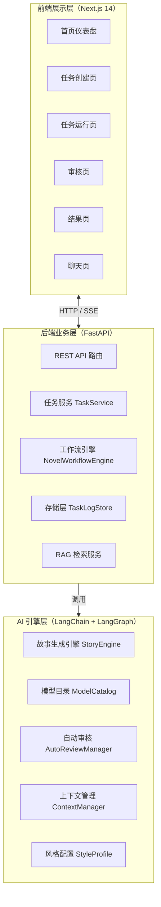
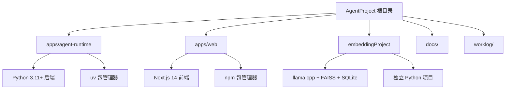
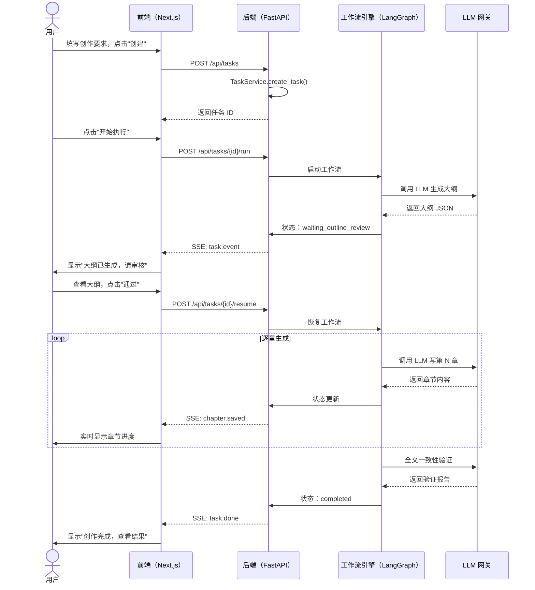
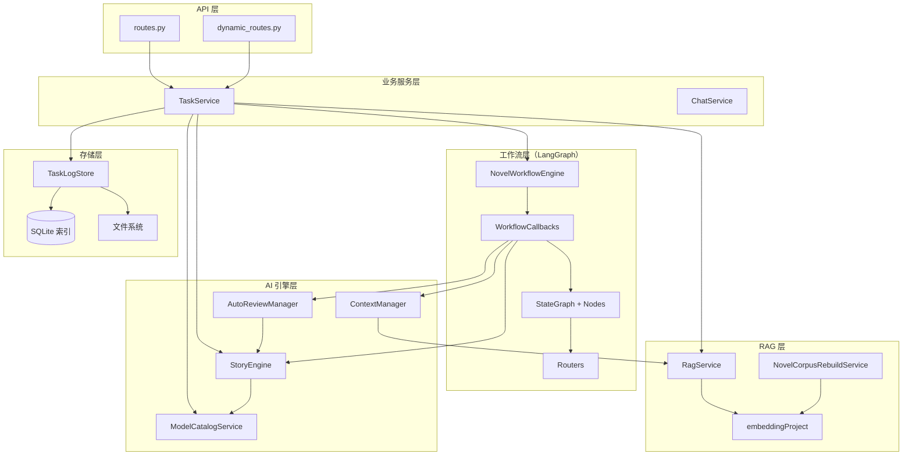
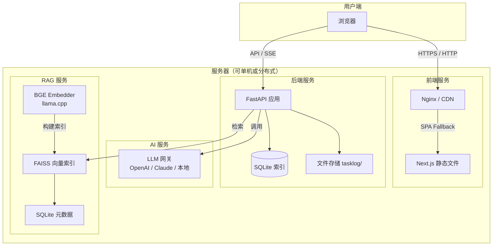
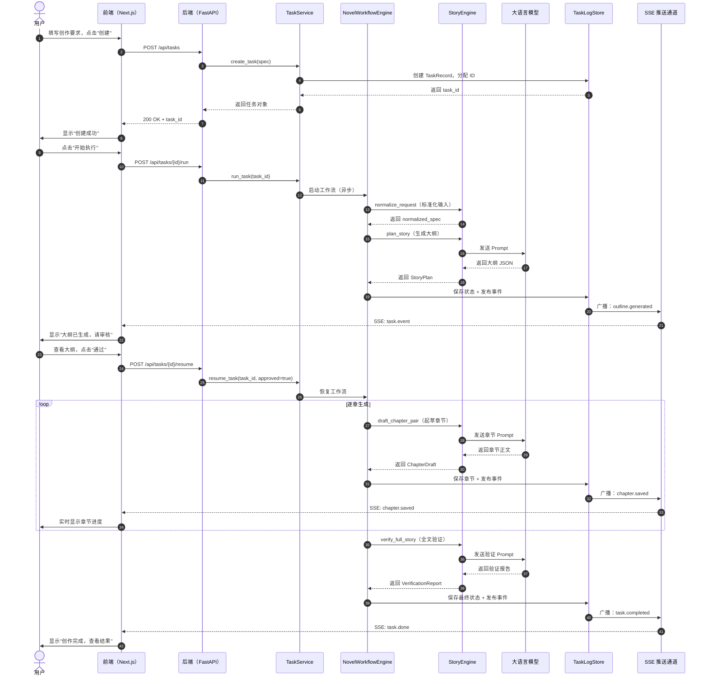

# 01 系统架构总览

> 本文面向完全没有背景知识的大学生读者。如果你只学过一门编程课、甚至还没学过，也能看懂。我们会用大量生活中的比喻来解释每一个技术概念。

---

## 1. 项目是什么？一句话概括

这是一个**AI 辅助小说创作系统**。你可以把它想象成一位"数字作家助理"：你告诉它"我想写一本科幻小说，主角是一个能穿越时间的猫"，它就能帮你生成完整的故事大纲、逐章写出正文，还能在写完后自动检查前后设定是否矛盾。整个过程你可以随时暂停、修改、审核，就像指导一位真人助理写作一样。

---

## 2. 三层架构：把复杂系统拆成"前台-中台-后台"

如果把这套系统比作一家餐厅，那么：

- **前端展示层** = 餐厅大堂 + 菜单 + 服务员（顾客能看到、能交互的部分）
- **后端业务层** = 厨房 + 调度员（接收订单、协调厨师、管理食材）
- **AI 引擎层** = 几位各有所长的"大厨"（真正动笔写小说的人）



### 2.1 前端展示层

前端就是一个网页，用 **Next.js 14** 框架写成。Next.js 是 React 的"升级版"，自带路由、服务端渲染等能力。

前端的主要页面有：

| 页面 | 作用 | 生活比喻 |
|------|------|---------|
| 首页 | 看所有任务的列表和统计 | 餐厅门口的等位屏幕 |
| 创建页 | 填写小说要求（题材、风格、字数等） | 点菜单 |
| 运行页 | 看 AI 写到哪里了，实时滚动日志 | 透过玻璃看厨房炒菜 |
| 审核页 | 对 AI 写的大纲或章节提修改意见 | 试吃后告诉厨师咸了 |
| 结果页 | 读最终成文，导出 Markdown | 端上桌的成品菜 |
| 聊天页 | 和 AI 自由对话，问写作建议 | 跟服务员闲聊 |

前端代码在 `apps/web/` 目录下。

### 2.2 后端业务层

后端是系统的"大脑"，用 **FastAPI** 框架写成。FastAPI 是一个 Python 的 Web 框架，特点是快、自动生成 API 文档、类型安全。

后端的职责可以用一句话概括：**接收前端的请求，调度 AI 引擎干活，把结果存起来，再推送给前端。**

核心模块：

- **API 路由层** (`app/api/routes.py`)：定义了所有接口，比如 `POST /api/tasks` 创建任务、`GET /api/tasks/{id}/workspace` 获取任务状态。
- **任务服务** (`app/application/task_service/`)：这是业务核心，负责创建任务、运行任务、恢复任务、审核任务。它由多个 mixin 组合而成，就像乐高积木拼在一起。
- **工作流引擎** (`app/workflow/engine.py`)：基于 LangGraph 实现，把小说创作流程抽象成一张"流程图"，每个节点是一个步骤（如生成大纲、审核大纲、写第一章……）。
- **存储层** (`app/storage/task_store.py`)：把任务的每一步状态、生成的大纲、章节正文都保存到磁盘，同时维护一个 SQLite 索引方便查询。
- **RAG 服务** (`app/rag/service.py`)：RAG 是 "Retrieval-Augmented Generation" 的缩写，意思是"检索增强生成"。简单说，就是 AI 写作前先查资料，就像写论文前要先查文献。

### 2.3 AI 引擎层

AI 引擎层是真正"动笔"的地方。它不直接面对用户，而是被后端调用。

- **StoryEngine** (`app/llm/story_engine.py`)：故事生成引擎，封装了所有和 LLM（大语言模型）交互的逻辑。它知道怎么写大纲、怎么写章节、怎么修订、怎么验证一致性。
- **ModelCatalog** (`app/llm/model_catalog.py`)：模型目录服务，管理可用的 AI 模型列表，支持动态切换模型（比如从 GPT-4 切换到 Claude）。
- **AutoReviewManager** (`app/llm/auto_reviewer.py`)：自动审核器，让 AI 自己审自己的稿子，打分、提意见，减少人工审核的负担。
- **ContextManager** (`app/context/manager.py`)：上下文管理器，负责控制每次给 AI 多少"记忆"。因为 AI 的"脑容量"有限（上下文窗口），太长的内容需要压缩或截断。

---

## 3. Monorepo 结构：三个项目住在一个"小区"里

Monorepo 就是"单一仓库"，把所有相关代码放在同一个 Git 仓库里管理。好处是：一次提交可以同时改前后端，版本一致；坏处是仓库会变大。

我们的"小区"里有三栋楼：



### 3.1 `apps/agent-runtime/` —— 后端主楼

这是系统的核心，所有"智能"都在这里。

```text
apps/agent-runtime/
├── app/
│   ├── main.py                 # 入口：组装所有服务，启动 FastAPI
│   ├── api/
│   │   ├── routes.py           # v1 REST API（任务、聊天、RAG、设置）
│   │   └── dynamic_routes.py   # v2 动态 Agent 编排 API
│   ├── application/
│   │   └── task_service/       # 任务服务（创建、运行、恢复、审核、查询）
│   ├── domain/
│   │   └── models.py           # 领域模型（TaskRecord、StoryPlan、ChapterDraft 等）
│   ├── graph/
│   │   ├── main_graph.py       # LangGraph 主图构建
│   │   ├── nodes/              # 各节点实现（大纲、章节、验证、收尾）
│   │   ├── routers/            # 条件路由逻辑
│   │   └── state.py            # 工作流状态定义
│   ├── llm/
│   │   ├── story_engine.py     # 故事生成引擎
│   │   └── model_catalog.py    # 模型目录
│   ├── context/                # 上下文管理（预算、压缩、缓存）
│   ├── storage/
│   │   └── task_store.py       # 任务持久化（文件 + SQLite 索引）
│   ├── rag/                    # RAG 检索增强
│   ├── novel_skills/           # 小说创作技能（Prompt 模板）
│   ├── style_profiles/         # 风格配置
│   ├── settings/               # 应用配置
│   └── observability/          # 日志与追踪
├── tests/                      # 测试用例
└── pyproject.toml              # Python 项目配置
```

### 3.2 `apps/web/` —— 前端展示楼

这是用户能看到、能点击的网页。

```text
apps/web/
├── src/
│   ├── app/                    # Next.js App Router 页面
│   │   ├── page.tsx            # 首页
│   │   ├── create/             # 创建任务
│   │   ├── tasks/              # 任务运行页
│   │   ├── review/             # 审核页
│   │   ├── result/             # 结果页
│   │   ├── archive/            # 归档页
│   │   ├── chat/               # 聊天页
│   │   └── settings/           # 设置页
│   ├── features/               # 按业务域划分的功能组件
│   │   ├── task-create/
│   │   ├── task-run/
│   │   ├── task-review/
│   │   ├── task-archive/
│   │   ├── task-recovery/
│   │   ├── chat/
│   │   └── settings/
│   ├── components/             # 通用 UI 组件
│   └── lib/                    # API 客户端、工具函数
├── package.json
└── next.config.js
```

### 3.3 `embeddingProject/` —— RAG 资料库

这是一个独立的子项目，负责把小说参考资料（比如世界观设定集、人物小传）转换成向量，存入 FAISS 索引和 SQLite 数据库。当 AI 写作时，可以像查字典一样快速找到相关资料。

技术栈：
- **BGE Embedding**：把文字变成向量（一串数字）
- **llama.cpp**：本地运行 Embedding 模型，不需要联网
- **FAISS**：Facebook 开源的向量检索库，能在毫秒级从百万条向量中找到最相似的
- **SQLite**：轻量级数据库，存原始文本和元数据

```text
embeddingProject/
├── cli.py                      # 命令行工具
├── embedder/                   # Embedding 模型封装
├── pipeline/                   # 索引和检索流水线
├── storage/                    # FAISS + SQLite 存储
└── tests/                      # 测试
```

---

## 4. 技术栈选型理由：为什么选这些工具？

### 4.1 后端：FastAPI

| 候选方案 | 为什么没选 | 为什么选 FastAPI |
|---------|-----------|-----------------|
| Django | 太重，自带 ORM 和 Admin，我们用不上 | FastAPI 轻量、异步原生支持、自动生成 OpenAPI 文档 |
| Flask | 太轻，缺少类型提示和异步支持 | FastAPI 基于 Python 类型注解，IDE 友好 |
| Tornado | 社区活跃度下降 | FastAPI 生态活跃，Starlette 底层性能优秀 |

**比喻**：Django 像一台自带烤箱、微波炉、洗碗机的整体厨房；FastAPI 像一张干净的料理台，你想放什么厨具自己决定。

### 4.2 AI 编排：LangChain + LangGraph

**LangChain** 是一个 LLM 应用开发框架，它把"调用 AI"这件事封装成了标准化的接口：不管底层是 OpenAI、Claude 还是本地模型，上层代码都一样写。

**LangGraph** 是 LangChain 的扩展，专门用来构建"有状态的多步骤工作流"。它的核心概念是：

- **State（状态）**：一个字典，记录当前写到哪了、大纲是什么、已生成哪些章节……
- **Node（节点）**：一个函数，接收状态、修改状态、返回状态。比如 `plan_story` 节点负责生成大纲。
- **Edge（边）**：连接节点的线，可以是普通边（A 做完一定去 B），也可以是条件边（A 做完如果审核通过去 B，不通过去 C）。

**比喻**：LangGraph 就像一张地铁线路图。State 是列车，Node 是车站，Edge 是轨道。列车从起点站出发，经过一个个车站，最终到达终点站。有些站是换乘站（条件边），根据乘客的目的地决定走哪条线。

### 4.3 前端：Next.js 14

| 特性 | 说明 |
|------|------|
| App Router | 新一代路由系统，支持服务端组件，减少前端 JS 体积 |
| Server Components | 部分页面在服务器渲染，首屏加载更快 |
| 静态导出 | 可以导出为纯 HTML/JS，挂载到后端当 SPA 用 |

**比喻**：普通的 React 应用像一份外卖，所有食材（JS 代码）都送到你家（浏览器）再炒；Next.js 像一家有中央厨房的餐厅，部分菜在中央厨房（服务器）就炒好了，送到你桌上直接吃。

### 4.4 向量检索：FAISS + BGE Embedding

为什么不用 Elasticsearch 或传统数据库？

因为我们要解决的是"语义相似"问题，不是"关键词匹配"问题。

**例子**：用户写了一句"主角在雨夜中独自前行"，资料库里有一段"深夜，他一个人在暴雨里走着，路灯昏黄"。这两句话没有一个关键词完全匹配，但语义非常接近。传统数据库查不到，但向量检索能查到。

原理简述：

Embedding 模型把句子变成高维空间中的一个点（向量）。语义相近的句子，它们的向量在空间中的距离也近。FAISS 用一种叫做 **IVF（Inverted File Index）** 的算法，把向量空间划分成很多"小区"，查询时只搜相关的小区，从而把复杂度从 $O(N)$ 降到近似 $O(\sqrt{N})$。

$$\text{similarity}(A, B) = \cos(\theta) = \frac{A \cdot B}{\|A\| \|B\|}$$

---

## 5. 前后端交互模式：REST API + SSE 流式事件

### 5.1 REST API：一问一答

大部分操作都是标准的 HTTP 请求：

| 操作 | 方法 + 路径 | 作用 |
|------|-----------|------|
| 创建任务 | `POST /api/tasks` | 提交小说创作要求 |
| 获取任务状态 | `GET /api/tasks/{id}` | 查询任务当前进度 |
| 运行任务 | `POST /api/tasks/{id}/run` | 让 AI 开始写作 |
| 上传参考素材 | `POST /api/tasks/{id}/assets` | 给 AI 提供背景资料 |
| 审核通过/驳回 | `POST /api/tasks/{id}/resume` | 人工审核后继续或修改 |

**比喻**：REST API 像发短信。你发一条，对方回一条，每条消息都是独立的。

### 5.2 SSE：实时推送

但小说创作是一个漫长的过程，可能需要几十分钟。如果前端每隔几秒就"发短信"问"写完了吗"，既浪费流量又延迟高。所以我们用 **SSE（Server-Sent Events）**。

SSE 是一种"服务器主动推"的技术：前端连上后，服务器可以随时发消息过来，不需要前端反复询问。

前端代码示例（简化）：

```javascript
// 建立 SSE 连接
const source = new EventSource(`/api/tasks/${taskId}/events/stream`);

// 收到快照事件（当前完整状态）
source.addEventListener("snapshot", (event) => {
  const data = JSON.parse(event.data);
  updateUI(data);
});

// 收到任务事件（阶段性更新）
source.addEventListener("task.event", (event) => {
  const data = JSON.parse(event.data);
  appendLog(data.message);
});

// 任务完成
source.addEventListener("task.done", (event) => {
  showCompletionNotice();
  source.close();
});
```

**比喻**：SSE 像听广播。你打开收音机（建立连接），电台随时播报新闻（服务器推送），你不需要反复调台查询。

### 5.3 前后端数据流时序图

下面这张图展示了"用户创建任务 → AI 写大纲 → 人工审核 → AI 写章节 → 完成"的完整交互过程：



---

## 6. 数据流全景：从想法到小说

现在我们把镜头拉远，看一次完整的小说创作旅程。

### 6.1 阶段一：下单（创建任务）

用户在网页上填写：
- 题材：科幻
- 风格：悬疑、冷峻
- 单章字数：3000
- 总章节数：20
- 核心创意：主角是一只穿越时间的猫

前端把这些信息打包成 JSON，发给后端 `POST /api/tasks`。后端创建一个 `TaskRecord` 对象，分配唯一 ID（如 `task_a1b2c3d4e5`），状态设为 `created`。

### 6.2 阶段二：备料（上传参考素材）

用户可以上传一些参考资料，比如：
- 一份"时间旅行规则"文档
- 主角的详细人设
- 类似作品的片段

后端把这些文件存入 `tasklog/runs/{task_id}/` 目录，同时更新任务状态为 `sources_ingested`。

### 6.3 阶段三：写大纲（Planning）

用户点击"开始执行"，后端启动 LangGraph 工作流。

工作流的第一个节点是 `normalize_request`，它把用户的原始输入标准化成一个 `normalized_spec` 字典。然后进入 `plan_story` 节点，调用 LLM 生成大纲。

大纲包含：
- `working_title`：作品标题
- `logline`：一句话梗概
- `world_notes`：世界观设定要点
- `character_notes`：人物设定要点
- `chapter_plan`：每章的标题和目标

生成后，状态变为 `waiting_outline_review`，SSE 推送事件到前端，用户看到审核按钮亮起。

### 6.4 阶段四：审大纲（Outline Review）

用户进入审核页，看到 AI 写的大纲。如果不满意，可以写修改意见（比如"第三章节奏太慢，改成主角直接遇到反派"），点击"驳回"。

后端收到驳回后，工作流进入 `revise_outline` 节点，把用户的意见和大纲一起发给 LLM，要求重新生成。这个"生成-审核-修订"的循环最多进行 5 次（`MAX_OUTLINE_REVISIONS = 5`），防止无限循环。

如果用户点击"通过"，工作流进入下一阶段。

### 6.5 阶段五：写正文（Drafting）

这是最长的一个阶段。工作流进入 `draft_chapter_pair` 节点，AI 开始逐章写作。

为了效率，系统采用"章节对"策略：首批同时写两章（利用多线程并行），后续每批写一章。每写完一批，状态变为 `waiting_chapter_review`，等待用户审核。

写作时，StoryEngine 会构建一个详细的 Prompt，包含：
- 作品标题和梗概
- 当前章节的标题和目标
- 已完成章节的摘要（保持连贯性）
- 上一章的全文（保持语气一致）
- 参考素材的摘要
- 风格约束

Prompt 示例（简化）：

```text
你是一个中文小说章节起草助手。

作品标题：时间之猫
一句话梗概：一只拥有时间穿越能力的猫，试图阻止一场毁灭世界的实验。

当前章节：第 3 章《雨夜追迹》
章节目标：主角发现实验室的异常，首次使用时间回溯能力。

已完成章节摘要：
- 第1章《觉醒》：主角在雷雨夜获得能力
- 第2章《线索》：主角追踪到废弃工厂

风格目标：悬疑、冷峻
风格约束：避免抒情，多用短句，环境描写要压抑。

请生成本章内容，控制在 3000 字左右，严格返回 JSON 格式。
```

### 6.6 阶段六：验货（Verification）

所有章节写完后，工作流进入 `verify_full_story` 节点。AI 以"质检员"的身份通读全文，检查：
- 人物设定是否前后一致（比如第一章说主角是黑猫，后面不能变成白猫）
- 时间线是否有矛盾
- 世界观规则是否被遵守
- 情节逻辑是否自洽

验证报告包含问题清单和整体评分。如果发现问题，进入 `fix_verified_issues` 节点修复；如果没问题或用户通过，进入收尾。

### 6.7 阶段七：交稿（Assembly）

`assemble_result` 节点把所有章节组装成最终成品：
- `result.md`：完整的 Markdown 文档
- `result.json`：结构化数据（每章的标题、摘要、正文）
- `artifacts/` 目录：每章单独的 Markdown 和 JSON 文件

任务状态变为 `completed`，SSE 发送 `task.done` 事件，前端跳转到结果页。

### 6.8 阶段八：归档（Archive）

完成的任务会自动从 `tasklog/runs/` 移动到 `tasklog/archive/`，释放运行目录空间，同时在 SQLite 索引中保留记录，方便后续查询。

---

## 7. 核心模块关系图

下面这张图展示了后端内部各模块如何协作：



### 7.1 依赖关系说明

- **API 层** 只依赖 **TaskService** 和 **ChatService**，不直接碰 AI 引擎。
- **TaskService** 是"大管家"，它持有工作流引擎、存储层、RAG 服务、AI 引擎的引用，协调它们工作。
- **NovelWorkflowEngine** 本身不依赖具体业务，它只要求传入一个 **WorkflowCallbacks** 对象（包含所有节点的实现函数）。这种设计叫做"依赖注入"，方便测试和替换。
- **StoryEngine** 是"笔杆子"，它只负责和 LLM 对话，不关心任务状态、不关心前端显示。
- **TaskLogStore** 是"档案室"，所有持久化操作都经过它，保证文件和数据库的一致性。

---

## 8. 部署拓扑图

这套系统可以单机运行，也可以拆分成多个服务部署。



### 8.1 单机部署（开发/小团队）

所有服务跑在一台机器上：

```bash
# 终端 1：启动后端
cd apps/agent-runtime
uv sync --locked --dev
python -m uvicorn app.main:app --host 127.0.0.1 --port 8000

# 终端 2：启动前端
cd apps/web
npm ci
npm run dev

# 终端 3：构建 RAG 索引（一次性）
cd embeddingProject
uv sync --dev
uv run python cli.py index --input-file data.jsonl --root-dir artifacts
```

### 8.2 生产部署建议

- **前端**：用 `npm run build` 导出静态文件，挂载到 Nginx 或 CDN。
- **后端**：用 Gunicorn + Uvicorn Worker 启动多进程，前面加 Nginx 做反向代理。
- **RAG**：embeddingProject 可以独立部署为一台"向量检索服务器"，通过 HTTP 接口被后端调用。
- **LLM 网关**：如果用量大，建议部署 vLLM / TGI 等推理加速框架，或直接使用云服务商的 API。

---

## 9. 关键技术细节补充

<details>
<summary>点击展开：LangGraph 状态机详解</summary>

LangGraph 的核心是一个**状态机（State Machine）**。我们的主图包含以下节点和边：

```
START -> normalize_request -> prepare_outline_context -> plan_story -> review_outline

review_outline 是条件节点：
  - 如果 approved=true 且是 master 阶段 -> plan_chapter_batch
  - 如果 approved=true 且章节计划全部完成 -> prepare_chapter_pair_context
  - 如果 approved=false 且未超修订上限 -> revise_outline -> review_outline（循环）
  - 如果 cancelled=true -> cancel_task -> END

prepare_chapter_pair_context -> draft_chapter_pair -> review_chapter_pair

review_chapter_pair 是条件节点：
  - approved=true -> accumulate_chapters
  - approved=false 且未超上限 -> revise_chapter_pair -> review_chapter_pair（循环）
  - cancelled=true -> cancel_task -> END

accumulate_chapters 是条件节点：
  - 还有未写章节 -> prepare_chapter_pair_context（循环）
  - 全部写完 -> verify_full_story -> review_verification

review_verification 是条件节点：
  - approved=true -> assemble_result -> END
  - approved=false 且未超上限 -> fix_verified_issues -> verify_full_story（循环）
```

这种设计的好处是：
1. **可恢复**：每个节点执行完都会自动保存状态（Checkpoint），如果服务器重启，可以从断点继续。
2. **可中断**：任何审核节点都可以暂停，等待人工输入。
3. **可观测**：每个状态转换都记录到事件流，前端可以实时展示进度。

</details>

<details>
<summary>点击展开：上下文窗口与 Token 预算</summary>

LLM 每次能处理的文本量是有限的，这个限制叫做**上下文窗口（Context Window）**，单位是 token（可以粗略理解为"字数"，英文 1 token ≈ 0.75 词，中文 1 token ≈ 0.5 字）。

我们的系统采用**分层预算策略**：

| 层级 | 预算分配 | 内容 |
|------|---------|------|
| 系统 Prompt | 固定 | 角色定义、输出格式要求 |
| 参考素材 | 动态 | RAG 检索结果、用户上传的文档 |
| 记忆上下文 | 动态 | 已完成章节的摘要、上一章全文 |
| 当前任务 | 固定 | 本章标题、目标、要求 |

当总长度超过模型上限时，ContextManager 会启动**压缩策略**：
1. 优先压缩参考素材（去掉低优先级片段）
2. 其次截断记忆上下文（只保留最近 N 章的摘要）
3. 极端情况下，把上一章全文替换为更短的摘要

数学表达：设上下文窗口上限为 $C$，当前输入长度为 $I$，则压缩触发条件为：

$$I > C \times \alpha$$

其中 $\alpha$ 是安全因子（通常取 0.8），预留空间给模型输出。

</details>

<details>
<summary>点击展开：自动审核机制</summary>

系统支持三种审核模式：

1. **完全自动（FULL_AUTO）**：AI 自己审自己，人工完全不介入。适合批量生成或草稿阶段。
2. **建议模式（ADVISORY）**：AI 给出审核意见和评分，但最终决策权交给人工。
3. **半自动（SEMI_AUTO）**：AI 先审，通过的自动放行，不通过的升级人工。

审核维度包括：
- **结构审核**：大纲是否完整、章节逻辑是否连贯
- **一致性审核**：人物、时间线、世界观是否前后一致
- **创意审核**：情节是否有新意、是否有套路化问题
- **风格审核**：语言风格是否符合用户要求

每个维度由一个独立的子 Agent 负责，多个 Agent 可以并行执行，最后由 Synthesis Agent 汇总意见并给出最终决策。

审核阈值配置：
- 大纲通过阈值：60 分
- 章节通过阈值：65 分
- 验证通过阈值：80 分

</details>

---

## 10. 实现详解：代码层面的"解剖课"

前面我们把系统比作餐厅，讲了前台、中台、后台的分工。现在我们把镜头推进到**代码层面**，看看后厨的"电路图"长什么样——也就是 `main.py` 这个文件，它是整个后端的大脑中枢。

### 10.1 依赖注入：像拼乐高一样组装服务

打开 `apps/agent-runtime/app/main.py`，你会发现它没有任何复杂的业务逻辑，只有一件事：**按正确的顺序，把一个个模块"插"到一起。**

这种设计模式叫做**依赖注入（Dependency Injection）**。想象你要组装一台电脑：先插电源，再插主板，再插显卡，最后开机。如果你先插显卡再插电源，电脑就点不亮。`main.py` 做的就是确保每个零件在正确的时间被初始化，然后互相连接。

下面是完整的组装流程，配合中文注释：

```python
# 步骤 0：读取 .env 配置文件
# 就像厨师上班先看今天的采购单，知道有什么食材
settings = get_settings()

# 步骤 1：初始化存储层（档案室）
# root_dir 指向 tasklog/ 目录，所有任务的文件和数据库都存在这里
store = TaskLogStore(root_dir=settings.tasklog_root)

# 步骤 2：初始化 AI 引擎（笔杆子）
# StoryEngine 是统一网关，封装了所有和 LLM 对话的逻辑
engine = StoryEngine(settings)

# 步骤 3：初始化模型目录（模型切换台）
# 管理可用的模型列表，支持运行时切换（比如从 GPT-4 切到 Claude）
model_catalog = ModelCatalogService(
    settings=settings,
    gateway_client=engine.gateway_client  # 复用引擎的网关连接
)

# 步骤 4：初始化 RAG 服务（资料检索员）
# 从环境变量读取配置，连接 FAISS 向量索引和 SQLite 元数据库
rag_service = RagService(RagConfig.from_env())
rag_rebuild_service = NovelCorpusRebuildService(RagConfig.from_env())

# 步骤 5：初始化风格与技能服务（调色盘 + 工具箱）
style_profile_service = StyleProfileService()
novel_skill_service = NovelSkillService(style_profile_service=style_profile_service)

# 步骤 6：配置自动审核策略（质检标准）
auto_review_policy = {
    "auto_review_model_mode": settings.auto_review_model_mode,
    "auditor_model": settings.auto_review_auditor_model,
    "synthesis_model": settings.auto_review_synthesis_model,
    "outline_pass_threshold": 60.0,      # 大纲及格线：60 分
    "outline_auto_escalate_on_critical": False,
    "outline_max_auto_revisions": 3,     # 大纲最多自动修订 3 次
    "chapter_pass_threshold": 65.0,      # 章节及格线：65 分
    "chapter_auto_escalate_on_critical": False,
    "chapter_max_auto_revisions": 3,     # 章节最多自动修订 3 次
}

# 步骤 7：组装任务服务（大管家）
# 把所有零件交给 TaskService，它负责协调它们工作
task_service = TaskService(
    store=store,
    engine=engine,
    model_catalog=model_catalog,
    rag_service=rag_service,
    novel_skill_service=novel_skill_service,
    style_profile_service=style_profile_service,
    auto_review=settings.auto_review,
    auto_review_policy=auto_review_policy,
)

# 步骤 8：组装聊天服务（客服专员）
chat_service = ChatService(
    gateway_client=engine.gateway_client,
    rag_service=rag_service,
    default_model_resolver=lambda: engine.resolve_model(None),
)
```

**关键洞察**：`TaskService` 不自己创建 `StoryEngine`，而是接收一个已经创建好的 `engine` 对象。这样做的好处是：

1. **测试时可以换假零件**：单元测试时，可以传一个 Mock 的 `StoryEngine`，不需要真的调用 LLM。
2. **生命周期可控**：`main.py` 统一管理所有资源的创建和销毁（比如 `shutdown` 事件里关闭网关连接池）。
3. **配置集中**：所有环境变量在 `settings` 里解析一次，然后分发到各个服务。

### 10.2 Monorepo 目录结构的实际布局

前面第 3 节画了"三栋楼"的示意图，下面是实际的目录树（去掉了不重要的文件）：

```text
AgentProject/                          # 小区大门
├── apps/
│   ├── agent-runtime/                 # 后厨主楼
│   │   ├── app/
│   │   │   ├── main.py               # 入口：组装所有服务
│   │   │   ├── api/
│   │   │   │   ├── routes.py         # v1 REST API（任务、聊天、RAG）
│   │   │   │   └── dynamic_routes.py # v2 动态 Agent 编排
│   │   │   ├── application/
│   │   │   │   └── task_service/     # 任务服务（创建、运行、恢复、审核）
│   │   │   ├── domain/
│   │   │   │   └── models.py         # 领域模型（TaskRecord、StoryPlan 等）
│   │   │   ├── graph/
│   │   │   │   ├── main_graph.py     # LangGraph 主图
│   │   │   │   ├── nodes/            # 各节点实现
│   │   │   │   ├── routers/          # 条件路由逻辑
│   │   │   │   └── state.py          # 工作流状态定义
│   │   │   ├── llm/
│   │   │   │   ├── story_engine.py   # 故事生成引擎
│   │   │   │   └── model_catalog.py  # 模型目录
│   │   │   ├── context/              # 上下文管理
│   │   │   ├── storage/
│   │   │   │   └── task_store.py     # 任务持久化
│   │   │   ├── rag/                  # RAG 检索增强
│   │   │   ├── novel_skills/         # 小说创作技能（Prompt 模板）
│   │   │   ├── style_profiles/       # 风格配置
│   │   │   ├── settings/             # 应用配置
│   │   │   └── observability/        # 日志与追踪
│   │   ├── tests/                    # 测试用例
│   │   └── pyproject.toml            # Python 项目配置
│   └── web/                          # 前端展示楼
│       ├── src/
│       │   ├── app/                  # Next.js App Router 页面
│       │   │   ├── page.tsx          # 首页
│       │   │   ├── create/           # 创建任务
│       │   │   ├── tasks/            # 任务运行页
│       │   │   ├── review/           # 审核页
│       │   │   ├── result/           # 结果页
│       │   │   ├── archive/          # 归档页
│       │   │   ├── chat/             # 聊天页
│       │   │   └── settings/         # 设置页
│       │   ├── features/             # 按业务域划分的功能组件
│       │   ├── components/           # 通用 UI 组件
│       │   └── lib/                  # API 客户端、工具函数
│       ├── package.json
│       └── next.config.js
├── embeddingProject/                 # RAG 资料库
│   ├── cli.py                        # 命令行工具
│   ├── embedder/                     # Embedding 模型封装
│   ├── pipeline/                     # 索引和检索流水线
│   ├── storage/                      # FAISS + SQLite 存储
│   └── tests/                        # 测试
├── docs/                             # 文档
│   └── technical/                    # 技术文档
├── worklog/                          # 问题记录与归档
│   ├── active/                       # 进行中问题
│   ├── archive/                      # 已完成问题
│   ├── index.md                      # 当前未完成问题索引
│   └── history.md                    # 历史归档索引
└── start-backend-tunnel.sh           # 一键启动脚本
```

**注意**：前端开发态和构建态的产物目录是隔离的：
- `npm run dev` 用 `.next-dev/`
- `npm run build` 用 `.next/`，输出到 `out/` 目录供后端挂载

### 10.3 前后端通信的实际代码

#### 10.3.1 CORS 配置：跨域访问的"通行证"

浏览器有一个安全机制叫**同源策略**：如果前端跑在 `http://localhost:3000`，后端跑在 `http://localhost:8000`，浏览器默认会阻止它们通信，就像两个不同国家的边境需要护照。

CORS（Cross-Origin Resource Sharing）就是给前端发"护照"：

```python
# 默认允许的来源：配置文件中指定的地址 + 本地开发地址
_default_origins = [
    settings.runtime_origin,           # 生产环境地址
    "http://127.0.0.1:3000",           # 前端 dev 模式
    "http://localhost:3000",
    "http://127.0.0.1:3001",
    "http://localhost:3001",
]

# 如果环境变量 CORS_ALLOWED_ORIGINS 存在，用它覆盖默认值
_allowed_origins = os.getenv("CORS_ALLOWED_ORIGINS", "")
if _allowed_origins:
    _default_origins = [o.strip() for o in _allowed_origins.split(",") if o.strip()]

# 注册 CORS 中间件
app.add_middleware(
    CORSMiddleware,
    allow_origins=_default_origins,           # 允许哪些域名访问
    allow_credentials=True,                   # 允许携带 Cookie
    allow_methods=["GET", "POST", "PATCH", "DELETE"],  # 允许的 HTTP 方法
    allow_headers=["Content-Type", "Authorization", "X-Request-ID"],  # 允许的请求头
    expose_headers=["X-Request-ID"],          # 暴露给前端读取的响应头
    max_age=600,                              # 预检请求缓存 10 分钟
)
```

**比喻**：CORS 就像小区的门禁系统。`allow_origins` 是"业主名单"，只有名单上的域名才能进；`allow_methods` 是"允许做的事"（比如只能 GET 不能 DELETE）；`allow_credentials` 是"是否允许带门禁卡"。

#### 10.3.2 静态文件挂载与 SPA 回退

生产环境中，前端构建后会生成一堆静态文件（HTML、JS、CSS）。后端可以直接把它们"挂"到自己的域名下，用户只需要访问一个地址：

```python
# 前端构建输出目录
_static_dir = Path("/home/user01/WorkSpace/AgentProject/apps/web/out")

if _static_dir.is_dir():
    _index_html = _static_dir / "index.html"

    # 先挂载 Next.js 的静态资源（JS/CSS/图片，带 hash 文件名）
    # 这些文件走 StaticFiles 中间件，效率很高
    app.mount("/_next", StaticFiles(directory=str(_static_dir / "_next")), name="static-next")

    # SPA 回退路由：所有路径都尝试返回 index.html
    @app.get("/{path:path}")
    async def spa_fallback(request: Request, path: str):
        """SPA 回退：静态文件优先，否则返回 index.html 让前端路由接管。"""
        if path:
            # 尝试匹配真实静态文件（如 /favicon.ico）
            candidate = _static_dir / path.strip("/")
            if candidate.is_file():
                return FileResponse(candidate)
            # 尝试匹配子目录的 index.html（如 /archive/ → archive/index.html）
            index_candidate = _static_dir / path.strip("/") / "index.html"
            if index_candidate.is_file():
                return FileResponse(index_candidate)
        # 所有其他路径回退到 index.html（前端路由接管）
        return FileResponse(_index_html)
```

**为什么需要 SPA 回退？**

Next.js 是一个**单页应用（SPA）**。用户访问 `/tasks/123` 时，浏览器其实只加载了一次 `index.html`，然后前端 JavaScript 根据 URL 决定显示什么内容。如果后端直接返回 404，页面就崩了。所以后端说："我不知道 `/tasks/123` 是什么，但我把 `index.html` 给你，你自己看着办。"

**比喻**：SPA 回退就像你去商场问"3 楼 305 室怎么走"，前台不知道具体房间，但给了你一张商场导览图（`index.html`），你自己看图找。

#### 10.3.3 限流与缓存中间件

```python
# 限流中间件：防止有人疯狂请求把服务器打爆
app.add_middleware(RateLimitMiddleware)

# 缓存控制中间件：让静态资源缓存、API 不缓存
app.add_middleware(CacheControlMiddleware)
```

`RateLimitMiddleware` 的实现细节：
- 通用接口：每个 IP 每分钟最多 60 次请求
- 聊天接口（`/api/chat/`）：每个 IP 每分钟最多 20 次（因为聊天调用 LLM 很贵）
- `/health` 健康检查接口：豁免，不限流
- 每 10 分钟清理一次过期记录，防止内存无限增长

`CacheControlMiddleware` 的规则：
- `/_next/static/` 下的文件（带 hash 的 JS/CSS）：缓存 30 天（因为文件名变了内容才变）
- `/api/` 下的接口：不缓存（每次请求都可能返回不同数据）
- 其他文件（HTML 等）：缓存 60 秒

### 10.4 数据流全链路：从用户点击到前端展示

现在我们把所有模块串起来，看一次完整的"用户点击创建任务 → AI 写完 → 前端展示"的全过程。



#### 步骤详解

**第 1~5 步：创建任务**

用户在创建页填好表单，前端把数据打包成 JSON，调用 `POST /api/tasks`。后端路由把请求交给 `TaskService.create_task()`，它创建一个 `TaskRecord` 对象，状态为 `created`，存入 `TaskLogStore`。`TaskLogStore` 同时做两件事：把任务信息写入 SQLite 索引，在文件系统创建 `tasklog/runs/{task_id}/` 目录。

**第 6~14 步：启动工作流，生成大纲**

用户点击"开始执行"，前端调用 `POST /api/tasks/{id}/run`。`TaskService` 启动 `NovelWorkflowEngine`（基于 LangGraph），这是一个异步任务，不会阻塞 HTTP 响应。

工作流的第一个节点 `normalize_request` 调用 `StoryEngine`，把用户的原始输入（比如"写一本科幻小说，主角是猫"）标准化成结构化数据。然后进入 `plan_story` 节点，构建一个详细的 Prompt 发给 LLM，LLM 返回大纲 JSON。

大纲生成后，工作流状态变为 `waiting_outline_review`，`TaskLogStore` 把这个事件放入 `asyncio.Queue`。同时，SSE 连接从队列中取出事件，推送给前端。前端收到 `task.event`，更新 UI，显示"大纲已生成，请审核"。

**第 15~17 步：人工审核**

用户进入审核页，看到 AI 写的大纲。如果满意，点击"通过"，前端调用 `POST /api/tasks/{id}/resume`，传入 `approved=true`。`TaskService` 找到对应的工作流，从断点恢复执行。

**第 18~24 步：逐章写作（循环）**

工作流进入 `draft_chapter_pair` 节点。为了效率，首批同时写两章（利用多线程并行），后续每批写一章。每写完一章，`StoryEngine` 返回 `ChapterDraft`，工作流把它存入 `TaskLogStore`，同时发布 `chapter.saved` 事件。

SSE 通道实时把事件推给前端，前端更新进度条、追加日志。用户可以看到"第 3 章已完成，共 3200 字"这样的实时反馈。

**第 25~30 步：全文验证与完成**

所有章节写完后，工作流进入 `verify_full_story` 节点。AI 以"质检员"身份通读全文，检查人物一致性、时间线矛盾、世界观漏洞。验证通过后，状态变为 `completed`，SSE 发送 `task.done` 事件，前端跳转结果页。

#### 为什么用 SSE 而不是 WebSocket？

SSE 和 WebSocket 都能做服务器推送，但 SSE 有几个优势：

1. **基于 HTTP**：不需要额外的协议握手，兼容所有代理和防火墙。
2. **自动重连**：浏览器原生支持断线重连，前端代码更简单。
3. **单向通信**：这里只需要服务器推给客户端，不需要客户端推给服务器，SSE 正好够用。

前端代码（简化）：

```javascript
// 建立 SSE 连接，像打开收音机
const source = new EventSource(`/api/tasks/${taskId}/events/stream`);

// 收到快照：当前完整状态（用于页面刷新后恢复）
source.addEventListener("snapshot", (event) => {
  const data = JSON.parse(event.data);
  updateUI(data);  // 更新整个页面状态
});

// 收到任务事件：阶段性更新（如"大纲生成中""第 3 章已保存"）
source.addEventListener("task.event", (event) => {
  const data = JSON.parse(event.data);
  appendLog(data.message);  // 追加到日志区域
});

// 任务完成
source.addEventListener("task.done", (event) => {
  showCompletionNotice();
  source.close();  // 关闭连接，节省资源
});
```

### 10.5 小结

`main.py` 虽然代码不多，但它是整个系统的"总装车间"。它的核心职责是：

1. **按顺序初始化服务**：先存储，再引擎，再目录，再 RAG，最后组装 TaskService。
2. **配置跨域和限流**：让前端能访问，同时防止恶意请求。
3. **挂载静态文件和 SPA 回退**：让前端构建产物能被浏览器直接访问。
4. **管理生命周期**：在应用关闭时，优雅地释放资源（如关闭 LLM 网关连接池）。

理解 `main.py`，就理解了整个后端的"骨架"。接下来每个模块的详细实现，都是在这个骨架上长出的"肌肉"。

---

## 11. 参考教程与延伸阅读

### 10.1 核心技术文档

- [FastAPI 官方文档](https://fastapi.tiangolo.com/)
- [LangGraph 概念指南](https://langchain-ai.github.io/langgraph/concepts/)
- [Next.js 14 App Router 文档](https://nextjs.org/docs/app)
- [FAISS 官方 Wiki](https://github.com/facebookresearch/faiss/wiki)
- [BGE Embedding - Hugging Face](https://huggingface.co/BAAI/bge-large-zh-v1.5)

### 10.2 设计模式参考

- **依赖注入（Dependency Injection）**：TaskService 在 `app/main.py` 中组装，各模块通过构造函数接收依赖，而不是自己创建。这便于单元测试时替换为 Mock 对象。
- **状态机（State Machine）**：LangGraph 的 StateGraph 本质上是一个有限状态机，每个节点是状态转换函数。
- **事件驱动（Event-Driven）**：TaskLogStore 使用 asyncio.Queue 实现发布-订阅模式，工作流中的事件自动广播到所有订阅者（包括 SSE 连接）。
- **CQRS（命令查询职责分离）**：写操作（创建任务、运行任务）和读操作（获取工作台、获取审核结果）使用不同的数据模型和接口。

### 10.3 项目内部关键文件速查

| 文件路径 | 作用 |
|---------|------|
| `apps/agent-runtime/app/main.py` | 后端入口，服务组装 |
| `apps/agent-runtime/app/api/routes.py` | REST API 定义 |
| `apps/agent-runtime/app/graph/main_graph.py` | LangGraph 主图构建 |
| `apps/agent-runtime/app/graph/state.py` | 工作流状态定义 |
| `apps/agent-runtime/app/llm/story_engine.py` | 故事生成引擎 |
| `apps/agent-runtime/app/storage/task_store.py` | 任务持久化 |
| `apps/agent-runtime/app/domain/models.py` | 领域模型 |
| `apps/web/src/app/layout.tsx` | 前端根布局 |
| `apps/web/src/lib/api.ts` | 前端 API 客户端 |
| `apps/web/src/features/task-run/task-run-client.tsx` | 任务运行页主组件 |

---

## 11. 总结

这套系统的架构设计遵循几个核心原则：

1. **分层解耦**：前端只管展示，后端只管调度，AI 只管生成。各层通过标准接口通信，可以独立演进。
2. **人机协作**：不是让 AI 一次性写完，而是"写一段 → 审一段 → 改一段"的循环，人类始终掌握最终决策权。
3. **状态可恢复**：基于 LangGraph 的 Checkpoint 机制，任何时刻崩溃都能从断点恢复，不会丢失进度。
4. **可观测**：通过 SSE 实时推送事件流，用户可以像看直播一样观察 AI 的写作过程。
5. **可扩展**：新的创作技能（Prompt 模板）、新的审核维度、新的模型，都可以通过配置文件或插件方式接入，不需要改核心代码。

希望这份文档能帮助你理解整个系统的全貌。如果你想深入了解某个模块，可以继续阅读后续章节。
