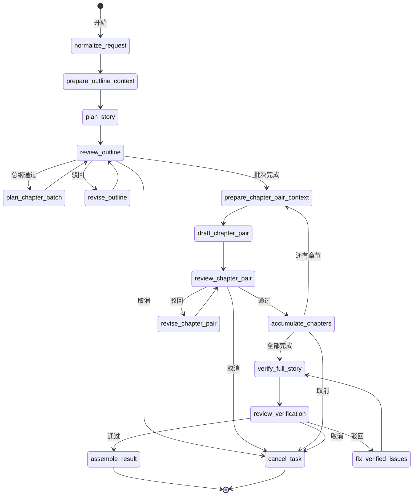
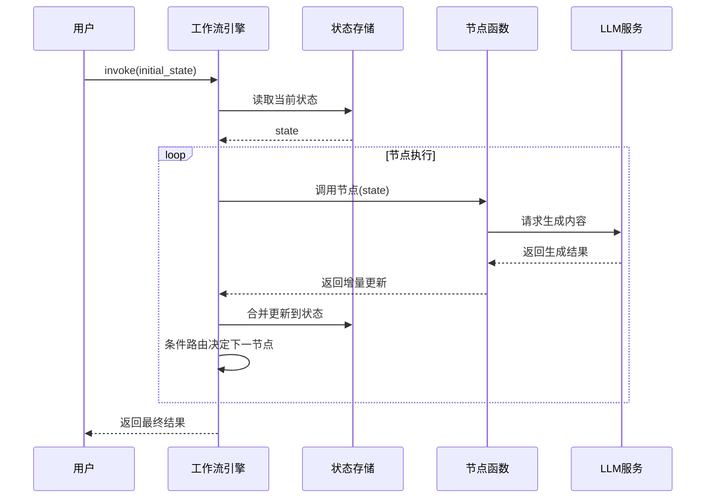
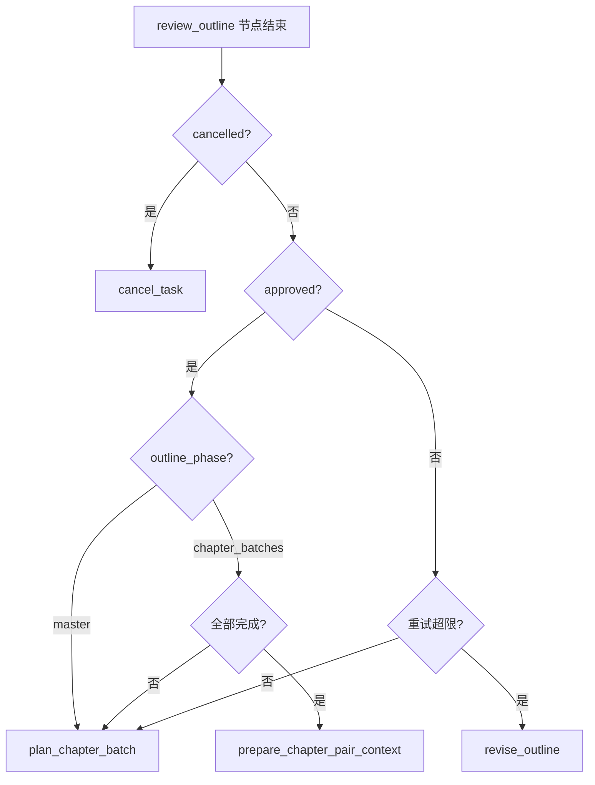
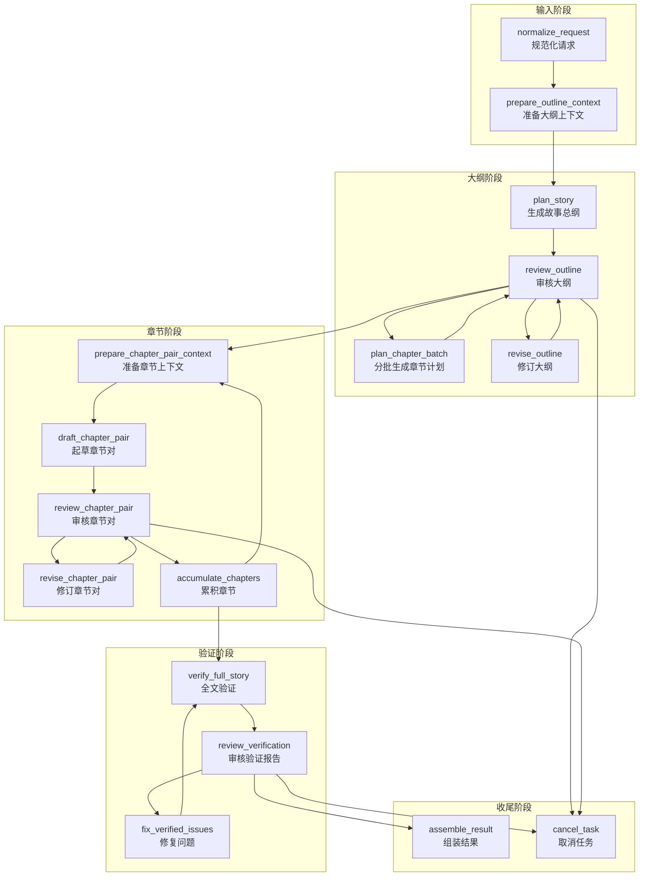
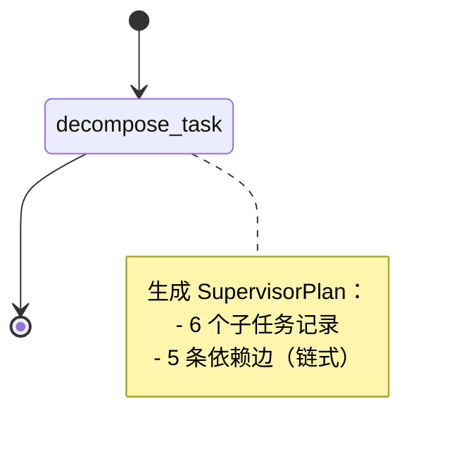
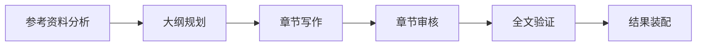
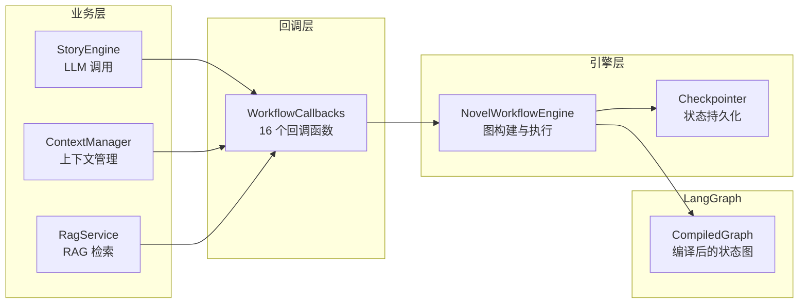
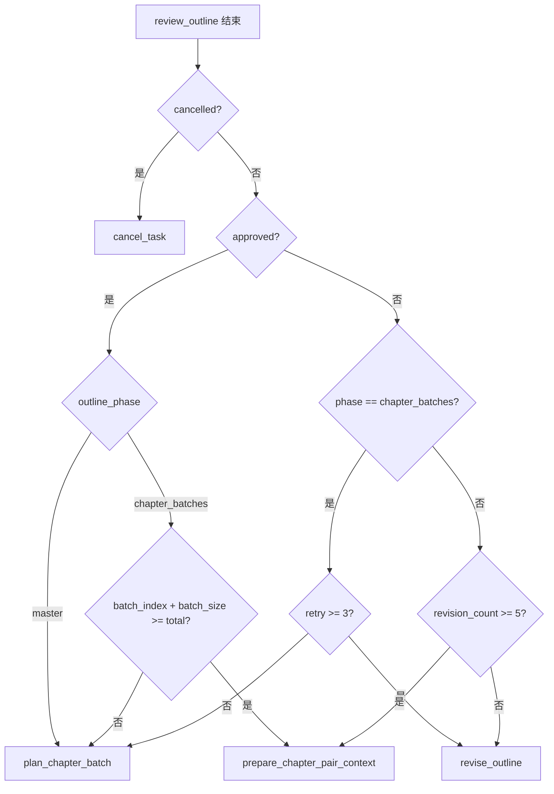
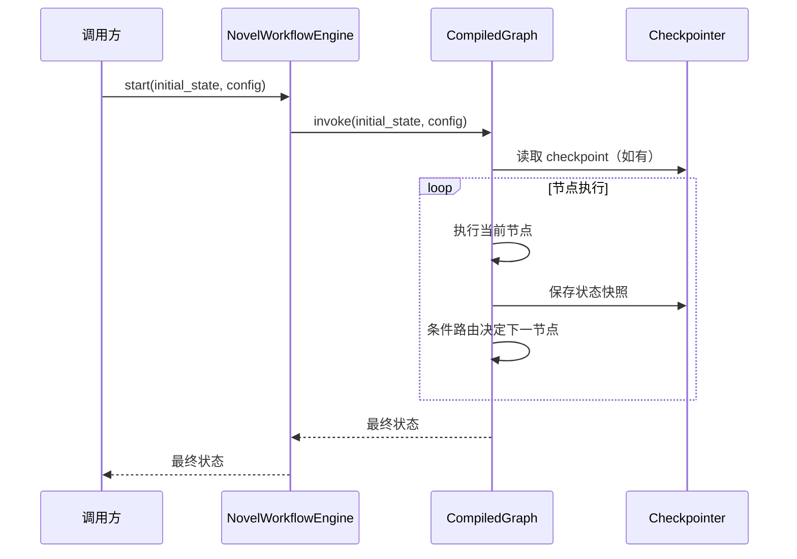
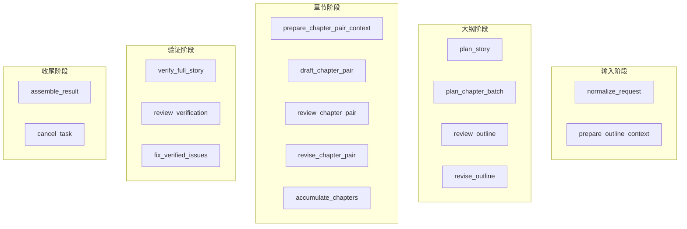

# LangGraph 工作流引擎：从零理解 AI 小说创作的状态图

> 本文面向完全不了解 LangGraph 的大学生读者。你不需要任何前置知识，只需要知道 "Python 函数可以接收参数并返回值" 即可。

---

## 目录

1. [为什么用"图"而不是流水线](#1-为什么用图而不是流水线)
2. [LangGraph 核心概念](#2-langgraph-核心概念)
3. [主创作图：从想法到小说](#3-主创作图从想法到小说)
4. [状态传递机制](#4-状态传递机制)
5. [条件路由：工作流的"红绿灯"](#5-条件路由工作流的红绿灯)
6. [节点详解：每个步骤在做什么](#6-节点详解每个步骤在做什么)
7. [监督者图：子任务编排](#7-监督者图子任务编排)
8. [工作流引擎：谁来驱动这张图](#8-工作流引擎谁来驱动这张图)
9. [参考链接](#9-参考链接)

---

## 1. 为什么用"图"而不是流水线

### 1.1 传统流水线的局限

想象一个传统的数据流水线（Pipeline）：

```
输入 → 步骤A → 步骤B → 步骤C → 输出
```

这种结构就像工厂的传送带——数据只能单向流动，一旦某个步骤出错，整个流程必须从头再来。对于 AI 小说创作来说，这远远不够：

- **大纲可能需要反复修改**：第一次生成的大纲往往不够好，需要"打回去重写"
- **章节需要分批审核**：写完一章就要审核一章，通过后再写下一章
- **人工可以随时介入**：作者看到 AI 写的内容后，可能要求修改，流程必须暂停等待

### 1.2 图结构的灵活性

LangGraph 使用**有向状态图（Directed State Graph）**来建模工作流：

```
          ┌─────────┐
          ▼         │
   [A] → [B] → [C] ─┘
          │
          ▼
         [D] → [END]
```

在这个结构中：
- **节点（Node）** 是处理步骤（如"生成大纲"、"审核章节"）
- **边（Edge）** 是节点之间的连接
- **状态（State）** 是在节点之间传递的"包裹"，包含所有需要共享的数据
- **条件边（Conditional Edge）** 可以根据状态决定走哪条路

> **核心设计思想**：LangGraph 把 AI 工作流看作一个"状态机"——系统始终处于某个状态，每次执行一个节点后，根据当前状态决定下一步去哪里。这与编译原理中的有限状态自动机（Finite State Automaton）思想一脉相承。

---

## 2. LangGraph 核心概念

### 2.1 状态图（StateGraph）

`StateGraph` 是 LangGraph 的核心类，它定义了：

1. **状态类型**：节点之间传递什么数据结构
2. **节点**：每个步骤的执行函数
3. **边**：节点之间的连接关系

```python
from langgraph.graph import StateGraph

# 定义状态类型（一个简单的字典）
class WorkflowState(TypedDict, total=False):
    task_id: str
    input_payload: dict
    story_plan: dict

# 创建状态图
graph = StateGraph(WorkflowState)
```

### 2.2 编译图（CompiledGraph）

状态图只是"蓝图"，需要**编译**后才能执行：

```python
from langgraph.graph import END

# 添加节点和边...
graph.add_node("plan_story", plan_story)
graph.add_edge(START, "plan_story")
graph.add_edge("plan_story", END)

# 编译：生成可执行的工作流
compiled = graph.compile()

# 执行：传入初始状态
result = compiled.invoke({"task_id": "123", "input_payload": {}})
```

编译过程会：
- 验证所有节点是否都有入口边
- 检查是否有无法到达的节点
- 生成执行计划

### 2.3 节点（Node）

节点是一个**纯函数**，接收当前状态，返回状态更新：

```python
def plan_story(state: WorkflowState) -> WorkflowState:
    # 读取状态
    spec = state["normalized_spec"]
    
    # 执行业务逻辑（调用 LLM 生成大纲）
    story_plan = engine.build_story_plan(spec)
    
    # 返回更新（LangGraph 会自动合并到状态中）
    return {"story_plan": story_plan}
```

> **重要**：节点只返回"变更的部分"，LangGraph 会自动将变更合并到现有状态中。这叫做**状态增量更新**。

### 2.4 边（Edge）与条件边

普通边是固定的连接：

```python
graph.add_edge("plan_story", "review_outline")
```

条件边根据状态动态选择路径：

```python
def route_after_review(state: WorkflowState) -> str:
    if state.get("approved"):
        return "next_step"
    return "revise"

graph.add_conditional_edges(
    "review_outline",
    route_after_review,
    {
        "next_step": "next_step",
        "revise": "revise_outline",
    }
)
```

---

## 3. 主创作图：从想法到小说

### 3.1 整体流程概览

本系统的主创作图实现了完整的"AI 辅助小说创作"流程：



### 3.2 三大循环结构

主创作图包含三个核心的"审核-修订"循环：

| 循环 | 目的 | 最大重试次数 |
|------|------|-------------|
| **大纲循环** | 生成并审核故事大纲 | 5 次 |
| **章节对循环** | 分批生成并审核章节 | 5 次 |
| **验证循环** | 全文一致性检查与修复 | 3 次 |

这种"生成 → 审核 → （驳回则）修订"的模式是 LangGraph 条件边的典型应用。

---

## 4. 状态传递机制

### 4.1 状态定义

系统的全部状态定义在 `app/graph/state.py` 中：

```python
class WorkflowState(TypedDict, total=False):
    # 基础信息
    task_id: str
    input_payload: dict[str, Any]
    reference_text: str
    source_assets: list[dict[str, Any]]
    normalized_spec: dict[str, Any]
    
    # 大纲阶段
    outline_context_packet: dict[str, Any]
    outline_context_snapshot: dict[str, Any]
    story_plan: dict[str, Any]
    outline_revision_count: int
    outline_phase: str
    outline_batch_index: int
    outline_batch_size: int
    outline_total_count: int
    outline_completed_count: int
    current_batch_chapter_plans: list[dict[str, Any]]
    
    # 章节阶段
    batch_index: int
    total_chapters: int
    completed_count: int
    chapter_pair_context_packet: dict[str, Any]
    current_chapter_pair: list[dict[str, Any]]
    completed_chapters: list[dict[str, Any]]
    chapter_pair_revision_count: int
    
    # 验证阶段
    verification_report: dict[str, Any]
    verification_revision_count: int
    
    # 审核交互
    review_type: str
    review_comment: str
    approved: bool
    cancelled: bool
    
    # 最终结果
    draft_result: dict[str, Any]
    
    # 自动审核
    auto_review: bool
    auto_review_policy: dict[str, Any]
    auto_review_trace: list[dict[str, Any]]
```

> `total=False` 表示所有字段都是可选的。这使得节点可以只返回需要更新的字段。

### 4.2 状态传递时序



### 4.3 状态合并原理

LangGraph 使用**浅合并（Shallow Merge）**策略：

```python
# 假设当前状态
state = {"task_id": "123", "story_plan": {"title": "旧标题"}}

# 节点返回的增量更新
update = {"story_plan": {"title": "新标题", "chapters": []}}

# 合并后
new_state = {"task_id": "123", "story_plan": {"title": "新标题", "chapters": []}}
```

> 注意：对于嵌套字典，LangGraph 会**替换整个值**而不是递归合并。因此如果节点只想修改 `story_plan.title`，它仍然需要返回完整的 `story_plan` 字典。

---

## 5. 条件路由：工作流的"红绿灯"

### 5.1 路由函数的本质

条件路由函数是一个**纯函数**，接收当前状态，返回目标节点名称：

```python
def route_after_outline_review(state: WorkflowState) -> str:
    if state.get("cancelled"):
        return "cancel_task"
    
    if state.get("approved"):
        phase = state.get("outline_phase", "master")
        if phase == "master":
            return "plan_chapter_batch"
        # 判断是否全部完成
        if batch_complete(state):
            return "prepare_chapter_pair_context"
        return "plan_chapter_batch"
    
    # 未通过审核
    if too_many_retries(state):
        return "revise_outline"
    return "plan_chapter_batch"
```

### 5.2 条件路由决策树



### 5.3 状态转移的概率/条件公式

用数学语言描述状态转移：

设当前状态为 $S_t$，路由函数为 $R$，则下一节点 $N_{t+1}$ 为：

$$
N_{t+1} = R(S_t) = \begin{cases}
\text{cancel_task} & \text{if } S_t.\text{cancelled} = \text{True} \\
\text{prepare_chapter_pair_context} & \text{if } S_t.\text{approved} = \text{True} \land S_t.\text{outline_phase} = \text{chapter_batches} \land S_t.\text{outline_batch_index} + S_t.\text{outline_batch_size} \geq S_t.\text{outline_total_count} \\
\text{plan_chapter_batch} & \text{if } S_t.\text{approved} = \text{True} \land S_t.\text{outline_phase} = \text{master} \\
\text{plan_chapter_batch} & \text{if } S_t.\text{approved} = \text{False} \land S_t.\text{outline_phase} = \text{chapter_batches} \land S_t.\text{outline_batch_retry_count} < \text{MAX_BATCH_RETRIES} \\
\text{revise_outline} & \text{if } S_t.\text{approved} = \text{False} \land S_t.\text{outline_phase} = \text{master} \land S_t.\text{outline_revision_count} < \text{MAX_OUTLINE_REVISIONS} \\
\text{prepare_chapter_pair_context} & \text{if } S_t.\text{approved} = \text{False} \land S_t.\text{outline_revision_count} \geq \text{MAX_OUTLINE_REVISIONS}
\end{cases}
$$

其中常数定义为：

$$
\text{MAX_OUTLINE_REVISIONS} = 5, \quad \text{MAX_BATCH_RETRIES} = 3
$$

### 5.4 防死循环机制

每个审核循环都设置了最大重试次数：

```python
# app/graph/state.py
MAX_OUTLINE_REVISIONS = 5
MAX_CHAPTER_PAIR_REVISIONS = 5
MAX_VERIFICATION_REVISIONS = 3
```

当达到上限时，系统会**强制通过**，避免无限循环：

```python
def route_after_chapter_pair_review(state: WorkflowState) -> str:
    if state.get("approved"):
        return "accumulate_chapters"
    # 达到最大修订次数，强制通过
    if state.get("chapter_pair_revision_count", 0) >= MAX_CHAPTER_PAIR_REVISIONS:
        return "accumulate_chapters"
    return "revise_chapter_pair"
```

---

## 6. 节点详解：每个步骤在做什么

### 6.1 节点关系流程图



### 6.2 各节点职责

| 节点 | 职责 | 关键输入 | 关键输出 |
|------|------|----------|----------|
| `normalize_request` | 规范化用户输入，初始化状态 | `input_payload` | `normalized_spec`, `auto_review` |
| `prepare_outline_context` | 构建 LLM 上下文（含 RAG 检索） | `normalized_spec` | `outline_context_packet` |
| `plan_story` | 调用 LLM 生成故事总纲 | `normalized_spec`, `reference_text` | `story_plan` |
| `plan_chapter_batch` | 分批生成详细章节计划 | `story_plan`, `outline_batch_index` | `current_batch_chapter_plans` |
| `review_outline` | 审核大纲（人工或自动） | `story_plan` | `approved`, `review_comment` |
| `revise_outline` | 根据审核意见修订大纲 | `story_plan`, `review_comment` | 更新后的 `story_plan` |
| `prepare_chapter_pair_context` | 为章节起草准备上下文 | `story_plan`, `completed_chapters` | `chapter_pair_context_packet` |
| `draft_chapter_pair` | 调用 LLM 起草一对章节 | `normalized_spec`, `story_plan` | `current_chapter_pair` |
| `review_chapter_pair` | 审核章节对 | `current_chapter_pair` | `approved`, `review_comment` |
| `revise_chapter_pair` | 修订章节对 | `current_chapter_pair`, `review_comment` | 更新后的 `current_chapter_pair` |
| `accumulate_chapters` | 将审核通过的章节加入已完成列表 | `current_chapter_pair` | `completed_chapters`, `batch_index` |
| `verify_full_story` | 全文一致性验证 | `completed_chapters`, `story_plan` | `verification_report` |
| `review_verification` | 审核验证报告 | `verification_report` | `approved`, `review_comment` |
| `fix_verified_issues` | 修复验证发现的问题 | `completed_chapters`, `verification_report` | 更新后的 `completed_chapters` |
| `assemble_result` | 组装最终输出 | `completed_chapters`, `story_plan` | `draft_result` |
| `cancel_task` | 取消任务 | - | `cancelled = True` |

### 6.3 大纲审核节点的实现细节

`review_outline` 节点展示了 LangGraph 的**中断（interrupt）**机制：

```python
from langgraph.types import interrupt

def review_outline(state, ..., interrupt_outline_review=None):
    # 自动审核模式
    if state.get("auto_review") and auto_review_executor_available:
        decision = execute_auto_review(payload, policy)
        if decision.approved:
            return {"approved": True, ...}
        # 需要人工介入时，触发中断
        if should_interrupt_manual_review(...):
            review = interrupt_outline_review(state)
            return {"approved": review.get("approved"), ...}
        return {"approved": decision.approved, ...}
    
    # 人工审核模式：直接中断等待用户输入
    review = interrupt_outline_review(state)
    return {"approved": review.get("approved"), ...}

def interrupt_outline_review(state, comment=""):
    return interrupt({
        "type": "outline_review",
        "summary": comment or "请确认大纲内容。",
        "story_plan": state.get("story_plan"),
        "revision_count": state.get("outline_revision_count", 0),
        # ... 更多上下文
    })
```

`interrupt()` 是 LangGraph 提供的特殊函数，它会：
1. 暂停图的执行
2. 将指定的数据返回给调用方
3. 保存当前状态到 checkpoint
4. 等待用户通过 `Command` 恢复执行

---

## 7. 监督者图：子任务编排

### 7.1 监督者图的作用

`supervisor_graph.py` 实现了一个轻量级的**任务分解器**，将创作任务拆分为 6 个标准子任务：

```python
_STORY_SUBTASK_SPECS: list[tuple[str, str]] = [
    ("reference_analysis", "参考资料分析"),
    ("outline_planning", "大纲规划"),
    ("chapter_writing", "章节写作"),
    ("chapter_review", "章节审核"),
    ("full_verification", "全文验证"),
    ("result_assembly", "结果装配"),
]
```

### 7.2 Supervisor 子任务编排图



### 7.3 依赖关系建模



子任务通过 `DependencyEdge` 建模依赖关系：

```python
def build_initial_supervisor_plan(payload):
    subtasks = []
    dependencies = []
    
    for index, (kind, title) in enumerate(_STORY_SUBTASK_SPECS):
        # 第一个任务就绪，其余阻塞
        status = SubtaskStatus.READY if index == 0 else SubtaskStatus.BLOCKED
        subtasks.append(SubtaskRecord(kind=kind, title=title, status=status))
    
    # 建立链式依赖
    for upstream, downstream in zip(subtasks, subtasks[1:]):
        dependencies.append(DependencyEdge(
            upstream_subtask_id=upstream.id,
            downstream_subtask_id=downstream.id,
        ))
    
    return SupervisorPlan(subtasks=subtasks, dependencies=dependencies)
```

> 当前版本的监督者图较为简单，主要用于**任务结构化描述**。未来可以扩展为真正的并行子任务调度器。

---

## 8. 工作流引擎：谁来驱动这张图

### 8.1 引擎架构



### 8.2 回调机制：解耦的秘诀

`WorkflowCallbacks` 是一个数据类，包含 16 个回调函数：

```python
@dataclass
class WorkflowCallbacks:
    normalize_request: Callable[[WorkflowState], WorkflowState]
    prepare_outline_context: Callable[[WorkflowState], WorkflowState]
    plan_story: Callable[[WorkflowState], WorkflowState]
    # ... 共 16 个
```

这种设计的核心优势是**依赖注入**：

```python
def build_default_callbacks(engine: StoryEngine, ...):
    # 通过闭包注入外部依赖
    def plan_story(state: WorkflowState) -> WorkflowState:
        return _plan_story_node(state, engine=engine)
    
    def prepare_outline_context(state: WorkflowState) -> WorkflowState:
        return _prepare_outline_context_node(
            state, context_manager=context_manager
        )
    
    return WorkflowCallbacks(
        plan_story=plan_story,
        prepare_outline_context=prepare_outline_context,
        # ...
    )
```

> **设计模式**：这是经典的**策略模式（Strategy Pattern）**——引擎定义接口，业务层提供具体实现。

### 8.3 引擎核心代码

```python
class NovelWorkflowEngine:
    def __init__(self, callbacks: WorkflowCallbacks, checkpoint_db_path=None):
        self.callbacks = callbacks
        self.graph = self._build_graph(callbacks, checkpoint_db_path)
    
    def _build_graph(self, callbacks, checkpoint_db_path):
        graph = StateGraph(WorkflowState)
        
        # 注册所有节点
        for node_name in NODE_NAMES:
            callback = getattr(callbacks, node_name)
            graph.add_node(node_name, callback)
        
        # 添加边（同第 3 节所述）
        # ...
        
        # 编译并附加 checkpoint
        return graph.compile(checkpointer=_create_checkpointer(checkpoint_db_path))
    
    def start(self, initial_state: dict, config: dict) -> dict:
        """启动工作流。"""
        return self.graph.invoke(initial_state, config=config)
    
    def resume(self, command: Command, config: dict) -> dict:
        """从中断点恢复工作流。"""
        return self.graph.invoke(command, config=config)
    
    def get_state(self, config: dict):
        """获取当前图状态。"""
        return self.graph.get_state(config)
```

### 8.4 Checkpoint：断点续传

LangGraph 的 `checkpointer` 机制允许工作流在中断后恢复：

```python
def _create_checkpointer(db_path=None):
    if db_path:
        # SQLite 持久化
        conn = sqlite3.connect(str(db_path), check_same_thread=False)
        return SqliteSaver(conn)
    # 内存模式（开发/测试用）
    return MemorySaver()
```

每次节点执行后，LangGraph 会自动保存状态到 checkpoint。当用户审核完成并提交 `Command` 时：

```python
from langgraph.types import Command

# 用户审核通过，发送恢复命令
command = Command(resume={"approved": True, "comment": "写得不错"})
result = engine.resume(command, config={"configurable": {"thread_id": task_id}})
```

### 8.5 状态查询与更新

引擎还提供了状态查询和手动更新能力：

```python
# 查询当前状态
state = engine.get_state(config={"configurable": {"thread_id": "123"}})

# 手动更新状态（用于调试或人工修正）
engine.update_state(
    config={"configurable": {"thread_id": "123"}},
    values={"approved": True},
    as_node="review_outline"
)
```

---

## 9. 参考链接

### 官方文档

- [LangGraph 官方文档](https://langchain-ai.github.io/langgraph/)
- [LangGraph 概念介绍](https://langchain-ai.github.io/langgraph/concepts/)
- [LangGraph 快速入门](https://langchain-ai.github.io/langgraph/tutorials/introduction/)
- [LangGraph Checkpoint 机制](https://langchain-ai.github.io/langgraph/concepts/persistence/)
- [LangGraph Interrupt 与 Human-in-the-Loop](https://langchain-ai.github.io/langgraph/concepts/human_in_the_loop/)

### 相关教程

- [LangChain 中文文档](https://python.langchain.com.cn/)
- [State Machines in Computer Science](https://en.wikipedia.org/wiki/Finite-state_machine)（理解状态机的理论基础）
- [Strategy Pattern](https://refactoring.guru/design-patterns/strategy)（理解回调解耦的设计模式）

### 项目源码

- `apps/agent-runtime/app/graph/main_graph.py` — 主创作图
- `apps/agent-runtime/app/graph/supervisor_graph.py` — 监督者图
- `apps/agent-runtime/app/graph/state.py` — 状态定义
- `apps/agent-runtime/app/workflow/engine.py` — 工作流引擎
- `apps/agent-runtime/app/workflow/callbacks.py` — 回调接口

---

## 10. 实现详解：逐行拆解真实代码

> 本节是"从原理到代码"的桥梁。我们将打开真实的源码文件，逐行解释 `build_main_graph()` 是如何把一张"蓝图"变成可执行的状态图的。

---

### 10.1 `build_main_graph()` 的完整代码走读

`build_main_graph()` 位于 `app/graph/main_graph.py`，它的工作可以比喻为**搭建乐高**：先准备好 16 块积木（节点），再按照说明书把它们插在一起（边），最后压上一层透明保护膜（编译）。

#### 第一步：State 定义 —— 确定"包裹"的规格

```python
# app/graph/state.py
from typing import Any, TypedDict

class WorkflowState(TypedDict, total=False):
    task_id: str
    input_payload: dict[str, Any]
    reference_text: str
    source_assets: list[dict[str, Any]]
    normalized_spec: dict[str, Any]
    outline_context_packet: dict[str, Any]
    outline_context_snapshot: dict[str, Any]
    story_plan: dict[str, Any]
    outline_revision_count: int
    outline_phase: str
    outline_batch_index: int
    outline_batch_size: int
    outline_total_count: int
    outline_completed_count: int
    outline_batch_retry_count: int
    current_batch_chapter_plans: list[dict[str, Any]]
    batch_index: int
    total_chapters: int
    completed_count: int
    chapter_pair_context_packet: dict[str, Any]
    current_chapter_pair: list[dict[str, Any]]
    completed_chapters: list[dict[str, Any]]
    chapter_pair_revision_count: int
    verification_report: dict[str, Any]
    verification_revision_count: int
    review_type: str
    review_comment: str
    approved: bool
    cancelled: bool
    draft_result: dict[str, Any]
    auto_review: bool
    auto_review_policy: dict[str, Any]
    auto_review_trace: list[dict[str, Any]]
```

`total=False` 表示所有字段都是可选的。就像快递单上的某些栏目可以留空一样，节点只填写自己关心的字段，LangGraph 会自动把新字段合并到总状态中。

#### 第二步：节点添加 —— 把 16 个函数注册到图里

```python
# app/graph/main_graph.py（节选）
graph = StateGraph(WorkflowState)          # 1. 创建空图，指定状态类型

graph.add_node("normalize_request", normalize_request)
graph.add_node("prepare_outline_context", prepare_outline_context)
graph.add_node("plan_story", plan_story)
graph.add_node("plan_chapter_batch", plan_chapter_batch)
graph.add_node("review_outline", review_outline)
graph.add_node("revise_outline", revise_outline)
graph.add_node("prepare_chapter_pair_context", prepare_chapter_pair_context)
graph.add_node("draft_chapter_pair", draft_chapter_pair)
graph.add_node("review_chapter_pair", review_chapter_pair)
graph.add_node("revise_chapter_pair", revise_chapter_pair)
graph.add_node("accumulate_chapters", accumulate_chapters)
graph.add_node("verify_full_story", verify_full_story)
graph.add_node("review_verification", review_verification)
graph.add_node("fix_verified_issues", fix_verified_issues)
graph.add_node("assemble_result", assemble_result)
graph.add_node("cancel_task", cancel_task)
```

每一行 `add_node` 都在告诉 LangGraph："我这里有一块积木，名字叫 `plan_story`，它的形状是一个接收 `WorkflowState` 并返回 `WorkflowState` 的函数。" 此时积木还散落在地上，彼此没有连接。

#### 第三步：边连接 —— 把积木插起来

```python
# 主线流程（固定边，像火车轨道一样笔直）
graph.add_edge(START, "normalize_request")           # 起点 → 规范化请求
graph.add_edge("normalize_request", "prepare_outline_context")
graph.add_edge("prepare_outline_context", "plan_story")
graph.add_edge("plan_story", "review_outline")

# 大纲审核循环
graph.add_edge("revise_outline", "review_outline")   # 修订后回到审核
graph.add_edge("plan_chapter_batch", "review_outline") # 批次生成后回到审核

# 章节对循环
graph.add_edge("prepare_chapter_pair_context", "draft_chapter_pair")
graph.add_edge("draft_chapter_pair", "review_chapter_pair")
graph.add_edge("revise_chapter_pair", "review_chapter_pair")

# 验证循环
graph.add_edge("verify_full_story", "review_verification")
graph.add_edge("fix_verified_issues", "verify_full_story")

# 收尾
graph.add_edge("assemble_result", END)
graph.add_edge("cancel_task", END)
```

`START` 和 `END` 是 LangGraph 提供的特殊标记，分别表示"图的入口"和"图的出口"。固定边就像单行道：车（状态）只能从 A 开到 B，没有别的选择。

#### 第四步：条件路由 —— 安装"红绿灯"

```python
# 大纲审核后的红绿灯
graph.add_conditional_edges(
    "review_outline",                    # 从哪个节点出发
    route_after_outline_review,          # 红绿灯的决策逻辑（函数）
    {                                    # 信号灯颜色 → 目标节点
        "prepare_chapter_pair_context": "prepare_chapter_pair_context",
        "plan_chapter_batch": "plan_chapter_batch",
        "revise_outline": "revise_outline",
        "cancel_task": "cancel_task",
    },
)

# 章节对审核后的红绿灯
graph.add_conditional_edges(
    "review_chapter_pair",
    route_after_chapter_pair_review,
    {
        "accumulate_chapters": "accumulate_chapters",
        "revise_chapter_pair": "revise_chapter_pair",
        "cancel_task": "cancel_task",
    },
)

# 累积章节后的红绿灯
graph.add_conditional_edges(
    "accumulate_chapters",
    route_after_accumulate,
    {
        "prepare_chapter_pair_context": "prepare_chapter_pair_context",
        "verify_full_story": "verify_full_story",
        "cancel_task": "cancel_task",
    },
)

# 验证审核后的红绿灯
graph.add_conditional_edges(
    "review_verification",
    route_after_verification_review,
    {
        "assemble_result": "assemble_result",
        "fix_verified_issues": "fix_verified_issues",
        "cancel_task": "cancel_task",
    },
)
```

`add_conditional_edges` 的第三个参数是一个**映射表**：路由函数返回字符串，LangGraph 拿着这个字符串去表里查"下一步该去哪个节点"。如果函数返回 `"revise_outline"`，车就掉头开回 `revise_outline`；如果返回 `"plan_chapter_batch"`，就继续向前开。

#### 第五步：编译 —— 压上透明保护膜

```python
return graph.compile(checkpointer=_create_checkpointer(checkpoint_db_path))
```

`compile()` 是 LangGraph 的魔法时刻。它会：

1. **拓扑检查**：确认每个节点都有入口边，没有孤立的积木；
2. **生成执行计划**：把图转换成内部的状态机表示；
3. **绑定 checkpoint**：让图在执行过程中自动"拍照存档"，支持中断后恢复。

编译后的返回值是一个 `CompiledGraph` 对象，它拥有 `.invoke()`、`.get_state()`、`.update_state()` 等方法，才是真正能跑的"发动机"。

---

### 10.2 `WorkflowState` 每个字段的含义和默认值

如果把 `WorkflowState` 比作一张**快递面单**，每个字段就是一个填写栏目。下面是全字段字典：

| 字段 | 类型 | 含义 | 比喻 |
|------|------|------|------|
| `task_id` | `str` | 任务唯一标识 | 快递单号 |
| `input_payload` | `dict` | 用户原始输入（标题、风格、字数等） | 寄件人填写的原始信息 |
| `reference_text` | `str` | 用户提供的参考资料文本 | 随包裹附带的说明书 |
| `source_assets` | `list[dict]` | 素材资源列表（RAG 检索结果等） | 仓库里的备用零件清单 |
| `normalized_spec` | `dict` | 规范化后的创作规格 | 工厂翻译后的标准生产指令 |
| `outline_context_packet` | `dict` | 大纲阶段的 LLM 上下文包 | 给大纲工程师的工具箱 |
| `outline_context_snapshot` | `dict` | 大纲上下文的快照（用于恢复） | 工具箱的拍照备份 |
| `story_plan` | `dict` | 故事总纲（标题、世界观、章节列表） | 建筑总设计图 |
| `outline_revision_count` | `int` | 大纲修订次数计数器 | 设计图被退回修改的次数 |
| `outline_phase` | `str` | 当前大纲阶段：`"master"`（总纲）或 `"chapter_batches"`（分批） | 设计流程当前步骤 |
| `outline_batch_index` | `int` | 当前批次起始索引 | 第几批零件开始加工 |
| `outline_batch_size` | `int` | 每批章节计划数量（默认 20） | 每批加工多少零件 |
| `outline_total_count` | `int` | 总章节数 | 订单总零件数 |
| `outline_completed_count` | `int` | 已完成章节计划数 | 已加工完成的零件数 |
| `outline_batch_retry_count` | `int` | 当前批次重试次数 | 本批零件返工次数 |
| `current_batch_chapter_plans` | `list[dict]` | 当前批次的章节计划列表 | 本批零件的加工图纸 |
| `batch_index` | `int` | 章节对循环的当前批次索引 | 流水线当前工位编号 |
| `total_chapters` | `int` | 总章节数（章节阶段） | 总工位数 |
| `completed_count` | `int` | 已完成章节数 | 已完工的工位数 |
| `chapter_pair_context_packet` | `dict` | 章节对的 LLM 上下文包 | 给章节工程师的工具箱 |
| `current_chapter_pair` | `list[dict]` | 当前正在写的两章内容 | 流水线上正在组装的两件产品 |
| `completed_chapters` | `list[dict]` | 已审核通过的章节列表 | 质检合格入库的产品 |
| `chapter_pair_revision_count` | `int` | 章节对修订次数 | 这两件产品返工次数 |
| `verification_report` | `dict` | 全文验证报告（一致性检查结果） | 出厂前的综合质检报告 |
| `verification_revision_count` | `int` | 验证阶段修订次数 | 质检后返修次数 |
| `review_type` | `str` | 当前审核类型 | 本次质检的类别 |
| `review_comment` | `str` | 审核意见/评论 | 质检员写的评语 |
| `approved` | `bool` | 是否通过审核 | 质检是否合格 |
| `cancelled` | `bool` | 任务是否被取消 | 订单是否被客户取消 |
| `draft_result` | `dict` | 最终结果（组装后的完整小说） | 打包好的成品 |
| `auto_review` | `bool` | 是否启用自动审核 | 是否用机器人质检 |
| `auto_review_policy` | `dict` | 自动审核策略配置 | 机器人质检的评分标准 |
| `auto_review_trace` | `list[dict]` | 自动审核历史轨迹 | 机器人质检的流水日志 |

> **默认值**：由于 `total=False`，所有字段默认都是 `None` 或不存在。节点在使用时通常通过 `state.get("field", default)` 来安全读取。

---

### 10.3 关键条件路由的实现

条件路由是工作流的"红绿灯系统"。下面逐行拆解三个核心路由函数。

#### `route_after_outline_review` —— 大纲审核后的分流

```python
# app/graph/routers/review.py
def route_after_outline_review(state: WorkflowState) -> str:
    # 第一优先级：检查任务是否被取消
    if state.get("cancelled"):
        return "cancel_task"

    phase = state.get("outline_phase", "master")

    # 审核通过分支
    if state.get("approved"):
        if phase == "master":
            # 总纲通过 → 进入分批生成章节计划
            return "plan_chapter_batch"
        # chapter_batches 阶段：判断是否全部完成
        batch_index = state.get("outline_batch_index", 0)
        batch_size = state.get("outline_batch_size", 20)
        total = state.get("outline_total_count", 0)
        if batch_index + batch_size >= total:
            # 全部批次完成 → 进入章节写作
            return "prepare_chapter_pair_context"
        # 还有剩余批次 → 继续生成下一批
        return "plan_chapter_batch"

    # 驳回分支：chapter_batches 阶段
    if phase == "chapter_batches":
        retry = state.get("outline_batch_retry_count", 0)
        if retry >= MAX_BATCH_RETRIES:   # MAX_BATCH_RETRIES = 3
            # 本批重试超限 → 退回总纲修订
            return "revise_outline"
        return "plan_chapter_batch"      # 重新生成本批次

    # 驳回分支：master 阶段
    if state.get("outline_revision_count", 0) >= MAX_OUTLINE_REVISIONS:  # 5 次
        # 总纲修订超限 → 强制进入章节写作（避免死循环）
        return "prepare_chapter_pair_context"
    return "revise_outline"              # 继续修订总纲
```

**决策树可视化**：



#### `route_after_chapter_pair_review` —— 章节对审核后的分流

```python
# app/graph/routers/review.py
def route_after_chapter_pair_review(state: WorkflowState) -> str:
    if state.get("cancelled"):
        return "cancel_task"
    if state.get("approved"):
        return "accumulate_chapters"
    # 达到最大修订次数，强制通过，防止死循环
    if state.get("chapter_pair_revision_count", 0) >= MAX_CHAPTER_PAIR_REVISIONS:  # 5 次
        return "accumulate_chapters"
    return "revise_chapter_pair"
```

这个路由逻辑非常简洁：通过 → 累积；超限 → 强制通过；否则 → 打回修订。就像质检员说："这两章要么合格入库，要么返工，返工最多 5 次，5 次后强制入库。"

#### `route_after_verification_review` —— 验证审核后的分流

```python
# app/graph/routers/flow.py
def route_after_verification_review(state: WorkflowState) -> str:
    if state.get("cancelled"):
        return "cancel_task"
    if state.get("approved"):
        return "assemble_result"
    # 达到最大修订次数，强制通过，防止死循环
    if state.get("verification_revision_count", 0) >= MAX_VERIFICATION_REVISIONS:  # 3 次
        return "assemble_result"
    return "fix_verified_issues"
```

验证阶段是最后一道关卡：通过 → 组装成品；超限 → 强制出厂；否则 → 修复问题后重新验证。

#### `route_after_accumulate` —— 累积章节后的分流

```python
# app/graph/routers/flow.py
def route_after_accumulate(state: WorkflowState) -> str:
    if state.get("cancelled"):
        return "cancel_task"
    batch_index = state.get("batch_index", 0)
    total_chapters = state.get("total_chapters", 0)
    if batch_index < total_chapters:
        # 还有剩余章节 → 继续写下一对
        return "prepare_chapter_pair_context"
    # 全部章节完成 → 进入全文验证
    return "verify_full_story"
```

这个路由像流水线的"分流器"：计数器没满 → 回到起点继续写；计数器满了 → 进入质检车间。

---

### 10.4 `workflow_engine.start()` 和 `workflow_engine.resume()` 的实际代码

工作流引擎是图的"司机"，负责点火启动和断点续传。

#### 引擎初始化 —— 把图装进车里

```python
# app/workflow/engine.py
class NovelWorkflowEngine:
    def __init__(self, callbacks: WorkflowCallbacks, checkpoint_db_path=None):
        self.callbacks = callbacks
        self.graph = self._build_graph(callbacks, checkpoint_db_path)
```

构造函数接收 `WorkflowCallbacks`（16 个回调函数的集合）和可选的 checkpoint 数据库路径，然后调用 `_build_graph()` 完成图的构建与编译。

#### `start()` —— 点火启动

```python
def start(self, initial_state: dict, config: dict) -> dict:
    """启动工作流。"""
    return self.graph.invoke(initial_state, config=config)
```

`start()` 就像汽车的一键启动：

- `initial_state`：油箱里的第一箱油（初始状态，至少包含 `task_id` 和 `input_payload`）；
- `config`：导航系统的配置（必须包含 `{"configurable": {"thread_id": task_id}}`，这是 LangGraph 用来区分不同任务线程的钥匙）；
- 返回值：汽车跑完全程后的最终状态（包含 `draft_result` 或 `cancelled`）。

内部执行流程：



#### `resume()` —— 断点续传

```python
from langgraph.types import Command

def resume(self, command: Command, config: dict) -> dict:
    """从中断点恢复工作流。"""
    return self.graph.invoke(command, config=config)
```

`resume()` 是 Human-in-the-Loop 的核心。当审核节点触发 `interrupt()` 后，图会暂停并保存状态。用户审核完成后，后端构造一个 `Command` 对象：

```python
# 调用方示例（不在 engine.py 中，但在系统内使用）
command = Command(resume={"approved": True, "review_comment": "写得不错"})
result = engine.resume(command, config={"configurable": {"thread_id": task_id}})
```

`Command(resume=...)` 就像给暂停的游戏机插入手柄输入：LangGraph 读取 checkpoint 找到暂停的位置，把 `resume` 里的数据合并到状态中，然后继续执行下一个节点。

#### 状态查询与手动更新

```python
def get_state(self, config: dict):
    """获取当前图状态。"""
    return self.graph.get_state(config)

def update_state(self, config: dict, values: dict, as_node: str | None = None):
    """更新图状态。"""
    return self.graph.update_state(config, values, as_node=as_node)
```

- `get_state()`：像查看游戏存档，返回当前线程的最新状态；
- `update_state()`：像修改游戏存档，用于调试或人工修正（`as_node` 指定"假装是从哪个节点修改的"，影响后续路由）。

---

### 10.5 16 个节点的完整清单与职责

下面是主创作图中全部 16 个节点的"花名册"，按执行阶段分组：



| 序号 | 节点名 | 所属阶段 | 职责 | 关键输入 | 关键输出 |
|------|--------|----------|------|----------|----------|
| 1 | `normalize_request` | 输入 | 解析用户输入，初始化 `normalized_spec`、`auto_review` 等 | `input_payload` | `normalized_spec`, `auto_review`, `auto_review_policy` |
| 2 | `prepare_outline_context` | 输入 | 构建大纲生成所需的上下文（含 RAG 检索、参考素材压缩） | `normalized_spec` | `outline_context_packet`, `outline_context_snapshot` |
| 3 | `plan_story` | 大纲 | 调用 LLM 生成故事总纲（世界观、角色、主线） | `normalized_spec`, `reference_text` | `story_plan` |
| 4 | `plan_chapter_batch` | 大纲 | 分批生成详细章节计划（每次最多 20 章） | `story_plan`, `outline_batch_index` | `current_batch_chapter_plans`, `outline_batch_index` 更新 |
| 5 | `review_outline` | 大纲 | 审核大纲（自动或人工），可能触发 `interrupt()` | `story_plan` 或 `current_batch_chapter_plans` | `approved`, `review_comment`, `review_type` |
| 6 | `revise_outline` | 大纲 | 根据审核意见修订总纲 | `story_plan`, `review_comment` | 更新后的 `story_plan`, `outline_revision_count` |
| 7 | `prepare_chapter_pair_context` | 章节 | 为当前章节对准备上下文（预算分配、素材检索） | `story_plan`, `completed_chapters` | `chapter_pair_context_packet` |
| 8 | `draft_chapter_pair` | 章节 | 调用 LLM 同时起草两章内容 | `normalized_spec`, `story_plan`, `chapter_pair_context_packet` | `current_chapter_pair` |
| 9 | `review_chapter_pair` | 章节 | 审核刚写完的两章（自动或人工） | `current_chapter_pair` | `approved`, `review_comment`, `chapter_pair_revision_count` |
| 10 | `revise_chapter_pair` | 章节 | 根据审核意见修订这两章 | `current_chapter_pair`, `review_comment` | 更新后的 `current_chapter_pair` |
| 11 | `accumulate_chapters` | 章节 | 将审核通过的章节加入 `completed_chapters`，更新计数器 | `current_chapter_pair` | `completed_chapters`, `completed_count`, `batch_index` |
| 12 | `verify_full_story` | 验证 | 对全部章节进行一致性验证（角色名、时间线、伏笔等） | `completed_chapters`, `story_plan` | `verification_report` |
| 13 | `review_verification` | 验证 | 审核验证报告，决定是否需要修复 | `verification_report` | `approved`, `review_comment`, `verification_revision_count` |
| 14 | `fix_verified_issues` | 验证 | 根据验证报告修复问题章节 | `completed_chapters`, `verification_report` | 更新后的 `completed_chapters` |
| 15 | `assemble_result` | 收尾 | 组装最终输出（合并章节、生成元数据） | `completed_chapters`, `story_plan` | `draft_result` |
| 16 | `cancel_task` | 收尾 | 设置 `cancelled = True`，结束工作流 | - | `cancelled` |

> **记忆口诀**："输入 2 → 大纲 4 → 章节 5 → 验证 3 → 收尾 2"，加起来正好 16。

---

## 总结

LangGraph 通过**状态图**为 AI 工作流提供了三个核心能力：

1. **循环与分支**：条件边让工作流不再是直线，而是可以"打回重写"、"分批处理"
2. **状态持久化**：Checkpoint 机制支持中断恢复，实现 Human-in-the-Loop
3. **模块化设计**：节点通过回调注入，引擎与业务完全解耦

在本系统中，一张状态图串联起了"从用户想法到完整小说"的完整创作流程，三个审核循环确保了内容质量，而监督者图为未来的并行扩展预留了空间。
