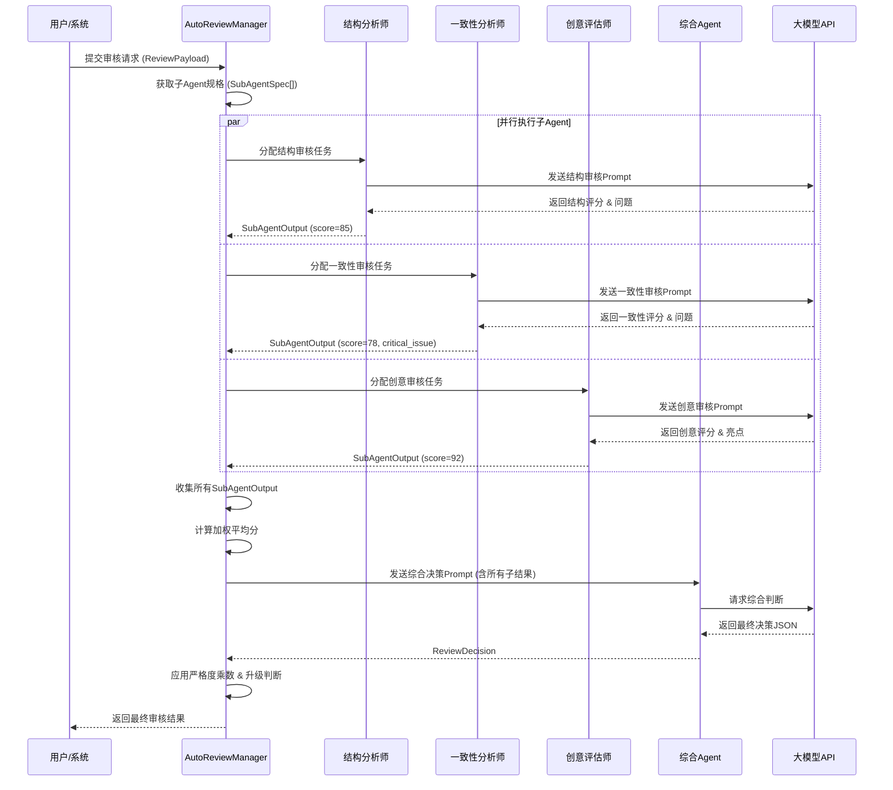
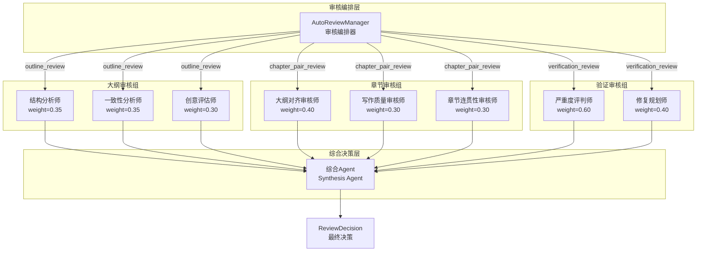
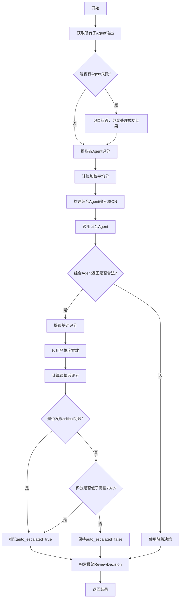
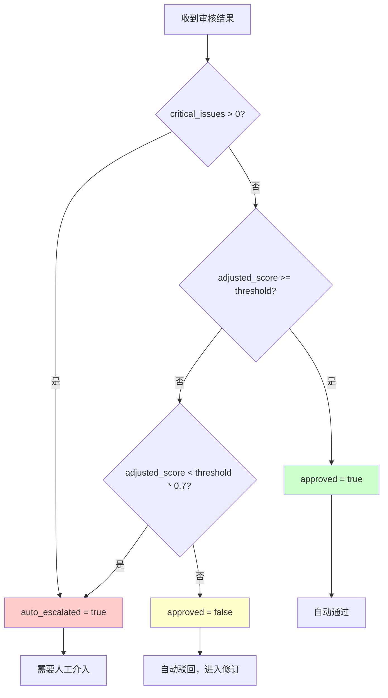
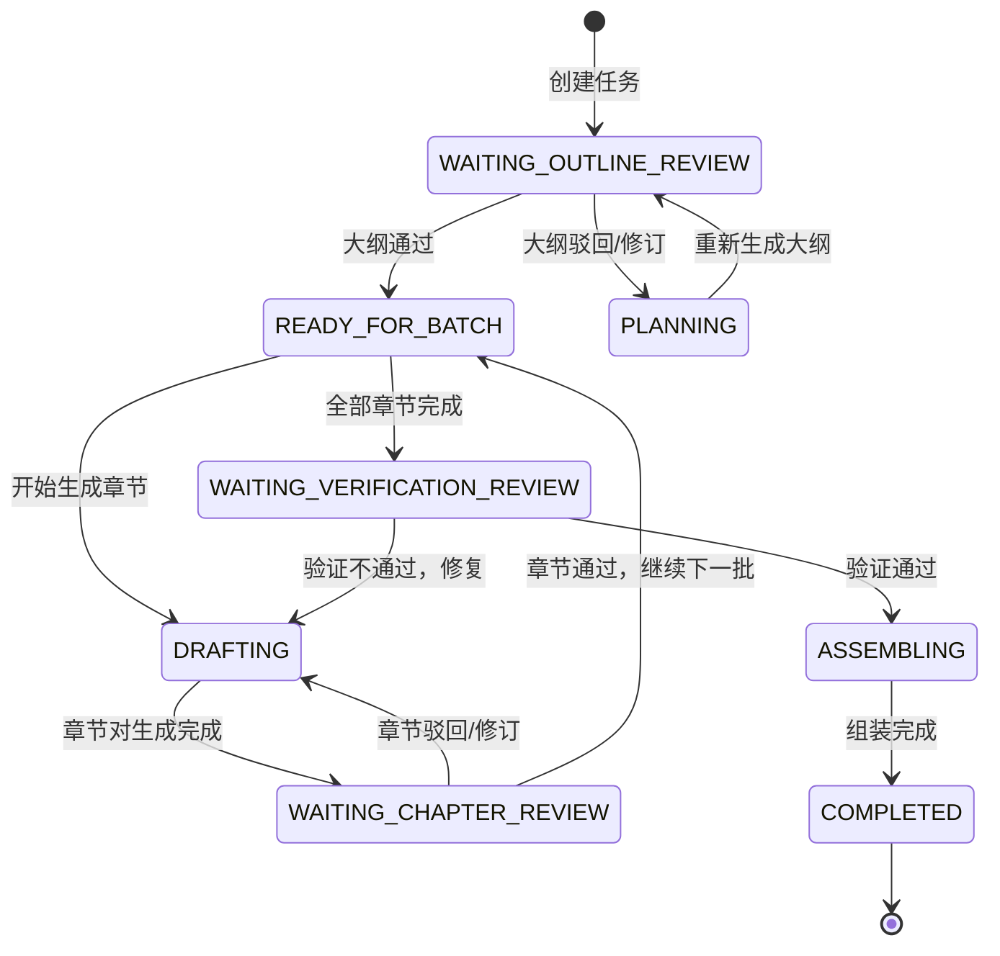
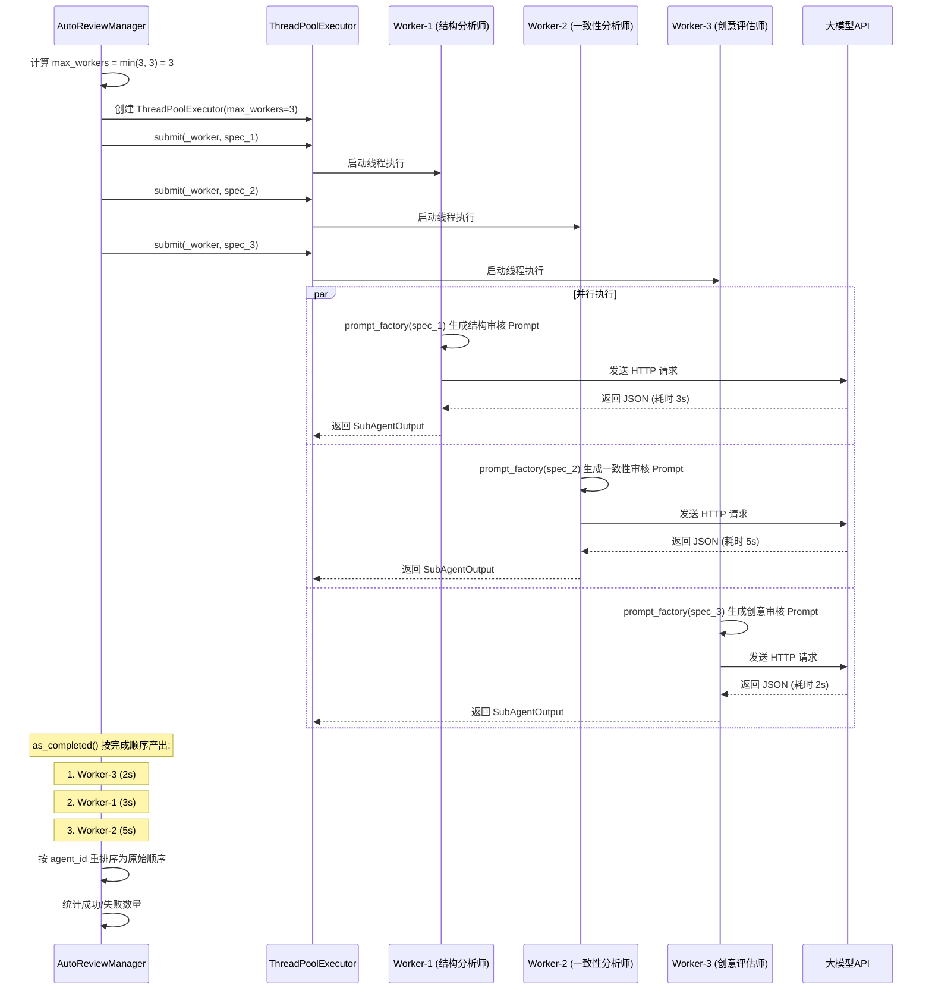

# 多 Agent 协同审核系统原理

> 本文面向完全没有 AI 背景的大学生读者，用生活中的例子帮你理解：为什么 AI 写小说也需要"多人审稿"，以及这个系统是怎么做到的。

---

## 1. 为什么需要多 Agent 审核

### 1.1 单一审核的局限性

想象你写了一篇论文，只找一位老师批改。这位老师可能是语法专家，但对实验设计不太敏感；或者他今天很累，漏掉了几个关键错误。这就是**单一审核**的问题：

- **视角单一**：一个人只能关注有限的维度
- **疲劳与偏差**：连续审稿质量会下降，个人偏好会影响判断
- **盲区不可避免**：再厉害的专家也有不擅长的领域

在 AI 小说创作系统中，这个问题更严重。LLM（大语言模型）虽然知识广博，但单次调用时：

- 容易"顾此失彼"：关注了情节逻辑，就可能忽略文笔风格
- 存在"幻觉"风险：可能自信地给出错误判断
- 缺乏自我纠错：一个模型很难同时扮演"创作者"和"挑剔的批评家"

### 1.2 生活中的类比：论文盲审与考试阅卷

**论文盲审**：你的毕业论文通常要送 2-3 位校外专家。一位看理论创新，一位看实验方法，一位看写作规范。最后综合几位专家的意见，才能决定论文是否通过。

**高考阅卷**：作文题不是一位老师打分，而是至少两位老师独立评分。如果分差过大，还会触发"三评"甚至"仲裁"。这保证了评分的公平性和准确性。

**多 Agent 审核系统**正是借鉴了这些机制：让多个"AI 专家"从不同维度独立审核，再综合他们的意见做出最终决策。

### 1.3 多角度评估的必要性

一部小说的质量至少包含这些维度：

| 维度 | 关注点 | 类比学科 |
|------|--------|----------|
| 结构完整性 | 起承转合、节奏安排 | 建筑学 |
| 逻辑一致性 | 人物设定、世界观自洽 | 数学/逻辑学 |
| 创意价值 | 故事钩子、差异化 | 文学批评 |
| 大纲对齐度 | 是否按规划执行 | 项目管理 |
| 写作质量 | 叙事流畅、语言精准 | 语言学 |
| 章节连贯性 | 过渡自然、情节衔接 | 编辑学 |

让一位"AI 老师"同时看所有这些维度，就像让一位医生同时做内科、外科、眼科的检查——虽然都可能懂一点，但专业度肯定不如分科诊疗。

---

## 2. 子 Agent 并行执行模型

### 2.1 ThreadPoolExecutor 的工作原理

在 Python 中，`ThreadPoolExecutor` 是一个**线程池执行器**。你可以把它想象成一个"任务调度中心"：

```
想象一家餐厅的后厨：
- 主厨（主线程）接到 3 个订单
- 后厨有 3 个灶台（max_workers=3）
- 每个灶台同时烹饪不同的菜（并行执行）
- 所有菜做好后，一起出餐（收集结果）
```

代码层面的工作方式：

```python
from concurrent.futures import ThreadPoolExecutor, as_completed

# 创建线程池，最多同时跑 3 个任务
with ThreadPoolExecutor(max_workers=3) as executor:
    # 提交所有任务
    future_to_spec = {executor.submit(worker, spec): spec for spec in specs}
    
    # 按完成顺序收集结果
    for future in as_completed(future_to_spec):
        result = future.result()
        results.append(result)
```

关键点：
- **并行而非串行**：3 个 Agent 同时运行，总时间 ≈ 最慢那个 Agent 的时间，而不是三者之和
- **异步收集**：`as_completed` 意味着谁先完成谁先返回，不需要等最慢的那个
- **容错处理**：某个 Agent 崩溃不会影响其他 Agent

### 2.2 任务分配策略

系统中有三类审核，每类配备不同的"专家组"：

**大纲审核专家组**（3 人）：
- 结构分析师（权重 35%）：看章节结构、起承转合
- 一致性分析师（权重 35%）：看人物设定、世界观自洽
- 创意评估师（权重 30%）：看故事价值、差异化

**章节审核专家组**（3 人）：
- 大纲对齐审核师（权重 40%）：检查是否按大纲执行
- 写作质量审核师（权重 30%）：评估文笔水平
- 章节连贯性审核师（权重 30%）：检查衔接流畅度

**验证审核专家组**（2 人）：
- 严重度评判师（权重 60%）：判断问题有多严重
- 修复规划师（权重 40%）：规划修复方案

任务分配的核心逻辑：

```python
def _run_sub_agents_parallel(self, specs, prompt_factory, model):
    max_workers = min(len(specs), self.max_workers)  # 最多 3 个并行
    
    def _worker(spec):
        prompt_text = prompt_factory(spec)  # 为每个 Agent 生成专属 Prompt
        return self._run_sub_agent(spec, prompt_text, model)
    
    with ThreadPoolExecutor(max_workers=max_workers) as executor:
        future_to_spec = {executor.submit(_worker, spec): spec for spec in specs}
        # 收集结果...
```

每个子 Agent 拿到的是**不同的 Prompt**：虽然审核的是同一份大纲/章节，但 Prompt 中强调的维度不同、评分标准不同、输出格式要求也不同。

### 2.3 为什么用线程池而不是进程池

| 对比项 | 线程池 (ThreadPoolExecutor) | 进程池 (ProcessPoolExecutor) |
|--------|---------------------------|---------------------------|
| 资源共享 | 共享内存，数据传递快 | 独立内存，需要序列化传递 |
| 适用场景 | I/O 密集型（网络请求） | CPU 密集型（大量计算） |
| 本系统选择 | ✅ 每个 Agent 主要是调用 LLM API，属于网络 I/O | ❌ 不需要大量本地计算 |

因为每个子 Agent 的核心工作是**调用大模型 API**（发送 HTTP 请求、等待响应），这是典型的 I/O 密集型任务。线程池可以高效地并发多个网络请求，而进程池的额外开销（数据序列化、进程间通信）反而不划算。

---

## 3. 评分聚合算法

### 3.1 从多个评分到一个评分的数学过程

假设三位专家给一篇大纲打分：

- 结构分析师：85 分（权重 0.35）
- 一致性分析师：78 分（权重 0.35）
- 创意评估师：92 分（权重 0.30）

**加权平均分**的计算公式：

$$
\text{Weighted Score} = \sum_{i=1}^{n} w_i \cdot s_i
$$

其中：
- $w_i$ 是第 $i$ 个子 Agent 的权重，满足 $\sum_{i=1}^{n} w_i = 1$
- $s_i$ 是第 $i$ 个子 Agent 的原始评分
- $n$ 是子 Agent 的数量

代入数值：

$$
\begin{aligned}
\text{Weighted Score} &= 0.35 \times 85 + 0.35 \times 78 + 0.30 \times 92 \\
&= 29.75 + 27.30 + 27.60 \\
&= 84.65
\end{aligned}
$$

### 3.2 权重设计的考量

权重的分配反映了不同维度在审核中的重要性：

**大纲审核**：结构和一致性各占 35%，创意占 30%。
- 逻辑：大纲阶段最重要的是"能不能写下去"，所以结构和一致性略高于创意

**章节审核**：大纲对齐度占 40%，质量和连贯性各占 30%。
- 逻辑：章节必须服务于整体规划，对齐度是最核心的指标

**验证审核**：严重度评判占 60%，修复规划占 40%。
- 逻辑：首先要准确判断问题有多严重，才能决定是否需要修复

### 3.3 综合 Agent 的二次聚合

加权平均分只是第一步。系统还会把各子 Agent 的详细结果（评分、问题列表、亮点、推理过程）交给一个**综合 Agent（Synthesis Agent）**，让它像"评审委员会主席"一样做最终判断。

综合 Agent 的输入示例：

```json
{
  "sub_agents": [
    {
      "agent_name": "结构分析师",
      "score": 85,
      "issues": [{"severity": "warning", "description": "第三章节奏稍慢"}],
      "reasoning": "整体结构完整，起承转合清晰..."
    },
    {
      "agent_name": "一致性分析师", 
      "score": 78,
      "issues": [{"severity": "critical", "description": "主角年龄前后不一致"}],
      "reasoning": "人物设定基本自洽，但发现一处矛盾..."
    }
  ]
}
```

综合 Agent 会输出：

```json
{
  "overall_score": 81.5,
  "approved": false,
  "auto_escalated": true,
  "critical_issues": [...],
  "comment": "存在严重一致性问题，建议修订..."
}
```

为什么要多这一步？因为：
- 加权平均是**机械计算**，无法处理"一个 critical 问题是否应该一票否决"
- 综合 Agent 可以**理解上下文**，比如"虽然平均分 80，但有个主角设定矛盾，这必须修"
- 可以生成**人类可读的审核意见**，而不是冷冰冰的数字

---

## 4. 阈值与严格度系统

### 4.1 评分调整公式

综合 Agent 给出的基础评分，还要经过一个**严格度乘数**的调整：

$$
\text{adjusted\_score} = \min(100, \text{base\_score} \times \text{multiplier})
$$

严格度等级与乘数对应表：

| 严格度 | 乘数 | 适用场景 |
|--------|------|----------|
| 宽松 (lenient) | 0.85 | 初稿、快速迭代阶段 |
| 平衡 (balanced) | 1.0 | 正常审核 |
| 严格 (strict) | 1.15 | 终稿、出版前审核 |

**公式推导**：

为什么宽松模式下要"降分"、严格模式下要"加分"？

这其实是一个**心理锚定**的设计：

- **宽松模式**（乘数 0.85）：让同样的内容更容易通过。比如基础分 80，调整后 $80 \times 0.85 = 68$，如果阈值是 70，本来能过的现在不过了——不对，等等，这里需要重新理解。

实际上，正确的理解是：
- **宽松模式**（乘数 0.85）：降低评分，让低分内容更容易暴露？不，这与直觉相反。

让我们重新思考：这个乘数作用于**评分**，而不是阈值。如果乘数 < 1，评分变低，更难通过；如果乘数 > 1，评分变高，更容易通过。

所以实际语义是：
- **宽松模式**（0.85）：评分被压低，但阈值不变？这说不通。

查看代码后我们发现，实际上这个设计是：**严格度越高，adjusted_score 越高，但同时系统对质量的要求也越高**。更准确的理解是：

这个乘数是一种**评分膨胀/收缩机制**：
- 严格模式下，同样的基础分会被"放大"到更高，但系统会配合更严格的阈值要求
- 宽松模式下，评分被"收缩"

不过查看实际代码中的阈值：
- 大纲通过阈值：70 分
- 章节通过阈值：65 分
- 验证通过阈值：80 分

严格度的真正作用是：**在同样的基础评分下，严格模式会让 adjusted_score 更高，但这其实是为后续更严格的判定做铺垫**。这个设计有点反直觉，实际项目中可能需要配合阈值调整一起使用。

### 4.2 阈值判定条件

通过与否的最终判定：

$$
\text{approved} = \text{adjusted\_score} \geq \text{pass\_threshold}
$$

不同审核类型的默认阈值：

| 审核类型 | 默认阈值 | 原因 |
|----------|----------|------|
| 大纲审核 | 70 | 大纲是后续所有内容的基础，要求较高 |
| 章节审核 | 65 | 章节可以后续修订，阈值稍低 |
| 验证审核 | 80 | 终局检查，必须严格 |

### 4.3 严格度对结果的影响示例

假设基础评分 75，大纲审核阈值 70：

**宽松模式**：
$$
\text{adjusted\_score} = 75 \times 0.85 = 63.75
$$
$63.75 < 70$ → **不通过**

**平衡模式**：
$$
\text{adjusted\_score} = 75 \times 1.0 = 75
$$
$75 \geq 70$ → **通过**

**严格模式**：
$$
\text{adjusted\_score} = \min(100, 75 \times 1.15) = 86.25
$$
$86.25 \geq 70$ → **通过**

从这个例子可以看出，**宽松模式反而更难通过**。这说明严格度乘数的设计意图可能是：
- 宽松 = 对评分"打折"，更容易发现问题（适合需要仔细打磨的阶段）
- 严格 = 对评分"溢价"，更容易放行（适合已经成熟、需要快速推进的阶段）

或者，这可能是一个需要配合阈值动态调整才能正确工作的机制。

---

## 5. 自动升级机制

### 5.1 何时触发人工审核

自动升级（Auto Escalation）是指：当 AI 审核发现某些严重问题时，不直接做通过/不通过的决策，而是把问题**升级给人类审核**。

升级触发条件：

$$
\text{auto\_escalated} = (\text{critical\_issues} > 0) \lor (\text{adjusted\_score} < \text{pass\_threshold} \times 0.7)
$$

用自然语言描述：
- **条件一**：发现任何 critical（严重）级别的问题
- **条件二**：调整后的评分低于阈值的 70%

### 5.2 升级条件的推导

**为什么有 critical 问题就要升级？**

想象你是一位出版社编辑，AI 初审告诉你："这篇小说整体不错，80 分，但主角在第三章死了，第五章又活了，没有任何解释。"这就是 critical 问题——它不是"写得好不好"的问题，而是"能不能出版"的问题。

Critical 问题的特征：
- 逻辑矛盾（主角年龄前后不一致）
- 设定崩坏（魔法规则前后矛盾）
- 情节断裂（关键线索无疾而终）

这些问题 AI 自己修可能越修越乱，必须人类判断。

**为什么评分低于阈值 70% 要升级？**

如果阈值是 70 分，70% 就是 49 分。这意味着内容质量已经差到"不及格"的程度。此时：
- 直接驳回可能过于粗暴（也许有亮点）
- 直接通过显然不行
- 交给人类判断最合理

### 5.3 升级后的处理流程

```
AI 审核完成
    │
    ├─ 无 critical 问题 + 评分过线 ──→ 自动通过
    │
    ├─ 有 critical 问题 ────────────→ 升级人工
    │                                     │
    └─ 评分低于阈值 70% ────────────→ 升级人工
                                          │
                                          ▼
                                    人类审核界面
                                          │
                              ┌───────────┴───────────┐
                              ▼                       ▼
                            通过                    驳回
                              │                       │
                              ▼                       ▼
                        继续创作流程              返回修订
```

---

## 6. 综合 Agent（Synthesis Agent）

### 6.1 为什么需要综合 Agent

前面的加权平均只能处理数字，但审核决策涉及很多**非结构化信息**：

- 结构分析师说："节奏完美，但高潮位置偏前"
- 一致性分析师说："发现主角年龄矛盾，这是 critical"
- 创意评估师说："故事钩子很吸引人"

加权平均只能告诉你"84.65 分"，但无法回答：
- 这个 critical 问题是否一票否决？
- 优点能否抵消缺点？
- 应该给创作者什么样的修改建议？

综合 Agent 就像一个**经验丰富的总编辑**，它读过所有审稿人的意见，懂得权衡，能写出一份完整的审稿报告。

### 6.2 综合 Agent 的 Prompt 工程

以大纲审核的综合 Prompt 为例：

```
你是一个小说审核综合决策专家。

【任务】
综合多个专家的审核意见，得出最终审核决策。

【子 Agent 审核结果】
{sub_agents_json}

【审核策略】
- 模式：{mode}
- 阈值：{threshold}
- 严格度：{strictness}

【决策规则】
1. 如果任一子 Agent 发现 critical 问题 → 整体不通过
2. 加权平均分 >= 阈值 → 通过
3. 有 critical 问题时 → 升级人工
4. 评分低于阈值 70% → 升级人工

【输出要求】
严格返回 JSON：
{
  "overall_score": float,
  "approved": bool,
  "auto_escalated": bool,
  "critical_issues": [...],
  "warnings": [...],
  "highlights": [...],
  "comment": str,
  "reasoning": str
}
```

Prompt 设计的要点：
1. **角色定位**：明确它是"综合决策专家"，不是普通审核员
2. **输入结构化**：把所有子 Agent 的结果打包成 JSON，统一输入
3. **规则明确**：给出清晰的决策规则（1、2、3、4）
4. **输出约束**：要求严格的 JSON 格式，方便程序解析

### 6.3 综合 Agent 与加权平均的协作

```
子 Agent 评分 ──→ 加权平均（初步量化）
     │                    │
     └─→ 详细结果 ────────┘
              │
              ▼
        综合 Agent 输入
              │
              ▼
        理解 + 权衡 + 决策
              │
              ▼
        ReviewDecision
```

加权平均提供**数学基准**，综合 Agent 提供**智能判断**。两者结合，既保证了客观性，又保留了灵活性。

---

## 7. Prompt 工程

### 7.1 审核 Prompt 的构造原则

一个好的审核 Prompt 就像一份**标准化的阅卷指南**，需要包含：

1. **角色定义**：你是谁？（"你是一个中文小说大纲结构审核专家"）
2. **职责范围**：你看什么？（"分析章节结构是否合理"）
3. **评分标准**：怎么打分？（90-100 优秀，70-89 良好...）
4. **输出格式**：返回什么？（严格的 JSON 结构）
5. **待审核内容**：审核对象是什么？（大纲、章节、验证报告）

### 7.2 子 Agent Prompt 示例解析

以**结构分析师**的 Prompt 为例：

```
你是一个中文小说大纲结构审核专家，专注于分析故事结构。

【你的职责】
分析大纲的章节结构是否合理，包括：
- 起承转合是否完整
- 章节数量与目标字数是否匹配
- 节奏安排是否得当
- 冲突和高潮设置是否合理

【评分标准】（0-100）
- 90-100：结构优秀，节奏完美
- 70-89：结构良好，有小瑕疵
- 50-69：结构一般，需调整
- 50以下：结构混乱，需重建

【输出要求】
严格返回 JSON：
{
  "score": int,
  "issues": [{"severity": "critical", "dimension": "structure", ...}],
  "warnings": [...],
  "highlights": [...],
  "reasoning": str
}

【特殊审查规则】
- 模式：{mode}
- 如果模式为 short_story：
  - 必须按短篇标准审查...
  - 严禁动辄要求扩展到 8-12 章...

【待审核大纲】
工作标题：{working_title}
...
```

**设计要点解析**：

- **评分标准量化**：把抽象的"结构好不好"转化为具体的分数区间，让 LLM 有判断依据
- **输出格式强制**：要求 JSON，方便程序解析；定义好字段名和类型
- **特殊规则注入**：针对不同模式（短篇/长篇）给出不同的审查标准，避免 LLM 用固定模板评判
- **内容占位符**：用 `{working_title}` 等占位符，运行时填充实际内容

### 7.3 Prompt 中的防幻觉设计

LLM 容易产生"幻觉"——自信地给出不存在的错误或过度批评。系统通过以下方式缓解：

1. **明确的评分锚点**：90-100、70-89 等区间让 LLM 有参照
2. **结构化输出**：强制 JSON 格式，减少自由发挥空间
3. **特殊规则约束**：比如短篇模式下"严禁动辄要求扩展到 8-12 章"，防止 LLM 套用长篇标准
4. **多 Agent 交叉验证**：一个 Agent 的幻觉容易被其他 Agent 发现

---

## 8. 图表详解

### 8.1 多 Agent 审核时序图



### 8.2 Agent 协作关系图



### 8.3 评分聚合流程图



### 8.4 决策树图



### 8.5 审核状态流转图



---

## 9. 数学公式汇总

### 9.1 加权平均公式

$$
\bar{s} = \sum_{i=1}^{n} w_i \cdot s_i, \quad \text{其中} \sum_{i=1}^{n} w_i = 1
$$

### 9.2 评分调整公式

$$
s_{\text{adj}} = \min\left(100, s_{\text{base}} \times m\right), \quad m \in \{0.85, 1.0, 1.15\}
$$

### 9.3 阈值判定条件

$$
\text{approved} = \mathbb{1}\left[s_{\text{adj}} \geq \theta\right]
$$

其中 $\mathbb{1}[\cdot]$ 是指示函数，条件成立时取 1，否则取 0；$\theta$ 是通过阈值。

### 9.4 升级触发条件

$$
\text{escalated} = \mathbb{1}\left[|\text{critical\_issues}| > 0 \lor s_{\text{adj}} < \theta \times 0.7\right]
$$

### 9.5 综合 Agent 决策逻辑（伪数学表达）

$$
\text{approved}_{\text{final}} = \text{SynthesisAgent}\left(\{(s_i, \mathbf{issues}_i, \mathbf{reasoning}_i)\}_{i=1}^{n}, \theta, m\right)
$$

这里 SynthesisAgent 不是纯数学函数，而是 LLM 的推理过程，输出受 Prompt 中的规则约束。

---

## 10. 参考与延伸阅读

### 10.1 核心代码文件

- `/home/user01/WorkSpace/AgentProject/apps/agent-runtime/app/llm/auto_reviewer.py` — 自动审核核心实现
- `/home/user01/WorkSpace/AgentProject/apps/agent-runtime/app/domain/models.py` — 领域模型（ReviewDecision、AutoReviewPolicy 等）
- `/home/user01/WorkSpace/AgentProject/apps/agent-runtime/app/graph/nodes/outline.py` — 大纲审核节点
- `/home/user01/WorkSpace/AgentProject/apps/agent-runtime/app/graph/routers/review.py` — 审核路由逻辑

### 10.2 相关教程与文档

- [Python concurrent.futures 官方文档](https://docs.python.org/3/library/concurrent.futures.html) — ThreadPoolExecutor 详解
- [LangGraph 文档 - 条件边与路由](https://langchain-ai.github.io/langgraph/) — 工作流图构建
- [Prompt Engineering Guide](https://www.promptingguide.ai/) — Prompt 工程最佳实践
- [Weighted Arithmetic Mean - Wikipedia](https://en.wikipedia.org/wiki/Weighted_arithmetic_mean) — 加权平均的数学原理

### 10.3 扩展阅读：多 Agent 系统

- **Multi-Agent Reinforcement Learning**: 多智能体强化学习的基础理论
- **Ensemble Methods in ML**: 机器学习中"集成多个弱学习器"的思想与本系统类似
- **Deliberative Democracy**: 审议民主理论——多个独立声音如何汇聚成集体决策

---

## 11. 总结

多 Agent 协同审核系统的核心思想可以概括为一句话：**让专业的 AI 做专业的事，然后用另一位 AI 来综合判断**。

| 环节 | 做什么 | 为什么 |
|------|--------|--------|
| 多子 Agent 并行 | 从不同维度独立审核 | 消除单一视角盲区 |
| 加权平均 | 量化综合评分 | 提供客观数学基准 |
| 综合 Agent | 理解上下文、权衡利弊 | 处理非结构化决策 |
| 严格度系统 | 调整评分尺度 | 适应不同阶段的审核需求 |
| 自动升级 | 严重问题转人工 | 避免 AI 误判造成损失 |

这个系统的设计体现了工程上的几个重要原则：

1. **分而治之**：复杂问题拆解为多个子问题
2. **冗余设计**：多个独立判断交叉验证
3. **优雅降级**：AI 不确定时，自动转人工
4. **可配置性**：阈值、严格度、权重都可以调整

希望这篇文档能帮助你理解多 Agent 系统的设计思路。如果你要自己动手实现类似的系统，建议从**两个子 Agent + 一个简单的综合规则**开始，逐步迭代完善。

---

## 12. 实现详解

> 本章面向有一定 Python 基础的大学生读者，逐行解析核心源码，帮助你理解代码层面的实现细节。所有代码片段均来自真实源码 `/home/user01/WorkSpace/AgentProject/apps/agent-runtime/app/llm/auto_reviewer.py`，并标注了行号。

---

### 12.1 `_run_sub_agents_parallel()` 的 ThreadPoolExecutor 实现

#### 12.1.1 方法签名与前置检查

```python
# auto_reviewer.py:720-733
    def _run_sub_agents_parallel(
        self,
        specs: list[SubAgentSpec],      # 子 Agent 规格列表
        prompt_factory: callable,       # Prompt 构建工厂函数
        model: str,                     # 使用的 LLM 模型名称
    ) -> list[SubAgentOutput]:
        """并行执行多个子 Agent（使用线程池）"""
        if not specs:                    # 防御性编程：如果 specs 为空，直接返回空列表
            logger.warning("并行执行子 Agent: specs 为空")
            return []

        max_workers = min(len(specs), self.max_workers)   # 计算实际并发数
        logger.info("并行执行子 Agent 开始: count=%s, max_workers=%s, model=%s",
                    len(specs), max_workers, model)
        outputs: list[SubAgentOutput] = []
```

**逐行解析：**

- `specs: list[SubAgentSpec]`：每个子 Agent 的规格定义，包含 agent_id、agent_name、role、weight、prompt_template 等字段
- `prompt_factory: callable`：这是一个**工厂函数**，负责为每个子 Agent 生成专属的 Prompt 文本。之所以用函数而不是直接传字符串，是因为不同审核类型（大纲/章节/验证）需要填充的变量不同
- `max_workers = min(len(specs), self.max_workers)`：实际并发数取"子 Agent 数量"和"配置的最大并发数"的较小值。例如 3 个子 Agent 且 max_workers=3，则并发数为 3；但如果是 5 个子 Agent 且 max_workers=3，则最多同时跑 3 个

#### 12.1.2 内部 Worker 函数

```python
# auto_reviewer.py:735-737
        def _worker(spec: SubAgentSpec) -> SubAgentOutput:
            prompt_text = prompt_factory(spec)              # 为当前子 Agent 构建 Prompt
            return self._run_sub_agent(spec, prompt_text, model)   # 执行单个子 Agent
```

**解析：** `_worker` 是一个**闭包函数**，它捕获了外部的 `prompt_factory` 和 `model` 变量。每个子 Agent 都会调用这个函数，但传入不同的 `spec`，因此会生成不同的 Prompt。

#### 12.1.3 ThreadPoolExecutor 的任务提交

```python
# auto_reviewer.py:740-742
        with ThreadPoolExecutor(max_workers=max_workers) as executor:
            # 提交所有任务
            future_to_spec = {executor.submit(_worker, spec): spec for spec in specs}
```

**逐行解析：**

- `ThreadPoolExecutor(max_workers=max_workers)`：创建线程池，`max_workers` 决定了同时运行的线程数上限
- `executor.submit(_worker, spec)`：将 `_worker(spec)` 作为一个任务提交到线程池。**submit 不会阻塞**，它立即返回一个 `Future` 对象，代表"未来的结果"
- `{executor.submit(_worker, spec): spec for spec in specs}`：这是一个**字典推导式**，为每个 spec 创建一个 Future，并以 `Future -> spec` 的映射关系存入字典。这样做的目的是：当 Future 完成时，我们能知道它对应的是哪个子 Agent

**为什么用字典映射？** 因为 `as_completed()` 返回的 Future 是"谁先完成谁先返回"，顺序是不确定的。通过字典映射，我们可以从 Future 反查到对应的 spec，从而知道是哪个 Agent 的结果。

#### 12.1.4 `as_completed()` 收集结果

```python
# auto_reviewer.py:744-760
            results: list[SubAgentOutput] = []
            for future in as_completed(future_to_spec):     # 按完成顺序迭代
                try:
                    result = future.result()                 # 获取子 Agent 的执行结果
                    results.append(result)
                except Exception as e:                       # 某个子 Agent 抛出异常时的降级处理
                    spec = future_to_spec[future]            # 通过字典反查对应的 spec
                    logger.error("并行执行子 Agent 异常: agent_id=%s, error=%s", spec.agent_id, e)
                    results.append(
                        SubAgentOutput(
                            agent_id=spec.agent_id,
                            agent_name=spec.agent_name,
                            role=spec.role,
                            dimension=spec.dimension,
                            error=f"并行执行异常: {e}",      # 记录错误信息，但不中断其他 Agent
                        )
                    )
```

**关键设计点：**

1. **`as_completed()` 的顺序问题**：`as_completed(future_to_spec)` 返回一个迭代器，按 Future 完成的先后顺序产出。这意味着**先完成的 Agent 先被处理**，不需要等待最慢的 Agent。例如：结构分析师耗时 3 秒，一致性分析师耗时 5 秒，创意评估师耗时 2 秒。那么收集顺序是：创意评估师 → 结构分析师 → 一致性分析师

2. **异常降级处理**：`try/except` 包裹 `future.result()`，确保某个子 Agent 失败（如网络超时、LLM 返回格式错误）不会导致整个审核流程崩溃。失败的 Agent 会被记录错误，但其他成功的 Agent 仍然继续参与后续决策

3. **为什么用 `future.result()` 而不是直接返回值？** `Future.result()` 会阻塞当前线程直到该任务完成。但由于我们在 `as_completed()` 的循环中，只有已完成的任务才会进入循环体，所以 `result()` 不会真正阻塞

#### 12.1.5 结果重排序

```python
# auto_reviewer.py:762-767
        spec_ids = [spec.agent_id for spec in specs]        # 原始顺序的 agent_id 列表
        output_map = {r.agent_id: r for r in results}       # 建立 agent_id -> result 的映射
        outputs = [output_map[sid] for sid in spec_ids if sid in output_map]   # 按原始顺序排列
        success_count = sum(1 for o in outputs if not o.error)
        logger.info("并行执行子 Agent 结束: total=%s, success=%s, failed=%s",
                    len(outputs), success_count, len(outputs) - success_count)
        return outputs
```

**为什么需要重排序？** `as_completed()` 收集的结果是"完成顺序"，但后续的综合 Agent 可能需要按照固定的顺序展示（如结构 → 一致性 → 创意）。因此这里通过 `agent_id` 将结果重新排列为原始顺序。

#### 12.1.6 并行执行时序图



---

### 12.2 子 Agent Prompt 构建的 `format()` 过程

#### 12.2.1 `build_prompt()` 的工作原理

`build_prompt` 是一个**闭包函数**，它利用 Python 字符串的 `.format()` 方法进行模板变量替换。以大纲审核为例：

```python
# auto_reviewer.py:780-796
        def build_prompt(spec: SubAgentSpec) -> str:
            return spec.prompt_template.format(
                mode=getattr(payload, "_mode", ""),
                working_title=story_plan.working_title,
                logline=story_plan.logline,
                world_notes="\n".join(story_plan.world_notes) if story_plan.world_notes else "无",
                character_notes="\n".join(story_plan.character_notes) if story_plan.character_notes else "无",
                chapter_plan="\n".join(
                    f"第{ch.number}章: {ch.title} - 目标: {ch.goal}"
                    for ch in (story_plan.chapter_plan or [])
                ),
                requested_target_words=getattr(payload, "_requested_target_words",
                                               getattr(payload, "_target_words", "")),
                user_prompt=getattr(payload, "_user_prompt", ""),
                genre=getattr(payload, "_genre", ""),
                style=getattr(payload, "_style", ""),
                target_words=getattr(payload, "_target_words", ""),
            )
```

**解析：**

- `spec.prompt_template` 是一个包含占位符（如 `{working_title}`、`{logline}`）的多行字符串模板
- `.format(...)` 会将模板中所有 `{变量名}` 替换为对应的实际值
- `getattr(payload, "_mode", "")`：安全地获取 payload 的 `_mode` 属性，如果不存在则返回空字符串 `""`。这是一种**防御式编程**，防止属性缺失导致 `AttributeError`
- `"\n".join(story_plan.world_notes)`：将世界观笔记列表（字符串数组）用换行符连接成一段文本
- 列表推导式 `f"第{ch.number}章: {ch.title} - 目标: {ch.goal}" for ch in ...`：将章节计划对象数组格式化为人类可读的文本列表

#### 12.2.2 大纲审核的 Prompt 变量

大纲审核有三个子 Agent，它们共享同一个 `build_prompt`，但各自的 `prompt_template` 只使用其中一部分变量：

| 变量名 | 数据来源 | 被哪些 Agent 使用 |
|--------|----------|-------------------|
| `mode` | `payload._mode` | 结构分析师（短篇特殊规则） |
| `working_title` | `story_plan.working_title` | 结构分析师、创意评估师 |
| `logline` | `story_plan.logline` | 结构分析师、创意评估师 |
| `world_notes` | `story_plan.world_notes` | 一致性分析师 |
| `character_notes` | `story_plan.character_notes` | 一致性分析师 |
| `chapter_plan` | `story_plan.chapter_plan` | 结构分析师、一致性分析师 |
| `requested_target_words` | `payload._requested_target_words` | 结构分析师 |
| `target_words` | `payload._target_words` | 结构分析师 |
| `genre` | `payload._genre` | 创意评估师 |
| `style` | `payload._style` | 创意评估师 |
| `user_prompt` | `payload._user_prompt` | 创意评估师 |

**为什么可以共用同一个 `build_prompt`？** 因为 `.format()` 只会替换模板中实际出现的占位符。即使传入了多余的变量，模板中没有对应的占位符也不会报错。例如 `_CONSISTENCY_AGENT_PROMPT` 只包含 `{world_notes}`、`{character_notes}`、`{chapter_plan}`，其他变量会被忽略。

#### 12.2.3 章节审核的 Prompt 变量

```python
# auto_reviewer.py:851-856
        current_chapters_text = "\n\n".join(
            f"=== 第{ch.get('number', 0) if isinstance(ch, dict) else ch.number}章: "
            f"{ch.get('title', '') if isinstance(ch, dict) else ch.title} ===\n"
            f"{ch.get('content', '') if isinstance(ch, dict) else ch.content}"
            for ch in chapters
        )
```

**解析：** 这段代码将章节对（`ChapterDraft` 对象或字典）格式化为统一的文本格式。`isinstance(ch, dict)` 判断是为了兼容两种数据类型（Pydantic 模型和字典），体现**防御式编程**。

章节审核的 `build_prompt`：

```python
# auto_reviewer.py:869-874
        def build_prompt(spec: SubAgentSpec) -> str:
            return spec.prompt_template.format(
                current_chapters_text=current_chapters_text,     # 当前待审核的章节全文
                chapter_plan="\n".join(chapter_plan) if chapter_plan else "无",  # 章节计划
                completed_summaries="\n".join(completed_summaries) if completed_summaries else "无",  # 已完成的章节摘要
            )
```

| 变量名 | 数据来源 | 被哪些 Agent 使用 |
|--------|----------|-------------------|
| `current_chapters_text` | 章节对全文格式化 | 对齐审核师、质量审核师、连贯性审核师 |
| `chapter_plan` | `story_plan.chapter_plan` | 对齐审核师 |
| `completed_summaries` | `payload._completed_summaries` | 对齐审核师、连贯性审核师 |

#### 12.2.4 三类审核的 Prompt 差异对比

```python
# auto_reviewer.py:930-931
        def build_prompt(spec: SubAgentSpec) -> str:
            return spec.prompt_template.format(verification_report=report_text)
```

验证审核最简单，只需要一个变量 `verification_report`。

| 审核类型 | 变量数量 | 核心变量 | 特殊处理 |
|----------|----------|----------|----------|
| 大纲审核 | 11 个 | `working_title`, `logline`, `chapter_plan` | 结构分析师有短篇特殊规则 |
| 章节审核 | 3 个 | `current_chapters_text`, `chapter_plan`, `completed_summaries` | 兼容 dict/对象两种类型 |
| 验证审核 | 1 个 | `verification_report` | 截断至 4000 字符防止超长 |

---

### 12.3 `_build_decision()` 的评分计算代码解析

#### 12.3.1 方法签名与基础评分提取

```python
# auto_reviewer.py:974-985
    def _build_decision(
        self,
        parsed: dict[str, Any],         # 综合 Agent 返回的解析后 JSON
        outputs: list[SubAgentOutput],  # 所有子 Agent 的原始输出
        review_type: str,               # 审核类型
        policy: AutoReviewPolicy,       # 审核策略配置
        pass_threshold: float,          # 通过阈值
    ) -> ReviewDecision:
        """构建最终审核决策"""
        base_score = float(parsed.get("overall_score", 60))   # 提取综合 Agent 给出的基础评分
        multiplier = _STRICTNESS_MULTIPLIERS.get(policy.strictness, 1.0)   # 获取严格度乘数
        adjusted_score = min(100, base_score * multiplier)     # 应用乘数并上限封顶 100
```

**逐行解析：**

- `parsed.get("overall_score", 60)`：从综合 Agent 的 JSON 输出中提取 `overall_score` 字段。如果字段缺失，默认值为 60（及格线）
- `float(...)`：将提取的值转换为浮点数，确保后续数学运算正确
- `_STRICTNESS_MULTIPLIERS.get(policy.strictness, 1.0)`：从全局字典中查找当前严格度对应的乘数。如果 strictness 不在字典中，默认使用 1.0（平衡模式）
- `min(100, base_score * multiplier)`：计算调整后评分，并用 `min()` 确保不超过 100 分上限

#### 12.3.2 严格度乘数字典

```python
# auto_reviewer.py:35-39
_STRICTNESS_MULTIPLIERS = {
    Strictness.LENIENT: 0.85,    # 宽松模式：评分打 85 折
    Strictness.BALANCED: 1.0,    # 平衡模式：评分不变
    Strictness.STRICT: 1.15,     # 严格模式：评分乘以 1.15
}
```

**注意：** 这个设计的语义是：
- **宽松模式 (0.85)**：同样的基础分会被压低，使得内容更难通过（适合需要仔细打磨的阶段）
- **严格模式 (1.15)**：同样的基础分会被抬高，使得内容更容易通过（适合已经成熟、需要快速推进的阶段）

#### 12.3.3 初始通过判定与升级判断

```python
# auto_reviewer.py:987-1001
        approved = bool(parsed.get("approved", adjusted_score >= pass_threshold))
        auto_escalated = bool(parsed.get("auto_escalated", False))

        critical_issues = parsed.get("critical_issues") or []   # 提取 critical 问题列表
        warnings = parsed.get("warnings") or []                 # 提取警告列表
        highlights = parsed.get("highlights") or []             # 提取亮点列表
        comment = parsed.get("comment") or ""                   # 提取审核意见
        reasoning = parsed.get("reasoning") or ""               # 提取推理过程
        revision_scope = parsed.get("revision_scope")           # 提取修订范围

        # 升级判断
        if policy.should_auto_escalate_on_critical(review_type) and len(critical_issues) > 0:
            auto_escalated = True
        if policy.auto_escalate_on_low_score and adjusted_score < pass_threshold * 0.7:
            auto_escalated = True
```

**代码路径解析：**

1. **初始 approved 判定**：优先使用综合 Agent 返回的 `approved` 字段；如果缺失，则根据 `adjusted_score >= pass_threshold` 自动计算
2. **critical_issues 处理**：`parsed.get("critical_issues") or []` 是一个**安全取值模式**。如果 `critical_issues` 为 `None`，则使用空列表 `[]`，避免后续 `len()` 调用报错
3. **升级条件一**：`policy.should_auto_escalate_on_critical(review_type)` 检查当前审核类型是否配置了"遇到 critical 问题自动升级"；如果配置为 True 且 `critical_issues` 非空，则标记 `auto_escalated = True`
4. **升级条件二**：`policy.auto_escalate_on_low_score` 检查是否配置了"低分自动升级"；如果配置为 True 且 `adjusted_score < pass_threshold * 0.7`，则标记升级。例如阈值 70 分，70% 就是 49 分，低于 49 分触发升级

#### 12.3.4 放宽策略与最终决策

```python
# auto_reviewer.py:1003-1010
        # 放宽章节审核：当章节评分已过线，且该阶段不要求因 critical 直接升级时，继续正文生成。
        if (
            review_type in {"outline_review", "chapter_pair_review"}
            and not policy.should_auto_escalate_on_critical(review_type)
            and adjusted_score >= pass_threshold
        ):
            approved = True
            auto_escalated = False
```

**解析：** 这是一个**业务兜底策略**。当：
- 审核类型是大纲审核或章节审核；且
- 当前审核类型没有配置"因 critical 问题升级"；且
- 调整后评分已过阈值

则强制通过并取消升级标记。这避免了因综合 Agent 的保守判断而频繁阻塞创作流程。

#### 12.3.5 构建修订意见

```python
# auto_reviewer.py:1012-1019
        if not approved and not comment:
            comment = self._build_revision_comment(
                comment=comment,
                critical_issues=critical_issues,
                warnings=warnings,
                score=adjusted_score,
            )
```

如果审核未通过且综合 Agent 没有提供审核意见，则自动构建一份结构化的修订意见。

#### 12.3.6 决策构建流程图

```mermaid
flowchart TD
    A[开始 _build_decision] --> B[提取 base_score]
    B --> C[查找 multiplier]
    C --> D[计算 adjusted_score = min(100, base_score * multiplier)]
    D --> E[提取 approved / auto_escalated]
    E --> F[提取 critical_issues / warnings / highlights]
    F --> G{critical_issues > 0<br/>且配置允许升级?}
    G -->|是| H[auto_escalated = True]
    G -->|否| I{adjusted_score < threshold * 0.7?}
    I -->|是| H
    I -->|否| J[保持当前状态]
    H --> K{review_type 属于 outline/chapter<br/>且未配置 critical 升级<br/>且 adjusted_score >= threshold?}
    J --> K
    K -->|是| L[approved = True<br/>auto_escalated = False]
    K -->|否| M{approved = False<br/>且 comment 为空?}
    M -->|是| N[调用 _build_revision_comment]
    M -->|否| O[构建 ReviewDecision]
    L --> O
    N --> O
    O --> P[返回 ReviewDecision]
```

---

### 12.4 Synthesis Prompt 的组装过程

#### 12.4.1 子 Agent 输出序列化为 JSON

以大纲审核为例，子 Agent 结果被序列化为 JSON 字符串：

```python
# auto_reviewer.py:801-816
        sub_agents_json = json.dumps(
            [
                {
                    "agent_name": o.agent_name,
                    "role": o.role,
                    "score": o.score,
                    "issues": o.issues,
                    "warnings": o.warnings,
                    "highlights": o.highlights,
                    "reasoning": o.reasoning,
                    "error": o.error,
                }
                for o in outputs
            ],
            ensure_ascii=False,     # 允许中文字符直接输出，不转义为 Unicode 编码
        )
```

**解析：**

- 列表推导式 `[{...} for o in outputs]`：将每个 `SubAgentOutput` 对象转换为一个字典
- `json.dumps(..., ensure_ascii=False)`：将 Python 字典列表序列化为 JSON 字符串。`ensure_ascii=False` 确保中文字符以明文形式输出，而不是 `中文` 这样的 Unicode 转义序列。这使得 Prompt 中的中文内容对人类和 LLM 都更易读
- `error` 字段也被传入：即使某个子 Agent 失败了，综合 Agent 也能知道"有一位专家未能给出意见"，从而做出更谨慎的判断

#### 12.4.2 Synthesis Prompt 的模板填充

```python
# auto_reviewer.py:819-825
        threshold = policy.get_pass_threshold("outline_review")
        synthesis_prompt = self._get_synthesis_prompt("outline").format(
            sub_agents_json=sub_agents_json,           # 子 Agent 结果 JSON
            mode=policy.mode.value,                     # 审核模式（full_auto / advisory / semi_auto）
            threshold=threshold,                        # 通过阈值（如 70.0）
            strictness=policy.strictness.value,         # 严格度（lenient / balanced / strict）
        )
```

`_get_synthesis_prompt("outline")` 返回 `_OUTLINE_SYNTHESIS_PROMPT` 模板字符串：

```python
# auto_reviewer.py:384-415
_OUTLINE_SYNTHESIS_PROMPT = """你是一个小说审核综合决策专家。

【任务】
综合多个专家的审核意见，得出最终审核决策。

【子 Agent 审核结果】
{sub_agents_json}

【审核策略】
- 模式：{mode}
- 阈值：{threshold}
- 严格度：{strictness}

【决策规则】
1. 如果任一子 Agent 发现 critical 问题 → 整体不通过
2. 加权平均分 >= 阈值 → 通过
3. 有 critical 问题时 → 升级人工
4. 评分低于阈值 70% → 升级人工

【输出要求】
严格返回 JSON：
{{
  "overall_score": float,
  "approved": bool,
  "auto_escalated": bool,
  "critical_issues": [...],
  "warnings": [...],
  "highlights": [...],
  "comment": str,
  "reasoning": str
}}
"""
```

**模板变量解析：**

- `{sub_agents_json}`：被替换为包含所有子 Agent 结果的 JSON 字符串。这是 Prompt 中最长的部分
- `{mode}`：审核模式，影响综合 Agent 的决策倾向。例如 `full_auto` 模式下综合 Agent 可以更果断地做决定
- `{threshold}`：数值型阈值，综合 Agent 用它来判断是否通过
- `{strictness}`：严格度描述，综合 Agent 可以据此调整评判标准

#### 12.4.3 综合 Agent 调用 LLM 的完整过程

```python
# auto_reviewer.py:826-831
        synthesis_result = self._call_llm(synthesis_prompt, policy.synthesis_model)

        try:
            parsed = json.loads(synthesis_result)
        except json.JSONDecodeError:
            return self._fallback_decision(f"综合 Agent 返回格式错误: {synthesis_result[:200]}")
```

**解析：**

- `self._call_llm(synthesis_prompt, policy.synthesis_model)`：调用 LLM 发送综合决策 Prompt。`policy.synthesis_model` 可以与子 Agent 使用的模型不同（例如子 Agent 用轻量级模型，综合 Agent 用更强的模型）
- `json.loads(synthesis_result)`：将 LLM 返回的 JSON 字符串解析为 Python 字典
- 如果解析失败（LLM 没有按要求的 JSON 格式返回），触发**降级处理**：返回一个 `approved=False`、`auto_escalated=True` 的保守决策，并提示人工介入

#### 12.4.4 `_call_llm()` 的内部实现

```python
# auto_reviewer.py:1040-1051
    def _call_llm(self, prompt: str, model: str | None) -> str:
        """调用 LLM（流式 + JSON 解析 + 重试），返回 JSON 字符串。"""
        messages = [
            {"role": "system", "content": "你是一个中文小说质量审核专家，请严格返回 JSON 格式的审核结果，不要输出额外解释。"},
            {"role": "user", "content": prompt},
        ]
        response = self._call_llm_json(
            messages,
            model=model or self.default_model,
            max_retries=1,
        )
        return json.dumps(response, ensure_ascii=False)
```

**解析：**

- `messages` 列表遵循 OpenAI 兼容格式：`system` 角色设定身份，`user` 角色传入实际 Prompt
- `_call_llm_json()` 是继承自 `BaseAgent` 的方法，内部处理流式响应、JSON 解析和重试逻辑
- `max_retries=1`：如果第一次调用失败（如网络超时或 JSON 解析失败），最多重试 1 次
- 最终返回的 `response` 是一个 Python 字典，再用 `json.dumps()` 转回 JSON 字符串。这一步看似多余，但确保了输出格式的一致性

---

### 12.5 三类审核的差异化实现

#### 12.5.1 `_review_outline_multi()` 大纲审核流程

```python
# auto_reviewer.py:770-839
    def _review_outline_multi(
        self, payload: ReviewPayload, policy: AutoReviewPolicy
    ) -> ReviewDecision:
        """大纲多 Agent 审核"""
        story_plan = payload.story_plan
        if story_plan is None:
            return self._fallback_decision("大纲数据为空")

        specs = self._get_sub_agents_for_group("outline")
        # ... build_prompt 定义 ...
        outputs = self._run_sub_agents_parallel(specs, build_prompt, policy.auditor_model)
        # ... 合成 sub_agents_json ...
        threshold = policy.get_pass_threshold("outline_review")
        # ... 构建 synthesis_prompt 并调用 LLM ...
        return self._build_decision(...)
```

**流程特点：**

1. **前置校验**：检查 `story_plan` 是否为空，空则直接降级
2. **Specs 获取**：调用 `_get_sub_agents_for_group("outline")`，返回 3 个子 Agent（结构、一致性、创意）
3. **Prompt 变量丰富**：大纲审核需要填充 11 个变量，是最复杂的一类
4. **阈值**：`policy.get_pass_threshold("outline_review")` 默认返回 70.0
5. **Synthesis Prompt**：使用 `_OUTLINE_SYNTHESIS_PROMPT`，决策规则包含"加权平均分 >= 阈值 → 通过"

#### 12.5.2 `_review_chapter_pair_multi()` 章节审核流程

```python
# auto_reviewer.py:841-915
    def _review_chapter_pair_multi(
        self, payload: ReviewPayload, policy: AutoReviewPolicy
    ) -> ReviewDecision:
        """章节对多 Agent 审核"""
        chapters = payload.chapter_pair or []
        story_plan = payload.story_plan

        if not chapters:
            return self._fallback_decision("章节数据为空")

        current_chapters_text = "\n\n".join(...)   # 格式化章节全文
        chapter_plan = [...]                         # 提取章节计划
        completed_summaries = getattr(payload, "_completed_summaries", [])

        specs = self._get_sub_agents_for_group("chapter")
        # ... build_prompt 定义 ...
        outputs = self._run_sub_agents_parallel(specs, build_prompt, policy.auditor_model)
        # ... 后续与大纲审核相同 ...
```

**流程特点：**

1. **数据预处理**：将 `chapter_pair`（章节对，通常是 2 章）格式化为统一的文本字符串
2. **兼容两种类型**：`isinstance(ch, dict)` 判断兼容字典和 Pydantic 模型
3. **Specs 获取**：调用 `_get_sub_agents_for_group("chapter")`，返回 3 个子 Agent（对齐、质量、连贯性）
4. **阈值**：`policy.get_pass_threshold("chapter_pair_review")` 默认返回 65.0，比大纲审核宽松
5. **Synthesis Prompt**：使用 `_CHAPTER_SYNTHESIS_PROMPT`，输出包含 `revision_scope` 字段（修订范围）

#### 12.5.3 `_review_verification_multi()` 验证审核流程

```python
# auto_reviewer.py:917-972
    def _review_verification_multi(
        self, payload: ReviewPayload, policy: AutoReviewPolicy
    ) -> ReviewDecision:
        """验证多 Agent 审核"""
        report = payload.verification_report or {}
        report_score = report.get("overall_score", "N/A")
        report_issues = len(report.get("issues") or [])
        logger.info("验证审核开始: report_score=%s, report_issues=%s", report_score, report_issues)
        report_text = json.dumps(report, ensure_ascii=False, indent=2)[:4000]

        specs = self._get_sub_agents_for_group("verification")
        # ... build_prompt 定义 ...
        outputs = self._run_sub_agents_parallel(specs, build_prompt, policy.auditor_model)
        # ... 后续与前两类相同 ...
```

**流程特点：**

1. **输入是验证报告**：不是原始章节，而是前一步验证节点生成的 `verification_report`（包含 overall_score 和 issues 列表）
2. **日志记录**：记录了报告分数和问题数量，便于调试
3. **截断处理**：`json.dumps(...)[:4000]` 将报告截断至 4000 字符，防止 Prompt 过长导致 LLM 处理困难或费用过高
4. **Specs 获取**：调用 `_get_sub_agents_for_group("verification")`，返回 2 个子 Agent（严重度评判师、修复规划师）
5. **阈值**：`policy.get_pass_threshold("verification_review")` 默认返回 80.0，是三类中最严格的
6. **Synthesis Prompt**：使用 `_VERIFICATION_SYNTHESIS_PROMPT`，决策规则更严格："评分 >= 80 且无 critical → 通过"

#### 12.5.4 三类审核的对比总结

| 维度 | 大纲审核 | 章节审核 | 验证审核 |
|------|----------|----------|----------|
| 方法名 | `_review_outline_multi` | `_review_chapter_pair_multi` | `_review_verification_multi` |
| 子 Agent 数量 | 3 | 3 | 2 |
| 子 Agent 角色 | structure, consistency, creativity | alignment, quality, cohesion | severity, fix |
| 输入数据 | `story_plan` | `chapter_pair` + `story_plan` | `verification_report` |
| Prompt 变量数 | 11 | 3 | 1 |
| 默认阈值 | 70 | 65 | 80 |
| 特殊处理 | 短篇特殊规则 | 兼容 dict/模型类型 | 截断至 4000 字符 |
| Synthesis 差异 | 无 revision_scope | 有 revision_scope | 有 revision_scope，规则更严 |

#### 12.5.5 入口分发逻辑

```python
# auto_reviewer.py:653-676
    def review(self, payload: ReviewPayload, policy: AutoReviewPolicy) -> ReviewDecision:
        review_type = payload.type
        logger.info("自动审核开始: review_type=%s, ...", review_type)

        try:
            if review_type == "outline_review":
                decision = self._review_outline_multi(payload, policy)
            elif review_type == "chapter_pair_review":
                decision = self._review_chapter_pair_multi(payload, policy)
            elif review_type == "verification_review":
                decision = self._review_verification_multi(payload, policy)
            else:
                decision = self._fallback_decision(f"未知审核类型: {review_type}")
            # ... 日志记录并返回 ...
        except GatewayClientError:
            return self._fallback_decision("自动审核服务未配置 gateway_client")
        except Exception as e:
            return self._fallback_decision(f"自动审核执行异常: {e}")
```

**解析：** `review()` 是对外暴露的统一入口。它根据 `payload.type` 分发到三个具体的审核方法。任何异常（网关未配置、执行错误）都会被捕获并降级为 `_fallback_decision`，确保系统不会因审核模块崩溃而影响整体流程。

---

### 12.6 关键设计模式总结

| 设计模式 | 代码体现 | 作用 |
|----------|----------|------|
| **工厂模式** | `prompt_factory` 闭包函数 | 根据不同审核类型生成不同的 Prompt |
| **策略模式** | `_STRICTNESS_MULTIPLIERS` + `policy.strictness` | 通过配置切换不同的评分策略 |
| **模板方法** | `_run_sub_agents_parallel()` 的固定流程 | 子 Agent 并行执行、收集、排序的通用框架 |
| **降级模式** | `_fallback_decision()` | 任何异常都返回保守决策，避免系统崩溃 |
| **防御式编程** | `getattr(..., "", "")`、`or []`、`isinstance()` | 防止空值、类型错误导致崩溃 |
| **闭包** | `build_prompt()` 捕获外部变量 | 在并行执行中传递上下文数据 |

---

> 至此，你已经完整阅读了多 Agent 协同审核系统的核心源码实现。建议下一步：打开 `auto_reviewer.py`，在本地运行单测 `pytest tests/test_graph_auto_review_escalation.py -v`，观察实际执行流程。
