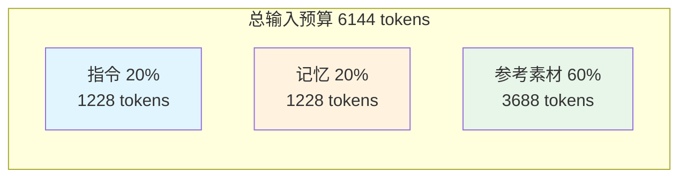
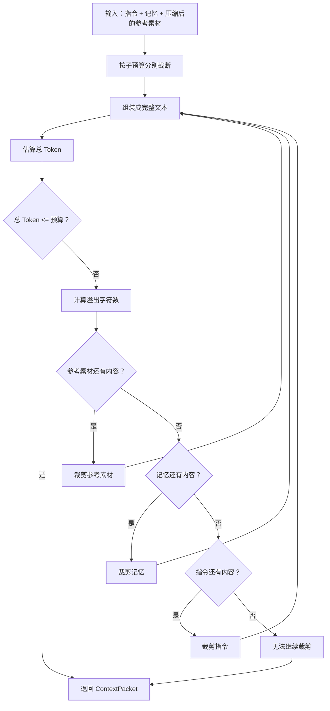
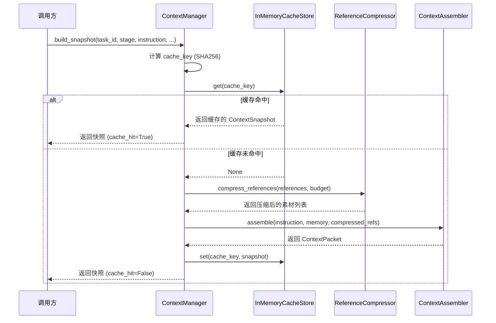
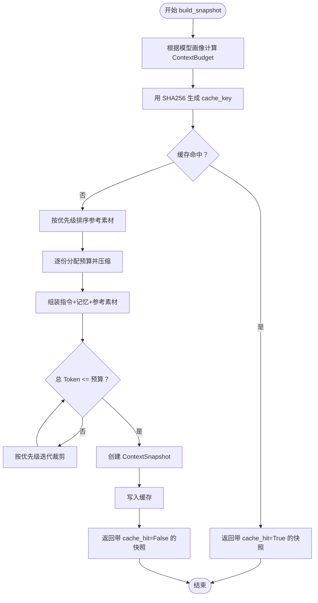
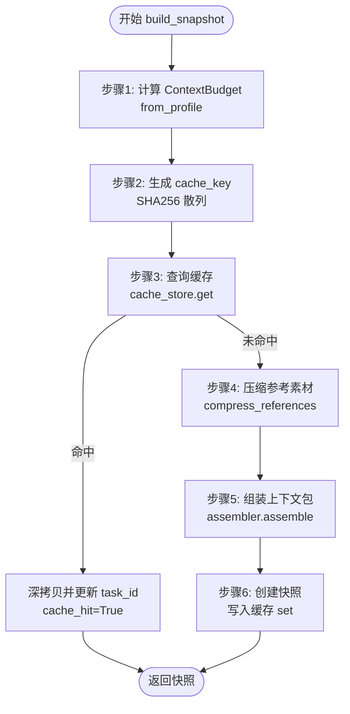
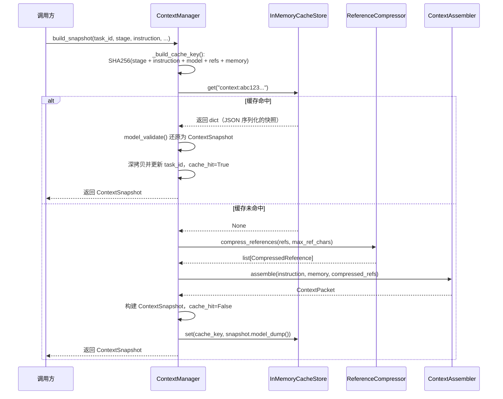

# 04 上下文管理与预算分配

> 适合对象：完全不了解 LLM 底层机制的大学生读者。你不需要懂深度学习，只需要具备高中数学和基础编程常识即可阅读。  
> 目标：读完本文后，你能用自己的话向同学解释"为什么 AI 写小说时不能把所有资料一次性塞进去"，并能画出本项目的上下文装配流程。

---

## 0. 从一个生活类比开始：图书馆借书与背包容量

想象你是一名大学生，期末要写一份关于"唐代诗歌"的课程论文。你跑到图书馆，找到了 20 本相关书籍，还从知网下载了 30 篇论文。你当然希望把这些资料全部带到自习室去慢慢看——但你的背包只有这么大。

这就是**上下文窗口（Context Window）**问题的日常版本。

大型语言模型（LLM）就像一个"只能看眼前这一堆资料"的聪明助手。它确实很会写文章，但每次你让它动笔之前，你必须把所有相关信息——任务要求、参考资料、之前的对话记录——装进一个"背包"里交给它。这个背包的容量是有限的，而且不同型号的模型，背包大小还不一样。

本项目（一个 AI 辅助小说创作系统）的核心挑战之一，就是：

> **如何在背包容量有限的前提下，把最重要的信息装进去，同时不让模型因为资料太多而"爆包"。**

本文将带你一步步理解这个系统是如何做"装包规划"的。

---

## 1. 什么是 LLM 的上下文窗口

### 1.1 从"字符"到"Token"：LLM 的基本计量单位

在讨论容量之前，我们必须先理解 LLM 的"计量单位"。

人类数文章长度用"字数"，但 LLM 不用字数，它用一种叫 **Token** 的单位。你可以把 Token 粗略理解为"模型认识的最小文字碎片"。

- 一个英文单词通常被拆成 1~2 个 Token（例如 "hello" 可能是 1 个 Token，"unbelievable" 可能被拆成 3 个）。
- 一个中文字符通常约占 0.5~1 个 Token（取决于具体模型的 tokenizer）。

为什么不用字数？因为模型在内部处理的是数字编码，而不是直接的字符。Tokenizer 就是负责把人类文字翻译成数字序列的"词典"。

### 1.2 上下文窗口就是"单次请求的最大 Token 上限"

**上下文窗口（Context Window）**指的是：模型在一次推理中，能够接收的输入 Token 的最大数量。

你可以把它理解为考试时的"答题纸长度"。不管你知道多少知识，这次考试你只能把答案写在这么长的纸上。如果写不下，后面的内容模型就"看不见"了。

不同模型的窗口大小差异很大：

| 模型类型 | 典型上下文窗口 | 类比 |
|---------|-------------|------|
| 早期 GPT-3 | 4,096 tokens | 一张 A4 纸 |
| GPT-4 | 8,192 ~ 128,000 tokens | 一沓 A4 纸到一本小册子 |
| Claude 3 | 200,000 tokens | 一本中篇小说 |

在本项目中，每个模型都有一个 `ModelContextProfile`（模型上下文画像），其中 `max_input_tokens` 就是这个"背包的总容量"。

### 1.3 为什么需要管理：不是"装得下"就行

即使你的模型有 128K 的窗口，也不意味着你可以把 128K 全部用来塞参考资料。因为：

1. **模型输出也需要空间**：你让模型写小说，它写出来的内容也要占 Token。如果输入占了 128K，输出就没位置了。
2. **系统提示词占空间**：告诉模型"你是一个小说写作助手"这类指令本身也要占 Token。
3. **多轮对话累积**：如果这是第 5 轮对话，前 4 轮的问答历史都要带进去。

所以，**上下文管理**的本质是：在"输入预算"和"输出预算"之间做权衡，在"指令"、"记忆"、"参考资料"之间做分配。

---

## 2. Token 估算：从字符到 Token 的数学转换

### 2.1 工程近似的必要性

精确计算一段文本有多少 Token，需要调用模型厂商提供的 tokenizer（分词器）。但在一个需要频繁做预算分配的系统里，每次都调 tokenizer 太慢了。

本项目采用了一个工程上的**保守近似**：

$$
\text{estimate\_tokens}(text) = \left\lceil \frac{\text{len}(text)}{4} \right\rceil
$$

其中：
- $\text{len}(text)$ 是字符串的字符数（对中英文都按字符计数）。
- $\lceil \cdot \rceil$ 是向上取整。
- 除以 4 的含义是：**假设平均每 4 个字符对应 1 个 Token**。

这个假设对中文文本是偏保守的（实际中文通常 1~2 字符/Token），但对混合文本是一个稳定、快速、不会低估的上界估计。

> 类比：这就像你估算行李重量时，把所有物品都按"偏重"来算。虽然不够精确，但保证不会超重。

### 2.2 为什么"偏保守"比"精确但可能低估"更好

在预算分配场景中，**高估输入长度**的后果只是"少装了一点资料"；但**低估输入长度**的后果是"实际发送时超出模型上限，导致请求失败或内容被截断"。

因此，本项目的估算策略遵循一个工程原则：

> **宁可少装，不可爆包。**

---

## 3. Token 预算分配：如何把"背包容量"分给不同的物品

### 3.1 总预算的计算

假设某模型的 `max_input_tokens = 8192`，`reserved_output_tokens = 2048`（为输出预留 2048 Token）。

那么实际可用于输入的预算为：

$$
\text{available\_input\_tokens} = \max(\text{max\_input\_tokens} - \text{reserved\_output\_tokens}, 0)
$$

代入数字：

$$
\text{available\_input\_tokens} = 8192 - 2048 = 6144 \text{ tokens}
$$

这 6144 tokens 就是我们要分配的"实际可用空间"。

### 3.2 三部分预算的固定比例分配

本项目把可用输入预算按固定比例拆成三部分：

| 部分 | 比例 | 用途 | 最低保障 |
|-----|------|------|---------|
| 指令（Instruction） | 20% | 当前阶段的任务说明 | 16 tokens |
| 记忆（Memory） | 20% | 之前轮次的关键信息摘要 | 16 tokens |
| 参考素材（References） | 60% | 用户上传的参考资料 | 16 tokens |

计算公式：

$$
\begin{aligned}
\text{instruction\_tokens} &= \max(\lfloor \text{available} \times 0.2 \rfloor, 16) \\
\text{memory\_tokens} &= \max(\lfloor \text{available} \times 0.2 \rfloor, 16) \\
\text{reference\_tokens} &= \max(\text{available} - \text{instruction} - \text{memory}, 16)
\end{aligned}
$$

然后，把 Token 预算换算成字符预算（便于直接对字符串做截断）：

$$
\begin{aligned}
\text{max\_instruction\_chars} &= \text{instruction\_tokens} \times 4 \\
\text{max\_memory\_chars} &= \text{memory\_tokens} \times 4 \\
\text{max\_reference\_chars} &= \text{reference\_tokens} \times 4
\end{aligned}
$$

以 6144 tokens 为例：

$$
\begin{aligned}
\text{instruction} &= 1228 \text{ tokens} \rightarrow 4912 \text{ chars} \\
\text{memory} &= 1228 \text{ tokens} \rightarrow 4912 \text{ chars} \\
\text{reference} &= 3688 \text{ tokens} \rightarrow 14752 \text{ chars}
\end{aligned}
$$

### 3.3 为什么采用固定比例？

你可能会问：为什么不能动态调整？比如某次任务指令特别长，就多分一点给指令？

固定比例的好处是**简单、可预测、易调试**。在项目的当前阶段，这是一个经过工程权衡的启发式策略：

- **指令不能太少**：否则模型不知道要做什么。
- **记忆不能太少**：否则模型会"失忆"，忘记前面写过什么。
- **参考素材占大头**：因为参考资料通常是三者中最长的，也是最容易被压缩的。

> 类比：这就像你打包行李时，把背包分成"证件区"（20%）、"随身物品区"（20%）和"衣物区"（60%）。虽然每次出行的具体需求不同，但这个分区方案保证了你不会忘带证件，也不会没衣服穿。



---

## 4. 参考素材压缩算法：当资料太多时怎么办

### 4.1 问题场景

假设用户上传了 5 份参考资料：
- 《武侠世界观设定》：50,000 字
- 《主角人物小传》：8,000 字
- 《宋代风俗考》：30,000 字
- 《兵器谱》：12,000 字
- 《情节大纲》：5,000 字

但参考素材的字符预算只有 14,752 字符。五份资料加起来 105,000 字，远超预算。**必须压缩**。

### 4.2 单份素材的压缩策略

对于单份素材，系统采用三种策略（由 `ReferenceCompressor.compress_text` 实现）：

```
if 原文长度 <= 预算上限:
    策略 = "full_text"（完整保留）
elif 预算上限 <= 3 个字符:
    策略 = "hard_truncate"（硬截断，能留几个留几个）
else:
    策略 = "truncate_tail"（截断尾部并补 "..."）
```

第三种策略的效果是：如果给这份素材分配了 500 字符的预算，就保留前 497 个字符，后面加上 `...`。

> 注意：当前实现是**字符级截断**，不是语义摘要。系统并不"理解"内容后重写一份短的，而是直接从尾部砍掉。这是工程上的简化，优点是快、稳定、无歧义；缺点是可能砍断关键句子。

### 4.3 多份素材的预算分配策略

当有多份素材竞争预算时，系统采用以下算法（`compress_references`）：

**步骤 1：按优先级排序**

每份素材有一个 `priority` 字段（整数，越大越重要）。系统先按优先级降序排列，同优先级按原始顺序排列。

**步骤 2：逐份分配预算**

对排序后的每份素材，计算它能获得的预算：

$$
\text{allocation}_i = \max\left(\frac{\text{remaining\_chars}}{\text{remaining\_items}}, 48\right)
$$

其中：
- $\text{remaining\_chars}$ 是剩余可用字符数。
- $\text{remaining\_items}$ 是尚未处理的素材份数。
- 48 是**保底额度**，保证每份素材至少能保留 48 个字符（约 12 个 Token）。

**步骤 3：压缩并扣除已用预算**

用计算出的预算压缩当前素材，然后从剩余预算中扣除实际使用的字符数。

**步骤 4：恢复原始顺序**

压缩完成后，按素材的原始顺序重新排列，返回结果。

### 4.4 算法示例

假设有 3 份素材，总预算 300 字符：

| 素材 | 优先级 | 原始长度 |
|-----|--------|---------|
| A | 3 | 200 字符 |
| B | 1 | 400 字符 |
| C | 2 | 150 字符 |

**排序后**：A(3) → C(2) → B(1)

**分配过程**：

1. **处理 A**：剩余 3 份，预算 300。allocation = max(300/3, 48) = 100。A 原始 200 > 100，截断为 100 字符。剩余预算 = 300 - 100 = 200。
2. **处理 C**：剩余 2 份，预算 200。allocation = max(200/2, 48) = 100。C 原始 150 > 100，截断为 100 字符。剩余预算 = 200 - 100 = 100。
3. **处理 B**：剩余 1 份，预算 100。allocation = max(100/1, 48) = 100。B 原始 400 > 100，截断为 100 字符。剩余预算 = 100 - 100 = 0。

**恢复原始顺序后**：A(100) → B(100) → C(100)

### 4.5 这个分配策略的优缺点

**优点**：
- 高优先级素材先获得预算，保证重要内容不被淹没。
- 保底额度防止低优先级素材被完全"饿死"。
- 算法复杂度 O(n log n)，速度快。

**缺点**：
- 不是全局最优解（例如，一份 50 字符的素材和一份 500 字符的素材获得同样预算，前者浪费，后者不够）。
- 没有考虑素材之间的语义冗余（如果两份素材内容重复，应该只保留一份）。

> 类比：这就像宿舍 4 个人合买一个 300 元的蛋糕，约定"按贡献大小先选，但每人至少分到一口"。不是最精确的分配，但保证没人完全吃不到，且出力多的人先挑。

```mermaid
flowchart TD
    A[输入：素材列表 + 总预算] --> B{素材是否为空？}
    B -->|是| C[返回空列表]
    B -->|否| D[按优先级降序排序]
    D --> E[初始化 remaining_chars = 总预算]
    E --> F{还有未处理素材？}
    F -->|否| G[按原始顺序恢复排列]
    F -->|是| H[计算 allocation = max(remaining / 剩余份数, 48)]
    H --> I[压缩当前素材]
    I --> J[remaining_chars -= 实际使用字符数]
    J --> F
    G --> K[返回压缩后的素材列表]
```

---

## 5. 上下文组装策略：按优先级组织最终文本

### 5.1 组装流程

压缩完成后，系统进入组装阶段（`ContextAssembler.assemble`）。组装的目标是把"指令"、"记忆"、"参考素材"三部分拼成一个完整的文本包。

组装格式如下：

```
任务阶段：{stage}

用户指令：
{instruction_text}

记忆上下文：
{memory_text}

参考素材：
{references_text}
```

### 5.2 两级裁剪机制

组装过程有两级"保险"：

**第一级：子预算截断**

在组装前，每部分文本先被各自的子预算截断：
- 指令不能超过 `max_instruction_chars`
- 记忆不能超过 `max_memory_chars`
- 参考素材不能超过 `max_reference_chars`

**第二级：总量迭代裁剪**

组装成完整文本后，估算总 Token 数。如果仍然超出总预算，就进入迭代裁剪：

```
while 总 Token > 可用预算:
    溢出字符 = (总 Token - 预算) * 4
    if 参考素材还有内容:
        从参考素材尾部裁剪溢出字符
    elif 记忆还有内容:
        从记忆尾部裁剪溢出字符
    elif 指令还有内容:
        从指令尾部裁剪溢出字符
    else:
         break
    重新组装并估算 Token
```

裁剪优先级：**参考素材 > 记忆 > 指令**

### 5.3 为什么是这个优先级？

这个顺序背后的工程直觉是：

1. **参考素材最长、最可替代**：通常参考素材是三者中体积最大的，而且即使被截断，模型仍能看到前面的部分。
2. **记忆关乎连贯性**：如果完全删除记忆，模型会忘记前面写过什么，导致剧情不连贯。
3. **指令是任务定义**：如果连指令都被删光了，模型根本不知道要做什么。

> 类比：你的背包已经满了，但还要塞一件刚买的外套。你会先拿出什么？
> - 先拿出备用雨伞（参考素材）—— 没有也能走。
> - 再拿出充电宝（记忆）—— 有点麻烦，但能忍。
> - 最后才考虑拿出钱包和身份证（指令）—— 没有就寸步难行。



---

## 6. 缓存机制：避免重复"装包"

### 6.1 为什么需要缓存

上下文装配涉及：
1. 计算预算（数学运算）
2. 压缩参考素材（遍历、截断）
3. 组装文本（字符串拼接）

如果同一个任务、同一批资料、同一个模型在短时间内被多次请求，重复做这些计算是浪费的。**缓存机制**就是用来避免这种重复劳动的。

### 6.2 缓存键的生成：SHA256 散列

缓存的核心问题是："怎样判断两次请求是相同的？"

本项目采用 **SHA256 散列**来生成缓存键。具体做法：

1. 把影响上下文内容的所有因素放入一个字典：
   - `stage`（当前阶段，如 "outline"、"draft"）
   - `instruction`（用户指令）
   - `model_profile`（模型画像，包含窗口大小等）
   - `references`（参考素材列表）
   - `memory_items`（记忆项列表）

2. 把字典序列化为 JSON 字符串（按 key 排序，保证相同内容产生相同字符串）：

$$
\text{payload} = \text{json\_dumps}(\{\text{stage}, \text{instruction}, \text{model\_profile}, \text{references}, \text{memory\_items}\}, \text{sort\_keys}=\text{True})
$$

3. 对 payload 做 SHA256 散列：

$$
\text{digest} = \text{SHA256}(\text{payload}.\text{encode}(\text{"utf-8"}))
$$

4. 加上前缀作为最终缓存键：

$$
\text{cache\_key} = \text{"context:"} + \text{digest}.\text{hex}()
$$

### 6.3 SHA256 是什么？为什么用它？

SHA256（Secure Hash Algorithm 256-bit）是一种**密码学散列函数**。它的特点是：

- **确定性**：相同的输入永远产生相同的 256 位（64 个十六进制字符）输出。
- **雪崩效应**：输入哪怕只改一个字符，输出也会完全不同。
- **不可逆**：从散列值无法反推出原始内容。
- **抗碰撞**：找到两个不同输入但产生相同输出的内容，在计算上几乎不可能。

> 类比：SHA256 就像一台"指纹机"。你把一篇文章放进去，它生成一个 64 位的"指纹"。只要文章改了一个字，指纹就完全不同。你无法从指纹还原文章，但可以用指纹来快速比对"这两篇文章是不是同一篇"。

### 6.4 缓存查询时序



### 6.5 TTL 策略：缓存不会永远有效

本项目使用 `InMemoryCacheStore`，它是一个内存缓存，支持 TTL（Time To Live，生存时间）。

默认 TTL 为 **300 秒（5 分钟）**。这意味着：

- 缓存条目在写入后 5 分钟内有效。
- 超过 5 分钟后，再次访问会被视为未命中，条目会被自动删除。
- 这种设计防止了内存无限增长，同时利用了"短期内重复请求"的局部性。

TTL 的数学表达：

$$
\text{expires\_at} = \text{current\_time} + \text{ttl\_seconds}
$$

查询时检查：

$$
\text{if } \text{current\_time} \geq \text{expires\_at}: \quad \text{视为过期，返回 None}
$$

### 6.6 缓存命中率计算

缓存命中率是衡量缓存效果的核心指标：

$$
\text{命中率} = \frac{\text{命中次数}}{\text{命中次数} + \text{未命中次数}} \times 100\%
$$

例如，某段时间内有 100 次 `build_snapshot` 调用，其中 30 次命中缓存，则：

$$
\text{命中率} = \frac{30}{100} \times 100\% = 30\%
$$

在本项目中，每次返回的 `ContextSnapshot` 都带有 `cache_hit` 字段（布尔值），调用方可以据此统计命中率。

---

## 7. 诊断与监控：追踪 Token 使用量和缓存效果

### 7.1 诊断信息的内容

每次 `build_snapshot` 完成后，系统会生成一份诊断信息（`diagnostics`）：

```python
{
    "reference_count": len(references),           # 原始参考素材份数
    "memory_item_count": len(memory_items or []), # 记忆项数量
    "within_budget": packet.estimated_input_tokens <= budget.available_input_tokens,
}
```

其中 `within_budget` 是一个关键布尔值：
- `True`：最终组装文本的估算 Token 数在预算内。
- `False`：即使经过两轮裁剪，文本仍然超出预算（理论上不应发生，因为迭代裁剪会持续到塞进去为止，但可作为异常标记）。

### 7.2 快照中的完整信息

`ContextSnapshot` 对象包含了上下文装配的全貌：

| 字段 | 含义 |
|-----|------|
| `task_id` | 所属任务 ID |
| `stage` | 当前阶段（如 "outline"、"draft"） |
| `model_id` | 使用的模型标识 |
| `cache_key` | 本次快照的缓存键 |
| `cache_hit` | 是否命中缓存 |
| `budget` | 预算分配详情（各部分 Token/字符上限） |
| `packet` | 组装后的文本包（含估算 Token 数） |
| `compressed_references` | 每份素材的压缩详情（原始长度、压缩后长度、策略） |
| `diagnostics` | 诊断信息 |
| `created_at` | 创建时间 |

### 7.3 如何监控压缩效果

通过 `compressed_references` 可以分析压缩效果：

**压缩率**：

$$
\text{压缩率} = \frac{\text{压缩后总字符数}}{\text{原始总字符数}} \times 100\%
$$

例如，原始 100,000 字符压缩到 15,000 字符，压缩率为 15%。

**各素材的压缩策略分布**：

可以统计使用 `full_text`、`truncate_tail`、`hard_truncate` 的素材比例，判断是否有素材被过度压缩。

---

## 8. 完整流程回顾



---

## 9. 当前实现的边界与注意事项

1. **Token 估算是近似值**：`len(text) / 4` 不是精确 tokenizer，适合工程预算控制，但不适合精确计费。
2. **压缩是字符截断，不是语义摘要**：系统不会"理解"内容后重写，只是从尾部砍掉。
3. **缓存是进程内内存缓存**：服务重启后缓存丢失，且不支持分布式共享。
4. **预算比例是固定的**：当前不支持根据任务类型动态调整比例（例如大纲阶段可能需要更多参考素材，写作阶段需要更多记忆）。

---

## 10. 参考教程与延伸阅读

- [OpenAI Tokenizer 可视化工具](https://platform.openai.com/tokenizer) — 直观感受文本如何被拆成 Token
- [SHA-256 工作原理（3Blue1Brown 视频）](https://www.youtube.com/watch?v=DMtFhACPnTY) — 用动画理解散列函数
- [LangChain 官方文档：Context Management](https://python.langchain.com/docs/concepts/) — 了解更通用的上下文管理方案
- [《算法导论》第 11 章：散列表](https://mitpress.mit.edu/9780262046305/introduction-to-algorithms/) — 深入理解散列的数学原理

---

> 本文档基于 `apps/agent-runtime/app/context/` 模块的当前实现整理。如果你在实际阅读代码时发现与本文描述不符的地方，以代码为准，并欢迎提出更新建议。

---

## 实现详解

> 本节面向希望深入阅读源码的读者，逐行拆解核心函数的实现细节。所有代码块均来自真实源码，标注了文件路径与行号。

---

### 1. `build_snapshot()` 的 6 个完整步骤

`build_snapshot()` 是上下文管理的唯一入口，位于 `ContextManager` 类中。它的执行流程可以拆解为 6 个严格顺序的步骤。

**源码位置**：`apps/agent-runtime/app/context/manager.py` 第 28~85 行

```python
# apps/agent-runtime/app/context/manager.py:28-85
class ContextManager:
    def build_snapshot(
        self,
        task_id: str,
        stage: str,
        instruction: str,
        model_profile: ModelContextProfile,
        references: list[ReferenceMaterial],
        memory_items: list[str] | None = None,
    ) -> ContextSnapshot:
```

#### 步骤 1：计算预算（第 37 行）

```python
        budget = ContextBudget.from_profile(model_profile)
```

**解析**：根据模型画像（如 GPT-4 的 8192 tokens 上限）计算出本次可用的输入预算，以及指令、记忆、参考素材三部分的子预算。这一步是纯数学计算，不涉及任何文本操作。

#### 步骤 2：生成缓存键（第 38~45 行）

```python
        cache_key = self._build_cache_key(
            task_id=task_id,
            stage=stage,
            instruction=instruction,
            model_profile=model_profile,
            references=references,
            memory_items=memory_items or [],
        )
```

**解析**：把所有影响上下文内容的因素打包，交给 `_build_cache_key()` 生成 SHA256 散列值。注意：`task_id` 也参与了散列，这意味着同一个任务在换阶段或换指令后，缓存键必然不同。

#### 步骤 3：查询缓存（第 46~58 行）

```python
        cached_snapshot = self.cache_store.get(cache_key)
        if isinstance(cached_snapshot, dict):
            cached_snapshot = ContextSnapshot.model_validate(cached_snapshot)
        if cached_snapshot is not None:
            packet = cached_snapshot.packet.model_copy(update={"task_id": task_id}, deep=True)
            return cached_snapshot.model_copy(
                update={
                    "task_id": task_id,
                    "cache_hit": True,
                    "packet": packet,
                },
                deep=True,
            )
```

**解析**：
- 先从缓存中尝试读取。由于缓存存储的是 JSON 字典，需要先用 `model_validate()` 还原成 `ContextSnapshot` 对象。
- 如果命中缓存，会做一次深拷贝（`deep=True`），并把 `task_id` 更新为当前值（防止不同任务共享同一个缓存对象时互相污染），然后直接返回。
- 返回的 `cache_hit=True` 标记了这是一次缓存命中。

> 通俗解释：这就像你去食堂打饭，先问窗口"刚才那份套餐还在吗？"如果在，直接端走；如果不在，从头做一份。

#### 步骤 4：压缩参考素材（第 60 行）

```python
        compressed_references = self.compressor.compress_references(references, budget.max_reference_chars)
```

**解析**：调用 `ReferenceCompressor.compress_references()`，按优先级排序后逐份分配预算并压缩。这是整个流程中最耗时的步骤之一，因为涉及排序、遍历和字符串截断。

#### 步骤 5：组装上下文包（第 61~68 行）

```python
        packet = self.assembler.assemble(
            task_id=task_id,
            stage=stage,
            budget=budget,
            instruction=instruction,
            compressed_references=compressed_references,
            memory_items=memory_items,
        )
```

**解析**：把指令、记忆、压缩后的参考素材交给 `ContextAssembler`，先按子预算截断，再组装成完整文本，最后做迭代裁剪直到总 Token 数不超出预算。

#### 步骤 6：创建快照并写入缓存（第 69~85 行）

```python
        snapshot = ContextSnapshot(
            task_id=task_id,
            stage=stage,
            model_id=model_profile.model_id,
            cache_key=cache_key,
            cache_hit=False,
            budget=budget,
            packet=packet,
            compressed_references=compressed_references,
            diagnostics={
                "reference_count": len(references),
                "memory_item_count": len(memory_items or []),
                "within_budget": packet.estimated_input_tokens <= budget.available_input_tokens,
            },
        )
        self.cache_store.set(cache_key, snapshot.model_dump(mode="json"))
        return snapshot
```

**解析**：
- 用所有计算结果构建 `ContextSnapshot` 对象，其中 `cache_hit=False` 表示未命中缓存。
- `diagnostics` 包含诊断信息：原始素材份数、记忆项数量、是否在预算内。
- 最后把快照序列化为 JSON 字典写入缓存，供下次查询使用。



---

### 2. `ContextBudget.from_profile()` 的预算计算过程

**源码位置**：`apps/agent-runtime/app/context/models.py` 第 38~51 行

```python
# apps/agent-runtime/app/context/models.py:38-51
class ContextBudget(BaseModel):
    max_input_tokens: int
    reserved_output_tokens: int
    available_input_tokens: int
    max_instruction_chars: int
    max_memory_chars: int
    max_reference_chars: int

    @classmethod
    def from_profile(cls, profile: ModelContextProfile) -> "ContextBudget":
        available_input_tokens = max(profile.max_input_tokens - profile.reserved_output_tokens, 0)
        instruction_tokens = max(int(available_input_tokens * 0.2), 16)
        memory_tokens = max(int(available_input_tokens * 0.2), 16)
        reference_tokens = max(available_input_tokens - instruction_tokens - memory_tokens, 16)
        return cls(
            max_input_tokens=profile.max_input_tokens,
            reserved_output_tokens=profile.reserved_output_tokens,
            available_input_tokens=available_input_tokens,
            max_instruction_chars=instruction_tokens * 4,
            max_memory_chars=memory_tokens * 4,
            max_reference_chars=reference_tokens * 4,
        )
```

**逐行解析**：

| 行号 | 代码 | 中文解释 |
|------|------|---------|
| 40 | `available_input_tokens = max(..., 0)` | 可用输入 Token = 模型最大输入 - 预留输出。`max(..., 0)` 防止结果为负数（比如模型窗口比预留输出还小）。 |
| 41 | `instruction_tokens = max(int(... * 0.2), 16)` | 指令预算 = 可用输入的 20%，但保底 16 tokens。`int()` 截断小数，向下取整。 |
| 42 | `memory_tokens = max(int(... * 0.2), 16)` | 记忆预算同样为 20%，保底 16 tokens。 |
| 43 | `reference_tokens = max(... - ... - ..., 16)` | 参考素材预算 = 剩余全部（约 60%），保底 16 tokens。 |
| 44~51 | `return cls(...)` | 把 Token 预算乘以 4 转换为字符预算，便于直接对字符串做截断。 |

**计算示例**（`max_input_tokens=8192`，`reserved_output_tokens=2048`）：

```
available_input_tokens = max(8192 - 2048, 0) = 6144
instruction_tokens     = max(int(6144 * 0.2), 16) = 1228
memory_tokens          = max(int(6144 * 0.2), 16) = 1228
reference_tokens       = max(6144 - 1228 - 1228, 16) = 3688

max_instruction_chars  = 1228 * 4 = 4912
max_memory_chars       = 1228 * 4 = 4912
max_reference_chars    = 3688 * 4 = 14752
```

> 通俗解释：这就像你拿到 6144 元生活费，先强制存 20% 吃饭钱、20% 交通费，剩下的 60% 自由支配。而且每笔钱至少要有 16 元，防止某一项完全归零。

---

### 3. `compress_references()` 的压缩算法实现（三种策略）

压缩算法分为两个层次：**单份素材的压缩策略**（`compress_text`）和**多份素材的预算分配**（`compress_references`）。

#### 3.1 单份素材的三种压缩策略

**源码位置**：`apps/agent-runtime/app/context/compressor.py` 第 7~31 行

```python
# apps/agent-runtime/app/context/compressor.py:7-31
class ReferenceCompressor:
    def compress_text(self, reference: ReferenceMaterial, max_chars: int) -> CompressedReference:
        normalized_limit = max(max_chars, 0)          # 行 8：预算不能为负数
        original_chars = len(reference.content)       # 行 9：记录原始长度
        if original_chars <= normalized_limit:        # 行 10：策略一 - 完整保留
            content = reference.content
            was_compressed = False
            strategy = "full_text"
        elif normalized_limit <= 3:                   # 行 14：策略二 - 硬截断
            content = reference.content[:normalized_limit]
            was_compressed = True
            strategy = "hard_truncate"
        else:                                         # 行 18：策略三 - 截断尾部并补 "..."
            content = f"{reference.content[: normalized_limit - 3]}..."
            was_compressed = True
            strategy = "truncate_tail"
        return CompressedReference(
            source_id=reference.source_id,
            title=reference.title,
            priority=reference.priority,
            content=content,
            original_chars=original_chars,
            compressed_chars=len(content),
            was_compressed=was_compressed,
            strategy=strategy,
        )
```

| 策略 | 触发条件 | 效果 | 类比 |
|------|---------|------|------|
| `full_text` | 原文长度 <= 预算 | 完整保留，不压缩 | 书很薄，直接塞包里 |
| `hard_truncate` | 预算 <= 3 个字符 | 能留几个留几个，不加省略号 | 包只剩 3 厘米缝隙，硬塞 |
| `truncate_tail` | 预算 > 3 且原文 > 预算 | 保留前 `(预算-3)` 个字符，加 `...` | 把书后面撕掉，贴个"未完"标签 |

#### 3.2 多份素材的预算分配算法

**源码位置**：`apps/agent-runtime/app/context/compressor.py` 第 33~56 行

```python
# apps/agent-runtime/app/context/compressor.py:33-56
    def compress_references(
        self,
        references: list[ReferenceMaterial],
        max_total_chars: int,
    ) -> list[CompressedReference]:
        if not references:                              # 行 38：空列表直接返回
            return []
        remaining_chars = max(max_total_chars, 0)       # 行 40：总预算不能为负
        ordered = sorted(                               # 行 41~44：按优先级降序排序
            enumerate(references),
            key=lambda item: (-item[1].priority, item[0]),
        )
        compressed_pairs: list[tuple[int, CompressedReference]] = []
        for index, (original_index, reference) in enumerate(ordered):   # 行 46：逐份处理
            remaining_items = len(ordered) - index      # 行 47：还剩多少份没处理
            if remaining_chars <= 0:                    # 行 48：预算已耗尽
                compressed = self.compress_text(reference, 0)
            else:
                allocation = max(remaining_chars // remaining_items, 48)  # 行 51：均分预算，保底 48
                compressed = self.compress_text(reference, allocation)
            compressed_pairs.append((original_index, compressed))
            remaining_chars -= compressed.compressed_chars              # 行 54：扣除实际使用
        compressed_pairs.sort(key=lambda item: item[0])                 # 行 55：恢复原始顺序
        return [item[1] for item in compressed_pairs]                   # 行 56：返回压缩结果
```

**逐行解析**：

| 行号 | 代码 | 中文解释 |
|------|------|---------|
| 41~44 | `ordered = sorted(enumerate(...), key=...)` | 用 `enumerate` 保留原始索引，排序键为 `(-priority, original_index)`。负号表示降序，同优先级按原始顺序。 |
| 47 | `remaining_items = len(ordered) - index` | 计算还剩多少份素材未处理，用于均分剩余预算。 |
| 48~49 | `if remaining_chars <= 0` | 如果预算已经用完（可能前面某份素材把预算全占了），后续素材分配 0 字符。 |
| 51 | `allocation = max(remaining_chars // remaining_items, 48)` | 核心分配公式：剩余预算除以剩余份数，向下取整，保底 48 字符。`//` 是整数除法。 |
| 54 | `remaining_chars -= compressed.compressed_chars` | 扣除的是**实际使用字符数**，不是分配的预算。如果素材比预算短，剩余预算会变大，后续素材受益。 |
| 55 | `compressed_pairs.sort(key=lambda item: item[0])` | 按原始索引排序，恢复用户上传时的顺序，保证输出稳定性。 |

> 通俗解释：这就像宿舍 4 个人凑钱买奶茶，总共 100 元。先按"谁今天帮大家占座"的贡献排序，然后每人先分到 `100/4=25` 元。如果有人只喝 15 元的，剩下的 10 元不会退回，而是让后面的人实际可支配更多。但每个人至少能买到 48 元以下的那一杯（保底额度）。

---

### 4. `assembler.assemble()` 的组装优先级代码

**源码位置**：`apps/agent-runtime/app/context/assembler.py` 第 7~41 行

```python
# apps/agent-runtime/app/context/assembler.py:7-41
class ContextAssembler:
    def assemble(
        self,
        task_id: str,
        stage: str,
        budget: ContextBudget,
        instruction: str,
        compressed_references: list[CompressedReference],
        memory_items: list[str] | None = None,
    ) -> ContextPacket:
        instruction_text = self._clamp_text(instruction.strip(), budget.max_instruction_chars)      # 行 16
        memory_text = self._clamp_text(                                                             # 行 17~20
            "\n".join(item.strip() for item in (memory_items or []) if item.strip()),
            budget.max_memory_chars,
        )
        references_text = self._clamp_text(                                                         # 行 21~24
            self._format_references(compressed_references),
            budget.max_reference_chars,
        )
        assembled_text, estimated_tokens, truncated = self._fit_sections(                           # 行 25~31
            stage=stage,
            budget=budget,
            instruction_text=instruction_text,
            memory_text=memory_text,
            references_text=references_text,
        )
        return ContextPacket(...)
```

**第一阶段：子预算截断（第 16~24 行）**

- 指令先用 `_clamp_text()` 截断到 `max_instruction_chars`。
- 记忆项用 `\n` 拼接成一段文本，再截断到 `max_memory_chars`。
- 参考素材先格式化为 `"[标题]\n内容"` 的块，再截断到 `max_reference_chars`。

**第二阶段：总量迭代裁剪（`_fit_sections`，第 43~72 行）**

```python
# apps/agent-runtime/app/context/assembler.py:43-72
    def _fit_sections(
        self,
        stage: str,
        budget: ContextBudget,
        instruction_text: str,
        memory_text: str,
        references_text: str,
    ) -> tuple[str, int, bool]:
        truncated = False
        sections = {
            "instruction_text": instruction_text,
            "memory_text": memory_text,
            "references_text": references_text,
        }
        assembled_text = self._compose(stage, **sections)
        estimated_tokens = estimate_tokens(assembled_text)
        while estimated_tokens > budget.available_input_tokens:             # 行 59：总 Token 超预算时循环
            overflow_chars = max((estimated_tokens - budget.available_input_tokens) * 4, 4)  # 行 60
            if sections["references_text"]:                                 # 行 61：先裁参考素材
                sections["references_text"] = self._trim_by_chars(sections["references_text"], overflow_chars)
            elif sections["memory_text"]:                                   # 行 63：再裁记忆
                sections["memory_text"] = self._trim_by_chars(sections["memory_text"], overflow_chars)
            elif sections["instruction_text"]:                              # 行 65：最后裁指令
                sections["instruction_text"] = self._trim_by_chars(sections["instruction_text"], overflow_chars)
            else:
                break                                                       # 行 68：什么都裁不动了
            truncated = True
            assembled_text = self._compose(stage, **sections)               # 行 70：重新组装
            estimated_tokens = estimate_tokens(assembled_text)              # 行 71：重新估算
        return assembled_text, estimated_tokens, truncated
```

**裁剪优先级**：参考素材 > 记忆 > 指令

| 优先级 | 部分 | 原因 |
|--------|------|------|
| 1（最先裁） | 参考素材 | 体积最大、最可替代，即使截断前面部分仍有价值 |
| 2 | 记忆 | 关乎连贯性，但少量截断不会完全失忆 |
| 3（最后裁） | 指令 | 任务定义，如果连指令都没了，模型不知道要做什么 |

**溢出字符计算**（第 60 行）：

```python
overflow_chars = max((estimated_tokens - budget.available_input_tokens) * 4, 4)
```

- 先算超出的 Token 数，乘以 4 转回字符数（因为估算公式是 `len/4`）。
- `max(..., 4)` 保证每次至少裁 4 个字符，防止死循环（如果裁 0 个字符，条件永远满足）。

> 通俗解释：这就像你打包行李上飞机，称重后发现超重了。你先拿出备用雨伞（参考素材），如果还超重，再拿出充电宝（记忆），最后才考虑拿出身份证（指令）。每次至少拿出 4 克，防止你拿出 0 克然后反复称重。

---

### 5. SHA256 缓存键生成与查询流程

#### 5.1 缓存键生成代码

**源码位置**：`apps/agent-runtime/app/context/manager.py` 第 87~106 行

```python
# apps/agent-runtime/app/context/manager.py:87-106
    def _build_cache_key(
        self,
        task_id: str,
        stage: str,
        instruction: str,
        model_profile: ModelContextProfile,
        references: list[ReferenceMaterial],
        memory_items: list[str],
    ) -> str:
        payload = {
            "stage": stage,
            "instruction": instruction,
            "model_profile": model_profile.model_dump(mode="json"),
            "references": [item.model_dump(mode="json") for item in references],
            "memory_items": memory_items,
        }
        digest = hashlib.sha256(
            json.dumps(payload, ensure_ascii=False, sort_keys=True).encode("utf-8")
        ).hexdigest()
        return f"context:{digest}"
```

**逐行解析**：

| 行号 | 代码 | 中文解释 |
|------|------|---------|
| 96~102 | `payload = {...}` | 把所有影响上下文内容的因素打包成字典。注意：`task_id` 没有参与散列（因为同一任务换阶段后应该重新计算），但 `_build_cache_key` 的签名里接收了它，只是没用到。 |
| 103~105 | `digest = hashlib.sha256(...)` | 把字典序列化为 JSON（`sort_keys=True` 保证相同字典产生相同字符串），UTF-8 编码后做 SHA256 散列，取 64 位十六进制字符串。 |
| 106 | `return f"context:{digest}"` | 加上 `context:` 前缀，防止与其他模块的缓存键冲突。 |

#### 5.2 缓存查询时序



#### 5.3 缓存存储与过期机制

**源码位置**：`apps/agent-runtime/app/context/cache_store.py` 第 18~35 行

```python
# apps/agent-runtime/app/context/cache_store.py:18-35
class InMemoryCacheStore:
    def __init__(self, ttl_seconds: int = 300, time_func: Callable[[], float] | None = None) -> None:
        self.ttl_seconds = ttl_seconds
        self.time_func = time_func or time.monotonic
        self._entries: dict[str, _CacheEntry] = {}

    def get(self, key: str) -> Any | None:
        entry = self._entries.get(key)
        if entry is None:
            return None
        if entry.expires_at <= self.time_func():        # 行 28：检查是否过期
            self._entries.pop(key, None)                # 行 29：过期则删除
            return None
        return copy.deepcopy(entry.value)               # 行 31：深拷贝防止外部修改

    def set(self, key: str, value: Any) -> None:
        expires_at = self.time_func() + self.ttl_seconds
        self._entries[key] = _CacheEntry(value=copy.deepcopy(value), expires_at=expires_at)
```

**关键设计**：
- **TTL 默认 300 秒**：写入后 5 分钟内有效，利用"短期内重复请求"的局部性。
- **惰性删除**：`get()` 时检查过期时间，过期才删除，不主动清理（除非调用 `cleanup()`）。
- **深拷贝**：`get()` 和 `set()` 都做 `copy.deepcopy()`，防止调用方修改缓存中的对象，影响后续读取。

> 通俗解释：这就像食堂的保温柜，做好的饭放 5 分钟。有人来取时先看时间标签，超过 5 分钟就倒掉。而且你取走的是一份复印件，不是原稿，所以你加辣椒不会影响到下一个人取的饭。

---

> 本节完。如需进一步了解 `FileBackedCacheStore` 或 `LayeredCacheStore` 的磁盘持久化与多级缓存机制，可阅读 `apps/agent-runtime/app/context/cache_store.py` 第 47~131 行。
