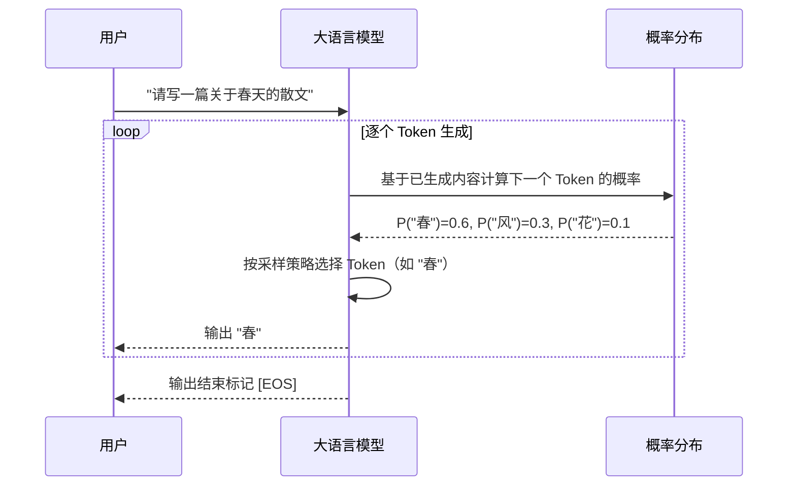
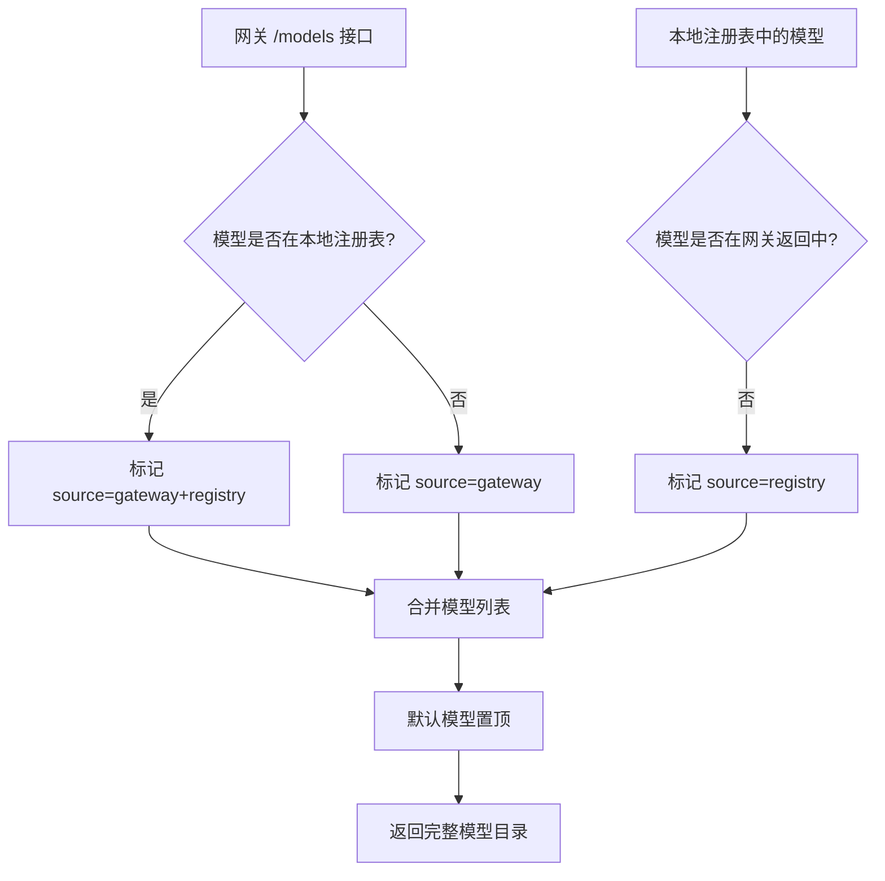
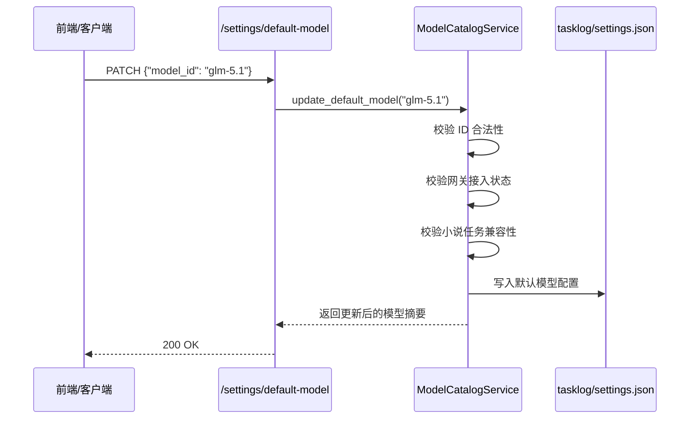
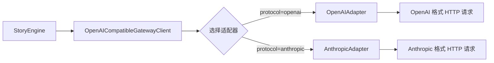
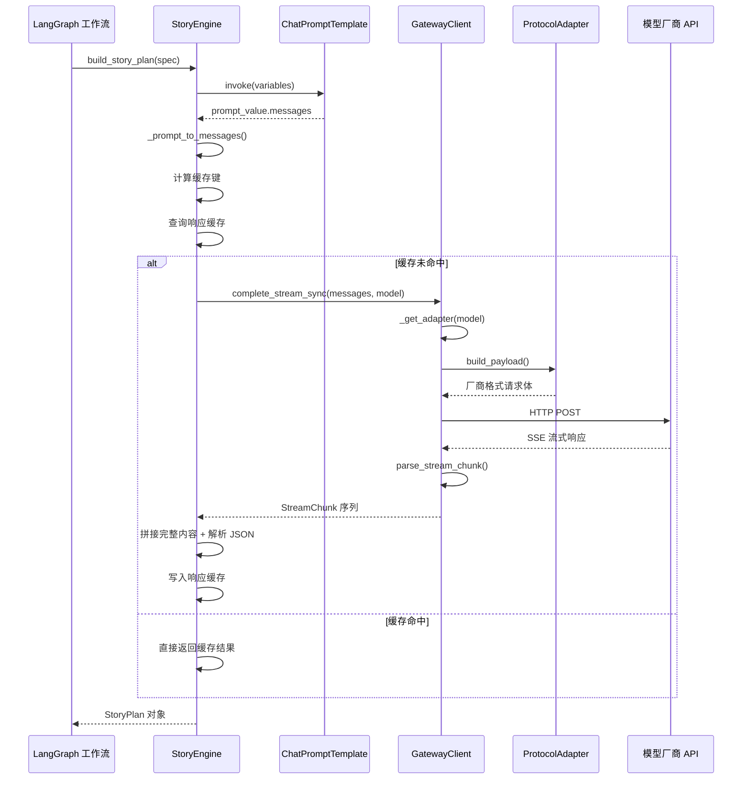
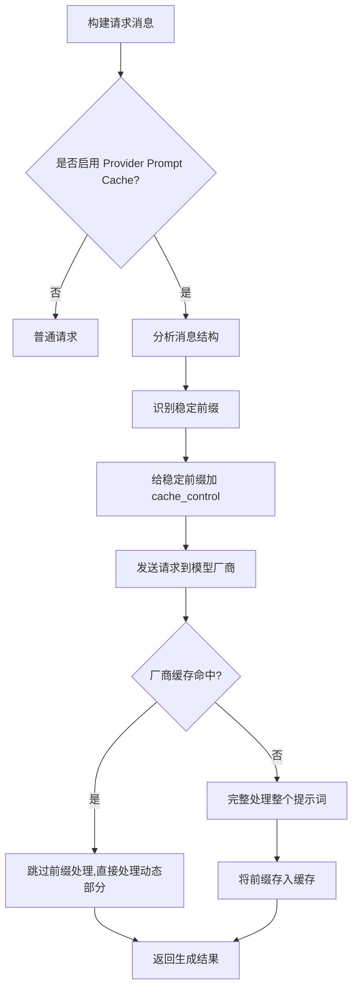
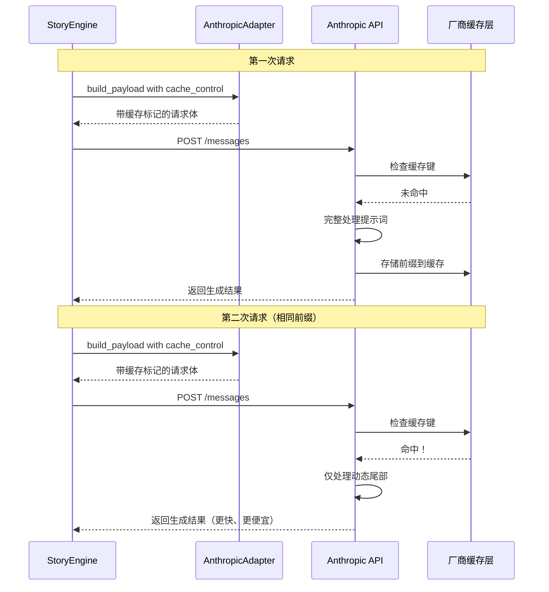
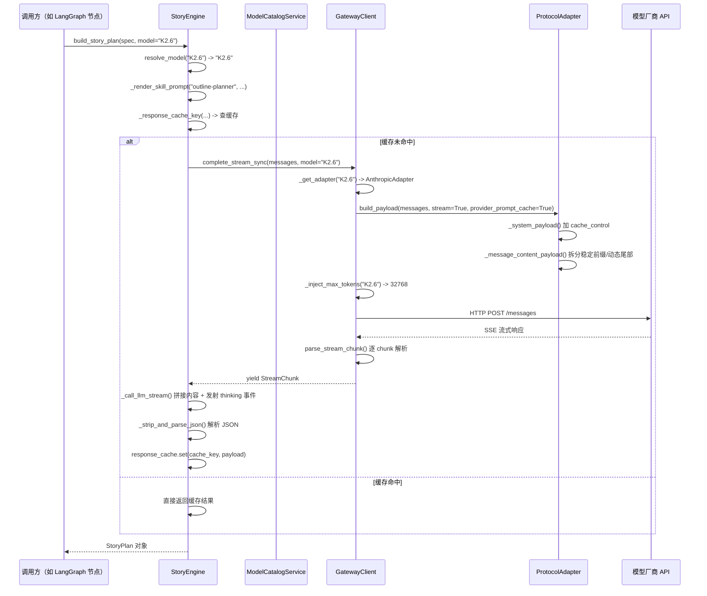

# 05 LLM 故事生成引擎

> 本文面向完全不了解大语言模型底层原理的大学生读者，从"AI 怎么一个字一个字写文章"开始，逐步拆解本系统的 LLM 调用架构。
>
> 阅读完本文后，你将理解：自回归生成是什么、Token 怎么被采样出来、系统如何同时管理十几个模型、流式响应为什么能"逐字显示"、Prompt Cache 如何省钱，以及模型失败时系统怎么自救。

---

## 1. LLM 推理基础：AI 怎么一个字一个字写文章

### 1.1 自回归语言模型：每次只猜下一个词

想象你正在玩一个"接龙"游戏。我说"今天天气很"，你要猜下一个字。你可能猜"好"、"热"、"冷"。LLM（Large Language Model，大语言模型）做的本质上就是这个游戏，只不过它猜的不是"字"，而是 **Token**。

**Token** 是模型处理文本的最小单位。一个 Token 可能是一个英文字母、一个完整英文单词、或者一个中文字的一部分。例如：

- `"Hello"` 可能被拆成 `["He", "llo"]`（2 个 Token）
- `"今天天气很好"` 可能被拆成 `["今天", "天气", "很", "好"]`（4 个 Token）

> 不同模型的 tokenizer 不同，拆分方式也不同。你可以到 [OpenAI Tokenizer](https://platform.openai.com/tokenizer) 或 [Hugging Face Tokenizer 教程](https://huggingface.co/docs/transformers/main_classes/tokenizer) 亲自体验。

自回归（Autoregressive）的核心思想用公式表达就是：

$$
P(x_1, x_2, \dots, x_T) = \prod_{t=1}^{T} P(x_t \mid x_1, x_2, \dots, x_{t-1})
$$

翻译成大白话：**生成第 $t$ 个 Token 时，模型只能看到前面已经生成的 $t-1$ 个 Token，看不到后面的。** 就像你写文章时，写到第 3 段，只能基于第 1、2 段的内容来决定第 3 段写什么，不能偷看第 4 段。

这个过程不断重复：

1. 模型看到所有已生成的 Token（包括你输入的提示词）
2. 模型输出一个概率分布：下一个 Token 是"好"的概率 45%，是"热"的概率 30%，是"糟"的概率 10%……
3. 根据某种**采样策略**（后面会讲 Temperature 和 Top-p），从概率分布中选一个 Token
4. 把这个 Token 拼到已生成文本的末尾
5. 回到第 1 步，直到生成结束标记或达到长度上限



### 1.2 Softmax：把分数变成概率

模型内部对每个候选 Token 先算出一个"原始分数"（logit），这些分数可正可负、可大可小。为了把它们变成合法的概率分布（每个概率在 0 到 1 之间，且总和为 1），需要使用 **Softmax** 函数：

$$
P(x_t = w_i \mid x_{<t}) = \frac{\exp(z_i)}{\sum_{j=1}^{V} \exp(z_j)}
$$

其中：
- $z_i$ 是候选词 $w_i$ 的原始分数（logit）
- $V$ 是整个词表的大小（通常是几万到几十万）
- $\exp(z_i)$ 是指数函数，让大的分数更大、小的分数更小
- 分母是所有候选词指数分数的总和，确保概率加起来等于 1

你可以把 Softmax 理解成"放大差异器"：如果某个候选词的分数比其他词高一点点，经过指数运算后，它的概率会高出很多。

### 1.3 Temperature：控制"随机性"的旋钮

Softmax 之后，我们得到了一个概率分布。但如果每次都选概率最高的 Token，模型会变得非常"死板"——同样的输入永远输出同样的内容，而且像机器人一样总是选"最正确"而不是"最有趣"的词。

**Temperature（温度）** 就是用来调节这个概率分布"平坦程度"的参数。它的公式很简单：

$$
P(x_t = w_i \mid x_{<t}) = \frac{\exp(z_i / T)}{\sum_{j=1}^{V} \exp(z_j / T)}
$$

其中 $T$ 就是 Temperature 值。

| Temperature 值 | 效果 |
|---------------|------|
| $T \to 0$（接近 0）| 概率分布变得极度尖锐，几乎总是选概率最高的 Token。输出变得**确定、保守、像机器人**。 |
| $T = 1$ | 保持原始概率分布，**平衡创造性和准确性**。 |
| $T > 1$（如 1.5）| 概率分布变得平坦，原本概率低的词也有机会被选中。输出变得**随机、有创意、可能胡言乱语**。 |

**实际例子**：假设下一个 Token 的候选概率原本是 `{"好": 0.5, "不错": 0.3, "烂": 0.2}`

- $T=0.1$ 时，几乎 100% 选"好"
- $T=1.0$ 时，按原始概率选
- $T=1.5$ 时，"烂"的概率被放大，模型可能突然说出"今天天气很烂"

在本系统中，Temperature 通常由网关统一配置，StoryEngine 本身不直接干预采样参数，但了解它的原理对调试生成质量非常重要。

> 更多细节可参考 [Hugging Face 博客：How to generate text](https://huggingface.co/blog/how-to-generate)

### 1.4 Top-p（Nucleus）采样：在"好词"里随机挑

Temperature 虽然能调节随机性，但它有一个问题：即使 $T$ 很高，模型也有可能选中一些明显荒谬的 Token（比如把"天气"接成"天气二极管"）。

**Top-p 采样**（也叫 Nucleus Sampling）解决的就是这个问题。它的思路是：

> 不要从整个词表里随机选，而是先挑出"累计概率达到 $p$ 的最小候选集合"，然后只在这个集合里按重新归一化的概率采样。

具体步骤：

1. 把所有候选 Token 按概率从高到低排序
2. 从概率最高的开始累加，直到累加和 $\geq p$
3. 只保留这些 Token，把其他的概率设为 0
4. 在保留下来的 Token 中重新做 Softmax，然后采样

用公式表示：

$$
V^{(p)} = \{ w_i \mid \sum_{j=1}^{i} P(w_j) \leq p \}
$$

$$
P'(w_i) = \frac{P(w_i)}{\sum_{w_j \in V^{(p)}} P(w_j)} \quad \text{for } w_i \in V^{(p)}
$$

**直观理解**：

- $p=0.9$ 表示：只考虑概率累计占到 90% 的那些 Token，剩下的 10% 概率对应的"罕见怪词"全部扔掉
- $p=1.0$ 等价于不裁剪，保留全部候选
- $p=0.1$ 表示只考虑最头部的 10% 概率，输出非常保守

Top-p 和 Temperature 通常**配合使用**：Temperature 控制"整体随机程度"，Top-p 控制"随机范围"，两者结合可以在创造性和连贯性之间取得平衡。

> 详细原理可参考 [The Curious Case of Neural Text Degeneration](https://arxiv.org/abs/1904.09751)（Top-p 采样的原始论文）

---

## 2. 多模型调度架构：ModelCatalog 如何管理十几个模型

### 2.1 为什么需要"模型目录"

本系统接入了多种模型：OpenAI 系列的 GPT-5.x、Anthropic 系列的 Claude、智谱的 GLM、MiniMax 的 M2.7、月之暗面的 Kimi K2.6……每个模型的能力不同：有的上下文窗口大，有的输出长度长，有的支持工具调用，有的支持 Prompt Cache。

如果每次调用都硬编码模型名称和参数，代码会变得非常混乱。`ModelCatalogService` 就是系统的"模型档案室"，它负责：

1. **记录每个模型的能力画像**（上下文窗口、是否支持流式、是否支持 JSON 模式等）
2. **聚合网关模型列表和本地注册表**
3. **支持运行时动态切换默认模型**
4. **校验模型是否支持小说生成任务**

### 2.2 模型能力画像：每个模型的"身份证"

在 `apps/agent-runtime/app/llm/model_catalog.py` 中，每个模型都有一张详细的"身份证"：

```python
"K2.6": {
    "display_name": "Kimi K2.6",
    "provider": "moonshot",
    "capabilities": {
        "context_window": {
            "max_input_tokens": 256000,
            "max_output_tokens": 32768,
            "max_total_tokens": 288768,
            "recommended_prompt_budget": 180000,
            "compression_trigger_tokens": 140000,
        },
        "cache": {
            "runtime_response_cache": True,
            "runtime_context_cache": True,
            "provider_prompt_cache": "anthropic_cache_control",
            "cache_key_strategy": "stage+model+context_hash",
        },
        "compression": {
            "supported": True,
            "may_compress": True,
            "strategy": "reference_truncate+memory_trim",
        },
        "features": {
            "json_mode": True,
            "tool_calling": True,
            "streaming": True,
        },
    },
    "protocol": "anthropic",
}
```

这些字段的含义：

| 字段 | 含义 |
|-----|------|
| `max_input_tokens` | 模型一次最多能接收多少 Token（包括你的提示词和模型自己的输出） |
| `max_output_tokens` | 模型一次最多能生成多少 Token |
| `recommended_prompt_budget` | 系统建议的提示词预算，留有余量防止溢出 |
| `compression_trigger_tokens` | 当输入超过这个阈值时，触发上下文压缩 |
| `provider_prompt_cache` | 是否支持 Provider 级别的 Prompt Cache（见第 5 节） |
| `json_mode` | 是否支持强制 JSON 输出 |
| `tool_calling` | 是否支持函数/工具调用 |
| `streaming` | 是否支持流式输出 |

### 2.3 模型列表的聚合逻辑

`ModelCatalogService` 不是简单地把网关返回的模型列表原样透传，而是做了一层**智能聚合**：



这个设计的精妙之处在于：

- **网关返回了新模型但本地没配置**：仍然显示，但标记为 `unverified`（未验证），不允许用于小说任务
- **本地注册了但网关暂时不可用**：仍然显示，让用户知道"这个模型理论上可用"
- **两者都有**：合并信息，以本地能力画像补充网关缺失的字段

### 2.4 运行时动态切换

系统支持通过 API 动态切换默认模型：

```python
# PATCH /settings/default-model
{"model_id": "glm-5.1"}
```

切换后，系统会：

1. 校验模型 ID 是否在可用列表中
2. 校验模型是否已接入网关（不能选只有本地画像的模型）
3. 校验模型是否支持小说任务流
4. 持久化到 `tasklog/settings.json`
5. 清除模型列表缓存，下次请求重新聚合



---

## 3. 统一网关设计：StoryEngine 如何封装不同 Provider

### 3.1 为什么需要"统一网关"

不同模型厂商的 API 格式差异很大：

- **OpenAI 格式**：`POST /chat/completions`，请求体是 `{model, messages, stream}`
- **Anthropic 格式**：`POST /messages`，请求体是 `{model, messages, system, max_tokens}`，且支持 `cache_control`
- **其他厂商**：往往自称"OpenAI 兼容"，但细节上总有偏差

如果业务代码直接调用这些不同格式的 API，每次新增一个模型厂商就要改一堆代码。`OpenAICompatibleGatewayClient` 通过**协议适配器模式**解决了这个问题。

### 3.2 协议适配器：OpenAIAdapter vs AnthropicAdapter



适配器负责三件事：

1. **`get_endpoint()`**：返回正确的 API 路径（`/chat/completions` 或 `/messages`）
2. **`build_payload()`**：把统一格式的 `messages` 转换成对应厂商的请求体
3. **`parse_completion_response()` / `parse_stream_chunk()`**：把厂商返回的 JSON 解析成统一格式

以 `AnthropicAdapter.build_payload()` 为例，它要做额外的转换：

- 把 `messages` 中的 `system` 消息提取出来，放到顶层的 `system` 字段
- 如果启用了 Prompt Cache，给 system 消息和 user 消息中的稳定部分加上 `cache_control: {type: "ephemeral"}`
- 处理 `max_tokens` 的默认值逻辑

### 3.3 协议动态切换

系统支持为特定模型覆盖协议：

```python
# PATCH /settings/protocols/K2.6
{"protocol": "anthropic"}
```

这个配置会持久化到 `data/runtime_settings.json`，优先级高于环境变量配置。当网关客户端发起请求时：

1. 先查运行时覆盖配置
2. 再查环境变量 `MODEL_PROTOCOL_OVERRIDES`
3. 最后使用默认协议（`openai`）

这让系统可以灵活应对"某个模型虽然来自 OpenAI 兼容网关，但要求用 Anthropic 协议访问"的特殊情况。

### 3.4 StoryEngine 的职责边界

`StoryEngine` 是系统的"故事生成大脑"，它不负责直接发 HTTP 请求，而是：

1. **管理 Prompt 模板**：用 `ChatPromptTemplate` 定义大纲、章节、修订等场景的 prompt 结构
2. **渲染 Skill Prompt**：优先从 Skill YAML 加载，fallback 到硬编码模板
3. **调用网关客户端**：把渲染好的消息列表交给 `OpenAICompatibleGatewayClient`
4. **处理响应**：解析 JSON、校验格式、维护对话历史
5. **管理缓存**：计算缓存键、查询/写入响应缓存



---

## 4. 流式生成机制：为什么 AI 能"逐字显示"

### 4.1 SSE：服务器推送的"文字直播"

当你在前端看到 AI 一个字一个字地"打字"时，背后使用的是 **SSE（Server-Sent Events）** 技术。SSE 是一种基于 HTTP 的服务器推送协议，特点是：

- **单向推送**：服务器可以持续向客户端发送数据，客户端不需要反复请求
- **文本格式**：每条消息以 `data: ...\n\n` 的格式传输
- **自动重连**：浏览器内置支持连接断开后的自动恢复

一个典型的 SSE 响应流看起来像这样：

```http
HTTP/1.1 200 OK
Content-Type: text/event-stream
Cache-Control: no-cache
Connection: keep-alive

event: snapshot
data: {"task_id": "abc", "status": "running"}

data: {"chunk": "今天", "finish_reason": null}

data: {"chunk": "天气", "finish_reason": null}

data: {"chunk": "很好", "finish_reason": "stop"}

event: task.done
data: {"task_id": "abc", "event_type": "task.completed"}
```

### 4.2 流式生成的完整数据流

```mermaid
flowchart LR
    A[用户点击"生成"] --> B[StoryEngine]
    B --> C[GatewayClient.complete_stream_sync]
    C --> D[HTTP POST 到模型 API]
    D --> E[模型开始逐 Token 生成]
    E --> F[每个 Token 封装为 SSE chunk]
    F --> G[HTTP 响应流]
    G --> H[GatewayClient 解析 StreamChunk]
    H --> I[BaseAgent._call_llm_stream 拼接内容]
    I --> J[发射 model.thinking 事件]
    I --> K[发射 model.usage 事件]
    K --> L[前端 SSE 接收]
    L --> M[UI 逐字渲染]
```

在代码层面，流式调用分为两条路径：

**同步路径**（StoryEngine 内部使用）：

```python
def _call_llm_stream(self, messages, model, ...):
    for chunk in gc.complete_stream_sync(messages, model=model):
        if chunk.reasoning_content:
            # 发射思考链事件
            progress_callback({"event_type": "model.thinking", ...})
        if chunk.content:
            full_content += chunk.content
```

**异步路径**（聊天接口使用）：

```python
async def complete_stream(self, messages, model, ...):
    async for raw_line in response.aiter_lines():
        # 解析 data: {...} 行
        chunk_data = json.loads(data_str)
        parsed = adapter.parse_stream_chunk(chunk_data)
        yield StreamChunk(
            content=parsed.get("content", ""),
            reasoning_content=parsed.get("reasoning_content", ""),
            ...
        )
```

### 4.3 思考链（Reasoning Content）的透传

部分模型（如 Claude 的扩展思考模式、DeepSeek 的 R1）在生成最终回答前，会先输出一段"思考过程"。这段内容对终端用户通常不可见，但对开发者调试非常有价值。

本系统通过 `StreamChunk.reasoning_content` 字段支持思考链的透传：

1. 网关客户端解析到 `reasoning_content` 时，单独放入 `StreamChunk`
2. `BaseAgent._call_llm_stream` 检测到 `reasoning_content` 后，发射 `model.thinking` 事件
3. 前端可以选择显示/隐藏思考过程，或者把思考内容记录到日志

### 4.4 流式中断的安全处理

流式生成有一个特殊风险：如果响应已经开始输出，但中途网络断开或模型报错，**不能简单地重试同一个请求**——因为模型可能已经生成了部分内容，重试会导致重复或冲突。

系统通过 `StreamInterruptedAfterStartError` 专门处理这种情况：

```python
try:
    for chunk in gc.complete_stream_sync(...):
        ...
except Exception as exc:
    if saw_stream_output:  # 已经输出过内容了
        raise StreamInterruptedAfterStartError("流式响应已开始后中断...")
    raise
```

当这个异常被抛出时，工作流引擎会进入恢复逻辑，而不是盲目重试。

---

## 5. Prompt Cache 技术：如何让重复请求更便宜、更快

### 5.1 为什么需要 Prompt Cache

在小说生成场景中，很多请求的前半部分内容是高度重复的：

- **System 提示**："你是一个中文小说策划助手，要输出严格 JSON……"
- **世界观设定**：同一部小说的世界观、人物设定在每个章节请求中都要重复发送
- **风格约束**：同样的风格要求要发给每个章节生成请求

如果模型每次都要重新处理这些重复内容，既浪费 Token（费钱），又增加延迟（费时）。**Prompt Cache** 就是让模型"记住"这些重复的前缀，下次直接跳过处理。

### 5.2 Provider Prompt Cache 的工作原理

本系统支持的是 **Anthropic 风格的 Prompt Cache**（通过 `cache_control` 标记实现）。其核心机制：



在 `AnthropicAdapter` 中，具体实现分为三层：

**第一层：System 消息缓存**

```python
def _system_payload(self, system_content, ...):
    if provider_prompt_cache and len(system_content) >= prompt_cache_min_chars:
        return [{
            "type": "text",
            "text": system_content,
            "cache_control": {"type": "ephemeral"}
        }]
    return system_content
```

**第二层：User 消息中的稳定前缀缓存**

```python
def _message_content_payload(self, content, ...):
    # 在内容中查找动态标记（如"当前章节序号"、"修改意见"等）
    split_index = content.find("\n当前章节序号：")
    stable_prefix = content[:split_index]
    dynamic_tail = content[split_index:]
    
    if len(stable_prefix) >= prompt_cache_min_chars:
        return [
            {"type": "text", "text": stable_prefix, "cache_control": {...}},
            {"type": "text", "text": dynamic_tail}
        ]
    return content
```

**第三层：配置开关**

```python
# .env
PROVIDER_PROMPT_CACHE=true
PROVIDER_PROMPT_CACHE_MIN_CHARS=1024
```

只有当内容长度超过 `1024` 字符时，才会触发缓存标记。这是为了避免对短内容也做缓存（缓存本身有开销）。

### 5.3 缓存命中 vs 未命中



### 5.4 运行时响应缓存：另一层保护

除了 Provider 级别的 Prompt Cache，系统还有自己的**响应缓存**（Response Cache）：

```python
self.response_cache = LayeredCacheStore([
    InMemoryCacheStore(ttl_seconds=1800),      # 内存缓存 30 分钟
    FileBackedCacheStore(..., ttl_seconds=86400)  # 文件缓存 24 小时
])
```

缓存键的计算方式：

```python
def _response_cache_key(self, model, request_messages, max_tokens):
    payload = json.dumps({
        "model": model,
        "messages": request_messages,
        "max_tokens": max_tokens,
    }, ensure_ascii=False, sort_keys=True)
    digest = hashlib.sha256(payload.encode("utf-8")).hexdigest()
    return f"response:{digest}"
```

注意 `sort_keys=True` 的使用：它确保即使字典的键值对顺序不同，只要内容相同，就能产生相同的缓存键。

这两层缓存的区别：

| 缓存类型 | 位置 | 作用 | 粒度 |
|---------|------|------|------|
| Provider Prompt Cache | 模型厂商侧 | 避免重复处理相同前缀 | 提示词前缀 |
| Response Cache | 本系统内部 | 避免重复调用模型 | 完整请求 |

---

## 6. 模型能力矩阵

以下是本系统当前注册的主要模型能力对比：

| 模型 | Provider | 上下文窗口 | 最大输出 | Prompt Cache | JSON 模式 | 工具调用 | 协议 |
|-----|----------|-----------|---------|-------------|----------|---------|------|
| GPT-5.4 | openai_compatible | 256K | 16K | unknown | ✅ | ❌ | openai |
| GPT-5.3 Codex | openai_compatible | 256K | 16K | unknown | ✅ | ✅ | openai |
| GPT-5.1 Codex Max | openai_compatible | 256K | 16K | unknown | ✅ | ✅ | openai |
| GPT-4.1 Mini | openai_compatible | 未知 | 未知 | unknown | ✅ | ❌ | openai |
| GLM-5 | zhipu | 200K | 8K | unknown | ✅ | ✅ | openai |
| GLM-5.1 | zhipu | 200K | 8K | unknown | ✅ | ✅ | openai |
| Claude Haiku 4.5 | anthropic | 200K | 8K | unknown | ✅ | ✅ | anthropic |
| Claude Sonnet 4.6 | anthropic | 200K | 32K | unknown | ✅ | ✅ | anthropic |
| Claude Opus 4.6 | anthropic | 200K | 32K | unknown | ✅ | ✅ | anthropic |
| MiniMax M2.7 | minimax | 200K | 8K | unknown | ✅ | ✅ | openai |
| **Kimi K2.6** | moonshot | 256K | 32K | **anthropic_cache_control** | ✅ | ✅ | **anthropic** |

> 注：`unknown` 表示当前注册表中未明确标注该能力，不代表模型绝对不支持。实际支持情况以厂商文档为准。

---

## 7. 重试与容错：失败时如何自救

### 7.1 网关级别的重试

`OpenAICompatibleGatewayClient` 对**非流式请求**实现了三层重试：

```python
for attempt in range(3):
    try:
        response = self._request("POST", endpoint, json=payload)
        ...
    except json.JSONDecodeError:
        if attempt < 2:
            sleep(1 * (attempt + 1))  # 第1次等1s，第2次等2s
            continue
        raise
    except GatewayClientError:
        if attempt < 2:
            sleep(1 * (attempt + 1))
            continue
        raise
```

对**流式请求**也实现了三层重试，但只针对 5xx 和网络错误：

```python
for attempt in range(3):
    try:
        with self._get_client().stream(...) as response:
            if response.status_code >= 500 and attempt < 2:
                sleep(1.5 * (attempt + 1))  # 第1次等1.5s，第2次等3s
                continue
            ...
    except httpx.HTTPError:
        if attempt < 2:
            sleep(1.5 * (attempt + 1))
            continue
        raise
```

注意：4xx 错误（如 400 Bad Request、401 Unauthorized）**不会触发重试**，因为重试这些请求没有意义。

### 7.2 StoryEngine 级别的降级

当流式调用失败时，`StoryEngine` 会自动 fallback 到非流式调用：

```python
try:
    full_content = self._call_llm_stream(...)
except StreamInterruptedAfterStartError:
    # 流已开始后中断，不能重试，直接抛出
    raise
except (GatewayClientError, Exception) as exc:
    # 流式失败，fallback 到非流式
    logger.warning("流式调用失败，fallback 到非流式: %s", exc)
    return self._complete_json_with_cache(...)
```

这种降级策略保证了：即使流式通道不可用，系统仍然能完成生成任务，只是前端看不到"逐字显示"的效果。

### 7.3 JSON 解析失败的重试

模型返回的内容可能不是合法 JSON（尤其是输出被截断时）。系统实现了多层修复：

1. **去除 Markdown 围栏**：把 ```json ... ``` 包裹的内容提取出来
2. **提取首个 JSON 值**：从文本中找到第一个完整的 `{...}` 或 `[...]`
3. **修复截断 JSON**：尝试补全缺失的括号
4. **LLM 重试**：如果以上都失败，把重试提示词追加到对话中，让模型重新输出

```python
def _strip_and_parse_json(self, raw):
    cleaned = gc._strip_markdown_fences(raw)
    try:
        return json.loads(cleaned)
    except json.JSONDecodeError:
        extracted = gc._extract_first_json_value(cleaned)
        if extracted is not None:
            return extracted
        repaired = self._repair_truncated_json(cleaned)
        if repaired is not None:
            return repaired
        raise GatewayClientError(f"模型返回的 JSON 无法解析：{raw[:240]}")
```

### 7.4 大纲生成的特殊重试

大纲生成对 JSON 完整性要求极高（必须包含 `working_title`, `logline`, `chapter_plan` 等字段）。如果第一次生成失败，系统会追加一段专门的压缩提示词：

```python
_OUTLINE_RETRY_JSON_PROMPT = (
    "上一次返回的大纲 JSON 不完整、被截断或不可解析。"
    "请重新输出一个更精简且完整的 JSON 对象。"
    "必须保留字段：working_title, logline, world_notes, character_notes, ..."
    "不要输出 Markdown 代码围栏，不要解释，只返回最终 JSON 对象。"
)
```

这种"针对性重试"比 generic 重试更有效，因为它明确告诉模型"上次哪里错了"。

---

## 8. 本章小结

| 主题 | 核心要点 |
|-----|---------|
| 自回归生成 | LLM 每次只预测下一个 Token，基于前面所有已生成的内容 |
| Temperature | 控制概率分布的"尖锐程度"，低温度保守、高温度随机 |
| Top-p 采样 | 只在累计概率达到 $p$ 的候选词中采样，避免选中荒谬词 |
| ModelCatalog | 聚合网关列表和本地注册表，为每个模型维护能力画像 |
| 统一网关 | 通过 ProtocolAdapter 封装 OpenAI/Anthropic 协议差异 |
| 流式生成 | 基于 SSE 协议，模型每生成一个 Token 就推送一个 chunk |
| Prompt Cache | 给稳定前缀加 `cache_control`，让厂商跳过重复处理 |
| 重试容错 | 网关级线性重试 + StoryEngine 流式降级 + JSON 修复 + LLM 重试 |

---

## 9. 实现详解：从代码层面看懂调用链

前面八节讲的是"是什么"和"为什么"，这一节我们深入源码，看看"怎么做"。我们会逐行拆解 `StoryEngine.generate()` 的调用链、`ModelCatalogService` 的模型解析、`Prompt Cache` 的标记逻辑、流式输出的处理，以及重试与降级的实际代码。

### 9.1 `StoryEngine.generate()` 的完整调用链

`StoryEngine` 本身并没有一个叫 `generate()` 的方法，但它对外暴露的所有生成方法（`build_story_plan`、`generate_draft`、`generate_chapter_pair` 等）都遵循同一条调用链。我们以 `build_story_plan()` 为例，把这条链拆成六步。

#### 第一步：参数校验与模型解析

```python
def build_story_plan(self, spec, reference_text, ...):
    # 1. 解析模型：优先用调用方指定的，其次运行时默认，最后配置文件默认
    resolved_model = self.resolve_model(model or spec.get("model_id") or spec.get("model"))
```

`resolve_model()` 的逻辑非常简单，像"三选一"的开关：

```python
def resolve_model(self, model: str | None) -> str:
    candidate = (model or "").strip()          # 先取调用方指定的
    return candidate or self._runtime_default_model or self.settings.default_chat_model
```

- 如果用户在前端手动选了模型，就用用户选的；
- 如果管理员通过 API 动态切换了默认模型，就用切换后的；
- 否则回退到 `.env` 里配置的 `DEFAULT_CHAT_MODEL`。

#### 第二步：Prompt 组装

```python
    # 2. 渲染 Skill Prompt（优先从 YAML 加载，fallback 到硬编码模板）
    request_messages = self._render_skill_prompt(
        "outline-planner",   # skill_id，对应大纲生成场景
        mode=...,            # 创作模式（短篇/长篇/同人）
        genre=...,           # 题材
        style=...,           # 风格
        prompt=...,          # 用户原始输入
        ...
    )
```

`_render_skill_prompt()` 内部有两条分支：

**分支 A：Skill YAML（优先）**

```python
if self._skills_loaded:
    try:
        config = self._skill_loader.get(skill_id)   # 从 YAML 读取模板
        for role_name in ("system", "human"):
            template = getattr(config.prompt, role_name, "")
            content = template.format(**variables)    # 变量插值
            messages.append({"role": role_name, "content": content})
        return messages
    except Exception as exc:
        logger.debug("Skill 渲染失败，fallback: %s", exc)
```

**分支 B：硬编码 ChatPromptTemplate（fallback）**

```python
attr_name = self._PROMPT_MAP.get(skill_id)       # "outline-planner" -> "outline_prompt"
template = getattr(self, attr_name)               # 取出硬编码模板
prompt_value = template.invoke(variables)         # LangChain 渲染
return self._prompt_to_messages(prompt_value)     # 转成 {role, content} 列表
```

你可以把 `_PROMPT_MAP` 理解为"技能身份证对照表"：

```python
_PROMPT_MAP = {
    "outline-planner":      "outline_prompt",           # 大纲生成
    "chapter-plan-batch":   "chapter_plan_batch_prompt", # 章节计划批次
    "draft-writer":         "draft_prompt",             # 初稿总览
    "chapter-writer":       "chapter_prompt",           # 单章生成
    "outline-reviser":      "outline_revision_prompt",  # 大纲修订
    "chapter-reviser":      "chapter_pair_revision_prompt", # 章节对修订
    "full-text-verifier":   "verification_prompt",      # 全文验证
    "issue-fixer":          "fix_issues_prompt",        # 问题修复
}
```

#### 第三步：Cache Control 标记（Anthropic 协议下）

Prompt 组装完成后，消息列表会交给网关客户端。网关客户端在构造 HTTP 请求前，会先判断当前模型使用什么协议：

```python
adapter = self._get_adapter(resolved_model)     # OpenAIAdapter 还是 AnthropicAdapter？
kwargs = {**self._provider_prompt_cache_kwargs(adapter), **kwargs}
payload = adapter.build_payload(messages=messages, model=resolved_model, stream=True, **kwargs)
```

如果是 `AnthropicAdapter`，`build_payload()` 会把 `system` 消息和 `user` 消息中的稳定前缀拆出来，加上 `cache_control` 标记。具体实现见第 9.4 节。

#### 第四步：网关调用

```python
endpoint = adapter.get_endpoint()   # "/chat/completions" 或 "/messages"
response = self._request("POST", endpoint, json=payload)
```

`_request()` 是网关客户端的底层 HTTP 发送方法，内部实现了三层重试（见第 9.5 节）。

#### 第五步：流式/非流式返回

如果调用的是 `_complete_stream_json_with_cache()`，会走流式路径：

```python
full_content = self._call_llm_stream(
    request_messages, resolved_model,
    progress_callback=active_progress,   # 实时推送思考链事件
    stage="planning",
    unit_id="outline",
    max_tokens=max_tokens,
)
```

如果流式失败，会 fallback 到非流式的 `_complete_json_with_cache()`：

```python
except (GatewayClientError, Exception) as exc:
    logger.warning("流式调用失败，fallback 到非流式: %s", exc)
    return self._complete_json_with_cache(...)
```

#### 第六步：JSON 解析与缓存写入

```python
payload = self._strip_and_parse_json(full_content)   # 去围栏 -> 解析 -> 修复截断
self.response_cache.set(cache_key, payload)           # 写入响应缓存
conversation_history = self._append_assistant_message(request_messages, payload)
```

`_strip_and_parse_json()` 是 JSON 的"急救室"，见第 9.5 节。

---

### 9.2 `ModelCatalogService` 的模型解析逻辑

`ModelCatalogService` 是系统的"模型档案室"，核心职责是把网关返回的原始模型列表和本地注册表合并成一份完整目录。

#### 9.2.1 别名映射与能力检查

本地注册表 `_PROFILE_REGISTRY` 是一个字典，键是模型 ID（如 `"K2.6"`、`"glm-5.1"`），值是模型的"能力画像"。当网关返回的模型 ID 和注册表中的键匹配时，系统会把两者合并：

```python
def _build_model_item(self, raw: dict[str, Any], source: str) -> dict[str, Any]:
    model_id = str(raw.get("id") or "").strip()
    profile = deepcopy(self.registry.get(model_id, {}))   # 从注册表取画像
    capabilities = profile.get("capabilities") or self._unknown_capabilities()
    provider = profile.get("provider") or self.settings.llm_provider
    display_name = profile.get("display_name") or model_id
    compatibility = "verified" if source in {"gateway+registry", "registry"} else "unverified"
    protocol = profile.get("protocol") or "openai"
    ...
```

这里有几个关键概念：

| 字段 | 含义 |
|-----|------|
| `source` | 模型的来源：`gateway`（仅网关有）、`registry`（仅本地有）、`gateway+registry`（两者都有） |
| `compatibility` | 兼容性状态：`verified`（已验证，可用于小说任务）、`unverified`（未验证，仅聊天可用） |
| `protocol` | 协议类型：`openai` 或 `anthropic`，决定用哪个适配器发请求 |

#### 9.2.2 模型列表聚合

```python
def _merge_models(self, raw_models: list[dict[str, Any]]) -> list[dict[str, Any]]:
    items: list[dict[str, Any]] = []
    seen: set[str] = set()

    # 1. 先添加网关返回的模型
    for raw in raw_models:
        model_id = str(raw.get("id") or "").strip()
        if not model_id or model_id in seen:
            continue
        seen.add(model_id)
        source = "gateway+registry" if model_id in self.registry else "gateway"
        items.append(self._build_model_item(raw, source=source))

    # 2. 再补充注册表中有但网关未返回的模型
    for model_id, profile in self.registry.items():
        if model_id in seen:
            continue
        seen.add(model_id)
        items.append(self._build_model_item({"id": model_id}, source="registry"))

    # 3. 默认模型置顶
    effective_default = self._effective_default_model().strip()
    default_idx = next((i for i, item in enumerate(items) if item["id"] == effective_default), -1)
    if default_idx > 0:
        items.insert(0, items.pop(default_idx))

    return items
```

这个合并逻辑保证了三种情况都能优雅处理：

- **网关有新模型，本地没配置**：显示为 `unverified`，不允许用于小说任务；
- **本地有配置，网关暂时不可用**：仍然显示，让用户知道"这个模型理论上可用"；
- **两者都有**：合并信息，以本地能力画像补充网关缺失的字段。

#### 9.2.3 小说任务兼容性校验

```python
def ensure_novel_generation_model_supported(self, model_id: str | None) -> dict[str, Any]:
    profile = self.get_model_profile(model_id)
    compatibility = str((profile.get("metadata") or {}).get("compatibility") or "").strip()
    supported = bool(((profile.get("capabilities") or {}).get("features") or {}).get("novel_task_supported"))
    if compatibility == "verified" and supported:
        return profile
    raise ValueError(f"模型 ... 未完成兼容性验证，暂不支持小说任务流。")
```

只有 `compatibility == "verified"` 且 `novel_task_supported == True` 的模型，才能被用于小说生成任务。这个检查在 `update_default_model()` 和任务创建时都会执行。

---

### 9.3 多模型调度：`resolve_model()` 的实际代码

`resolve_model()` 是系统中最常用的模型选择逻辑，但它本身非常简单——真正的"调度"发生在调用链的上游。

#### 9.3.1 StoryEngine 层面的模型选择

```python
def resolve_model(self, model: str | None) -> str:
    candidate = (model or "").strip()
    return candidate or self._runtime_default_model or self.settings.default_chat_model
```

这个方法的优先级是：

1. 调用方显式传入的 `model` 参数（如用户在前端选了某个模型）
2. 运行时通过 API 动态切换的 `_runtime_default_model`
3. 配置文件（`.env`）中的 `default_chat_model`

#### 9.3.2 运行时动态切换

管理员可以通过 API 动态切换默认模型：

```python
# PATCH /settings/default-model
{"model_id": "glm-5.1"}
```

后端处理：

```python
def update_default_model(self, model_id: str) -> dict[str, Any]:
    valid_ids = {item["id"] for item in self.list_models()}
    if model_id not in valid_ids:
        raise ValueError(f"模型 ID 不在可用模型列表中：{model_id}")
    self.ensure_runtime_default_model_supported(model_id)   # 检查是否接入网关
    self.ensure_novel_generation_model_supported(model_id)  # 检查是否支持小说任务
    self._runtime_default_model = model_id
    self._save_runtime_settings()                           # 持久化到 tasklog/settings.json
    self._cached_payload = None                             # 清除缓存，下次重新聚合
    return {"default_model": self._effective_default_model(), ...}
```

切换后，所有没有显式指定模型的请求都会自动使用新默认模型，无需重启服务。

---

### 9.4 Prompt Cache 的实现：哪些前缀被标记了 `cache_control`

Prompt Cache 的实现集中在 `AnthropicAdapter` 中。只有使用 `anthropic` 协议的模型（如 Kimi K2.6）才会触发这套逻辑。

#### 9.4.1 配置开关

```python
def _provider_prompt_cache_kwargs(self, adapter: Any) -> dict[str, Any]:
    if not isinstance(adapter, AnthropicAdapter):
        return {}                                          # OpenAI 协议直接返回空
    if not getattr(settings, "provider_prompt_cache", True):
        return {}                                          # 全局开关关闭
    return {
        "provider_prompt_cache": True,
        "prompt_cache_min_chars": max(int(getattr(settings, "provider_prompt_cache_min_chars", 1024) or 1024), 1),
        "prompt_cache_ttl": str(getattr(settings, "provider_prompt_cache_ttl", "") or "").strip() or None,
    }
```

对应的环境变量：

```bash
PROVIDER_PROMPT_CACHE=true              # 总开关
PROVIDER_PROMPT_CACHE_MIN_CHARS=1024    # 最短缓存长度，低于此长度不标记
PROVIDER_PROMPT_CACHE_TTL=              # 可选的缓存 TTL
```

#### 9.4.2 System 消息缓存

```python
def _system_payload(self, system_content: str, *, provider_prompt_cache: bool, prompt_cache_min_chars: int, ...):
    # 只有开启缓存且 system 内容长度超过阈值，才加 cache_control
    if provider_prompt_cache and len(system_content) >= prompt_cache_min_chars:
        return [{
            "type": "text",
            "text": system_content,
            "cache_control": {"type": "ephemeral"}   # "ephemeral" 表示"用一次就过期"
        }]
    return system_content
```

#### 9.4.3 User 消息中的稳定前缀缓存

这是 Prompt Cache 最精妙的部分。系统会识别 user 消息中的"动态标记"，把标记之前的部分作为稳定前缀缓存，标记之后的部分作为动态尾部每次重新处理。

```python
_DYNAMIC_MARKERS = (
    "\n当前章节序号：",                    # 章节生成场景
    "\n用户对当前章节提出了以下修改意见",   # 修订场景
    "\n修改意见：",                       # 修订场景
    "\n已完成正文：",                     # 验证场景
    "\n【审核意见】",                     # 修复场景
)

def _message_content_payload(self, content: str, *, provider_prompt_cache: bool, ...):
    if not provider_prompt_cache or not isinstance(content, str):
        return content

    # 在内容中查找最早的动态标记
    split_index = -1
    for marker in self._DYNAMIC_MARKERS:
        candidate = content.find(marker)
        if candidate > 0 and (split_index < 0 or candidate < split_index):
            split_index = candidate + 1

    if split_index <= 0:
        return content   # 没找到动态标记，整段都是稳定的，但也没必要拆

    stable_prefix = content[:split_index]    # 标记之前的部分（可缓存）
    dynamic_tail = content[split_index:]     # 标记之后的部分（每次变）

    # 稳定前缀必须足够长，且动态尾部不能是空的
    if len(stable_prefix) < prompt_cache_min_chars or not dynamic_tail.strip():
        return content

    return [
        {"type": "text", "text": stable_prefix, "cache_control": {"type": "ephemeral"}},
        {"type": "text", "text": dynamic_tail},
    ]
```

**举个例子**：假设 user 消息是这样的：

```
你是一个中文小说章节起草助手...
（此处省略 2000 字的风格约束、世界观设定、人物设定）
当前章节序号：5
当前章节标题：风雨欲来
...
```

系统会把它拆成两部分：

- **稳定前缀**（2000+ 字）："你是一个中文小说章节起草助手..." + 风格约束 + 世界观 + 人物设定
- **动态尾部**："当前章节序号：5\n当前章节标题：风雨欲来\n..."

第一次请求时，厂商会完整处理全部内容，并把稳定前缀存入缓存。第二次请求（比如生成第 6 章），稳定前缀完全相同，厂商直接跳过处理，只处理动态尾部，既省钱又省时。

#### 9.4.4 厂商缓存如何利用

Anthropic 的 Messages API 会在响应中返回 `usage` 字段，其中包含缓存命中信息：

```json
{
  "usage": {
    "input_tokens": 1000,
    "output_tokens": 500,
    "cache_creation_input_tokens": 2000,   // 第一次：创建缓存消耗的 token
    "cache_read_input_tokens": 2000        // 第二次：从缓存读取的 token
  }
}
```

- `cache_creation_input_tokens`：缓存未命中时，厂商处理稳定前缀并创建缓存；
- `cache_read_input_tokens`：缓存命中时，厂商直接从缓存读取前缀，价格通常比正常输入便宜很多。

---

### 9.5 流式输出的实现：`async for chunk in stream` 的处理

流式输出的核心在 `OpenAICompatibleGatewayClient.complete_stream_sync()` 和 `BaseAgent._call_llm_stream()` 两个方法中。

#### 9.5.1 网关客户端：把 SSE 流解析成 StreamChunk

```python
def complete_stream_sync(self, messages, model=None, **kwargs):
    resolved_model = model or self.model
    adapter = self._get_adapter(resolved_model)
    payload = adapter.build_payload(messages=messages, model=resolved_model, stream=True, **kwargs)
    endpoint = adapter.get_endpoint()

    for attempt in range(3):   # 三层重试
        try:
            with self._get_client().stream("POST", f"{self.base_url}{endpoint}", headers=self.headers, json=payload) as response:
                if response.status_code >= 500 and attempt < 2:
                    sleep(1.5 * (attempt + 1))
                    continue
                if response.status_code >= 400:
                    raise GatewayClientError(f"同步流式调用失败，状态码 {response.status_code}...")

                for raw_line in response.iter_lines():
                    line = raw_line.strip()
                    if not line or not line.startswith("data:"):
                        continue
                    data_str = line[len("data:"):].strip()
                    if data_str == "[DONE]":
                        return   # 流结束

                    chunk_data = json.loads(data_str)          # 解析 SSE 数据行
                    parsed = adapter.parse_stream_chunk(chunk_data)  # 适配器解析
                    if parsed is None:
                        continue

                    yield StreamChunk(
                        content=parsed.get("content", ""),
                        reasoning_content=parsed.get("reasoning_content", ""),
                        finish_reason=parsed.get("finish_reason"),
                        model=chunk_data.get("model", ""),
                        usage=parsed.get("usage"),
                    )
                return
        except httpx.HTTPError as exc:
            if attempt < 2:
                sleep(1.5 * (attempt + 1))
                continue
            raise GatewayClientError(f"同步流式调用网络失败：{exc}")
```

这里的关键是 `response.iter_lines()`：它逐行读取 HTTP 响应体，每行以 `data: {...}` 的 SSE 格式到达。解析后，通过 `yield StreamChunk(...)` 把结果推给上游。

#### 9.5.2 BaseAgent：拼接内容并发射事件

```python
def _call_llm_stream(self, messages, model, *, progress_callback=None, stage="", unit_id="", max_tokens=None):
    gc = self._require_gateway_client()
    full_content = ""
    full_reasoning = ""
    saw_stream_output = False

    for chunk in gc.complete_stream_sync(messages, model=model, max_tokens=max_tokens):
        # 1. 用量事件（通常只在最后一个 chunk 出现）
        if chunk.usage and progress_callback:
            progress_callback({
                "event_type": "model.usage",
                "stage": stage,
                "unit_id": unit_id,
                "payload": {**chunk.usage, "model": chunk.model or model},
            })

        # 2. 思考链事件（reasoning_content）
        if chunk.reasoning_content:
            saw_stream_output = True
            full_reasoning += chunk.reasoning_content
            if progress_callback:
                progress_callback({
                    "event_type": "model.thinking",
                    "stage": stage,
                    "unit_id": unit_id,
                    "message": "模型思考中...",
                    "payload": {
                        "reasoning_chunk": chunk.reasoning_content,
                        "accumulated_length": len(full_reasoning),
                    },
                })

        # 3. 正文内容
        if chunk.content:
            saw_stream_output = True
            full_content += chunk.content

    return full_content
```

`progress_callback` 是一个回调函数，通常由工作流引擎注入。它把 `model.thinking` 和 `model.usage` 事件发射到前端，前端据此更新"AI 正在思考..."的提示和 Token 用量统计。

#### 9.5.3 SSEEvent 的构造

系统内部并没有显式定义一个 `SSEEvent` 类，但流式响应的格式完全遵循 SSE 标准：

```http
HTTP/1.1 200 OK
Content-Type: text/event-stream
Cache-Control: no-cache
Connection: keep-alive

data: {"chunk": "今天", "finish_reason": null}

data: {"chunk": "天气", "finish_reason": null}

data: {"chunk": "很好", "finish_reason": "stop"}

data: [DONE]
```

每一行 `data: {...}` 就是一个 SSE 事件。网关客户端通过 `line[len("data:"):].strip()` 提取 JSON 内容，再用适配器解析成统一格式。

---

### 9.6 重试与降级机制

系统实现了四层容错，像"俄罗斯套娃"一样层层包裹：

#### 9.6.1 网关级重试（HTTP 请求层）

**非流式请求**的三层重试：

```python
def complete(self, messages, model=None, **kwargs):
    for attempt in range(3):
        try:
            response = self._request("POST", endpoint, json=payload)
            self._ensure_success(response, "调用聊天补全失败")
            body = response.json()
            result = adapter.parse_completion_response(body)
            return result
        except json.JSONDecodeError as exc:
            if attempt < 2:
                sleep(1 * (attempt + 1))   # 第1次等1s，第2次等2s
                continue
            raise
        except GatewayClientError as exc:
            if attempt < 2:
                sleep(1 * (attempt + 1))
                continue
            raise
```

**流式请求**的三层重试：

```python
def complete_stream_sync(self, messages, model=None, **kwargs):
    for attempt in range(3):
        try:
            with self._get_client().stream(...) as response:
                if response.status_code >= 500 and attempt < 2:
                    sleep(1.5 * (attempt + 1))   # 第1次等1.5s，第2次等3s
                    continue
                ...
        except httpx.HTTPError as exc:
            if attempt < 2:
                sleep(1.5 * (attempt + 1))
                continue
            raise
```

注意：4xx 错误（如 400 Bad Request、401 Unauthorized）**不会触发重试**，因为重试这些请求没有意义。

#### 9.6.2 StoryEngine 流式降级

当流式调用失败时，`StoryEngine` 会自动 fallback 到非流式调用：

```python
def _complete_stream_json_with_cache(self, request_messages, model, ...):
    try:
        full_content = self._call_llm_stream(request_messages, model, ...)
    except StreamInterruptedAfterStartError:
        # 流已开始后中断，不能安全重试，直接抛出
        logger.warning("流式响应已开始后中断，不执行非流式重放。")
        raise
    except (GatewayClientError, Exception) as exc:
        # 流式失败，fallback 到非流式
        logger.warning("流式调用失败，fallback 到非流式: %s", exc)
        return self._complete_json_with_cache(...)
```

这种降级保证了：即使流式通道不可用，系统仍然能完成生成任务，只是前端看不到"逐字显示"的效果。

#### 9.6.3 JSON 解析失败的多层修复

```python
def _strip_and_parse_json(self, raw: str) -> dict[str, Any]:
    gc = self._require_gateway_client()
    cleaned = gc._strip_markdown_fences(raw)     # 第1层：去除 ```json ... ``` 围栏
    try:
        return json.loads(cleaned)
    except json.JSONDecodeError:
        extracted = gc._extract_first_json_value(cleaned)   # 第2层：提取首个 {...} 或 [...]
        if extracted is not None:
            return extracted
        repaired = self._repair_truncated_json(cleaned)     # 第3层：修复截断 JSON
        if repaired is not None:
            return repaired
        raise GatewayClientError(f"模型返回的 JSON 无法解析：{raw[:240]}")
```

**`_repair_truncated_json()` 的修复策略**：

```python
@staticmethod
def _repair_truncated_json(text: str) -> dict[str, Any] | None:
    start = text.find("{")
    if start < 0:
        return None
    fragment = text[start:]

    # 逐字符追踪括号深度和字符串状态
    depth = 0
    in_string = False
    escaping = False
    last_good_pos = start

    for i, char in enumerate(fragment):
        if in_string:
            if escaping:
                escaping = False
            elif char == "\\":
                escaping = True
            elif char == '"':
                in_string = False
                # 字符串结束，检查后面是否有逗号或冒号
                j = i + 1
                while j < len(fragment) and fragment[j] in " \t\n\r":
                    j += 1
                if j < len(fragment) and fragment[j] in ",:}":
                    last_good_pos = j + 1
            continue
        ...

    # 在最后一个完整位置截断，补全缺失的括号
    candidate = fragment[:last_good_pos].rstrip(",")
    open_braces = candidate.count("{") - candidate.count("}")
    open_brackets = candidate.count("[") - candidate.count("]")
    candidate += "]" * max(0, open_brackets) + "}" * max(0, open_braces)

    try:
        result = json.loads(candidate)
        if isinstance(result, dict):
            return result
    except json.JSONDecodeError:
        pass
    return None
```

这个修复器像一位"断句高手"：它逐字符追踪 JSON 的括号深度和字符串状态，找到最后一个"完整"的位置，然后把后面截断的部分扔掉，再补全缺失的括号。虽然不能保证 100% 修复成功，但对"模型输出到一半被 token 上限截断"的情况非常有效。

#### 9.6.4 大纲生成的特殊重试

大纲生成对 JSON 完整性要求极高。如果第一次生成失败，系统会追加一段专门的压缩提示词：

```python
def _build_story_plan_with_retry(self, request_messages, model, ...):
    attempt_messages = request_messages
    for attempt in range(2):
        try:
            payload, _ = self._complete_stream_json_with_cache(...)
            return StoryPlan.model_validate(payload)
        except (GatewayClientError, ValidationError):
            if attempt == 1:
                raise
            # 追加压缩提示词，要求模型输出更精简的 JSON
            attempt_messages = [dict(item) for item in request_messages] + [
                {"role": "user", "content": _OUTLINE_RETRY_JSON_PROMPT}
            ]
```

`_OUTLINE_RETRY_JSON_PROMPT` 的内容：

```python
_OUTLINE_RETRY_JSON_PROMPT = (
    "上一次返回的大纲 JSON 不完整、被截断或不可解析。"
    "请重新输出一个更精简且完整的 JSON 对象。"
    "必须保留字段：working_title, logline, world_notes, character_notes, planned_chapter_count, chapter_plan。"
    "请压缩 world_notes 为最多 6 条短句，压缩 character_notes 为最多 6 条短句。"
    "chapter_plan 中每章只保留 number、title、goal 三个字段，不要扩写，不要附加额外说明。"
    "不要输出 Markdown 代码围栏，不要解释，不要补充说明，只返回最终 JSON 对象。"
)
```

这种"针对性重试"比 generic 重试更有效，因为它明确告诉模型：

1. 上次哪里错了（JSON 不完整/被截断）
2. 这次要怎么做（更精简、保留关键字段、不要额外说明）

---

### 9.7 小结：调用链全景图



---

## 参考链接

1. [Hugging Face: How to generate text](https://huggingface.co/blog/how-to-generate) —— 文本生成策略的权威教程
2. [OpenAI API 文档: Chat Completions](https://platform.openai.com/docs/api-reference/chat) —— OpenAI 格式详解
3. [Anthropic Messages API 文档](https://docs.anthropic.com/en/api/messages) —— Anthropic 协议与 Prompt Cache
4. [The Curious Case of Neural Text Degeneration](https://arxiv.org/abs/1904.09751) —— Top-p 采样原始论文
5. [OpenAI Tokenizer](https://platform.openai.com/tokenizer) —— 在线体验 Token 拆分
6. [Hugging Face Tokenizer 文档](https://huggingface.co/docs/transformers/main_classes/tokenizer) —— Tokenizer 原理与使用
