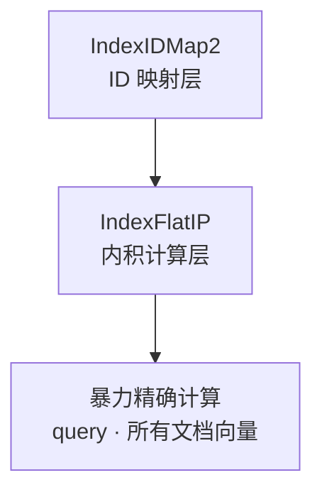
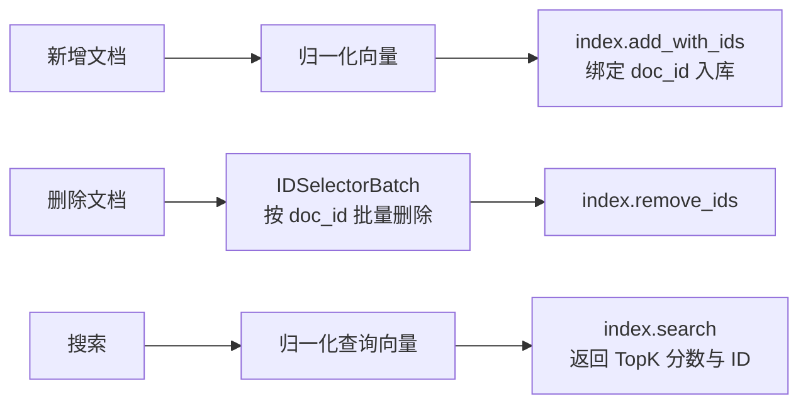
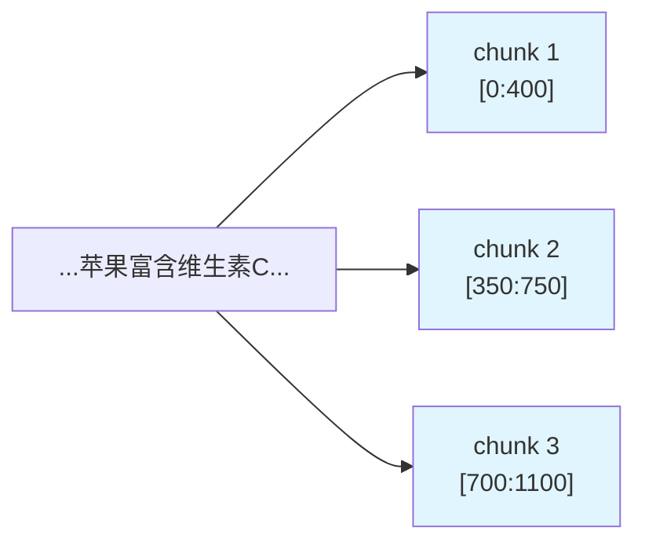
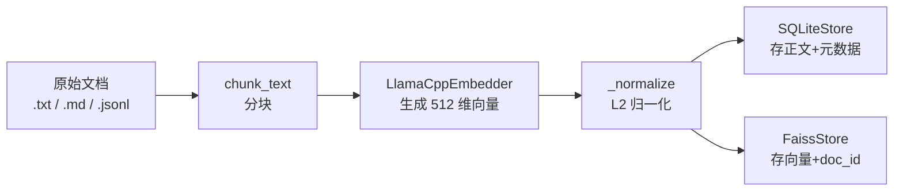
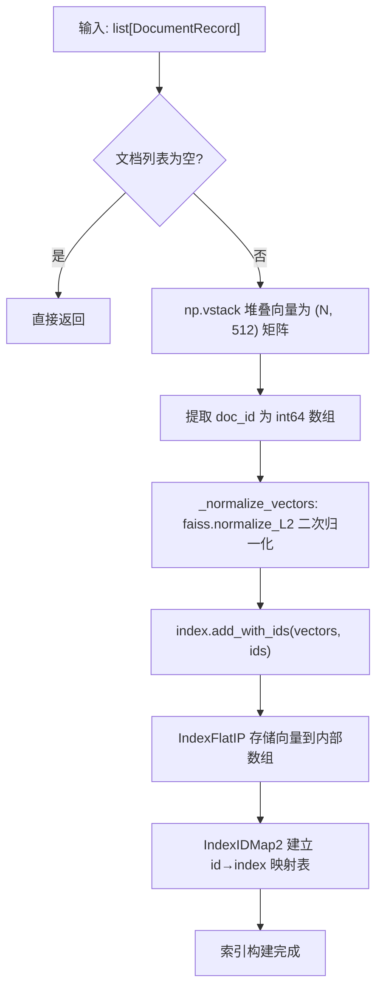
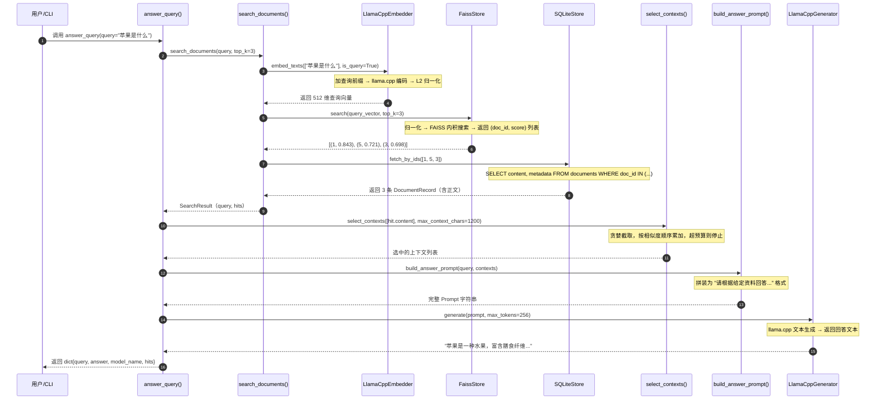

# 小说生成 Agent 系统核心技术原理 06：RAG 检索增强系统

> 适合对象：掌握 Python 基础，但还不熟悉 Embedding、向量检索和 RAG 链路的大学生读者。  
> 说明：本文从"AI 怎么读资料再回答"这个直觉问题出发，逐步拆解本项目 `embeddingProject/` 中 BGE + FAISS + SQLite 检索子系统的完整原理。

---

## 1. 什么是 RAG：让 AI 先查资料再回答

想象你正在写一篇关于"唐代诗歌"的课程论文。你不会凭空捏造，而是先去图书馆找几本相关的书，翻到 relevant 的章节，读完后才动笔。RAG（Retrieval-Augmented Generation，检索增强生成）做的就是这件事——让 AI 在"动笔回答"之前，先去自己的"数字图书馆"里查资料。

### 1.1 为什么 AI 需要"查资料"

大语言模型（LLM）的知识来自训练数据，存在三个天然缺陷：

1. **知识有截止日期**：模型不知道最近发生的新闻。
2. **容易"幻觉"**：没有依据时，模型会一本正经地编造内容。
3. **无法访问私有资料**：你的个人笔记、公司内部文档、小说参考素材，模型在训练时从未见过。

RAG 的核心思想很简单：不直接问模型，而是先把问题变成检索请求，从外部知识库中召回最相关的文本片段，再把这些片段和用户问题一起塞给模型，让它"有凭有据"地回答。

### 1.2 本项目中的 RAG 链路

在本项目的 `embeddingProject/` 目录下，RAG 链路被实现为一套完整的本地检索系统：

```
用户问题
  → 文本向量化（BGE Embedding）
  → 向量相似度检索（FAISS）
  → 回表取正文（SQLite）
  → 上下文压缩与拼装
  → 调用生成模型回答
```

这套系统不依赖任何云端 API，完全本地运行，适合处理小说创作中的参考素材检索、世界观设定查询等场景。

---

## 2. Embedding 向量化：把文字变成数字坐标

### 2.1 从"找相似句子"说起

假设你有两句话：

- A: "苹果是一种水果。"
- B: "香蕉可以直接吃。"
- C: "Python 是一种编程语言。"

作为人类，你一眼就能看出 A 和 B 更相关（都在说食物），而 C 是另一回事。但计算机不懂"水果"和"编程语言"的含义，它只认数字。所以我们需要一种方法，把每句话变成一串数字（向量），使得语义相近的句子在数字空间中也挨得近。

这就是 **Embedding（嵌入）** 要做的事情。

### 2.2 BERT/BGE 如何生成向量

本项目使用的是 `BAAI/bge-small-zh-v1.5`，一个专为中文语义检索优化的 Embedding 模型。它基于 BERT（Bidirectional Encoder Representations from Transformers）架构，核心思想是：

> 通过在海量文本上进行"完形填空"式的自监督训练，让模型学会把每个词和整句话的语义压缩成一个固定长度的向量。

具体过程可以用下图理解：


**关键参数（来自本项目实际配置）**：

- 模型：`bge-small-zh-v1.5`，GGUF q4_k_m 量化格式
- 词表大小：`n_vocab = 21128`
- 向量维度：`n_embd = 512`
- 最大上下文：`n_ctx = 512`

代码实现位于 `embeddingProject/embedder/llama_cpp_embedder.py`：

```python
class LlamaCppEmbedder:
    def __init__(self, model_path, n_ctx=512, ...):
        self._llm = Llama(
            model_path=str(model_path),
            embedding=True,      # 启用 embedding 模式
            n_ctx=n_ctx,
            verbose=False,
        )
        self.dimension = 512   # bge-small-zh-v1.5 的输出维度
```

### 2.3 向量归一化：让每个向量长度为 1

模型输出的原始向量长度各不相同。为了后续用"内积"直接等价于"余弦相似度"，我们需要先把所有向量变成**单位向量**（长度为 1）。

归一化公式：

$$
\hat{v} = \frac{v}{\|v\|}
$$

其中 $\|v\|$ 是向量的 L2 范数：

$$
\|v\| = \sqrt{v_1^2 + v_2^2 + \cdots + v_{512}^2}
$$

代码实现：

```python
def _normalize(self, vectors: np.ndarray) -> np.ndarray:
    norms = np.linalg.norm(vectors, axis=1, keepdims=True)
    norms = np.clip(norms, a_min=1e-12, a_max=None)  # 防止除以零
    return vectors / norms
```

**为什么归一化如此重要？** 因为归一化后，两个向量的内积就等于它们的余弦相似度。这在下一节会严格推导。

---

## 3. 查询指令前缀：为什么查询和文档要用不同格式

### 3.1 不对称编码

BGE 模型有一个特殊设计：**查询（query）和文档（document）使用不同的输入格式**。

在本项目中，这一差异体现在 `embedder/base.py` 的默认配置：

```python
DEFAULT_QUERY_INSTRUCTION = "为这个句子生成表示以用于检索相关文章："
```

当处理用户问题时：

```python
def _prepare_texts(self, texts: list[str], is_query: bool) -> list[str]:
    if not is_query:
        return texts
    return [f"{self.query_instruction}{text}" for text in texts]
```

- **文档向量**：直接 embedding，`is_query=False`
  - 输入：`"苹果是一种水果。"`
- **查询向量**：前缀 + 问题，`is_query=True`
  - 输入：`"为这个句子生成表示以用于检索相关文章：苹果是什么"`

### 3.2 为什么要加前缀

BGE 在训练时使用了**对比学习（Contrastive Learning）**。训练数据中的正例是"查询-相关文档"对，负例是"查询-不相关文档"对。模型学会的是：把查询向量拉向相关文档向量，推离不相关文档向量。

加前缀相当于给模型一个"角色提示"：

> "现在你要生成的是一个用于检索的查询表示，不是普通的句子表示。"

这会让查询向量"有意识"地去靠近那些语义匹配的文档向量，而不是仅仅编码句子本身的字面含义。

### 3.3 实测效果

在本项目的实际运行中，观测到以下数值：

- 文档向量范数：约 `7.163`
- 查询向量范数：约 `6.445`
- 归一化后余弦相似度：约 `0.843`

这说明即使原始向量长度不同，经过归一化后，查询和文档在方向上是高度对齐的。

---

## 4. 向量相似度计算：内积、余弦相似度与 L2 距离的数学关系

### 4.1 余弦相似度的定义

两个向量 $a$ 和 $b$ 的**余弦相似度**定义为它们夹角的余弦值：

$$
\cos(\theta) = \frac{a \cdot b}{\|a\| \|b\|}
$$

其中：
- $a \cdot b = a_1 b_1 + a_2 b_2 + \cdots + a_n b_n$ 是**内积（点积）**
- $\|a\| = \sqrt{a_1^2 + \cdots + a_n^2}$ 是 $a$ 的 L2 范数

### 4.2 归一化后：内积 = 余弦相似度

当两个向量都已经归一化为单位向量时：

$$
\|\hat{a}\| = 1, \quad \|\hat{b}\| = 1
$$

代入余弦相似度公式：

$$
\cos(\theta) = \frac{\hat{a} \cdot \hat{b}}{\|\hat{a}\| \|\hat{b}\|} = \frac{\hat{a} \cdot \hat{b}}{1 \times 1} = \hat{a} \cdot \hat{b}
$$

**结论**：对于单位向量，内积等于余弦相似度。这就是本项目选择 `IndexFlatIP`（内积索引）的根本原因——归一化后的内积搜索等价于余弦相似度搜索。

### 4.3 L2 距离与内积的等价关系

**L2 距离（欧几里得距离）**定义为：

$$
d_{L2}(a, b) = \|a - b\| = \sqrt{(a_1-b_1)^2 + \cdots + (a_n-b_n)^2}
$$

对其平方展开：

$$
\|a - b\|^2 = (a - b) \cdot (a - b) = a \cdot a - 2(a \cdot b) + b \cdot b
$$

当 $a$ 和 $b$ 都是单位向量时：

$$
a \cdot a = \|a\|^2 = 1, \quad b \cdot b = \|b\|^2 = 1
$$

因此：

$$
\|\hat{a} - \hat{b}\|^2 = 1 - 2(\hat{a} \cdot \hat{b}) + 1 = 2 - 2(\hat{a} \cdot \hat{b})
$$

整理得：

$$
\hat{a} \cdot \hat{b} = 1 - \frac{\|\hat{a} - \hat{b}\|^2}{2}
$$

**结论**：
- 内积越大 → L2 距离越小 → 向量越相似
- 内积 = 1 时，L2 距离 = 0，两个向量完全相同
- 内积 = 0 时，L2 距离 = $\sqrt{2}$，两个向量正交（最不相似）

### 4.4 为什么本项目用内积而不是 L2

FAISS 同时支持 `IndexFlatIP`（内积）和 `IndexFlatL2`（L2 距离）。本项目选择 `IndexFlatIP` 的原因是：

1. **语义直观**：内积结果范围是 $[-1, 1]$，正值表示相似，负值表示相反，符合直觉。
2. **计算等价**：归一化后，最大化内积 = 最小化 L2 距离 = 最大化余弦相似度。
3. **工程简洁**：FAISS 的 `faiss.normalize_L2()` 可以直接完成归一化，之后统一用内积搜索。

代码中的体现：

```python
# faiss_store.py
import faiss

class FaissStore:
    def __init__(self, dimension: int) -> None:
        self.index = faiss.IndexIDMap2(faiss.IndexFlatIP(dimension))

    def search(self, query_vector, top_k):
        vector = self._validate_vector(query_vector).reshape(1, -1)
        scores, ids = self.index.search(_normalize_vectors(vector), top_k)
        # scores[0][i] 就是归一化后的内积 = 余弦相似度
```

---

## 5. FAISS 向量检索：IndexFlatIP 的工作原理

### 5.1 FAISS 是什么

FAISS（Facebook AI Similarity Search）是 Meta 开源的高效相似度搜索库。它的核心职责是：给定一个查询向量，从数百万甚至数十亿个向量中，快速找出最相似的前 K 个。

### 5.2 本项目的索引结构

```python
self.index = faiss.IndexIDMap2(faiss.IndexFlatIP(dimension))
```

这是一个两层结构：



- **IndexFlatIP(512)**：最底层的"扁平索引"，存储所有 512 维向量，搜索时计算查询向量与每个文档向量的内积。
- **IndexIDMap2**：ID 映射层，给每个向量绑定一个自定义的 `doc_id`（int64），使得搜索结果返回的是业务 ID 而不是数组下标。

### 5.3 为什么小数据量用精确搜索

`IndexFlatIP` 属于**精确搜索（Exact Search）**，时间复杂度是 $O(N \times D)$，其中 $N$ 是文档数，$D$ 是维度（512）。

对于小说创作场景，参考素材通常在几千到几万条之间：

- 1 万条 × 512 维 = 约 20MB 向量数据
- 单次搜索在普通 CPU 上仅需毫秒级

因此本项目没有使用 IVF（倒排文件索引）或 HNSW（图索引）等近似最近邻（ANN）算法。精确搜索的好处是：

1. **结果 100% 准确**，不存在 ANN 的召回率损失。
2. **实现简单**，不需要调聚类中心数、邻居数等超参。
3. **内存可控**，几万条 512 维向量仅占几十 MB。

当数据量增长到百万级以上时，才需要考虑切换到 `IndexIVFFlat` 或 `IndexHNSWFlat`。

### 5.4 索引的增删改查



代码中的关键操作：

```python
# 添加文档
vectors = np.vstack([doc.vector for doc in documents])
ids = np.array([doc.doc_id for doc in documents], dtype=np.int64)
self.index.add_with_ids(_normalize_vectors(vectors), ids)

# 删除文档
selector = faiss.IDSelectorBatch(np.array(doc_ids, dtype=np.int64))
self.index.remove_ids(selector)

# 搜索
scores, ids = self.index.search(normalized_query, top_k)
```

---

## 6. 文本分块策略：滑动窗口与重叠区域

### 6.1 为什么要分块

Embedding 模型有最大输入长度限制（本项目是 512 tokens）。一篇长篇小说或参考资料无法一次性编码，必须切成小段。但切得太碎会丢失上下文，切得太长又超出限制。

### 6.2 滑动窗口分块

本项目的分块实现位于 `rag/chunking.py`：

```python
def chunk_text(text: str, chunk_size: int = 400, chunk_overlap: int = 50) -> list[str]:
    step = max(1, chunk_size - chunk_overlap)  # 步长 = 350
    while start < len(text):
        chunk = text[start : start + chunk_size]
        chunks.append(chunk)
        if start + chunk_size >= len(text):
            break
        start += step
```

参数说明：

- `chunk_size = 400`：每块最多 400 个字符
- `chunk_overlap = 50`：相邻两块之间有 50 个字符重叠

### 6.3 重叠区域的作用



重叠区域（图中灰色部分）的作用是**防止语义断裂**。如果一个完整的句子恰好落在两块边界上，没有重叠的话，这句话会被硬生生切断，导致两块都失去完整语义。50 字符的重叠为句子"跨边界存活"提供了缓冲。

### 6.4 分块数量估算

对于长度为 $L$ 的文本，分块数量可以估算为：

$$
N \approx \left\lceil \frac{L - c}{c - o} \right\rceil + 1
$$

其中：
- $L$ = 文本总长度
- $c$ = `chunk_size`（400）
- $o$ = `chunk_overlap`（50）
- $c - o$ = 有效步长（350）

**示例**：一段 2000 字的参考素材

$$
N \approx \left\lceil \frac{2000 - 400}{350} \right\rceil + 1 = \left\lceil 4.57 \right\rceil + 1 = 6
$$

实际会产生约 6 个文本块，每块 400 字符，相邻块重叠 50 字符。

---

## 7. 上下文压缩：在有限窗口内塞入最有用的信息

### 7.1 为什么需要压缩

即使检索回了 TopK 个文本块，它们的总长度可能仍然超过生成模型的上下文窗口。本项目中的上下文预算计算如下：

```python
max_context_chars = chunk_size * retrieval_top_k
# = 400 * 3 = 1200 字符
```

这意味着：即使检索回了 3 个块，如果它们的总长度超过 1200 字符，就必须截断。

### 7.2 贪婪截取策略

`rag/answering.py` 中的实现：

```python
def select_contexts(contexts: list[str], max_context_chars: int) -> list[str]:
    selected: list[str] = []
    total = 0
    for context in contexts:
        if total + len(context) > max_context_chars:
            break
        selected.append(context)
        total += len(context)
    return selected
```

这是一个**按检索结果顺序的贪婪策略**：

1. FAISS 已经按相似度从高到低排好了顺序。
2. 依次尝试放入每个块，直到预算用完。
3. 如果一个块放不进去，直接停止，不再尝试后面的块。

这种策略的假设是：**相似度更高的块更有价值**，优先保证高相关内容的完整性，宁可少放几块，也不把高相关块截断。

### 7.3 Prompt 拼装

选中的上下文会被格式化为：

```python
def build_answer_prompt(query: str, contexts: list[str]) -> str:
    context_block = "\n\n".join(
        f"[片段 {i+1}]\n{ctx}" for i, ctx in enumerate(contexts)
    )
    return (
        "请根据给定资料回答用户问题。"
        "如果资料不足以回答，请明确说资料不足。\n\n"
        f"{context_block}\n\n"
        f"问题：{query}\n"
        "回答："
    )
```

最终送入生成模型的 prompt 结构：

```
请根据给定资料回答用户问题。如果资料不足以回答，请明确说资料不足。

[片段 1]
苹果是一种水果，富含膳食纤维...

[片段 2]
苹果原产于中亚，现在全球广泛种植...

问题：苹果是什么
回答：
```

---

## 8. 双存储设计：向量库 + 关系库的经典架构

### 8.1 为什么需要两个数据库

FAISS 擅长"海量向量的相似度搜索"，但它不擅长：

1. 存储原始文本内容
2. 存储结构化元数据（来源文件、分类标签、创建时间等）
3. 支持复杂的条件过滤和事务操作

SQLite 恰好弥补这些短板。因此本项目采用了经典的**双存储架构**：

```mermaid
flowchart TB
    subgraph "FAISS 向量存储"
        A1["doc_id: 1 → 向量 [0.12, -0.05, ..., 0.33]"]
        A2["doc_id: 2 → 向量 [-0.08, 0.21, ..., -0.15]"]
        A3["IndexFlatIP + IndexIDMap2"]
    end

    subgraph "SQLite 元数据存储"
        B1["表 documents"]
        B2["doc_id | content | metadata_json"]
        B3["1 | 苹果是一种水果... | {\"分类\": \"水果\"}"]
        B4["2 | 香蕉可以直接吃... | {\"分类\": \"水果\"}"]
    end

    C["搜索流程"] --> D["FAISS: 返回 doc_id + score"]
    D --> E["SQLite: SELECT content, metadata WHERE doc_id IN (...)"]
    E --> F["组装 SearchHit 返回上层"]
```

### 8.2 数据一致性保证

在 `pipeline/indexing.py` 中，建索引时两个存储是同步写入的：

```python
def index_documents(*, embedder, faiss_store, sqlite_store, documents):
    embedding_result = embedder.embed_texts([doc.content for doc in documents])
    records = [
        DocumentRecord(
            doc_id=doc.doc_id,
            content=doc.content,
            metadata=doc.metadata,
            vector=embedding_result.vectors[i],
        )
        for i, doc in enumerate(documents)
    ]
    sqlite_store.upsert_documents(records)   # 先写 SQLite
    faiss_store.add_documents(records)        # 再写 FAISS
```

**设计要点**：

- `doc_id` 是 int64 类型的唯一标识，作为两个存储之间的关联键。
- SQLite 使用 `UPSERT`（`INSERT ... ON CONFLICT DO UPDATE`），支持重复索引同一文档时的更新语义。
- FAISS 的 `IndexIDMap2` 允许用相同的 `doc_id` 覆盖旧向量（先删除再添加）。

### 8.3 SQLite 表结构

```sql
CREATE TABLE documents (
    doc_id INTEGER PRIMARY KEY,
    content TEXT NOT NULL,
    metadata_json TEXT NOT NULL
);
```

`metadata_json` 使用 JSON 字符串存储灵活的结构化信息。在目录导入模式下，会记录 `source_path`（来源文件）和 `chunk_index`（分块序号），方便追溯：

```python
metadata = {
    "source_path": "docs/设定集/世界观.md",
    "source_root": "/home/user/project/docs",
    "chunk_index": 3,
}
```

---

## 9. RAG 完整 Pipeline：端到端流程

### 9.1 建索引阶段



### 9.2 查询阶段


### 9.3 代码层面的完整调用链

以 `cli.py answer` 命令为例：

```python
# 1. 加载索引
faiss_store = FaissStore.load(runtime_config.faiss_index_path)
sqlite_store = SQLiteStore(connection=sqlite3.connect(...))

# 2. 执行 RAG
payload = answer_query(
    query="苹果是什么",
    top_k=3,
    embedder=embedder,
    generator=generator,
    faiss_store=faiss_store,
    sqlite_store=sqlite_store,
    max_tokens=256,
    max_context_chars=400 * 3,  # 1200
)

# 3. 返回结构
{
    "query": "苹果是什么",
    "answer": "苹果是一种水果，可以直接吃。",
    "model_name": "llama.cpp-generator",
    "hits": [
        {"doc_id": 1, "content": "...", "metadata": {...}, "score": 0.843},
        ...
    ]
}
```

---

## 10. 量化技术：GGUF q4_k_m 是什么

### 10.1 为什么需要量化

原始的 `bge-small-zh-v1.5` 模型以 PyTorch 格式存储时，参数量约为 24MB（FP32）或 12MB（FP16）。虽然不大，但如果要在资源受限的设备上运行，或者同时加载多个模型，仍然需要进一步压缩。

**量化（Quantization）** 的核心思想是：用更少的比特数表示每个参数，从而减小模型体积和内存占用。

### 10.2 GGUF 格式与 llama.cpp

GGUF（GPT-Generated Unified Format）是 llama.cpp 项目定义的二进制模型格式，专为本地推理优化。它把模型权重、词表、超参数等打包在一个文件中，支持多种量化方案。

### 10.3 q4_k_m 的含义

`q4_k_m` 是 GGUF 中的一种量化策略，属于 **Q4_K_M** 变体：

- **Q4**：每个权重用 4 比特（bit）表示，而不是标准的 32 比特（FP32）或 16 比特（FP16）。
- **K**：使用 "K-quants" 量化算法，对注意力层（attention）和前馈层（FFN）采用不同的量化粒度，保护对模型质量更敏感的权重。
- **M**：Medium（中等），在 Q4_K 系列中属于平衡型，介于 Q4_K_S（Small，更小更快）和 Q4_K_L（Large，更高精度）之间。

**压缩效果**：

- 原始 FP32：每个参数 32 比特 = 4 字节
- Q4_K_M：平均每个参数约 4.5 比特（含缩放因子和混合精度层）
- 压缩比：约 7:1

对于 `bge-small-zh-v1.5`：

- 参数量约 24M
- FP32 体积：约 96MB
- GGUF q4_k_m 体积：约 13MB

### 10.4 量化对 Embedding 质量的影响

量化会引入一定误差，但对于 Embedding 任务，实验表明：

1. **检索精度损失很小**：Q4_K_M 级别的量化在大多数检索任务上与 FP16 的差距小于 1%。
2. **速度提升明显**：4 比特权重在 CPU 上的矩阵乘法更快，内存带宽压力也更小。
3. **本项目实测可用**：`test_embedders.py` 和 `test_rag.py` 中的测试用例均使用真实量化模型通过。

### 10.5 项目中的模型配置

```python
# config.py
class AppConfig:
    gguf_path: Path = Path("models/gguf/bge-small-zh-v1.5-q4_k_m.gguf")
    n_ctx: int = 512
    n_batch: int = 512
```

`n_batch=512` 表示 llama.cpp 每次最多并行处理 512 个 token 的 embedding 计算，这是本地 CPU 推理的常用配置。

---

## 11. 总结：RAG 系统的关键设计决策

| 设计点 | 本项目的做法 | 理由 |
|--------|-----------|------|
| Embedding 模型 | BGE-small-zh-v1.5 | 中文检索优化，512 维，体积小 |
| 模型格式 | GGUF q4_k_m | 7:1 压缩，本地 CPU 可跑 |
| 查询前缀 | `"为这个句子生成表示以用于检索相关文章："` | 不对称编码，提升检索精度 |
| 向量归一化 | L2 归一化到单位向量 | 内积 = 余弦相似度 |
| 向量索引 | FAISS IndexFlatIP | 精确搜索，适合小数据量 |
| 元数据存储 | SQLite | 轻量、事务、JSON 支持 |
| 关联键 | doc_id (int64) | 简单、高效、跨存储一致 |
| 文本分块 | 400 字符 / 50 字符重叠 | 平衡上下文完整性与模型长度限制 |
| 上下文压缩 | 贪婪顺序截取 | 优先保证高相关块完整性 |
| 生成模型 | llama.cpp 本地加载 | 不依赖云端，隐私可控 |

---

## 参考链接

- [FAISS 官方文档](https://faiss.ai/) — Meta 开源的向量相似度搜索库
- [BGE GitHub 仓库](https://github.com/FlagOpen/FlagEmbedding) — BAAI 开源的 Embedding 模型系列
- [llama.cpp 文档](https://github.com/ggerganov/llama.cpp) — 本地 LLM 推理引擎，支持 GGUF 格式
- [GGUF 量化格式说明](https://github.com/ggerganov/llama.cpp/blob/master/gguf.md) — GGUF 文件格式规范
- [Sentence-BERT 论文](https://arxiv.org/abs/1908.10084) — Sentence Embedding 的经典工作
- [BERT 论文](https://arxiv.org/abs/1810.04805) — Transformer 双向编码器的奠基之作

---

## 实现详解

> 本节深入源码层面，逐行拆解 `embeddingProject/` 中 5 个核心模块的真实实现。适合已经理解 RAG 整体概念、希望进一步掌握工程细节的大学生读者。

---

### A. llama_cpp_embedder 的 Embedding 生成流程

文件路径：`embeddingProject/embedder/llama_cpp_embedder.py`

#### A.1 初始化：加载 GGUF 模型

```python
# 第 14-44 行
class LlamaCppEmbedder(Embedder):
    runtime = "llama.cpp"

    def __init__(
        self,
        model_path: str | Path,
        model_name: str = "bge-small-zh-v1.5-gguf",
        query_instruction: str = DEFAULT_QUERY_INSTRUCTION,
        n_ctx: int = 512,
        n_threads: int | None = None,
        n_batch: int = 512,
    ) -> None:
        try:
            from llama_cpp import Llama
        except Exception as exc:
            raise RuntimeError(f"无法初始化 llama.cpp 运行时：{exc}") from exc

        self.model_path = Path(model_path)
        if not self.model_path.exists():
            raise FileNotFoundError(f"未找到 GGUF 模型文件：{self.model_path}")

        self.model_name = model_name
        self.query_instruction = query_instruction
        self.dimension = 512
        self._llm = Llama(
            model_path=str(self.model_path),
            embedding=True,          # 关键：启用 embedding 模式，而非文本生成模式
            n_ctx=n_ctx,             # 最大上下文长度 512 tokens
            n_threads=n_threads,     # CPU 线程数，None 表示自动
            n_batch=n_batch,         # 单次前向传播最多处理 512 tokens
            verbose=False,
        )
```

**中文注释解释**：
- `embedding=True` 是核心开关。llama.cpp 的 `Llama` 类既可以当生成模型用（续写文本），也可以当编码器用（输出向量）。这个开关决定了内部计算图走哪条分支。
- `n_batch=512` 控制的是"单次前向最多吃多少 token"。如果输入文本很长，llama.cpp 会自动拆成多个 batch 串行处理，但每个 batch 不超过 512。
- `dimension = 512` 是硬编码的，因为 `bge-small-zh-v1.5` 的隐藏层维度就是 512。如果将来换模型，这里需要同步修改。

#### A.2 文本准备：查询前缀的拼接

```python
# 第 57-60 行
    def _prepare_texts(self, texts: list[str], is_query: bool) -> list[str]:
        if not is_query:
            return texts
        return [f"{self.query_instruction}{text}" for text in texts]
```

**通俗解释**：这就像是给模型发"角色卡"。
- 编码文档时，直接丢原文：`"苹果是一种水果。"`
- 编码查询时，前面加一句提示：`"为这个句子生成表示以用于检索相关文章：苹果是什么"`

BGE 模型在训练时，查询和文档就是这样不对称配对的。加前缀相当于提醒模型："现在不是普通理解句子，而是要生成一个专门用来找资料的向量。"

#### A.3 Embedding 调用与降级策略

```python
# 第 71-105 行
    def _embed_with_fallback(self, texts: list[str]) -> np.ndarray:
        try:
            response = self._llm.create_embedding(texts)
            return self._extract_vectors(response)
        except (RuntimeError, ValueError, TypeError) as exc:
            import logging
            logger = logging.getLogger(__name__)
            logger.warning(
                "批量 embedding 失败，降级为逐条处理: model=%s, texts=%d, error=%s",
                self.model_name, len(texts), exc,
            )
            vectors = []
            for text in texts:
                last_error = None
                for attempt in range(2):
                    try:
                        response = self._llm.create_embedding(text)
                        vectors.append(self._extract_vectors(response)[0])
                        break
                    except (RuntimeError, ValueError, TypeError) as retry_exc:
                        last_error = retry_exc
                        if attempt == 0:
                            logger.warning("单条 embedding 重试: text_len=%d, error=%s", len(text), retry_exc)
                        else:
                            raise RuntimeError(f"embedding 失败（已重试）: {text[:50]}...") from last_error
            return np.asarray(vectors, dtype=np.float32)
```

**中文注释解释**：
- 第一层 `try` 尝试批量调用 `create_embedding(texts)`，把所有文本一次性送进模型。这是最快的方式，因为 llama.cpp 可以在一个 batch 内并行计算。
- 如果批量失败（比如某些文本太长导致内存溢出），就**降级（fallback）**为逐条处理。
- 逐条处理时，每条文本还有**一次重试机会**（`attempt in range(2)`）。这是为了应对偶发的运行时错误，比如线程竞争或临时内存碎片。
- 如果重试仍然失败，就抛出异常，并附带失败文本的前 50 个字符，方便定位问题数据。

#### A.4 向量提取：兼容两种返回格式

```python
# 第 62-69 行
    def _extract_vectors(self, response: Any) -> np.ndarray:
        if isinstance(response, dict) and "data" in response:
            vectors = [item["embedding"] for item in response["data"]]
        elif isinstance(response, list):
            vectors = response
        else:
            raise RuntimeError("llama.cpp 返回的 embedding 结果格式无法识别。")
        return np.asarray(vectors, dtype=np.float32)
```

**通俗解释**：llama.cpp 的 Python 绑定在不同版本下返回格式不一样。有的版本返回 OpenAI 兼容的 `{"data": [{"embedding": [...]}]}` 字典，有的版本直接返回 `[[...], [...]]` 列表。这段代码做了**防御性编程**，两种格式都能兼容。

#### A.5 L2 归一化：把向量变成单位长度

```python
# 第 107-110 行
    def _normalize(self, vectors: np.ndarray) -> np.ndarray:
        norms = np.linalg.norm(vectors, axis=1, keepdims=True)
        norms = np.clip(norms, a_min=1e-12, a_max=None)
        return vectors / norms
```

**中文注释解释**：
- `np.linalg.norm(vectors, axis=1, keepdims=True)` 计算每一行的 L2 范数。对于形状为 `(N, 512)` 的数组，结果形状是 `(N, 1)`。
- `np.clip(..., a_min=1e-12)` 防止除以零。如果某个向量全为零（虽然理论上不应该），除以一个极小值而不是零，避免 `NaN`。
- 归一化后，每个向量的长度都变成 1。这样后续用**内积搜索就等价于余弦相似度搜索**，这是整个系统数学上的基石。

---

### B. FAISS IndexIDMap2.add_with_ids() 的索引构建过程

文件路径：`embeddingProject/storage/faiss_store.py`

#### B.1 索引的初始化

```python
# 第 17-20 行
class FaissStore:
    def __init__(self, dimension: int) -> None:
        self.dimension = dimension
        self.index = faiss.IndexIDMap2(faiss.IndexFlatIP(dimension))
```

**中文注释解释**：
- `faiss.IndexFlatIP(dimension)` 是最底层的**精确内积索引**。它不做任何近似或压缩，就是简单粗暴地把所有向量存在一个数组里，搜索时逐个算内积。时间复杂度 $O(N \times D)$。
- `faiss.IndexIDMap2(...)` 是**ID 映射包装器**。FAISS 原生索引只认"数组下标"（0, 1, 2...），但业务层需要用自己的 `doc_id`（比如 1001, 1002）。`IndexIDMap2` 维护了一张映射表：业务 ID → 内部下标。

#### B.2 add_with_ids 的完整流程

```python
# 第 22-28 行
    def add_documents(self, documents: list[DocumentRecord]) -> None:
        if not documents:
            return

        vectors = np.vstack([self._validate_vector(document.vector) for document in documents])
        ids = np.asarray([document.doc_id for document in documents], dtype=np.int64)
        self.index.add_with_ids(_normalize_vectors(vectors), ids)
```

**逐行拆解**：

1. **空列表保护**（`if not documents: return`）：FAISS 对空数组调用 `add_with_ids` 会报错，所以提前返回。

2. **向量堆叠**（`np.vstack(...)`）：把多个一维向量纵向堆叠成二维矩阵。
   - 输入：3 个文档，每个向量长度 512
   - 输出：形状为 `(3, 512)` 的 `np.ndarray`

3. **ID 数组**（`np.asarray(..., dtype=np.int64)`）：FAISS 要求 ID 必须是 `int64`。如果传入 `int32`，会直接报错。

4. **二次归一化**（`_normalize_vectors(vectors)`）：虽然 `LlamaCppEmbedder` 已经归一化过一次，但这里再归一次是**防御性设计**。`_normalize_vectors` 用 `faiss.normalize_L2()` 实现，是 FAISS 原生的 C++ 优化版本，比 NumPy 更快：

```python
# 第 11-14 行（faiss_store.py 顶部）
def _normalize_vectors(vectors: np.ndarray) -> np.ndarray:
    normalized = np.asarray(vectors, dtype=np.float32).copy()
    faiss.normalize_L2(normalized)
    return normalized
```

5. **`add_with_ids` 的内部机制**：FAISS 会把 `(vectors, ids)` 一起写入 `IndexFlatIP` 的向量数组，同时在 `IndexIDMap2` 中维护 `id → internal_index` 的哈希表。下次搜索返回的是业务 ID，而不是内部数组下标。

#### B.3 索引构建流程图



---

### C. search() 的查询-归一化-搜索流程

文件路径：`embeddingProject/storage/faiss_store.py`

#### C.1 搜索代码

```python
# 第 30-38 行
    def search(self, query_vector: np.ndarray, top_k: int) -> list[tuple[int, float]]:
        vector = self._validate_vector(query_vector).reshape(1, -1)
        scores, ids = self.index.search(_normalize_vectors(vector), top_k)
        results: list[tuple[int, float]] = []
        for doc_id, score in zip(ids[0], scores[0], strict=True):
            if doc_id == -1:
                continue
            results.append((int(doc_id), float(score)))
        return results
```

**逐行拆解**：

1. **`_validate_vector`**：检查向量是否一维、维度是否匹配 512。如果不匹配，提前报错而不是让 FAISS 崩溃。

2. **`.reshape(1, -1)`**：把一维查询向量变成 `(1, 512)` 的二维矩阵。FAISS 的 `search` 接口要求输入必须是二维，因为支持一次搜多个查询向量（批量搜索）。

3. **`_normalize_vectors(vector)`**：查询向量也必须归一化。这里和文档向量用同一套归一化逻辑，保证数学上的对称性。

4. **`index.search(..., top_k)`**：FAISS 返回两个数组：
   - `scores`：形状 `(1, top_k)`，每列是对应文档的内积值（因为已经归一化，所以等于余弦相似度）。
   - `ids`：形状 `(1, top_k)`，每列是对应文档的 `doc_id`。

5. **`doc_id == -1` 过滤**：如果索引里的文档总数少于 `top_k`，FAISS 会用 `-1` 填充空缺位置。这段代码把无效结果过滤掉，避免上层业务拿到假数据。

#### C.2 搜索流程的数学本质

假设索引里有 3 个文档向量 $\hat{d}_1, \hat{d}_2, \hat{d}_3$（都是单位向量），查询向量是 $\hat{q}$（也是单位向量）。

FAISS 实际计算的是：

$$
\text{score}_i = \hat{q} \cdot \hat{d}_i = \cos(\theta_i)
$$

然后按 `score` 从大到小排序，返回前 `top_k` 个。因为所有向量都是单位向量，**内积值直接就是余弦相似度**，范围在 $[-1, 1]$ 之间。值越接近 1，表示语义越相似。

---

### D. RAG Pipeline answering.py 完整调用链

文件路径：`embeddingProject/rag/answering.py`

#### D.1 完整代码

```python
# 第 1-69 行
from __future__ import annotations

from generator.base import TextGenerator
from pipeline.search import search_documents
from storage.faiss_store import FaissStore
from storage.sqlite_store import SQLiteStore
from embedder.base import Embedder


def select_contexts(contexts: list[str], max_context_chars: int) -> list[str]:
    selected: list[str] = []
    total = 0
    for context in contexts:
        context_length = len(context)
        if total + context_length > max_context_chars:
            break
        selected.append(context)
        total += context_length
    return selected


def build_answer_prompt(query: str, contexts: list[str]) -> str:
    context_block = "\n\n".join(
        f"[片段 {index + 1}]\n{context}" for index, context in enumerate(contexts)
    )
    return (
        "请根据给定资料回答用户问题。"
        "如果资料不足以回答，请明确说资料不足。\n\n"
        f"{context_block}\n\n"
        f"问题：{query}\n"
        "回答："
    )


def answer_query(
    *,
    query: str,
    top_k: int,
    embedder: Embedder,
    generator: TextGenerator,
    faiss_store: FaissStore,
    sqlite_store: SQLiteStore,
    max_tokens: int = 256,
    max_context_chars: int = 3000,
) -> dict[str, object]:
    search_result = search_documents(
        embedder=embedder,
        faiss_store=faiss_store,
        sqlite_store=sqlite_store,
        query=query,
        top_k=top_k,
    )
    contexts = select_contexts([hit.content for hit in search_result.hits], max_context_chars)
    prompt = build_answer_prompt(query, contexts)
    answer = generator.generate(prompt, max_tokens=max_tokens)
    return {
        "query": query,
        "answer": answer,
        "model_name": generator.model_name,
        "hits": [
            {
                "doc_id": hit.doc_id,
                "content": hit.content,
                "metadata": hit.metadata,
                "score": hit.score,
            }
            for hit in search_result.hits
        ],
    }
```

#### D.2 调用链时序图



#### D.3 三个辅助函数的工程意义

**`select_contexts`**（第 10-19 行）：
- 这是一个**贪婪预算控制**函数。FAISS 返回的 TopK 结果已经按相似度排好序，这里按顺序累加文本长度，一旦超过 `max_context_chars` 就停止。
- 设计哲学：**宁可少放几块，也不把高相关块截断**。因为相似度最高的块往往包含最关键的信息。

**`build_answer_prompt`**（第 22-32 行）：
- 把零散的文本片段格式化为结构化的 prompt。每个片段前有 `[片段 N]` 标记，方便生成模型区分不同来源。
- 系统指令明确告诉模型："如果资料不足，请明确说资料不足。" 这是**减少幻觉**的关键约束。

**`answer_query` 的返回结构**（第 56-69 行）：
- 不仅返回 `answer`，还返回完整的 `hits` 列表（含 `doc_id`、`content`、`metadata`、`score`）。这让上层可以做**可解释性展示**——用户不仅看到答案，还能看到答案是从哪些资料里来的。

---

### E. chunking 的滑动窗口实现

文件路径：`embeddingProject/rag/chunking.py`

#### E.1 完整代码

```python
# 第 1-24 行
from __future__ import annotations


def chunk_text(text: str, chunk_size: int = 400, chunk_overlap: int = 50) -> list[str]:
    if chunk_overlap >= chunk_size:
        raise ValueError("chunk_overlap 必须小于 chunk_size")

    normalized = text.strip()
    if not normalized:
        return []
    if len(normalized) <= chunk_size:
        return [normalized]

    chunks: list[str] = []
    start = 0
    step = max(1, chunk_size - chunk_overlap)
    while start < len(normalized):
        chunk = normalized[start : start + chunk_size]
        if chunk:
            chunks.append(chunk)
        if start + chunk_size >= len(normalized):
            break
        start += step
    return chunks
```

#### E.2 逐行拆解

1. **参数校验**（`chunk_overlap >= chunk_size`）：
   - 如果重叠区大于等于块大小，会导致 `step <= 0`，无限循环或死锁。这里提前抛出 `ValueError`。

2. **空文本与短文本快速路径**：
   - `text.strip()` 去掉首尾空白。
   - 如果结果为空，返回空列表。
   - 如果文本长度本身就小于 `chunk_size`，直接原样返回，不切分。

3. **步长计算**（`step = max(1, chunk_size - chunk_overlap)`）：
   - 默认 `chunk_size=400`, `chunk_overlap=50`，所以 `step = 350`。
   - 每次窗口向前滑动 350 个字符，但每块取 400 个字符，因此相邻两块有 50 字符重叠。

4. **滑动窗口循环**：
   - `start` 从 0 开始。
   - 每次取 `normalized[start : start + chunk_size]`。
   - 如果 `start + chunk_size >= len(normalized)`，说明已经覆盖到文本末尾，取完最后一块后 `break`。
   - 否则 `start += step`，窗口向前滑动。

#### E.3 滑动窗口的可视化

假设有一段文本，字符位置标记为 0 到 900：

```
位置: 0        350      400      700      750      900
      |---------|--------|---------|--------|---------|
chunk1: [0:400]  ← 长度 400
chunk2:      [350:750]  ← 长度 400，与 chunk1 重叠 50
chunk3:           [700:900] ← 长度 200（剩余不足 400，取到末尾）
```

**重叠区域的作用**：
- 防止语义断裂。如果一个完整的句子恰好落在两块边界上（比如 `"苹果富含维生素C和多种矿物质。"` 的 `"富"` 在 chunk1 末尾，`"含"` 在 chunk2 开头），没有重叠的话，这句话会被硬生生切断，导致两块都失去完整语义。
- 50 字符的重叠为句子"跨边界存活"提供了缓冲。即使切分点落在句子中间，重叠区也能保证至少其中一块包含完整句子。

#### E.4 分块数量估算

对于长度为 $L$ 的文本，分块数量约为：

$$
N \approx \left\lceil \frac{L - \text{chunk_size}}{\text{step}} \right\rceil + 1
$$

**示例**：一段 2000 字的参考素材
- `chunk_size = 400`, `chunk_overlap = 50`
- `step = 350`
- $N \approx \lceil (2000 - 400) / 350 \rceil + 1 = \lceil 4.57 \rceil + 1 = 6$

实际产生约 6 个文本块，每块最多 400 字符，相邻块重叠 50 字符。

---

> 本文档基于 `embeddingProject/` 目录下的实际代码整理，时间口径为 2026-05-16。如需了解与主系统（`apps/agent-runtime`）的集成方式，请参考《核心技术原理-01-Agent与工作流.md》中关于 `RagService` 与 `NovelCorpusRebuildService` 的章节。
