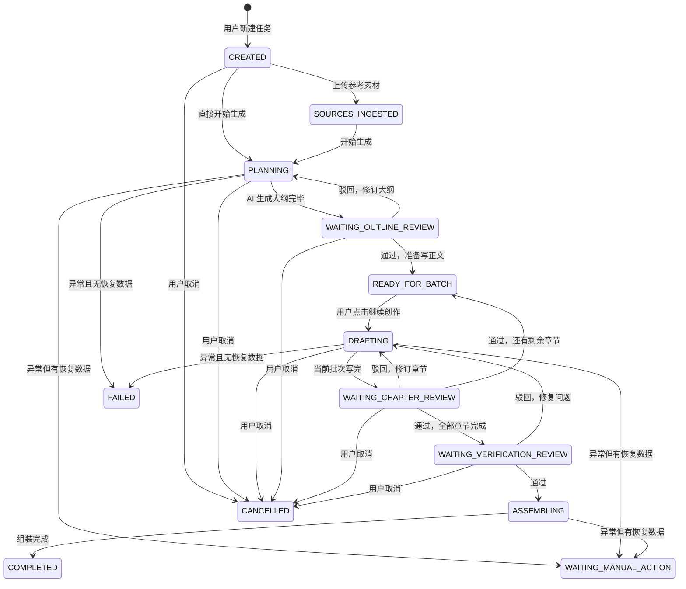
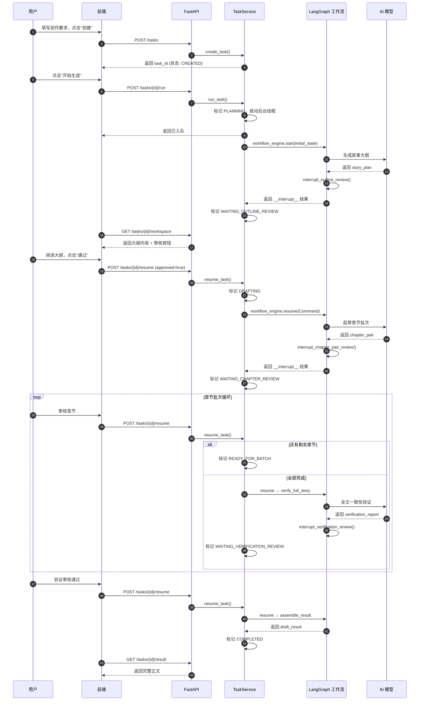
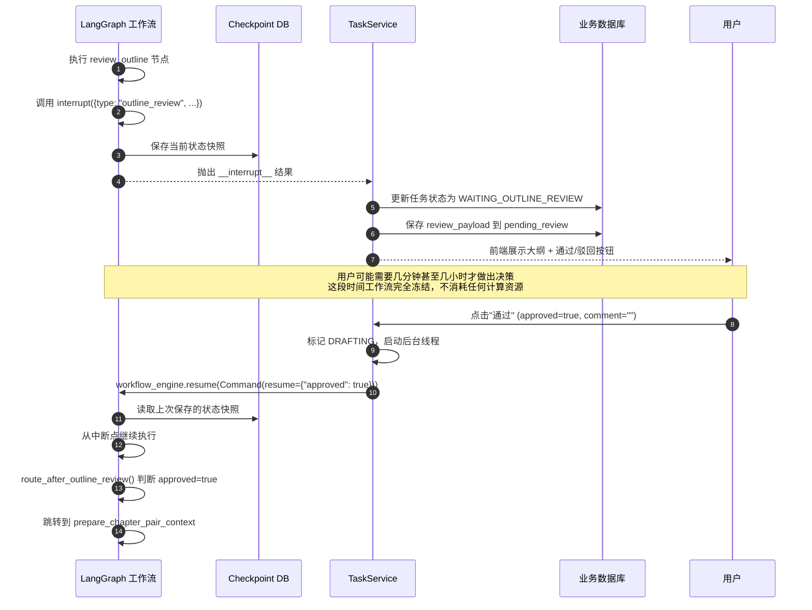
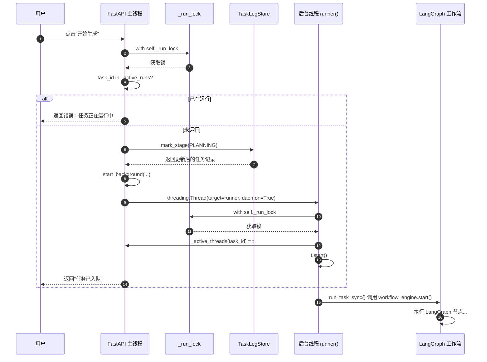
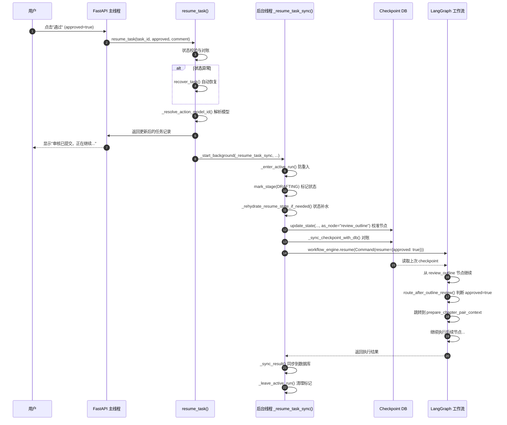
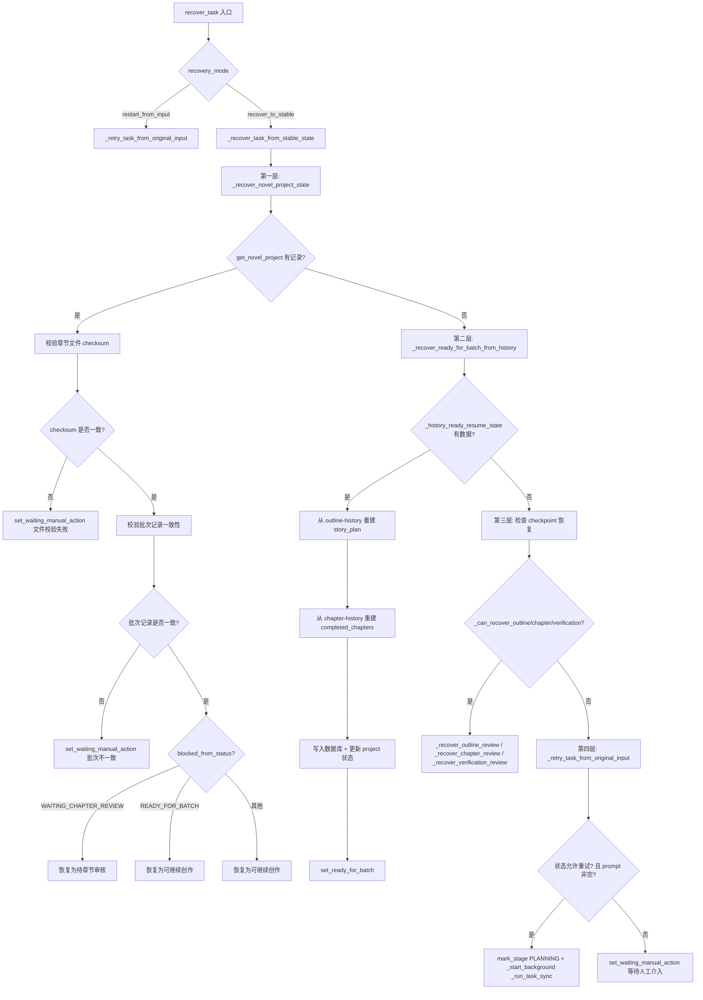

# 07 任务状态机与生命周期

> 本文面向完全没有工程背景的大学生读者。如果你玩过 RPG 游戏、收过快递，或者用过外卖 App，你就已经具备理解状态机的全部生活经验。

---

## 1. 状态机基础概念

### 1.1 什么是有限状态机（FSM）

想象你点了一份外卖，这份订单在骑手 App 里会经历这样的变化：

```
已下单 → 商家已接单 → 骑手已取餐 → 配送中 → 已送达
```

每一个时刻，订单只能处于**唯一一个**状态；从一个状态跳到下一个状态，必须满足特定条件（比如骑手到店扫码后，才会从"商家已接单"变成"骑手已取餐"）。这种"有限个状态 + 状态之间有条件跳转"的数学模型，就叫做**有限状态机**（Finite State Machine，简称 FSM）。

再举一个游戏关卡的例子：

```
关卡选择 → 加载中 → 战斗中 → 结算中 → 返回大厅
```

如果你正在"战斗中"，就不可能同时处于"结算中"；只有当你击败 Boss（触发条件），状态才会迁移。

### 1.2 为什么用 FSM 管理 AI 创作任务

我们的系统是一个 AI 辅助小说创作平台。一篇小说从"用户输入一句话灵感"到"生成完整正文"，中间要经历：整理创作要求、生成大纲、人工审核大纲、分批写章节、人工审核章节、全文验证、组装成品……

如果没有状态机，这些步骤就像一团毛线：
- 用户不知道当前做到哪一步了
- 后台不知道下一步该调用哪个 AI 模型
- 一旦出错，没人知道该从哪里恢复

引入 FSM 后，每个任务就像快递单号一样，有一个**明确的当前状态**。所有代码、前端界面、恢复逻辑都可以围绕这个状态展开，系统变得清晰、可预测、可维护。

---

## 2. 十二种任务状态详解

本系统定义了 12 种任务状态（实际代码中有 13 个枚举值，其中 `WAITING_MANUAL_ACTION` 为异常兜底状态）。下面用"快递物流"的类比逐一解释。

| 状态 | 含义 | 进入条件 | 退出条件 |
|:---|:---|:---|:---|
| `CREATED` | 已创建 | 用户点击"新建任务" | 用户上传参考素材或点击"开始生成" |
| `SOURCES_INGESTED` | 素材已录入 | 用户上传了参考小说/设定 | 用户点击"开始生成" |
| `PLANNING` | 正在规划 | 后台开始执行 LangGraph 工作流，AI 正在生成大纲 | 大纲生成完成，或出错 |
| `WAITING_OUTLINE_REVIEW` | 待大纲审核 | AI 已输出故事大纲，等待人工/自动审核 | 用户通过或驳回 |
| `READY_FOR_BATCH` | 可继续创作 | 大纲审核通过，或某批章节审核通过，等待发起下一批 | 用户点击"继续创作" |
| `DRAFTING` | 正在起草 | 后台正在调用 AI 写章节正文 | 当前批次章节写完，进入审核 |
| `WAITING_CHAPTER_REVIEW` | 待章节审核 | 当前批次章节已生成，等待审核 | 用户通过或驳回 |
| `WAITING_VERIFICATION_REVIEW` | 待验证审核 | 全部章节写完，AI 已完成全文一致性验证 | 用户通过或驳回 |
| `ASSEMBLING` | 正在组装 | 验证通过，正在拼接最终 Markdown/JSON 成品 | 组装完成 |
| `COMPLETED` | 已完成 | 最终成品已生成并归档 | 终态，不再变化 |
| `CANCELLED` | 已取消 | 用户主动取消，或管理员终止 | 终态 |
| `FAILED` | 已失败 | 发生不可恢复错误，且没有任何可恢复上下文 | 终态 |
| `WAITING_MANUAL_ACTION` | 待人工处理 | 发生异常，但系统检测到有可恢复数据，需要人工判断 | 用户选择恢复策略后离开 |

### 2.1 正向流程状态（快递的"运输中"）

`CREATED` → `SOURCES_INGESTED` → `PLANNING` → `WAITING_OUTLINE_REVIEW` → `READY_FOR_BATCH` → `DRAFTING` → `WAITING_CHAPTER_REVIEW` → `READY_FOR_BATCH` → ... → `WAITING_VERIFICATION_REVIEW` → `ASSEMBLING` → `COMPLETED`

这就像快递从仓库发出，经过一个个分拣中心，最终到达你手中。

### 2.2 中断状态（快递的"待签收"）

`WAITING_OUTLINE_REVIEW`、`WAITING_CHAPTER_REVIEW`、`WAITING_VERIFICATION_REVIEW` 这三个状态是**人机协同的 checkpoint**。AI 跑到这里会主动"踩刹车"，把成果摊在人类面前：

> "大纲我写好了，你看行不行？"
> "这两章写完了，你检查一下。"
> "全文都写完了，我自查了一遍，你最后把把关。"

### 2.3 终态（快递的"已签收/已退回/已丢失"）

`COMPLETED`、`CANCELLED`、`FAILED` 是三个终态。任务进入终态后，后台线程会清理活跃运行标记，不再接受新的状态迁移。

### 2.4 异常兜底态

`WAITING_MANUAL_ACTION` 是一个特殊状态。假设 AI 写到第 15 章时突然网络超时，但前面 14 章都好好的——直接标记为 `FAILED` 太可惜，标记为 `DRAFTING` 又不准确。于是系统把它放进 `WAITING_MANUAL_ACTION`，相当于：

> "快递卡在半路了，但包裹还在。请你来决定：继续等、改地址、还是退货？"

---

## 3. 正常生命周期：从创建到完成

### 3.1 完整状态机图



### 3.2 任务生命周期时序图



---

## 4. 审核中断-恢复机制：LangGraph 如何实现人机协同

### 4.1 什么是 interrupt

在 LangGraph 中，`interrupt` 是一个特殊函数。当工作流执行到某个节点时调用它，整个图会**暂停执行**，把当前状态持久化到 checkpoint 数据库，然后向调用方抛出一个包含中断信息的特殊返回值。

这就像游戏里的"暂停菜单"：
- 游戏画面定格（工作流暂停）
- 存档点自动保存（checkpoint 写入）
- 玩家可以选择继续、读档或退出（人工审核决策）

### 4.2 三种审核中断点

系统在三个关键位置设置了 interrupt：

1. **大纲审核中断** (`interrupt_outline_review`)：AI 写完大纲后暂停
2. **章节审核中断** (`interrupt_chapter_pair_review`)：每批章节写完后暂停
3. **验证审核中断** (`interrupt_verification_review`)：全文验证后暂停

### 4.3 审核中断-恢复时序图



### 4.4 恢复时的关键技术细节

恢复执行时，系统需要解决三个问题：

**问题 1：如何确保 resume 被正确的节点消费？**

```python
as_node_map = {
    "outline_review": "review_outline",
    "chapter_pair_review": "review_chapter_pair",
    "verification_review": "review_verification",
}
as_node = as_node_map.get(review_type)
if as_node and hasattr(self.workflow_engine, "update_state"):
    self.workflow_engine.update_state(self._config(task_id), {}, as_node=as_node)
```

通过 `update_state(..., as_node=xxx)`，系统强制把 checkpoint 的"当前节点指针"拨回对应的中断节点，避免误入旧的生成节点。

**问题 2：模型切换后如何同步？**

用户在审核时可能换了模型。恢复前，系统会检查 checkpoint 里的 `input_payload.model_id` 是否与用户选择的模型一致，不一致则打补丁：

```python
if str(input_payload.get("model_id") or "").strip() != resolved_model_id:
    patch["input_payload"] = self._with_model_id(input_payload, resolved_model_id)
```

**问题 3：checkpoint 与数据库状态不一致怎么办？**

系统实现了 `_sync_checkpoint_with_db()` 对账机制，以数据库为准，同步 `novel_project_status`、`completed_chapter_count`、`next_chapter_number` 等字段。

---

## 5. 取消机制：如何优雅地停止任务

### 5.1 为什么"优雅停止"很重要

假设用户点击取消时，AI 正在写第 8 章。如果直接杀线程，可能导致：
- 第 8 章写到一半的文件残留
- 数据库里章节计数和实际文件不一致
- 下一次恢复时系统混乱

### 5.2 三层取消信号

系统采用"信号旗"模式实现协作式取消：

```python
self._stop_requested: set[str] = set()  # 任务级停止信号
self._active_runs: set[str] = set()      # 当前活跃任务集合
self._run_lock = threading.Lock()        # 线程安全锁
```

**第一层：HTTP 层立即响应**

用户点击取消后，API 立即返回"取消请求已接收"，不会让用户干等。

**第二层：业务状态标记**

```python
with self._run_lock:
    was_active = task_id in self._active_runs
    if was_active:
        self._stop_requested.add(task_id)
```

**第三层：回调函数拦截**

所有工作流回调函数都被 `_guard_workflow_callbacks_for_stop()` 包装。每次回调执行前后都会检查 `_stop_requested`：

```python
def guarded_callback(state):
    if self._is_stop_requested(task_id):
        return {"cancelled": True}
    result = callback(state)
    if self._is_stop_requested(task_id):
        next_result = dict(result or {})
        next_result["cancelled"] = True
        return next_result
    return result
```

这就像在流水线上每隔一段距离就站一个检查员，看到"停产"红旗就立即停止当前工序。

### 5.3 取消后的状态清理

```python
# 保存 blocked_from_status 以便后续恢复
update_project_status(task_id, status=current_status, blocked_from_status=blocked)

# 清理残留的活动批次
active_batch = get_active_batch(task_id)
if active_batch is not None:
    mark_batch_failed(task_id, int(active_batch.batch_no))

# 标记任务为 CANCELLED
record = self.store.cancel_task(task_id, comment=comment)
```

---

## 6. 错误处理：失败后的状态迁移和恢复策略

### 6.1 两种失败路径

系统区分"有恢复数据的失败"和"无恢复数据的失败"：

```python
def _mark_failed_unless_stable(self, task_id, message):
    # 如果任务已经在稳定状态（等待审核/已完成/已取消），不要覆盖
    if self._has_stable_terminal_state(current):
        return current

    # 检查是否有可恢复上下文
    if (current.story_plan is not None
        or current.pending_review is not None
        or current.normalized_spec
        or self._has_novel_project(task_id)):
        # 有数据 → 转入 WAITING_MANUAL_ACTION
        return self.store.set_waiting_manual_action(task_id, message, ...)

    # 什么都没有 → 标记 FAILED
    return self.store.set_failed(task_id, message)
```

### 6.2 稳定状态保护

```python
def _has_stable_terminal_state(self, task):
    return task.status in {
        TaskStatus.WAITING_OUTLINE_REVIEW,
        TaskStatus.WAITING_CHAPTER_REVIEW,
        TaskStatus.WAITING_VERIFICATION_REVIEW,
        TaskStatus.WAITING_MANUAL_ACTION,
        TaskStatus.COMPLETED,
        TaskStatus.CANCELLED,
    }
```

这个设计确保：如果任务已经安全停在某个 checkpoint，后台的异常不会把它"撞飞"。

---

## 7. 修订循环与防死锁

### 7.1 为什么需要修订上限

AI 不是完美的。用户驳回大纲后，AI 会尝试修订；但如果用户和 AI"杠上了"——用户始终不满意，AI 始终改不到点子上——就会陷入无限循环。

### 7.2 三级修订上限

```python
MAX_OUTLINE_REVISIONS = 5          # 大纲修订最多 5 轮
MAX_CHAPTER_PAIR_REVISIONS = 5     # 章节对修订最多 5 轮
MAX_VERIFICATION_REVISIONS = 3     # 验证修复最多 3 轮
MAX_BATCH_RETRIES = 3              # 大纲批次重试最多 3 轮
```

### 7.3 路由层面的防死锁

```python
def route_after_outline_review(state):
    if state.get("approved"):
        return "prepare_chapter_pair_context"
    # master 阶段：达到上限强制通过
    if state.get("outline_revision_count", 0) >= MAX_OUTLINE_REVISIONS:
        return "prepare_chapter_pair_context"
    return "revise_outline"
```

```python
def route_after_chapter_pair_review(state):
    if state.get("approved"):
        return "accumulate_chapters"
    # 达到最大修订次数，强制通过
    if state.get("chapter_pair_revision_count", 0) >= MAX_CHAPTER_PAIR_REVISIONS:
        return "accumulate_chapters"
    return "revise_chapter_pair"
```

### 7.4 收敛条件（数学表达）

修订循环的收敛可以用以下不等式描述：

$$
\forall r \in \{\text{outline}, \text{chapter}, \text{verification}\}, \quad N_r \leq N_r^{\max}
$$

其中 $N_r$ 是当前修订计数，$N_r^{\max}$ 是对应的上限。当 $N_r = N_r^{\max}$ 时，系统自动设置 `approved = True`，强制跳出循环。

对于大纲批次分步，额外的约束是：

$$
N_{\text{batch_retry}} \leq 3
$$

超过后退回总纲修订，相当于"这批货老是出问题，我们回仓库重新打包"。

---

## 8. 恢复系统的四层架构

当任务因异常进入 `WAITING_MANUAL_ACTION` 或用户主动要求恢复时，系统会按优先级尝试四层恢复策略。

### 8.1 恢复系统决策流程图

```mermaid
flowchart TD
    A[用户请求恢复任务] --> B{选择恢复模式}
    B -->|recover_to_stable| C[四层恢复策略]
    B -->|restart_from_input| D[按原始输入重新开始]

    C --> E[第一层: NovelProject 状态恢复]
    E --> F{数据库中有<br/>novel_project 记录?}
    F -->|是| G[检查章节文件一致性<br/>校验 checksum]<br/>修复批次记录
    F -->|否| H[第二层: 历史文件恢复]

    G --> I{能否回到<br/>稳定状态?}
    I -->|是| J[返回对应稳定状态]
    I -->|否| H

    H --> K{能否从<br/>outline-history.json<br/>重建 story_plan?}
    K -->|是| L[从 chapter-history<br/>重建已完成章节]
    K -->|否| M[第三层: Checkpoint 恢复]

    L --> N{是否有<br/>已完成章节?}
    N -->|是| O[标记 READY_FOR_BATCH]
    N -->|否| M

    M --> P{LangGraph checkpoint<br/>是否包含可用状态?}
    P -->|是| Q[从 checkpoint 重建<br/>pending_review 等状态]
    P -->|否| R[第四层: 原始输入重试]

    R --> S{是否有原始输入<br/>prompt 且任务处于<br/>FAILED/CANCELLED?}
    S -->|是| T[清空所有产物<br/>重新进入 PLANNING]
    S -->|否| U[标记 WAITING_MANUAL_ACTION<br/>等待人工介入]

    D --> V{任务状态是否允许<br/>重新开始?}
    V -->|是| T
    V -->|否| U
```

### 8.2 四层恢复详解

**第一层：NovelProject 状态恢复**

这是最可靠的恢复源。系统在 SQLite 数据库中维护了 `novel_project`、`novel_generation_batch`、`outline_chapter` 等表。恢复时：
- 检查章节文件是否存在且 checksum 匹配
- 检查批次记录的数学一致性（`persisted_count` 是否在 `[0, effective_count]` 范围内）
- 如果一切正常，根据 `blocked_from_status` 回到对应的稳定状态

**第二层：历史文件恢复**

如果数据库记录损坏或缺失，系统会尝试从文件系统恢复：
- `context/planning/outline-history.json`：重建 `story_plan`
- `context/drafting/chapter-XX-history.json`：重建已完成章节
- 成功后标记为 `READY_FOR_BATCH`，告诉用户"可以从第 X 章继续"

**第三层：Checkpoint 状态恢复**

LangGraph 的 checkpoint 机制会在每个节点执行后自动保存状态。系统可以通过 `workflow_engine.get_state(config)` 读取 checkpoint，重建 `pending_review`、`story_plan`、`completed_chapters` 等字段。

**第四层：原始输入重试**

如果以上全部失败，但用户原始的创作要求（`input.prompt`）还在，系统允许"从零开始"：

```python
def _retry_task_from_original_input(self, task):
    snapshot = self.store.mark_stage(task.id, status=TaskStatus.PLANNING, ...)
    self._start_background(task.id, self._run_task_sync, task.id, action_model_id)
```

这就像快递完全丢失了，但用户记得买了什么，可以重新下单。

---

## 9. 并发安全：防重入、线程安全的设计

### 9.1 为什么需要并发控制

FastAPI 是多线程的。如果用户在前端快速双击"开始生成"按钮，或者同时打开两个浏览器标签页操作同一个任务，就可能导致：
- 同一个任务被两个后台线程同时执行
- 数据库状态被覆盖
- 文件写入冲突

### 9.2 并发安全控制流程图

```mermaid
flowchart TD
    A[HTTP 请求到达<br/>run_task / resume_task / continue_task] --> B{获取 _run_lock}
    B --> C{task_id 是否在<br/>_active_runs 中?}
    C -->|是| D[抛出异常:<br/>"任务正在运行中，请勿重复提交"]
    C -->|否| E[将 task_id 加入<br/>_active_runs]
    E --> F[释放 _run_lock]
    F --> G[启动后台线程<br/>threading.Thread]
    G --> H[后台线程执行<br/>LangGraph 工作流]

    H --> I{执行过程中<br/>是否有新请求?}
    I -->|是| J[新请求获取 _run_lock<br/>发现 task_id 在 _active_runs<br/>立即拒绝]
    I -->|否| K[工作流正常结束<br/>或异常捕获]

    K --> L{进入 finally 块}
    L --> M[获取 _run_lock]
    M --> N[从 _active_runs 移除 task_id<br/>从 _active_threads 移除线程引用<br/>从 _stop_requested 移除停止信号]
    N --> O[释放 _run_lock]

    style D fill:#ffcccc
    style J fill:#ffcccc
```

### 9.3 核心并发控制代码

```python
class TaskServiceCoreMixin:
    def __init__(self, ...):
        self._active_runs: set[str] = set()       # 当前活跃任务
        self._run_lock = threading.Lock()         # 保护 _active_runs 的锁
        self._active_threads: dict[str, threading.Thread] = {}
        self._stop_requested: set[str] = set()    # 待停止任务
        self._chapter_file_locks: dict[str, threading.Lock] = {}  # 章节文件锁

    def _enter_active_run(self, task_id: str) -> bool:
        with self._run_lock:
            if task_id in self._active_runs:
                return False  # 已在运行，拒绝重入
            self._active_runs.add(task_id)
            return True

    def _leave_active_run(self, task_id: str) -> None:
        with self._run_lock:
            self._active_runs.discard(task_id)
            self._active_threads.pop(task_id, None)
            self._stop_requested.discard(task_id)
```

### 9.4 文件写入的原子性

章节文件写入使用"临时文件 + rename"模式：

```python
def _atomic_write_text(self, path: Path, content: str) -> None:
    fd, tmp_path = tempfile.mkstemp(dir=path.parent, prefix=f".{path.name}.", suffix=".tmp")
    try:
        with os.fdopen(fd, "w", encoding="utf-8") as f:
            f.write(content)
            f.flush()
            os.fsync(fd)
        os.replace(tmp_path, path)  # 原子替换
    except Exception:
        os.unlink(tmp_path)
        raise
```

`os.replace()` 是操作系统级别的原子操作，确保任何时刻读者看到的文件都是完整的。

### 9.5 数学模型：并发控制的互斥性

并发控制的核心是一个互斥锁（Mutex）。对于任务 $t$ 的任意操作 $op$，定义：

$$
\forall t, \quad \text{active}(t) \in \{0, 1\}
$$

其中 $\text{active}(t) = 1$ 当且仅当 $t \in \text{_active_runs}$。`_enter_active_run` 操作满足：

$$
\text{enter}(t) = \begin{cases}
\text{True}, & \text{if } \text{active}(t) = 0 \\
\text{False}, & \text{if } \text{active}(t) = 1
\end{cases}
$$

且：

$$
\text{enter}(t) = \text{True} \implies \text{active}(t) := 1
$$

这保证了同一时刻最多只有一个线程在执行任务 $t$ 的后台逻辑。

---

## 10. 扩展阅读与参考

### 10.1 状态机理论

- [有限状态机 - 维基百科](https://zh.wikipedia.org/wiki/%E6%9C%89%E9%99%90%E7%8A%B6%E6%80%81%E6%9C%BA)
- [State Machines in Python](https://python-statemachine.readthedocs.io/en/latest/)

### 10.2 LangGraph 工作流

- [LangGraph 官方文档 - Interrupts](https://langchain-ai.github.io/langgraph/concepts/interruption/)
- [LangGraph 官方文档 - Checkpointer](https://langchain-ai.github.io/langgraph/concepts/persistence/)
- [LangGraph 条件边与路由](https://langchain-ai.github.io/langgraph/how-tos/branching/)

### 10.3 并发编程

- [Python threading 模块官方文档](https://docs.python.org/3/library/threading.html)
- [Python 原子文件写入最佳实践](https://docs.python.org/3/library/tempfile.html)

### 10.4 项目源码

| 文件 | 说明 |
|:---|:---|
| `apps/agent-runtime/app/domain/models.py` | `TaskStatus` 枚举与数据模型 |
| `apps/agent-runtime/app/application/task_service/core.py` | 核心 Mixin：创建、取消、状态同步 |
| `apps/agent-runtime/app/application/task_service/runner.py` | 运行 Mixin：启动与恢复执行 |
| `apps/agent-runtime/app/application/task_service/review.py` | 审核 Mixin：三种审核的处理逻辑 |
| `apps/agent-runtime/app/application/task_service/recovery.py` | 恢复 Mixin：四层恢复策略 |
| `apps/agent-runtime/app/application/task_service/continuation.py` | 继续创作 Mixin：章节批次生成 |
| `apps/agent-runtime/app/graph/main_graph.py` | 主图构建与节点注册 |
| `apps/agent-runtime/app/graph/routers/review.py` | 审核路由：修订循环与防死锁 |
| `apps/agent-runtime/app/graph/routers/flow.py` | 流程路由：章节累积与验证路由 |
| `apps/agent-runtime/app/graph/state.py` | `WorkflowState` 类型定义与修订上限常量 |
| `apps/agent-runtime/app/workflow/engine.py` | `NovelWorkflowEngine`：LangGraph 封装 |

---

## 11. 小结

本文从生活类比出发，系统讲解了一个 AI 小说创作平台的 12 状态任务生命周期：

1. **FSM 基础**：用快递和游戏解释状态机的直觉
2. **12 种状态**：每个状态的含义、进入条件、退出条件
3. **正常生命周期**：从创建到完成的正向流程
4. **审核中断-恢复**：LangGraph `interrupt` 实现人机协同
5. **取消机制**：三层信号实现优雅停止
6. **错误处理**：区分"有恢复数据"和"无恢复数据"的失败路径
7. **修订循环与防死锁**：三级上限保证收敛
8. **四层恢复架构**：数据库 → 文件 → Checkpoint → 原始输入
9. **并发安全**：互斥锁 + 原子写入 + 防重入

理解这套状态机，你就理解了整个系统的心脏。无论前端界面如何变化，后台的 AI 模型如何升级，这 12 个状态和它们之间的迁移规则，始终是系统最稳定的骨架。

---

## 12. 实现详解

> 本章面向有一定 Python 基础的大学生读者，逐行讲解核心源码，揭开状态机背后的工程细节。

---

### 12.1 TaskService.run_task() 的后台线程启动流程

当用户在前端点击"开始生成"按钮时，FastAPI 路由层会调用 `TaskService.run_task()`。这个方法并不直接执行 AI 生成，而是做三件事：防重入检查、状态标记、启动后台线程。

#### 12.1.1 防重入检查与锁的获取

```python
# apps/agent-runtime/app/application/task_service/core.py:306-309

def run_task(self, task_id: str, model_id: str | None = None) -> TaskRecord:
    with self._run_lock:                          # 第 307 行：获取线程锁，保护共享集合
        if task_id in self._active_runs:          # 第 308 行：检查该任务是否已在运行
            raise ValueError("任务正在运行中，请勿重复提交。")  # 第 309 行：已在运行则拒绝
```

**逐行解释：**

- `with self._run_lock:`：`self._run_lock` 是一个 `threading.Lock()` 对象（在 `__init__` 第 103 行创建）。这把锁保护三个共享集合：`_active_runs`、`_active_threads`、`_stop_requested`。使用 `with` 语句确保锁一定会被释放，即使发生异常。
- `if task_id in self._active_runs:`：`_active_runs` 是一个 `set[str]`（第 102 行），存储当前正在后台执行的任务 ID。集合的查找时间复杂度是 O(1)，非常高效。
- `raise ValueError(...)`：如果用户快速双击按钮，或者同时打开两个标签页操作同一个任务，第二次请求会在这里被拦截，不会启动重复线程。

#### 12.1.2 状态校验与模型解析

```python
# apps/agent-runtime/app/application/task_service/core.py:310-315

    task = self.store.get(task_id)                # 第 310 行：从存储层读取任务记录
    if task.status not in {TaskStatus.CREATED, TaskStatus.SOURCES_INGESTED}:
        raise ValueError("只有新建任务或已上传素材的任务才能开始生成。")  # 第 312 行：状态校验
    if self.rag_service is not None and not self.rag_service.is_ready():
        raise ValueError(self.rag_service.readiness_error())  # 第 314 行：RAG 服务就绪检查
    action_model_id = self._resolve_action_model_id(task, model_id)  # 第 315 行：解析实际使用的模型 ID
```

**逐行解释：**

- `self.store.get(task_id)`：`store` 是 `TaskLogStore` 实例（定义在 `task_store.py`），负责任务的持久化。它先从内存字典 `_tasks` 中查找，找不到再从磁盘加载。
- 状态校验：只有 `CREATED`（刚创建）或 `SOURCES_INGESTED`（已上传素材）的任务才能开始。如果任务已经在 `PLANNING` 或 `WAITING_OUTLINE_REVIEW`，说明用户操作有误。
- RAG 检查：如果系统配置了 RAG（检索增强生成）服务，必须先确认向量数据库已加载完成。
- `_resolve_action_model_id`：用户可能指定了某个模型（如 `gpt-5`），也可能使用系统默认模型。这个方法会校验模型是否被支持，并返回最终确定的模型 ID。

#### 12.1.3 标记状态并记录操作

```python
# apps/agent-runtime/app/application/task_service/core.py:316-325

    snapshot = self.store.mark_stage(             # 第 316 行：标记任务进入 PLANNING 状态
        task_id,
        status=TaskStatus.PLANNING,               # 第 318 行：状态设为"正在规划"
        stage="planning",                         # 第 319 行：当前阶段标识
        progress=max(task.progress, 5),           # 第 320 行：进度至少到 5%
        message="任务已进入后台执行，正在整理创作要求。",  # 第 321 行：用户可见消息
        event_type="task.queued",                 # 第 322 行：事件类型，用于前端展示
    )
    snapshot = self._record_last_action(task_id, model_id=action_model_id, kind="run")  # 第 324 行：记录本次操作
    snapshot = self._sync_supervisor_plan(task_id)  # 第 325 行：同步监督计划状态
```

**逐行解释：**

- `mark_stage`：这是 `TaskLogStore` 的方法（`task_store.py:472-504`），它会更新任务状态、写入事件流、持久化到磁盘和数据库。注意此时任务状态已经变成 `PLANNING`，但 AI 还没有真正开始工作。
- `progress=max(task.progress, 5)`：使用 `max` 确保进度只增不减。如果任务之前已经有 10% 的进度，不会回退到 5%。
- `_record_last_action`：记录"最后操作模型"和"操作类型"，用于恢复时知道上次用了什么模型。
- `_sync_supervisor_plan`：更新监督者计划（supervisor plan）中的子任务状态，让前端任务卡片显示正确的步骤。

#### 12.1.4 启动后台线程

```python
# apps/agent-runtime/app/application/task_service/core.py:326

    self._start_background(task_id, self._run_task_sync, task_id, action_model_id)
    return snapshot
```

**逐行解释：**

- `_start_background`：这是启动后台线程的核心方法。它接收目标函数 `self._run_task_sync` 和参数 `(task_id, action_model_id)`，在一个新的守护线程中执行。
- 返回 `snapshot`：HTTP 响应立即返回给前端，用户看到"任务已开始"，不需要等待 AI 生成完成。

#### 12.1.5 _start_background 的线程创建细节

```python
# apps/agent-runtime/app/application/task_service/core.py:754-775

    def _start_background(self, task_id: str, target, *args: Any) -> None:
        def runner() -> None:                     # 第 755 行：定义线程入口函数
            try:
                target(*args)                     # 第 757 行：执行实际工作（如 _run_task_sync）
            except Exception as exc:              # 第 758 行：捕获所有异常
                try:
                    self._mark_failed_unless_stable(task_id, f"后台任务异常：{exc}")  # 第 761 行：尝试标记失败
                except Exception:                 # 第 762 行：连标记失败也失败了
                    logger.exception("后台任务异常且 set_failed 也失败，task_id=%s", task_id)
            finally:
                self._leave_active_run(task_id)   # 第 766 行：无论如何都要清理活跃标记

        t = threading.Thread(                     # 第 768 行：创建线程对象
            target=runner,                        # 第 769 行：线程执行 runner 函数
            name=f"task-worker-{task_id}",        # 第 770 行：线程名称，便于调试
            daemon=True,                          # 第 771 行：设为守护线程
        )
        with self._run_lock:                      # 第 773 行：再次获取锁
            self._active_threads[task_id] = t     # 第 774 行：记录线程引用
        t.start()                                 # 第 775 行：真正启动线程
```

**逐行解释：**

- `runner()` 闭包：这是线程真正执行的函数。它包装了 `target(*args)`，添加了异常处理和清理逻辑。使用闭包而不是直接把 `target` 传给 `Thread`，是为了统一处理异常和收尾工作。
- `daemon=True`：守护线程的特点是——如果主程序（FastAPI 服务）退出，守护线程会自动终止，不会阻止程序关闭。这对于 Web 服务很重要。
- `name=f"task-worker-{task_id}"`：给线程起名字，在日志和调试工具（如 `htop`、IDE 调试器）中可以清晰看到每个线程对应哪个任务。
- `self._active_threads[task_id] = t`：把线程对象存入字典。这样 `cancel_task()` 时可以通过 `thread.is_alive()` 检查线程是否还在运行。

#### 12.1.6 run_task 完整时序图



---

### 12.2 _run_task_sync() 的 LangGraph 调用链

`_run_task_sync()` 是后台线程真正干活的地方。它负责构建初始状态、调用 LangGraph、同步执行结果到数据库。

#### 12.2.1 进入活跃运行与状态检查

```python
# apps/agent-runtime/app/application/task_service/runner.py:35-43

    def _run_task_sync(self, task_id: str, action_model_id: str | None = None) -> TaskRecord:
        if not self._enter_active_run(task_id):   # 第 36 行：再次防重入（双重保险）
            return self.store.get(task_id)        # 第 37 行：已在运行则直接返回当前状态
        task = self.store.get(task_id)            # 第 38 行：读取任务记录
        if task.status not in {TaskStatus.CREATED, TaskStatus.SOURCES_INGESTED, TaskStatus.PLANNING}:
            raise ValueError("只有新建任务或已上传素材的任务才能开始生成。")  # 第 40 行：状态二次校验
        try:
            if self._is_stop_requested(task_id):  # 第 42 行：检查是否已被请求取消
                return self.store.get(task_id)    # 第 43 行：已被取消则直接返回
```

**逐行解释：**

- `_enter_active_run(task_id)`（`core.py:709-714`）：再次尝试把 `task_id` 加入 `_active_runs`。如果加入失败（说明已有其他线程在执行），返回 `False`。这是双重保险——`run_task()` 检查过一次，但两个检查之间可能有极短的时间窗口被其他请求抢占。
- 状态二次校验：`run_task()` 已经校验过，但后台线程启动时任务状态可能已被其他操作改变（比如用户同时点了取消）。
- `_is_stop_requested(task_id)`：检查 `_stop_requested` 集合。如果用户在 `run_task()` 和 `_run_task_sync()` 之间点击了取消，这里会提前退出，避免浪费计算资源。

#### 12.2.2 标记执行状态与标准化创作要求

```python
# apps/agent-runtime/app/application/task_service/runner.py:44-71

            self.store.mark_stage(                # 第 44 行：更新为"正在生成大纲"
                task_id,
                status=TaskStatus.PLANNING,
                stage="planning",
                progress=max(task.progress, 20),
                message="开始执行 LangGraph 工作流，正在生成大纲。",
                event_type="outline.generating",
            )
            self._emit_trace_summary(             # 第 52 行：写入 trace 摘要
                task_id,
                kind="outline",
                title="开始生成大纲",
                detail="正在结合提示词、风格和参考文本收敛故事骨架。",
            )
            initial_state = self._initial_state(task, action_model_id)  # 第 58 行：构建初始状态字典
            initial_payload = initial_state["input_payload"]            # 第 59 行：提取输入载荷
            normalized_spec = build_normalized_spec(                     # 第 60 行：标准化用户输入
                initial_payload,
                novel_skill_service=self.novel_skill_service,
                style_profile_service=self.style_profile_service,
            )
            self.store.update_normalized_spec(task_id, self._persistable_normalized_spec(task, normalized_spec))  # 第 65 行：保存标准化结果
```

**逐行解释：**

- `mark_stage(..., progress=max(task.progress, 20))`：进度推进到至少 20%，前端进度条会动起来。
- `_initial_state(task, action_model_id)`（`core.py:554-580`）：构建 LangGraph 的初始状态字典，包含 `task_id`、`input_payload`（用户输入的创作要求）、`reference_text`（参考素材）、`auto_review`（是否自动审核）等。这个字典会被 LangGraph 的各个节点读取和修改。
- `build_normalized_spec`：调用小说技能服务和风格配置服务，把用户的原始提示词整理成结构化的创作要求（如目标字数、风格、受众等）。
- `update_normalized_spec`：把标准化后的创作要求保存到任务记录中。如果后续需要恢复，这个标准化结果可以直接复用。

#### 12.2.3 设置回调并启动 LangGraph

```python
# apps/agent-runtime/app/application/task_service/runner.py:72-78

            progress_token = set_progress_callback(self._build_progress_callback(task_id))      # 第 72 行：注册进度回调
            exchange_token = set_exchange_callback(self._build_exchange_callback(task_id))      # 第 73 行：注册对话历史回调
            try:
                result = self.workflow_engine.start(initial_state, config=self._config(task_id))  # 第 75 行：启动 LangGraph！
            finally:
                reset_progress_callback(progress_token)   # 第 77 行：无论成败，清理进度回调
                reset_exchange_callback(exchange_token)   # 第 78 行：无论成败，清理对话回调
```

**逐行解释：**

- `set_progress_callback` / `set_exchange_callback`：这两个函数来自 `story_engine.py`，它们向 LLM 引擎注册回调函数。当 AI 生成章节时，进度回调会被触发，更新任务进度；对话历史回调会保存每次模型调用的输入输出，便于调试和缓存。
- `self.workflow_engine.start(...)`：这是真正调用 LangGraph 的地方。`workflow_engine` 是 `NovelWorkflowEngine` 实例（定义在 `engine.py`），它的 `start` 方法内部调用 `self.graph.invoke(initial_state, config=config)`。
- `self._config(task_id)`（`core.py:587-588`）：返回 `{"configurable": {"thread_id": task_id}, "recursion_limit": 100}`。`thread_id` 是 LangGraph checkpoint 的键，确保同一个任务的状态被持久化到同一个"线程"中；`recursion_limit` 防止图陷入无限循环。
- `try/finally`：确保即使 LangGraph 执行过程中抛出异常，回调也会被清理，避免内存泄漏。

#### 12.2.4 workflow_engine.start() 的内部实现

```python
# apps/agent-runtime/app/workflow/engine.py:208-211

    def start(self, initial_state: dict, config: dict) -> dict:
        """启动工作流。"""
        return self.graph.invoke(initial_state, config=config)  # 第 210 行：调用 LangGraph 的 invoke
```

**逐行解释：**

- `self.graph` 是在 `__init__` 中通过 `_build_graph()` 构建并编译的 LangGraph 状态图。它包含 16 个节点和多条条件边（详见 `engine.py:115-206`）。
- `invoke()` 是 LangGraph 的同步执行方法。它会按图的拓扑顺序执行节点，遇到条件边时调用路由函数决定下一步，遇到 `interrupt` 时暂停并返回特殊结果。
- 返回值 `result` 是图执行结束后的最终状态字典，可能包含 `__interrupt__`（表示暂停等待审核）、`draft_result`（表示完成）、`cancelled`（表示取消）等字段。

#### 12.2.5 执行结果同步到数据库

```python
# apps/agent-runtime/app/application/task_service/runner.py:79-81

            if self._is_stop_requested(task_id):  # 第 79 行：执行完成后再次检查取消
                return self.store.get(task_id)    # 第 80 行：已被取消则直接返回
            return self._sync_result(task_id, result)  # 第 81 行：同步结果到数据库
```

**逐行解释：**

- 再次检查 `_is_stop_requested`：LangGraph 执行可能耗时几分钟甚至更久，期间用户可能点击了取消。如果取消请求已发出，直接返回，不处理结果。
- `_sync_result(task_id, result)`（`core.py:343-493`）：这是结果处理的核心方法。它会根据 `result` 的内容判断工作流是正常结束、中断等待审核、还是被取消：
  - 如果 `__interrupt__` 在 `result` 中：提取中断信息，根据 `review_type` 分别调用 `set_waiting_review`、`set_waiting_chapter_review` 或 `set_waiting_verification_review`。
  - 如果 `cancelled` 为真：调用 `set_cancelled`。
  - 否则：验证 `story_plan` 和 `draft_result`，调用 `set_completed`。

#### 12.2.6 异常处理与收尾

```python
# apps/agent-runtime/app/application/task_service/runner.py:82-86

        except Exception as exc:                  # 第 82 行：捕获所有异常
            self._mark_failed_unless_stable(task_id, f"运行失败：{exc}")  # 第 83 行：智能标记失败
            raise                                 # 第 84 行：重新抛出异常，让 runner() 的 try/except 也能捕获
        finally:
            self._leave_active_run(task_id)       # 第 86 行：无论成败，从 _active_runs 中移除
```

**逐行解释：**

- `_mark_failed_unless_stable`（`core.py:663-707`）：这个方法很智能——如果任务已经处于稳定状态（如等待审核），它不会覆盖状态，只是记录一条错误日志；如果有可恢复数据，转入 `WAITING_MANUAL_ACTION`；什么都没有才标记 `FAILED`。
- `raise`：重新抛出异常，让外层的 `runner()` 函数（`_start_background` 中定义的）也能捕获并记录日志。
- `self._leave_active_run(task_id)`（`core.py:716-720`）：在 `finally` 块中执行，确保无论成功、失败、异常，活跃运行标记都会被清理，防止"僵尸任务"永远占着 `_active_runs`。

---

### 12.3 resume_task() 的审核恢复流程

当用户阅读完 AI 生成的大纲或章节，点击"通过"或"驳回"时，前端发送 `POST /tasks/{id}/resume`，后端调用 `resume_task()`。

#### 12.3.1 HTTP 层接收审核决定

```python
# apps/agent-runtime/app/application/task_service/review.py:28-41

    def resume_task(self, task_id: str, approved: bool, comment: str, model_id: str | None = None) -> TaskRecord:
        valid_statuses = {                        # 第 29 行：定义允许恢复的状态集合
            TaskStatus.WAITING_OUTLINE_REVIEW,
            TaskStatus.WAITING_CHAPTER_REVIEW,
            TaskStatus.WAITING_VERIFICATION_REVIEW,
        }
        task = self.store.get(task_id)            # 第 34 行：读取任务
        task = self._reconcile_pending_review_with_novel_project(task)  # 第 35 行：状态对账
        if task.status not in valid_statuses or task.pending_review is None:
            task = self.recover_task(task_id, model_id=model_id)          # 第 37 行：尝试自动恢复
            task = self._reconcile_pending_review_with_novel_project(task)
        if task.status not in valid_statuses or task.pending_review is None:
            raise ValueError("当前任务没有待恢复的审核节点。")              # 第 40 行：恢复失败则报错
        action_model_id = self._resolve_action_model_id(task, model_id)  # 第 41 行：解析模型
```

**逐行解释：**

- `approved: bool`：`True` 表示用户通过，`False` 表示驳回。
- `comment: str`：用户的审核意见，可能为空。
- `model_id: str | None`：用户可能在审核时切换了模型，这里传入新选择的模型 ID。
- `_reconcile_pending_review_with_novel_project`：这是一个对账方法。有时数据库中的 `novel_project` 状态已经前进（比如所有章节都已完成），但任务记录还停留在 `WAITING_CHAPTER_REVIEW`，这个方法会自动校正到 `WAITING_VERIFICATION_REVIEW`。
- `recover_task(task_id)`：如果任务状态异常（比如数据库和内存不一致），尝试自动恢复。如果恢复后仍然没有 `pending_review`，说明确实没有可恢复的审核节点，抛出错误。

#### 12.3.2 大纲审核通过的特殊处理（分步生成）

```python
# apps/agent-runtime/app/application/task_service/review.py:44-74

        if review_type == "outline_review" and approved:
            story_plan = task.story_plan or task.pending_review.story_plan
            if story_plan is None:
                raise ValueError("当前任务缺少大纲，无法进入继续创作阶段。")

            outline_batch = task.pending_review.outline_batch if task.pending_review else None
            phase = outline_batch.phase if outline_batch else "master"  # 第 52 行：判断当前阶段

            if phase == "master":                 # 第 54 行：总纲通过
                task.story_plan = story_plan
                self._ensure_novel_project_seeded(task)  # 第 57 行：把大纲写入数据库
                batch_size = outline_batch.batch_size if outline_batch else 20
                task.pending_review.outline_batch = OutlineBatchInfo(  # 第 59 行：创建批次信息
                    phase="chapter_batches",
                    completed_count=0,
                    batch_index=0,
                    batch_size=batch_size,
                    total_count=story_plan.planned_chapter_count or 0,
                )
                self.store.save(task)
                snapshot = self.store.set_waiting_review(task_id, task.pending_review, task.story_plan)
                # ... 启动后台线程
                self._start_background(task_id, self._resume_task_sync, task_id, approved, comment, action_model_id)
                return snapshot
```

**逐行解释：**

- `phase == "master"`：大纲生成分为两个阶段。第一阶段 `master` 生成故事总纲（世界观、人物、主线）；通过后进入第二阶段 `chapter_batches`，分批生成详细的章节计划。
- `_ensure_novel_project_seeded(task)`：把大纲数据写入 SQLite 数据库的 `novel_project` 表和 `outline_chapter` 表，为后续章节生成做准备。
- `OutlineBatchInfo(...)`：创建批次跟踪对象，记录当前生成到第几批、每批多少章、总共多少章。这支持大纲的分步生成，避免一次性生成几百章的详细计划导致上下文溢出。
- 最后调用 `_start_background` 启动后台线程执行 `_resume_task_sync`，和 `run_task()` 的模式一致。

#### 12.3.3 _resume_task_sync 的 LangGraph 恢复调用

```python
# apps/agent-runtime/app/application/task_service/runner.py:88-155

    def _resume_task_sync(self, task_id: str, approved: bool, comment: str, action_model_id: str | None = None) -> TaskRecord:
        if not self._enter_active_run(task_id):   # 第 89 行：防重入
            return self.store.get(task_id)
        # ... 状态校验 ...
        try:
            if self._is_stop_requested(task_id):  # 第 103 行：检查取消
                return self.store.get(task_id)
            if approved:
                self.store.mark_stage(            # 第 106 行：标记为 DRAFTING
                    task_id,
                    status=TaskStatus.DRAFTING,
                    stage="drafting",
                    # ...
                )
            # ...
            progress_token = set_progress_callback(self._build_progress_callback(task_id))
            exchange_token = set_exchange_callback(self._build_exchange_callback(task_id))
            try:
                self._rehydrate_resume_state_if_needed(task, action_model_id)  # 第 125 行：恢复状态补水
                # 校准 as_node，确保 Command 被正确消费
                values = self._graph_state_values(task_id)
                if values:
                    review_type = task.pending_review.type if task.pending_review else None
                    as_node_map = {               # 第 131 行：审核类型到节点名称的映射
                        "outline_review": "review_outline",
                        "chapter_pair_review": "review_chapter_pair",
                        "verification_review": "review_verification",
                    }
                    as_node = as_node_map.get(review_type)
                    if as_node and hasattr(self.workflow_engine, "update_state"):
                        self.workflow_engine.update_state(self._config(task_id), {}, as_node=as_node)  # 第 138 行：强制设置当前节点
                    self._sync_checkpoint_with_db(task_id)  # 第 140 行：checkpoint 与数据库对账
                result = self.workflow_engine.resume(        # 第 141 行：恢复执行！
                    Command(resume={"approved": approved, "comment": comment}),
                    config=self._config(task_id),
                )
            finally:
                reset_progress_callback(progress_token)
                reset_exchange_callback(exchange_token)
            # ... 结果同步 ...
```

**逐行解释：**

- `_rehydrate_resume_state_if_needed`（`recovery.py:1166-1186`）：恢复执行前，检查 checkpoint 中的状态是否完整。如果 `input_payload` 缺失（比如旧版本的数据），从任务的 `pending_review` 和 `story_plan` 重建初始状态并注入 checkpoint。
- `as_node_map` 和 `update_state(..., as_node=as_node)`：这是关键技巧。LangGraph 的 `Command(resume=...)` 需要被特定的中断节点消费。通过 `update_state(..., as_node="review_outline")`，系统强制把图的"当前节点指针"拨回对应的中断节点，避免 `Command` 被错误的节点消费。
- `_sync_checkpoint_with_db(task_id)`：以数据库为准，同步 `novel_project_status`、`completed_chapter_count` 等字段到 checkpoint，防止数据库和 checkpoint 状态不一致。
- `workflow_engine.resume(Command(...), config=...)`：调用 LangGraph 的恢复执行。`Command` 是 LangGraph 提供的特殊对象，告诉图"从中断点继续，并带上这些恢复值"。

#### 12.3.4 resume_task 完整时序图



---

### 12.4 recover_task() 的四层恢复策略实现

当任务因异常进入 `WAITING_MANUAL_ACTION`，或用户主动请求恢复时，`recover_task()` 会按优先级尝试四层恢复策略。

#### 12.4.1 恢复入口与模式选择

```python
# apps/agent-runtime/app/application/task_service/recovery.py:38-75

    def recover_task(
        self,
        task_id: str,
        force: bool = False,
        model_id: str | None = None,
        recovery_mode: str = "recover_to_stable",
    ) -> TaskRecord:
        task = self.store.get(task_id)            # 第 45 行：读取任务
        action_model_id = self._resolve_action_model_id(task, model_id)

        if recovery_mode == "restart_from_input":  # 第 48 行：用户选择"重新开始"
            retried = self._retry_task_from_original_input(task, action_model_id)
            if retried is not None:
                return self._safe_sync_supervisor_plan(task_id, fallback=retried)
            raise ValueError("当前任务不能按原始输入重新开始。")
        if recovery_mode != "recover_to_stable":
            raise ValueError("不支持的 recovery_mode。")

        if not self._should_attempt_recovery(task, force=force):  # 第 56 行：判断是否需要恢复
            return task

        recovered = self._recover_task_from_stable_state(task, force=force)  # 第 59 行：四层恢复
        if recovered is not None:
            return self._safe_sync_supervisor_plan(task_id, fallback=recovered)
        if force:
            raise ValueError("当前没有可回填的稳定阶段。")

        if task.status is not TaskStatus.WAITING_MANUAL_ACTION or force:
            return self.store.set_waiting_manual_action(...)  # 第 66 行：全部失败，转入人工处理
        return task
```

**逐行解释：**

- `recovery_mode`：两种恢复模式。`recover_to_stable` 是默认模式，尝试四层策略恢复到最近的稳定状态；`restart_from_input` 是"从零开始"，清空所有产物重新生成大纲。
- `_should_attempt_recovery`（第 77-97 行）：判断当前任务是否真的需要恢复。比如任务已经在 `WAITING_OUTLINE_REVIEW` 且 `pending_review` 和 `story_plan` 都存在，说明状态是完整的，不需要恢复。
- `_recover_task_from_stable_state`：四层恢复的核心方法，按优先级依次尝试。

#### 12.4.2 四层恢复流程图



#### 12.4.3 第一层：NovelProject 数据库状态恢复

```python
# apps/agent-runtime/app/application/task_service/recovery.py:529-601

    def _recover_novel_project_state(self, task: TaskRecord) -> TaskRecord | None:
        from app.storage.db_repository import (
            get_active_batch, get_novel_project, list_outline_chapters,
            mark_batch_failed, mark_outline_chapter_manual_action,
            read_file_content_hash, update_project_status, upsert_outline_chapter_draft,
        )

        project = get_novel_project(task.id)      # 第 541 行：查询 novel_project 表
        if project is None:
            return None                             # 第 543 行：无记录，进入第二层

        # 清理残留活动批次
        if task.status in {TaskStatus.WAITING_MANUAL_ACTION, TaskStatus.CANCELLED}:
            active_batch = get_active_batch(task.id)
            if active_batch is not None:
                mark_batch_failed(task.id, int(active_batch.batch_no))  # 第 549 行：标记残留批次为失败
                update_project_status(task.id, status=project.status, active_batch_no=None)

        chapters = list_outline_chapters(task.id)  # 第 558 行：列出所有章节记录
        for chapter in chapters:
            chapter_path = self._chapter_storage_path(task.id, int(chapter.chapter_number))
            if chapter_path.exists():
                current_hash, current_size = read_file_content_hash(chapter_path)
                if chapter.content_hash and chapter.file_size and (
                    chapter.content_hash != current_hash or int(chapter.file_size) != int(current_size)
                ):
                    mark_outline_chapter_manual_action(task.id, int(chapter.chapter_number), "checksum_mismatch")
                    return self.store.set_waiting_manual_action(task.id, f"章节文件校验失败：第 {chapter.chapter_number} 章。")
            elif chapter.status in {"approved", "rejected", "drafted"} or chapter.md_ref:
                return self.store.set_waiting_manual_action(task.id, f"章节文件缺失：第 {chapter.chapter_number} 章。")
```

**逐行解释：**

- `get_novel_project(task.id)`：查询 SQLite 数据库中的 `novel_project` 表。这个表是小说项目的核心记录，包含 `status`、`completed_chapter_count`、`blocked_from_status` 等字段。
- 如果 `project` 为 `None`，说明数据库中没有项目记录，第一层恢复失败，进入第二层。
- 清理残留批次：如果任务之前被取消或异常中断，可能留下"活动批次"记录。这里把残留批次标记为失败，避免状态混乱。
- 章节文件校验：遍历 `outline_chapter` 表中的每条记录，检查对应的磁盘文件是否存在，并计算 checksum 比对。如果文件被手动修改过或损坏，checksum 会不匹配，任务转入 `WAITING_MANUAL_ACTION` 等待人工处理。
- 文件缺失检查：如果数据库记录显示章节已生成（`status` 为 `approved`/`rejected`/`drafted`），但磁盘文件不存在，同样转入人工处理。

#### 12.4.4 第一层续：批次一致性校验与状态恢复

```python
# apps/agent-runtime/app/application/task_service/recovery.py:602-671

        batch = get_active_batch(task.id)         # 第 603 行：获取活动批次
        if batch is not None:
            expected_end = int(batch.actual_start_chapter) + int(batch.effective_count) - 1
            actual_end = None
            if int(batch.persisted_count or 0) > 0:
                actual_end = int(batch.actual_start_chapter) + int(batch.persisted_count) - 1
            if (
                int(batch.expected_end_chapter or 0) != expected_end
                or (batch.actual_end_chapter != actual_end)
                or int(batch.persisted_count or 0) < 0
                or int(batch.persisted_count or 0) > int(batch.effective_count or 0)
            ):
                return self.store.set_waiting_manual_action(task.id, "章节批次一致性校验失败...")

        if task.status in {TaskStatus.WAITING_MANUAL_ACTION, TaskStatus.CANCELLED} and project.blocked_from_status:
            blocked_status = project.blocked_from_status
            if blocked_status == TaskStatus.WAITING_CHAPTER_REVIEW.value and task.pending_review is not None:
                snapshot = self.store.set_waiting_chapter_review(task.id, task.pending_review)
                update_project_status(task.id, status=TaskStatus.WAITING_CHAPTER_REVIEW.value, blocked_from_status="")
                return snapshot
            if blocked_status == TaskStatus.READY_FOR_BATCH.value and task.story_plan is not None:
                snapshot = self.store.set_ready_for_batch(task.id, task.story_plan)
                update_project_status(task.id, status=TaskStatus.READY_FOR_BATCH.value, blocked_from_status="")
                return snapshot
```

**逐行解释：**

- 批次数学一致性校验：检查 `expected_end_chapter`、`actual_end_chapter`、`persisted_count`、`effective_count` 之间的关系是否符合数学逻辑。例如 `persisted_count` 不能为负数，也不能超过 `effective_count`。
- `blocked_from_status`：这是取消或异常时保存的"中断前状态"。如果第一层校验全部通过，系统根据 `blocked_from_status` 把任务恢复到对应状态：
  - 如果中断前是 `WAITING_CHAPTER_REVIEW`，恢复为待章节审核。
  - 如果中断前是 `READY_FOR_BATCH`，恢复为可继续创作。

#### 12.4.5 第二层：历史文件恢复

```python
# apps/agent-runtime/app/application/task_service/recovery.py:450-527

    def _recover_ready_for_batch_from_history(self, task: TaskRecord) -> TaskRecord | None:
        if task.status is not TaskStatus.WAITING_MANUAL_ACTION or task.pending_review is not None:
            return None                             # 第 451-452 行：只有特定状态才尝试
        history_resume = self._history_ready_resume_state(task)  # 第 453 行：尝试从历史文件重建
        if history_resume is None:
            return None

        story_plan, completed_chapters = history_resume
        completed_count = len(completed_chapters)
        next_chapter_number = completed_count + 1

        # 重建数据库记录
        current_task = self.store.get(task.id)
        current_task.story_plan = story_plan
        self.store.save(current_task)
        upsert_novel_project(current_task, story_plan)  # 第 471 行：重建 novel_project
        seed_outline_chapters(task.id, story_plan)      # 第 472 行：重建 outline_chapter 计划

        for chapter in completed_chapters:          # 第 474 行：逐章恢复
            chapter_number = int(chapter.get("number") or 0)
            if chapter_number <= 0:
                continue
            self._write_chapter_file(task.id, ...)  # 第 481 行：写入章节文件
            upsert_outline_chapter_draft(task.id, ...)  # 第 488 行：写入数据库草稿记录

        snapshot = self.store.set_ready_for_batch(  # 第 499 行：标记为可继续创作
            task.id, story_plan,
            message=f"已从历史大纲和 {completed_count} 章章节快照恢复..."
        )
        update_project_status(...)                  # 第 504 行：同步数据库状态
        return self.store.save(self.store.get(snapshot.id))
```

**逐行解释：**

- `_history_ready_resume_state`（第 438-448 行）：这个方法尝试从 `outline-history.json` 重建 `story_plan`，并从 `chapter-XX-history.json` 重建已完成章节。它会按章节编号顺序读取，遇到缺失就停止，确保连续性。
- `upsert_novel_project` + `seed_outline_chapters`：把重建的大纲写回数据库，让第一层恢复下次能直接命中。
- `_write_chapter_file`：把章节内容写回磁盘文件，恢复文件系统状态。
- `upsert_outline_chapter_draft`：把章节信息写回数据库的 `outline_chapter` 表。
- 最终标记为 `READY_FOR_BATCH`，告诉用户"可以从第 X 章继续"。

#### 12.4.6 第三层：Checkpoint 状态恢复

第三层恢复分散在 `_can_recover_outline_review`、`_can_recover_chapter_review`、`_can_recover_verification_review` 和对应的 `_recover_*` 方法中。

```python
# apps/agent-runtime/app/application/task_service/recovery.py:700-715

    def _can_recover_outline_review(self, task: TaskRecord) -> bool:
        if task.status is TaskStatus.WAITING_OUTLINE_REVIEW:
            return task.pending_review is None or task.story_plan is None
        if task.status in {TaskStatus.WAITING_MANUAL_ACTION, TaskStatus.CANCELLED}:
            if self._has_novel_project(task.id):
                project = get_novel_project(task.id)
                if project is not None and int(project.completed_chapter_count or 0) > 0:
                    return False                  # 第 708 行：已有章节完成，不应恢复到大纲审核
            return task.pending_review is None and self._load_story_plan_from_history(task.id) is not None
```

**逐行解释：**

- 第三层恢复的本质是：任务记录本身可能已经损坏（`pending_review` 丢失或 `story_plan` 为空），但历史文件还在。系统从历史文件重建审核状态，而不是从 LangGraph checkpoint 直接读取。
- `_load_story_plan_from_history`（第 823-842 行）：读取 `context/planning/outline-history.json` 或 `outline-revision-history.json`，从对话历史中提取 AI 生成的 `StoryPlan` JSON。
- `_recover_outline_review`（第 735-767 行）：用重建的 `story_plan` 构造 `ReviewPayload`，标记为 `WAITING_OUTLINE_REVIEW`。
- `_recover_chapter_review`（第 769-796 行）：类似地，重建章节审核状态。
- 注意：如果数据库中已经有完成的章节（`completed_chapter_count > 0`），系统不会恢复到大纲审核，而是应该恢复到 `READY_FOR_BATCH` 或 `WAITING_CHAPTER_REVIEW`。

#### 12.4.7 第四层：原始输入重试

```python
# apps/agent-runtime/app/application/task_service/recovery.py:673-698

    def _retry_task_from_original_input(self, task: TaskRecord, action_model_id: str | None = None) -> TaskRecord | None:
        if task.status not in {TaskStatus.WAITING_MANUAL_ACTION, TaskStatus.FAILED, TaskStatus.CANCELLED}:
            return None                             # 第 674 行：只有特定状态允许重试
        if task.story_plan is not None or task.pending_review is not None:
            return None                             # 第 676-677 行：已有产物则不允许清零重试
        if not str(task.input.prompt or "").strip():
            return None                             # 第 678 行：没有原始输入则无法重试

        snapshot = self.store.mark_stage(          # 第 681 行：重置为 PLANNING
            task.id,
            status=TaskStatus.PLANNING,
            stage="planning",
            message="正在根据原始输入重新尝试生成大纲。",
            event_type="task.recovered",
            payload={"source": "raw_input_retry"},
        )
        snapshot.error_message = None
        snapshot = self.store.save(snapshot)
        snapshot = self._record_last_action(task.id, model_id=action_model_id, kind="recover")
        self._start_background(task.id, self._run_task_sync, task.id, action_model_id)  # 第 697 行：重新启动
        return snapshot
```

**逐行解释：**

- 第四层是最后的兜底。当数据库记录损坏、历史文件也缺失，但用户原始的创作要求（`task.input.prompt`）还在时，系统允许"从零开始"。
- 严格的前置条件：
  1. 任务状态必须是 `WAITING_MANUAL_ACTION`、`FAILED` 或 `CANCELLED`。
  2. 没有 `story_plan` 和 `pending_review`（防止误删已有成果）。
  3. 原始输入 `prompt` 非空。
- 重置为 `PLANNING` 后，调用 `_start_background` 启动 `_run_task_sync`，就像新建任务一样重新执行。
- 这就像快递完全丢失了，但用户记得买了什么，可以重新下单。

---

### 12.5 cancelTask 的三层取消信号实现

取消机制需要解决一个核心问题：用户点击取消时，AI 可能正在写第 8 章，直接杀线程会导致文件残留、状态不一致。系统采用"协作式取消"，让工作流自己优雅退出。

#### 12.5.1 第一层：HTTP 层立即响应

```python
# apps/agent-runtime/app/application/task_service/core.py:245-254

    def cancel_task(self, task_id: str, comment: str = "") -> TaskRecord:
        with self._run_lock:                       # 第 248 行：获取锁
            was_active = task_id in self._active_runs  # 第 249 行：检查是否在运行
            thread = self._active_threads.get(task_id) # 第 250 行：获取线程引用
            if was_active:
                self._stop_requested.add(task_id)  # 第 252 行：设置停止信号
        if thread is not None and thread.is_alive():
            logger.info("取消任务已发送停止信号，后台线程将自行收敛，task_id=%s", task_id)
```

**逐行解释：**

- `cancel_task` 是同步方法，HTTP 请求会立即得到响应，不会让用户干等。
- `was_active`：判断任务是否正在后台运行。如果不在运行（比如已经在等待审核），直接标记为 `CANCELLED` 即可。
- `self._stop_requested.add(task_id)`：这是取消的"信号旗"。把任务 ID 加入 `_stop_requested` 集合，后台线程会在合适的时机检查这个标志并退出。
- `thread.is_alive()`：如果线程还在运行，记录一条日志告知"停止信号已发送"。注意：这里**不**调用 `thread.join()` 或 `thread.kill()`，因为强制终止线程会导致资源泄漏。

#### 12.5.2 第二层：业务状态标记与数据库清理

```python
# apps/agent-runtime/app/application/task_service/core.py:255-276

        from app.storage.db_repository import get_active_batch, get_novel_project, mark_batch_failed, update_project_status
        project = get_novel_project(task_id)      # 第 257 行：查询项目记录
        if project is not None:
            current_status = project.status
            blocked = project.blocked_from_status or current_status
            if not project.blocked_from_status:
                update_project_status(task_id, status=current_status, blocked_from_status=blocked)  # 第 262-266 行：保存中断前状态
            active_batch = get_active_batch(task_id)
            if active_batch is not None:
                mark_batch_failed(task_id, int(active_batch.batch_no))  # 第 268-269 行：标记活动批次为失败
            update_project_status(task_id, status=current_status, active_batch_no=None,
                                  active_continue_request_id="", blocked_from_status=blocked)  # 第 270-276 行：清理活动标记
        record = self.store.cancel_task(task_id, comment=comment)  # 第 277 行：标记任务为 CANCELLED
```

**逐行解释：**

- `blocked_from_status`：保存任务被取消前的状态。这样如果用户后续想恢复，系统知道应该恢复到哪个状态。
- `mark_batch_failed`：如果当前有正在生成的章节批次，把它标记为失败。防止数据库里留下"进行中的批次"，导致后续恢复时误判。
- `active_batch_no=None, active_continue_request_id=""`：清理数据库中的活动标记，表示当前没有正在进行的批次。
- `self.store.cancel_task(...)`（`task_store.py:352-381`）：更新任务状态为 `CANCELLED`，写入取消事件，持久化到磁盘。

#### 12.5.3 第三层：回调函数中的取消检查

这是协作式取消的核心。所有工作流回调函数都被 `_guard_workflow_callbacks_for_stop()` 包装，在每次回调执行前后检查 `_stop_requested`。

```python
# apps/agent-runtime/app/application/task_service/core.py:726-752

    def _guard_workflow_callbacks_for_stop(self, callbacks: WorkflowCallbacks) -> WorkflowCallbacks:
        guarded: dict[str, Any] = {}

        def cancelled_patch(state: dict[str, Any]) -> dict[str, Any]:
            patch: dict[str, Any] = {"cancelled": True}
            review_comment = state.get("review_comment")
            if review_comment:
                patch["review_comment"] = review_comment
            return patch

        def wrap(callback):
            def guarded_callback(state: dict[str, Any]) -> dict[str, Any]:
                task_id = str(state.get("task_id") or "")
                if task_id and self._is_stop_requested(task_id):   # 第 739 行：执行前检查
                    return cancelled_patch(state)                  # 第 740 行：已请求取消，直接返回取消标记
                result = callback(state)                           # 第 741 行：执行原始回调
                if task_id and self._is_stop_requested(task_id):   # 第 742 行：执行后检查
                    next_result = dict(result or {})
                    next_result["cancelled"] = True                # 第 744 行：打上取消标记
                    return next_result
                return result
            return guarded_callback

        for field_name in WorkflowCallbacks.__dataclass_fields__:  # 第 750 行：遍历所有回调字段
            guarded[field_name] = wrap(getattr(callbacks, field_name))
        return WorkflowCallbacks(**guarded)
```

**逐行解释：**

- `cancelled_patch(state)`：构造一个字典 `{"cancelled": True}`。LangGraph 的节点返回这个字典后，后续的路由节点可以检测到 `cancelled` 标志，走取消分支直接到 `END`。
- `wrap(callback)`：这是一个高阶函数（函数返回函数）。它接收原始回调，返回一个"包装后的回调"。
- 执行前检查（第 739 行）：如果 `_stop_requested` 中已有该任务 ID，直接返回 `cancelled_patch`，跳过原始回调的执行。这相当于"看到红旗就停车"。
- 执行后检查（第 742 行）：如果回调执行期间用户点击了取消（发生在回调执行和检查之间），把取消标记合并到回调结果中。这确保了即使回调已经跑完，后续节点也能感知到取消请求。
- `WorkflowCallbacks.__dataclass_fields__`：`WorkflowCallbacks` 是一个 dataclass，有 16 个字段（`normalize_request`、`plan_story`、`draft_chapter_pair` 等）。这段代码遍历所有字段，给每个回调都穿上"防护服"。

#### 12.5.4 取消后的状态清理

```python
# apps/agent-runtime/app/application/task_service/core.py:754-766 (runner 中的 finally)

    def _start_background(self, task_id: str, target, *args: Any) -> None:
        def runner() -> None:
            try:
                target(*args)
            except Exception as exc:
                # ...
            finally:
                self._leave_active_run(task_id)   # 第 766 行：清理活跃标记
```

**逐行解释：**

- 当取消信号被工作流感知后，LangGraph 会沿着 `cancel_task` 节点走到 `END`，`invoke()` 返回。
- `_sync_result` 检测到 `result` 中有 `cancelled=True`，调用 `set_cancelled` 标记任务状态。
- 最后 `runner()` 的 `finally` 块执行 `_leave_active_run`，从 `_active_runs`、`_active_threads`、`_stop_requested` 中清理该任务的所有痕迹。

#### 12.5.5 取消机制三层架构总结

| 层级 | 代码位置 | 作用 | 特点 |
|:---|:---|:---|:---|
| 第一层（HTTP 响应） | `cancel_task()` 前 10 行 | 立即返回"取消请求已接收" | 用户不等待 |
| 第二层（状态标记） | `cancel_task()` 后续 + `store.cancel_task()` | 保存 `blocked_from_status`，清理活动批次，标记 `CANCELLED` | 数据库状态一致 |
| 第三层（回调拦截） | `_guard_workflow_callbacks_for_stop()` | 每个 LangGraph 节点执行前后检查 `_stop_requested` | 协作式优雅停止 |

这就像工厂停产：第一层是广播室发出停产通知（HTTP 响应），第二层是车间主任记录停产原因并关闭生产线入口（数据库清理），第三层是流水线上每个工位都装了红灯，看到灯亮就停止当前工序（回调拦截）。三层配合，确保不会有一个工人还在往传送带上放零件。

---

## 13. 小结

本章从源码层面深入讲解了任务状态机的五个核心实现：

1. **`run_task()` 的线程启动**：`_run_lock` + `_active_runs` 防重入，`threading.Thread(daemon=True)` 启动后台线程，`runner()` 闭包统一异常处理和收尾。
2. **`_run_task_sync()` 的 LangGraph 调用**：`_initial_state()` 构建初始状态，`workflow_engine.start()` 调用 `graph.invoke()`，`try/finally` 确保回调清理，`_sync_result()` 根据返回结果更新数据库状态。
3. **`resume_task()` 的审核恢复**：HTTP 层接收 `approved/comment/model_id`，`_rehydrate_resume_state_if_needed()` 补水，`update_state(..., as_node=as_node)` 校准中断节点，`workflow_engine.resume(Command(...))` 恢复执行。
4. **`recover_task()` 的四层恢复**：第一层 `novel_project` 数据库校验 → 第二层历史文件重建 → 第三层 checkpoint/历史状态恢复 → 第四层原始输入重试，每层都有严格的准入条件和失败兜底。
5. **`cancel_task()` 的三层取消**：`_stop_requested` 信号旗 + 数据库状态清理 + `_guard_workflow_callbacks_for_stop()` 回调包装，实现协作式优雅停止。

理解这些实现细节，你就不仅知道状态机"是什么"，还知道它"是怎么工作的"。当你自己设计类似系统时，这些模式——锁保护共享状态、守护线程后台执行、协作式取消、分层恢复——都可以直接借鉴。
