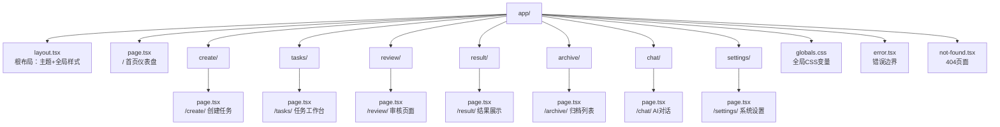
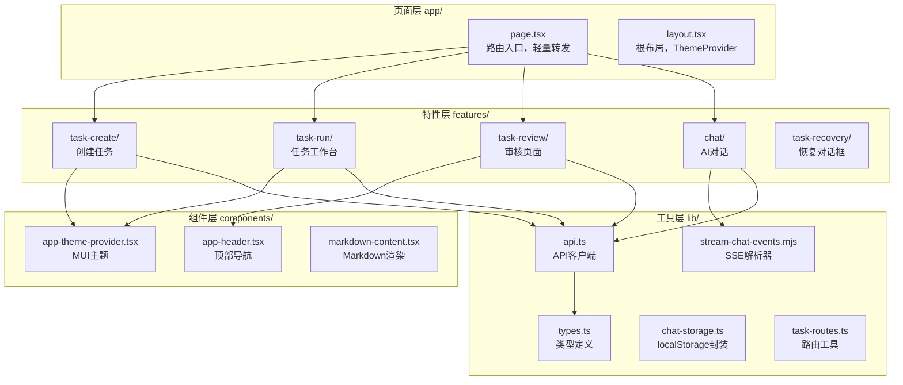
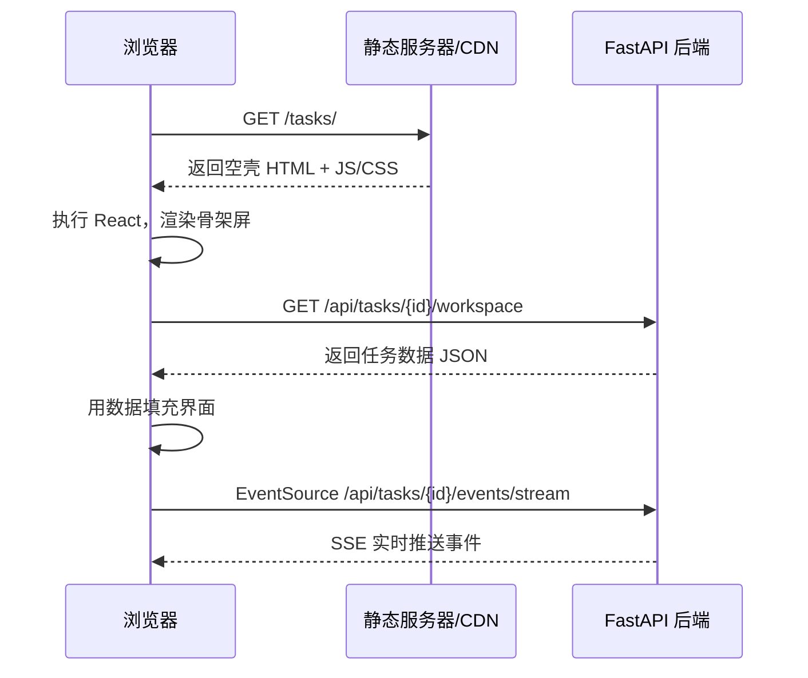
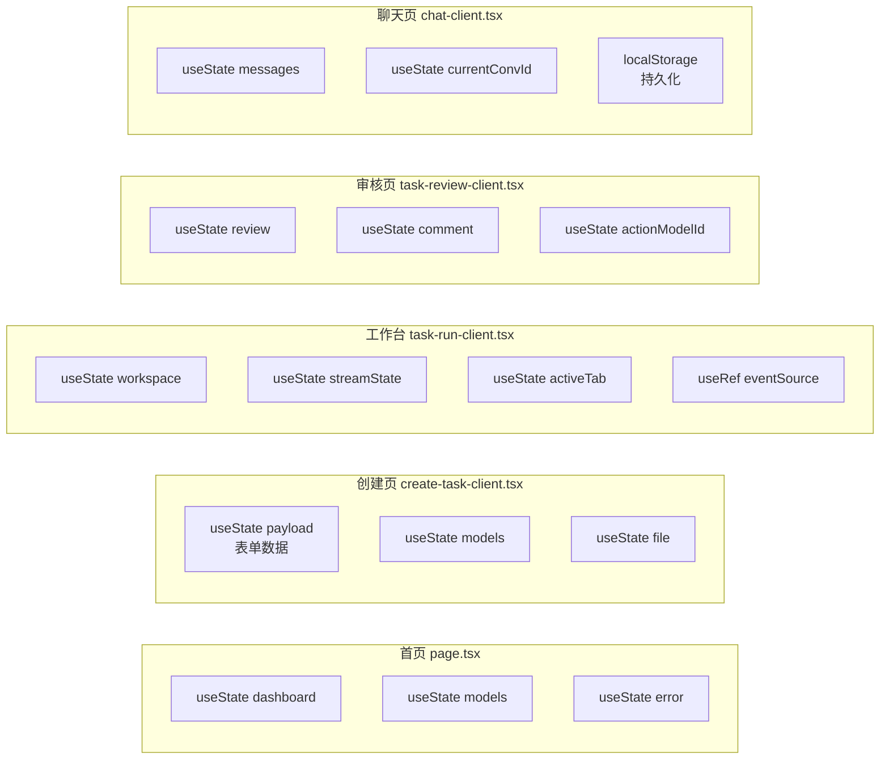
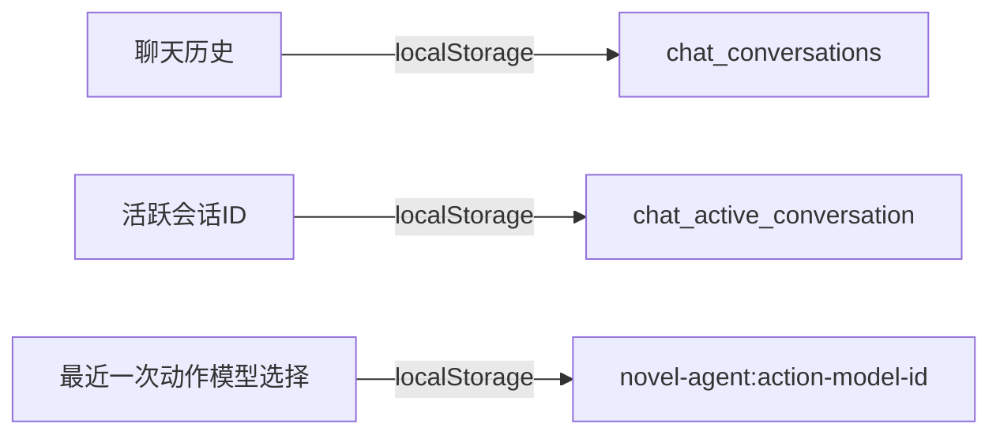
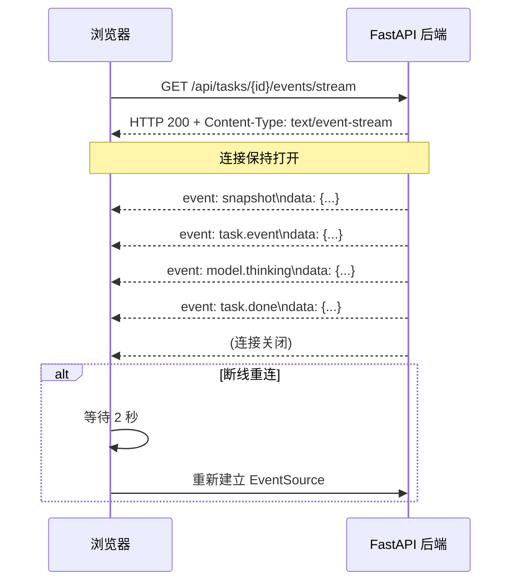
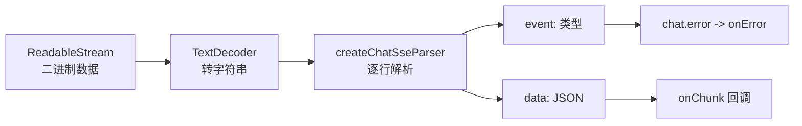
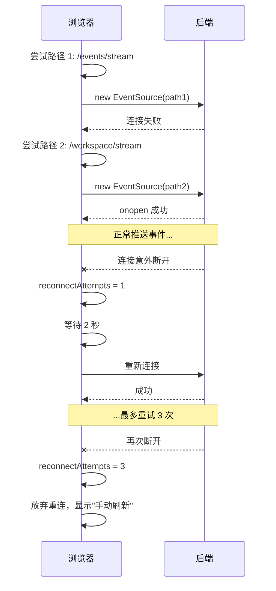
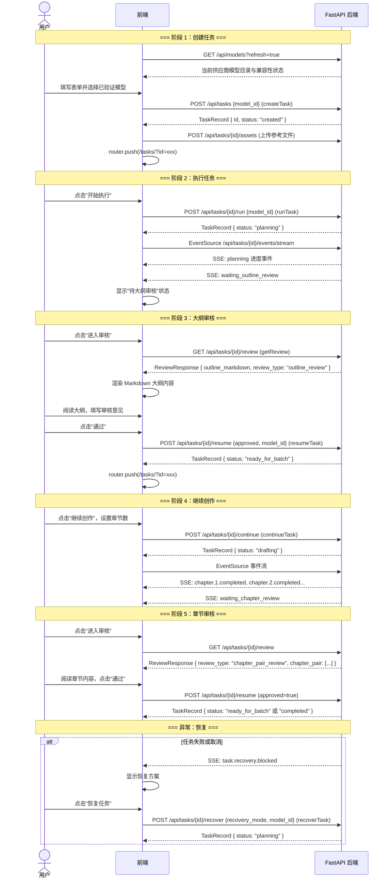

# 08 前端架构与数据流

> 目标读者：对 Web 开发零基础或仅有基础了解的大学生。
> 前置知识：HTML/CSS/JavaScript 基础、了解"网页在浏览器里打开"这件事。

---

## 1. 网页是怎么做出来的？从"静态页面"到"现代应用"

### 1.1 最朴素的网页

如果你刚学编程，可能写过这样的 HTML 文件：

```html
<!DOCTYPE html>
<html>
  <body>
    <h1>你好，世界</h1>
    <p>这是一段文字。</p>
  </body>
</html>
```

把它存成 `.html` 文件，双击用浏览器打开，你就看到了一个网页。这是**静态网页**——内容写死在文件里，谁打开都一样，不会变。

### 1.2 网页需要"动起来"

但现代网站（比如微博、B站、淘宝）显然不是静态的：

- 你发一条微博，页面上立刻多出来一条
- 视频播放时，进度条在实时走动
- 点击"加载更多"，新内容从服务器拉取并插入页面

这些"动态"效果，早期靠 JavaScript（简称 JS）在浏览器里操作 DOM（文档对象模型）来实现。但代码很快变得混乱：数据存在哪里？按钮点了之后该调哪个函数？页面状态变了怎么更新界面？

### 1.3 现代方案：React + 框架

2013 年，Facebook 开源了 **React**。它的核心思想很简单：

> **不要把网页看成静态 HTML，而要看成"数据（State）驱动界面（UI）"的函数。**
>
> `UI = f(State)`

也就是说，你只需关心"数据是什么"，React 会自动帮你算出"页面该长什么样"，并高效地更新变化的部分。

但 React 只解决"怎么画界面"，不解决"怎么组织代码""怎么路由跳转""怎么构建部署"。于是出现了**元框架**（Meta-Framework），在 React 之上封装了完整的工程化方案。目前最主流的是 **Next.js**。

---

## 2. Next.js 14 App Router 基础

### 2.1 什么是 App Router

Next.js 有两种路由模式：

| 模式 | 名称 | 核心思想 |
|------|------|----------|
| Pages Router | 旧模式（Next.js 13 之前）| 每个 `.js/.tsx` 文件自动变成一个页面路由 |
| **App Router** | **新模式（Next.js 13+）** | 用文件夹组织路由，支持更灵活的布局、加载态、错误处理 |

本项目使用 **Next.js 14 + App Router**。它的核心规则是：

> `app/文件夹/page.tsx` = 一个可访问的页面

例如：

```
app/
  page.tsx          -> 访问 /         (首页)
  create/
    page.tsx        -> 访问 /create/   (创建任务页)
  tasks/
    page.tsx        -> 访问 /tasks/    (任务工作台)
  review/
    page.tsx        -> 访问 /review/   (审核页)
```

### 2.2 App Router 路由树



### 2.3 与 Pages Router 的关键区别

| 特性 | Pages Router | App Router |
|------|-------------|------------|
| 路由文件 | `pages/index.tsx` | `app/page.tsx` |
| 布局 | 每个页面手动包 Layout | `layout.tsx` 自动包裹子路由 |
| 加载状态 | 手动实现 | `loading.tsx` 自动显示 |
| 错误处理 | 手动 try-catch | `error.tsx` 自动捕获边界错误 |
| 数据获取 | `getServerSideProps` / `getStaticProps` | 直接在组件里 `fetch`，更灵活 |

> 推荐阅读：[Next.js App Router 官方文档](https://nextjs.org/docs/app)

---

## 3. 前端架构分层

一个可维护的前端项目，代码必须有清晰的层次。本项目采用四层架构：



### 3.1 各层职责

| 层级 | 目录 | 职责 | 举例 |
|------|------|------|------|
| **页面层** | `app/` | 路由入口，只做"引入特性组件"这一件事 | `create/page.tsx` 只渲染 `<CreateTaskClient />` |
| **特性层** | `features/` | 按业务域组织的完整功能模块，包含状态、UI、交互逻辑 | `task-run/task-run-client.tsx` 包含任务工作台的全部逻辑 |
| **组件层** | `components/` | 跨特性复用的通用 UI 组件 | `app-theme-provider.tsx` 提供全局 MUI 主题 |
| **工具层** | `lib/` | 与业务无关的纯工具：API 封装、类型定义、存储、路由 | `api.ts` 封装所有 HTTP 请求 |

这种分层的好处是：**改一个功能，只需去对应的 feature 文件夹；不会牵一发而动全身。**

---

## 4. 纯客户端渲染策略（CSR）

### 4.1 三种渲染方式

现代 Web 应用有三种主要的页面渲染策略：

| 策略 | 英文缩写 | 原理 | 优点 | 缺点 |
|------|---------|------|------|------|
| 服务端渲染 | SSR | 服务器先渲染好 HTML，浏览器直接显示 | 首屏快、SEO 友好 | 服务器压力大、交互复杂 |
| 静态生成 | SSG | 构建时预渲染 HTML，部署到 CDN | 极快、成本低 | 内容不能实时变化 |
| 客户端渲染 | CSR | 浏览器下载空壳 HTML，JS 执行后渲染内容 | 交互丰富、服务器轻量 | 首屏慢、SEO 差 |

### 4.2 本项目为什么选择 CSR

打开本项目的任意一个页面文件，你会发现第一行几乎都是：

```tsx
"use client";
```

这是 Next.js 的指令，表示"这个组件只在浏览器里运行，不在服务器上渲染"。

**选择 CSR 的原因：**

1. **这是一个内部工具/Demo 系统**，不需要 SEO（搜索引擎优化）
2. **大量实时交互**：SSE 事件流、任务状态轮询、模型切换，都需要浏览器端的动态状态
3. **后端是独立 FastAPI 服务**，前端只是"壳"，所有数据都来自 API 调用
4. **部署简单**：`output: "export"` 生成纯静态文件，任何静态服务器（Nginx、GitHub Pages）都能托管



### 4.3 Next.js 配置

```js
// next.config.mjs
const nextConfig = {
  reactStrictMode: true,
  distDir: isDevelopmentServer ? ".next-dev" : ".next",
  ...(isProductionPhase ? { output: "export" } : {}),  // 生产环境静态导出
  trailingSlash: true,
  images: { unoptimized: true },  // 静态导出不支持图片优化
};
```

> 推荐阅读：[Next.js 渲染策略官方指南](https://nextjs.org/docs/app/building-your-application/rendering)

---

## 5. React 组件生命周期与 Hooks（面向零基础读者）

### 5.1 什么是"组件"

在 React 中，**组件就是一个函数**，它接收一些输入（称为 `props`），返回一段描述界面的 JSX：

```tsx
function Welcome(props: { name: string }) {
  return <h1>你好，{props.name}</h1>;
}

// 使用：<Welcome name="小明" />
```

### 5.2 组件需要"记忆"

但网页不是静态的。比如一个计数器按钮，点了之后数字要加 1。这个数字存在哪里？

React 提供了 **State（状态）**：

```tsx
"use client";
import { useState } from "react";

function Counter() {
  const [count, setCount] = useState(0);  // 创建一个状态，初始值为 0

  return (
    <button onClick={() => setCount(count + 1)}>
      点了 {count} 次
    </button>
  );
}
```

`useState` 是 React 最重要的 **Hook**（钩子）。Hooks 是 React 16.8 引入的机制，让你在不写"类组件"的情况下，使用状态、生命周期等能力。

### 5.3 最常用的 Hooks

本项目大量使用了以下 Hooks：

#### `useState` —— 组件的"记忆"

```tsx
const [dashboard, setDashboard] = useState<DashboardResponse | null>(null);
const [error, setError] = useState("");
```

- `dashboard` 是当前值，`setDashboard` 是修改它的函数
- 调用 `setDashboard(newValue)` 后，React 会自动重新渲染组件

#### `useEffect` —— 副作用处理

"副作用"指不直接产生 UI 的操作：发网络请求、订阅事件、操作 DOM、设置定时器等。

```tsx
useEffect(() => {
  // 组件挂载时执行：加载数据
  fetchDashboard();

  // 返回的函数在组件卸载时执行：清理工作
  return () => {
    console.log("组件卸载，清理资源");
  };
}, [fetchDashboard]);  // 依赖数组：只有 fetchDashboard 变化时才重新执行
```

#### `useCallback` —— 缓存函数

```tsx
const fetchDashboard = useCallback(() => {
  getDashboard().then(setDashboard).catch(setError);
}, []);  // 空依赖 = 永远不变
```

如果不包 `useCallback`，每次渲染都会创建一个新函数，可能导致子组件不必要的重渲染。

#### `useMemo` —— 缓存计算结果

```tsx
const selectedModel = useMemo(
  () => models.find((item) => item.id === payload.model_id),
  [models, payload.model_id]  // 只有这两个变的时候才重新计算
);
```

#### `useRef` —— 不触发渲染的"盒子"

```tsx
const eventSourceRef = useRef<EventSource | null>(null);
// 修改它不会触发重新渲染：eventSourceRef.current = new EventSource(url)
```

> 推荐阅读：[React Hooks 官方文档](https://react.dev/reference/react)

---

## 6. 状态管理设计：无全局状态库

### 6.1 为什么不用 Redux / Zustand

很多 React 项目使用 Redux 或 Zustand 做全局状态管理。但本项目**完全没有引入任何全局状态库**。

原因：

1. **各页面相对独立**：首页、创建页、工作台、审核页之间没有共享的复杂状态
2. **状态生命周期短**：大多数状态（如表单数据、任务列表）只在当前页面存在，离开页面就不需要了
3. **减少依赖**：少一个库，构建体积更小，学习成本更低
4. **localStorage 足够**：只有"聊天历史"和"最近一次动作模型选择"需要跨页面持久化

### 6.2 组件自治模式

每个 feature 组件自己管理自己的状态：



### 6.3 需要持久化的状态



`chat-storage.ts` 封装了完整的 localStorage 操作，包括容量保护（超过 4MB 警告）、异常处理（存储满时提示用户）。

本地保存的模型 ID 只用于预填选择，不是全局默认模型。创建、工作台、审核、恢复和聊天页面都会从 `/api/models` 读取当前供应商模型目录；保存的值不再存在于目录中时会被清空并要求重新选择。小说任务页面还会筛选 `metadata.source` 为 `gateway` 且兼容性已验证的模型。

---

## 7. API 客户端封装

### 7.1 `request()` 函数的设计

所有 HTTP 请求都经过 `lib/api.ts` 中的 `request()` 函数：

```tsx
async function request<T>(path: string, init?: RequestInit): Promise<T> {
  const url = `${API_BASE}${path}`;

  // 1. 发送请求（带 30 秒超时）
  const response = await fetch(url, {
    ...init,
    headers: { "Content-Type": "application/json", ... },
    cache: "no-store",  // 禁用浏览器缓存
    signal: AbortSignal.timeout(30000),
  });

  // 2. GET 请求失败自动重试一次
  if (!response.ok && canRetry) {
    response = await makeRequest();  // 重试
  }

  // 3. 解析错误信息
  if (!response.ok) {
    const data = await response.json();
    throw new Error(data.detail || "请求失败");
  }

  // 4. 返回 JSON 数据
  return response.json() as Promise<T>;
}
```

### 7.2 设计亮点

| 特性 | 实现 | 目的 |
|------|------|------|
| **超时控制** | `AbortSignal.timeout(30000)` | 防止请求挂死 |
| **GET 自动重试** | 失败后再请求一次 | 应对瞬时网络抖动 |
| **写操作不重试** | POST/DELETE/PATCH 失败直接抛错 | 避免重复提交 |
| **错误信息提取** | 优先取 `data.detail` | 后端 FastAPI 的错误格式 |
| **FormData 兼容** | 上传文件时自动去掉 `Content-Type` | 让浏览器自动设置 multipart 边界 |

模型请求遵循同一约束：先通过 `getModelCatalog()` 获取当前供应商目录，再把选中的 ID 随请求发送。聊天请求必须带 `model`；创建小说任务必须带已验证的 `model_id`；工作台、审核和恢复界面发送本次动作的 `model_id`。服务端在动作字段缺失时只会复用任务创建时已保存的模型，绝不会回退到全局默认模型。

### 7.3 API 函数一览

```tsx
export function createTask(payload: TaskCreatePayload) {
  return request<TaskRecord>("/api/tasks", { method: "POST", body: JSON.stringify(payload) });
}

export function getDashboard() {
  return request<DashboardResponse>("/api/dashboard");
}

export function getModelCatalog(options?: { refresh?: boolean }) {
  return request<ModelListResponse>(`/api/models${options?.refresh ? "?refresh=true" : ""}`);
}

export function runTask(taskId: string, payload?: TaskActionPayload) {
  return request<TaskRecord>(`/api/tasks/${taskId}/run`, { method: "POST", body: JSON.stringify(payload ?? {}) });
}

export function resumeTask(taskId: string, approved: boolean, comment: string, modelId?: string) {
  return request<TaskRecord>(`/api/tasks/${taskId}/resume`, {
    method: "POST",
    body: JSON.stringify(modelId && modelId.trim() ? { approved, comment, model_id: modelId.trim() } : { approved, comment }),
  });
}

export function cancelTask(taskId: string, comment?: string) {
  return request<TaskRecord>(`/api/tasks/${taskId}/cancel`, { method: "POST" });
}

export function deleteTask(taskId: string) {
  return request<{ task_id: string }>(`/api/tasks/${taskId}`, { method: "DELETE" });
}

export function getWorkspace(taskId: string) {
  return request<WorkspaceResponse>(`/api/tasks/${taskId}/workspace`);
}

export function getReview(taskId: string) {
  return request<ReviewResponse>(`/api/tasks/${taskId}/review`);
}
```

---

## 8. SSE 流式通信

### 8.1 什么是 SSE

**SSE（Server-Sent Events）** 是一种浏览器原生支持的实时通信技术。与 WebSocket 不同：

| 特性 | SSE | WebSocket |
|------|-----|-----------|
| 方向 | 服务器 -> 客户端（单向） | 双向 |
| 协议 | 基于 HTTP | 独立的 ws:// 协议 |
| 自动重连 | 浏览器原生支持 | 需手动实现 |
| 适用场景 | 服务器推送流式数据 | 实时双向通信（如游戏） |

本项目用 SSE 推送任务执行过程中的实时事件（大纲生成进度、章节完成通知、思考链片段等）。

### 8.2 SSE 工作原理



SSE 的消息格式是纯文本：

```
event: snapshot
data: {"task_id": "abc", "status": "planning"}

event: model.thinking
data: {"reasoning_chunk": "我正在分析故事结构..."}
```

### 8.3 解析器设计

`stream-chat-events.mjs` 实现了一个流式 SSE 解析器：



核心代码逻辑：

```js
export function createChatSseParser({ onChunk, onError }) {
  let buffer = "";
  let eventType = "";

  return {
    push(text) {
      buffer += text;
      const lines = buffer.split("\n");
      buffer = lines.pop() || "";  // 最后一行可能不完整，留到下次

      for (const line of lines) {
        if (line.startsWith("event:")) eventType = line.slice(6).trim();
        if (line.startsWith("data:")) {
          const data = JSON.parse(line.slice(5).trim());
          if (eventType === "chat.error") onError(data);
          else onChunk(data);
        }
      }
    },
    flush() { /* 处理缓冲区剩余内容 */ },
  };
}
```

### 8.4 断线重连机制

任务工作台（`task-run-client.tsx`）实现了完整的 SSE 连接管理：



---

## 9. 类型系统设计

### 9.1 TypeScript 是什么

**TypeScript（TS）** 是 JavaScript 的超集，增加了**静态类型检查**。简单来说：在代码运行之前，编译器就能帮你发现"把字符串当数字用""访问不存在的属性"等错误。

### 9.2 前后端契约

本项目的核心设计是：**TypeScript 类型 = 前后端 API 契约**。

```tsx
// lib/types.ts —— 前后端共享的数据结构定义

export type TaskStatus =
  | "created"
  | "sources_ingested"
  | "planning"
  | "waiting_outline_review"
  | "ready_for_batch"
  | "drafting"
  | "waiting_manual_action"
  | "assembling"
  | "completed"
  | "cancelled"
  | "failed"
  | "waiting_chapter_review"
  | "waiting_verification_review";

export interface TaskRecord {
  id: string;
  status: TaskStatus;
  current_stage: string;
  progress: number;
  input: TaskInput;
  // ...
}

export interface WorkspaceResponse {
  meta: WorkspaceMeta;
  recent_events: WorkspaceEvent[];
  novel_progress?: { /* ... */ };
}
```

API 函数利用泛型 `<T>` 把类型和请求绑定：

```tsx
// 这里 T 被替换为 WorkspaceResponse
// 如果后端返回的 JSON 不符合 WorkspaceResponse 的形状，TypeScript 会报错
const workspace = await getWorkspace(taskId);
// workspace 的类型自动推断为 WorkspaceResponse
console.log(workspace.meta.status);  // 安全的，编译器知道 meta 里有 status
```

### 9.3 类型守卫与防御性编程

```tsx
// normalizeModelOptions：防御性处理后端可能返回的异常数据
export function normalizeModelOptions(models: ModelOption[]) {
  return models
    .filter((item) => typeof item?.id === "string" && item.id.trim())  // 过滤无效项
    .map((item) => ({
      ...item,
      id: item.id.trim(),
      // 确保 display_name 是有效字符串，否则设为 undefined
      display_name: typeof item.display_name === "string" && item.display_name.trim()
        ? item.display_name.trim()
        : undefined,
    }));
}
```

> 推荐阅读：[TypeScript 官方文档](https://www.typescriptlang.org/docs/)

---

## 10. UI 设计系统

### 10.1 Material-UI (MUI) v5

本项目使用 **MUI v5** 作为 UI 组件库。MUI 提供了一套现成的 React 组件（按钮、卡片、表单、对话框等），并支持通过 **Theme** 统一定制外观。

### 10.2 暖色调国风主题

```tsx
// components/app-theme-provider.tsx

const theme = createTheme({
  palette: {
    primary: { main: "#276451" },      // 墨绿
    secondary: { main: "#9a5f2f" },    // 赭石
    background: {
      default: "#efe4cf",              // 米黄
      paper: "#fffaf2",                // 纸张白
    },
    text: { primary: "#1d2a27" },      // 墨色
  },
  typography: {
    fontFamily: "var(--font-sans-sc)",
    h1: { fontFamily: "var(--font-serif-sc)" },  // 标题用宋体
    // ...
  },
  shape: { borderRadius: 12 },
});
```

### 10.3 玻璃态卡片

```css
/* globals.css */
.glass-card {
  background: rgba(255, 250, 242, 0.65);
  backdrop-filter: blur(12px) saturate(1.2);
  border: 1px solid rgba(255, 255, 255, 0.45);
  box-shadow: 0 8px 32px rgba(88, 69, 37, 0.12);
  border-radius: 16px;
}
```

`backdrop-filter: blur()` 是 CSS 的现代特性，让元素背后的内容产生模糊效果，像毛玻璃一样。步骤指示器就使用了这种效果。

### 10.4 全局渐变背景

```css
body {
  background:
    radial-gradient(circle at top left, rgba(226, 195, 136, 0.35), transparent 32%),
    linear-gradient(180deg, #f7efe2 0%, #efe4cf 52%, #e2d3bb 100%);
}
```

两层背景叠加：左上角的光晕 + 从上到下的暖色渐变，营造出"宣纸"般的质感。

> 推荐阅读：[MUI 官方文档](https://mui.com/material-ui/getting-started/)

---

## 11. 前后端交互流程：完整前端视角

### 11.1 创建 -> 执行 -> 审核 -> 恢复的完整流程



### 11.2 状态流转与前端路由映射

| 任务状态 | 前端展示 | 用户可执行操作 |
|---------|---------|--------------|
| `created` | 步骤指示器：创建 | 点击"开始执行" |
| `planning` | 步骤指示器：运行（转圈中） | 等待 / 取消 |
| `waiting_outline_review` | 步骤指示器：审核（高亮） | 点击"进入审核" |
| `ready_for_batch` | 步骤指示器：运行（可继续） | 点击"继续创作" |
| `drafting` | 步骤指示器：运行（正文生成中） | 等待 / 取消 |
| `waiting_chapter_review` | 步骤指示器：审核 | 点击"进入审核" |
| `completed` | 步骤指示器：结果 | 点击"查看结果" |
| `failed` / `cancelled` | 显示错误/恢复方案 | 恢复或删除 |

---

## 12. 组件依赖关系图

以"任务工作台"为例，展示组件间的依赖关系：

```mermaid
graph TD
    subgraph TaskRunPage["/tasks/ page.tsx"]
        TRP[TaskRunClient]
    end

    subgraph TaskRunClient["task-run-client.tsx"]
        A[useState workspace]
        B[useState streamState]
        C[useState activeTab]
        D[useRef eventSource]
        E[useEffect SSE连接]
        F[handleRun]
        G[handleContinueDraft]
        H[handleCancelTask]
        I[StepIndicator组件]
        J[RecoveryDialog组件]
    end

    subgraph API["lib/api.ts"]
        API1[getWorkspace]
        API2[runTask]
        API3[continueTask]
        API4[cancelTask]
        API5[getModelCatalog]
    end

    subgraph Types["lib/types.ts"]
        T1[WorkspaceResponse]
        T2[TaskStatus]
        T3[ModelOption]
    end

    subgraph MUI["@mui/material"]
        M1[Card]
        M2[Button]
        M3[Tabs]
        M4[LinearProgress]
        M5[Alert]
    end

    TRP --> TaskRunClient
    A -.->|类型| T1
    B -.->|类型| T2
    F --> API2
    G --> API3
    H --> API4
    E -->|EventSource| D
    I --> M1
    I --> M4
    J --> M2
    TaskRunClient --> M1
    TaskRunClient --> M2
    TaskRunClient --> M3
    TaskRunClient --> M5
```



---

## 13. 总结：关键设计决策一览

| 决策 | 选择 | 理由 |
|------|------|------|
| 框架 | Next.js 14 App Router | 现代路由、静态导出、工程化完善 |
| 渲染策略 | 纯 CSR (`"use client"`) | 内部工具无需 SEO，交互复杂 |
| UI 库 | MUI v5 + Emotion | 成熟稳定、主题定制能力强 |
| 状态管理 | 无全局库，组件自治 + localStorage | 减少依赖、状态生命周期短 |
| API 通信 | 原生 fetch + 自定义 request() | 轻量、完全可控 |
| 实时通信 | SSE (EventSource) | 单向推送足够、浏览器原生支持 |
| 类型系统 | TypeScript 严格模式 | 编译期保证前后端契约 |
| 部署方式 | 静态导出 (`output: "export"`) | 任何静态服务器即可托管 |

---

## 14. 实现详解（源码级剖析）

> 本章面向想深入代码的读者，逐行讲解核心模块的真实实现。比喻：前面章节是"菜谱"，这一章是"进后厨看师傅怎么切菜"。

---

### 14.1 `api.ts`：`request()` 函数的完整实现

`lib/api.ts` 是所有 HTTP 请求的"总闸"。下面展示 `request()` 函数的完整源码，并逐行注释：

```ts
// 从环境变量读取后端地址，若未设置则默认连本地 8000 端口
const API_BASE = process.env.NEXT_PUBLIC_API_BASE_URL ?? "http://127.0.0.1:8000";

async function request<T>(path: string, init?: RequestInit): Promise<T> {
  // 1. URL 拼接：把相对路径拼成完整地址
  const url = `${API_BASE}${path}`;

  // 2. 定义一个"制造请求"的内部函数，方便后面重试时复用
  const makeRequest = async (): Promise<Response> => {
    const response = await fetch(url, {
      ...init,                          // 把调用者传进来的配置展开
      headers: {
        // 3. 智能 Content-Type：如果上传文件（FormData），就不设置 Content-Type，
        //    让浏览器自动填 multipart 边界；否则默认 JSON
        ...(init?.body instanceof FormData ? {} : { "Content-Type": "application/json" }),
        ...(init?.headers ?? {}),       // 调用者自定义的头部优先
      },
      cache: "no-store",                // 4. 禁用浏览器缓存，保证拿到最新数据
      signal: AbortSignal.timeout(30000), // 5. 30 秒超时：超过就自动取消请求
    });
    return response;
  };

  // 6. 判断请求方法，GET 请求失败才允许重试；POST/DELETE/PATCH 等写操作不重试
  const method = (init?.method ?? "GET").toUpperCase();
  const canRetry = method === "GET";

  let response: Response;
  try {
    response = await makeRequest();     // 7. 第一次发送请求
  } catch (err) {
    // 8. 网络层失败（如断网、超时）
    if (canRetry) {
      console.warn(`请求失败，准备重试: ${url}`, ...);
      try {
        response = await makeRequest(); // GET 请求：再试一次
      } catch (retryErr) {
        console.error(`请求重试后仍失败: ${url}`, ...);
        throw new Error("请求失败");     // 重试仍失败，抛出错误
      }
    } else {
      console.error(`请求失败（写操作不重试）: ${url}`, ...);
      throw new Error("请求失败");       // 写操作直接失败，避免重复提交
    }
  }

  // 9. HTTP 状态码不是 2xx 时，解析后端返回的错误信息
  if (!response.ok) {
    let errorMessage = "请求失败";
    try {
      const data = await response.json();
      // FastAPI 的错误格式通常是 { detail: "..." }
      errorMessage = typeof data?.detail === "string" ? data.detail : JSON.stringify(data);
    } catch {
      // 如果返回的不是 JSON，就截取前 500 字符的纯文本
      const text = await response.text();
      errorMessage = text ? text.slice(0, 500) : `HTTP ${response.status}`;
    }
    throw new Error(errorMessage);      // 把后端错误抛给调用者
  }

  // 10. 一切正常，把 JSON 解析成调用者期望的类型 T
  return response.json() as Promise<T>;
}
```

**设计要点比喻**：

- **超时控制**（`AbortSignal.timeout`）：像外卖平台给骑手设倒计时，超时就自动取消订单。
- **GET 自动重试**：像打电话没打通，再拨一次；但写操作（POST）像转账，绝不能自动重拨，否则可能转两笔钱。
- **FormData 兼容**：像寄快递，普通信件自己写地址；但文件包裹要让快递公司贴专用标签。

---

### 14.2 `stream-chat-events.mjs`：SSE 流式解析器

SSE（Server-Sent Events）的消息是纯文本，格式如下：

```
event: snapshot
data: {"task_id": "abc", "status": "planning"}

event: model.thinking
data: {"reasoning_chunk": "我正在分析故事结构..."}
```

`stream-chat-events.mjs` 负责把这一长串文本"切分"成结构化事件：

```js
export function createChatSseParser({ onChunk, onError }) {
  let buffer = "";      // 1. 缓冲区：存还没处理完的半行文本
  let eventType = "";   // 2. 当前事件类型（如 snapshot、model.thinking）
  let stopped = false;  // 3. 是否已遇到错误，停止解析

  // 4. 处理一行 data: 后面的 JSON 内容
  const handleData = (jsonStr) => {
    let data;
    try {
      data = JSON.parse(jsonStr);   // 把 JSON 字符串转成对象
    } catch {
      return;                       // 解析失败就跳过这一行
    }

    // 5. 如果事件类型是 chat.error，或者数据里有 error 字段，触发错误回调
    if (eventType === "chat.error" || data?.error) {
      onError(extractErrorMessage(data));
      stopped = true;               // 标记停止，后续数据不再处理
      return;
    }

    // 6. 正常数据：只要有内容、推理片段、完成原因或用量统计，都推给 onChunk
    if (data.content !== undefined || data.reasoning_content !== undefined) {
      onChunk(data);
    }
    if (data.finish_reason) onChunk(data);
    if (data.usage) onChunk(data);
  };

  // 7. 处理单行文本：识别 event: 和 data: 前缀
  const processLine = (line) => {
    const trimmed = line.trim();
    if (!trimmed) {
      eventType = "";               // 空行表示一个事件结束，重置事件类型
      return;
    }
    if (trimmed.startsWith("event:")) {
      eventType = trimmed.slice(6).trim();  // 提取 event: 后面的类型名
      return;
    }
    if (trimmed.startsWith("data:")) {
      handleData(trimmed.slice(5).trim());  // 提取 data: 后面的 JSON
    }
  };

  return {
    // 8. push：接收从网络流中读到的文本块（可能只包含半行）
    push(text) {
      if (stopped) return false;    // 已出错就不再处理
      buffer += text;               // 把新文本追加到缓冲区
      const lines = buffer.split("\n");
      buffer = lines.pop() || "";   // 最后一行可能不完整，留到下次
      for (const line of lines) {
        processLine(line);
        if (stopped) return false;
      }
      return true;                  // 返回 true 表示继续读取
    },
    // 9. flush：流结束时处理缓冲区里剩余的内容
    flush() {
      if (stopped || !buffer.trim()) return !stopped;
      processLine(buffer);
      buffer = "";
      return !stopped;
    },
    get stopped() {
      return stopped;
    },
  };
}
```

**核心逻辑比喻**：SSE 解析器就像一个"分拣员"，传送带（网络流）上送来一堆混在一起的标签和包裹，分拣员负责：

1. 看到 `event:` 标签，记下来这是什么类型的包裹；
2. 看到 `data:` 标签，拆开 JSON，按类型送到对应的处理窗口；
3. 如果包裹还没送完（行没结束），先暂存在缓冲区，等下一批到了再拼起来。

---

### 14.3 `task-run-client.tsx`：核心 Hooks 与 SSE 连接管理

任务工作台是前端最复杂的页面之一。下面拆解它的核心状态管理和 SSE 连接逻辑。

#### 14.3.1 状态声明：一个组件的"记忆清单"

```tsx
export default function TaskRunClient({ taskId }: { taskId?: string }) {
  const router = useRouter();
  const searchParams = useSearchParams();
  const resolvedTaskId = taskId || searchParams.get("id") || "";

  // 1. 核心数据状态
  const [workspace, setWorkspace] = useState<WorkspaceResponse | null>(null);
  const [running, setRunning] = useState(false);       // 是否正在提交动作（防重复点击）
  const [loading, setLoading] = useState(true);        // 初始加载中
  const [error, setError] = useState("");              // 错误提示
  const [streamState, setStreamState] = useState("未连接事件流"); // SSE 连接状态文字
  const [activeTab, setActiveTab] = useState(0);       // 当前激活的 Tab

  // 2. 弹窗与展开状态
  const [chapterDialogOpen, setChapterDialogOpen] = useState(false);
  const [expandedThinking, setExpandedThinking] = useState<Record<string, boolean>>({});

  // 3. 当前供应商模型目录与本次动作模型选择
  const [models, setModels] = useState<ModelOption[]>([]);
  const [actionModelId, setActionModelId] = useState("");

  // 4. 恢复对话框状态
  const [recoveryDialogOpen, setRecoveryDialogOpen] = useState(false);
  const [selectedRecoveryAction, setSelectedRecoveryAction] = useState<RecoveryMode>("recover_to_stable");

  // 5. Refs：不触发渲染的"暗盒"，存实时变化的值供异步逻辑读取
  const eventSourceRef = useRef<EventSource | null>(null);   // 当前 SSE 连接对象
  const continueRequestIdRef = useRef<string | null>(null);   // 继续创作的请求 ID（防重）
  const currentActionModelIdRef = useRef("");                // 当前动作模型 ID（供闭包读取）
```

#### 14.3.2 加载工作台数据

```tsx
  // 6. 封装加载工作台的逻辑，用 useCallback 缓存函数引用
  const refreshWorkspace = useCallback(async () => {
    if (!resolvedTaskId) {
      setError("缺少任务 ID");
      setWorkspace(null);
      setLoading(false);
      return;
    }
    setLoading(true);
    try {
      const nextWorkspace = await getWorkspace(resolvedTaskId);  // 调 API
      setWorkspace(nextWorkspace);                                 // 更新状态
      setError("");
    } catch (refreshError) {
      setError(refreshError instanceof Error ? refreshError.message : "读取工作台失败");
    } finally {
      setLoading(false);
    }
  }, [resolvedTaskId]);  // 只有 taskId 变时才重新创建函数

  // 7. 组件挂载时自动加载数据
  useEffect(() => {
    void refreshWorkspace();
  }, [refreshWorkspace]);
```

#### 14.3.3 SSE 连接与断线重连（核心）

```tsx
  useEffect(() => {
    if (!resolvedTaskId) {
      setStreamState("缺少任务 ID，无法连接事件流");
      return;
    }

    let disposed = false;           // 8. 标记组件是否已卸载
    let source: EventSource | null = null;
    let refreshTimeout: ReturnType<typeof setTimeout> | null = null;
    let reconnectTimeout: ReturnType<typeof setTimeout> | null = null;

    // 9. 候选路径列表：后端可能有多个 SSE 端点，逐个尝试
    const candidatePaths = [
      `/api/tasks/${resolvedTaskId}/events/stream`,
      `/api/tasks/${resolvedTaskId}/workspace/stream`,
      `/api/tasks/${resolvedTaskId}/workspace/events`,
      `/api/tasks/${resolvedTaskId}/sse`,
    ];
    let reconnectAttempts = 0;
    const MAX_RECONNECT = 3;        // 最多重连 3 次
    const RECONNECT_DELAY = 2000;   // 每次等待 2 秒

    // 10. 递归尝试连接：先试路径 0，失败再试路径 1...
    const tryConnect = (index: number) => {
      if (disposed || index >= candidatePaths.length) {
        setStreamState("事件流未就绪，当前使用手动刷新");
        return;
      }

      const target = `${getApiBase()}${candidatePaths[index]}`;
      setStreamState(`正在连接 ${candidatePaths[index]}`);
      source = new EventSource(target);   // 11. 建立 SSE 连接
      eventSourceRef.current = source;

      let opened = false;               // 标记是否成功打开过

      source.onopen = () => {
        opened = true;
        reconnectAttempts = 0;          // 成功后重置重连计数
        setStreamState("事件流已连接");
      };

      // 12. 收到特定事件后，延迟 3 秒刷新工作台（防抖，避免频繁请求）
      const handleRefresh = () => {
        if (refreshTimeout) return;
        refreshTimeout = setTimeout(() => {
          refreshTimeout = null;
        }, 3000);
        void refreshWorkspace();
      };
      source.addEventListener("snapshot", handleRefresh);
      source.addEventListener("task.event", handleRefresh);
      source.addEventListener("task.done", handleRefresh);

      // 13. 错误处理：区分"从未打开"和"中途断开"
      source.onerror = () => {
        source?.close();
        if (disposed) return;           // 组件已卸载，不做任何处理

        if (!opened) {
          // 13a. 从未成功打开：尝试下一个候选路径
          tryConnect(index + 1);
          return;
        }

        // 13b. 中途断开：进入重连逻辑
        if (reconnectAttempts < MAX_RECONNECT) {
          reconnectAttempts += 1;
          setStreamState(`事件流已断开，${RECONNECT_DELAY / 1000}秒后第${reconnectAttempts}次重连...`);
          reconnectTimeout = setTimeout(() => {
            reconnectTimeout = null;
            if (!disposed) tryConnect(0);  // 从路径 0 重新开始
          }, RECONNECT_DELAY);
          return;
        }

        // 13c. 超过最大重连次数，放弃
        setStreamState("事件流已断开，当前使用手动刷新");
      };
    };

    tryConnect(0);

    // 14. 清理函数：组件卸载或 taskId 变化时关闭连接
    return () => {
      disposed = true;
      if (refreshTimeout) clearTimeout(refreshTimeout);
      if (reconnectTimeout) clearTimeout(reconnectTimeout);
      source?.close();
      eventSourceRef.current = null;
    };
  }, [resolvedTaskId, refreshWorkspace]);
```

**重连逻辑比喻**：SSE 连接像打电话听直播：

- 你先拨第一个号码（`/events/stream`），不通就换第二个（`/workspace/stream`）；
- 接通了，开始听；突然断线，等 2 秒重拨，最多重拨 3 次；
- 3 次都不通，就放弃，告诉用户"请手动刷新"。

---

### 14.4 `task-review-client.tsx`：审核交互的三种形态

审核页根据 `review_type` 渲染三种不同的审核界面：大纲审核、章节审核、验证审核。它们共享同一个"审核操作区"组件。

#### 14.4.1 主组件状态与数据加载

```tsx
export default function TaskReviewClient({ taskId }: { taskId?: string }) {
  const router = useRouter();
  const searchParams = useSearchParams();
  const resolvedTaskId = taskId || searchParams.get("id") || "";

  const [review, setReview] = useState<ReviewResponse | null>(null);
  const [outlineMarkdown, setOutlineMarkdown] = useState("");
  const [comment, setComment] = useState("");            // 用户填写的审核意见
  const [submitting, setSubmitting] = useState(false);   // 提交中防重复
  const [loading, setLoading] = useState(true);
  const [error, setError] = useState("");
  const [models, setModels] = useState<ModelOption[]>([]);
  const [actionModelId, setActionModelId] = useState("");

  // 15. 加载审核数据：先 GET /api/tasks/{id}/review
  const loadReview = useCallback(async () => {
    if (!resolvedTaskId) { setError("缺少任务 ID"); return; }
    setLoading(true);
    try {
      const nextReview = await getReview(resolvedTaskId);
      setReview(nextReview);
      setOutlineMarkdown(nextReview.outline_markdown ?? "");

      // 16. 如果 outline_markdown 为空但有引用地址，再 fetch 文本内容
      if (!nextReview.outline_markdown && nextReview.outline_md_ref) {
        const markdown = await fetchTextRef(nextReview.outline_md_ref);
        setOutlineMarkdown(markdown);
      }
    } catch (reason) {
      setError(reason instanceof Error ? reason.message : "读取审核信息失败");
    } finally {
      setLoading(false);
    }
  }, [resolvedTaskId]);
```

#### 14.4.2 审核决策处理

```tsx
  // 17. 用户点击"通过"或"驳回"后调用
  async function handleDecision(approved: boolean) {
    if (!hasValidActionModel) {
      setError("任务创作模型当前不可用，请先手动选择本次执行模型。");
      return;
    }
    try {
      setSubmitting(true);
      // 18. 调用 resumeTask，把审核结果、意见、选用的模型一起发给后端
      const nextTask = await resumeTask(resolvedTaskId, approved, comment, resolvedActionModelId || undefined);
      setError("");

      // 19. 根据返回的任务状态，决定跳转到哪个页面
      if (nextTask.status === "completed") {
        router.push(resultHref(resolvedTaskId));           // 完成 -> 结果页
      } else if (approved && nextTask.status === "ready_for_batch") {
        router.push(workspaceHref(resolvedTaskId));        // 通过且可继续 -> 工作台
      } else if (["waiting_outline_review", "waiting_chapter_review", "waiting_verification_review"].includes(nextTask.status)) {
        await loadReview();                                 // 仍在审核状态 -> 刷新当前页
        router.refresh();
      } else {
        router.push(workspaceHref(resolvedTaskId));        // 其他情况 -> 工作台
      }
    } catch (submitError) {
      setError(submitError instanceof Error ? submitError.message : "提交审核失败");
    } finally {
      setSubmitting(false);
    }
  }
```

#### 14.4.3 三种审核界面的条件渲染

```tsx
  // 20. 根据 review_type 渲染对应的审核组件
  const reviewType = review.review_type || "outline_review";

  return (
    <Container maxWidth="md">
      {/* 步骤指示器 */}
      <StepIndicator steps={steps} activeStep={activeStep} />

      {/* 21. 大纲审核：展示 Markdown 大纲 + 通过/驳回 */}
      {reviewType === "outline_review" && (
        <OutlineReview
          review={review}
          outlineMarkdown={outlineMarkdown}
          comment={comment}
          setComment={setComment}
          submitting={submitting}
          onDecision={handleDecision}
          ...
        />
      )}

      {/* 22. 章节审核：展示章节对 + 通过/驳回 */}
      {reviewType === "chapter_pair_review" && (
        <ChapterPairReview
          review={review}
          comment={comment}
          setComment={setComment}
          submitting={submitting}
          onDecision={handleDecision}
          ...
        />
      )}

      {/* 23. 验证审核：展示验证报告 + 评分 + 通过/驳回 */}
      {reviewType === "verification_review" && (
        <VerificationReview
          review={review}
          comment={comment}
          setComment={setComment}
          submitting={submitting}
          onDecision={handleDecision}
          ...
        />
      )}
    </Container>
  );
```

**审核交互比喻**：审核页像一个"试卷批改系统"：

- 大纲审核 = 看作文提纲，决定"可以动笔"还是"重写提纲"；
- 章节审核 = 看正文段落，决定"继续写下一章"还是"修改本章"；
- 验证审核 = 看全文检查报告，决定"定稿"还是"再改一遍"。

每种试卷的题型不同，但"打分"和"写评语"的操作区是一样的。

---

### 14.5 Next.js App Router 中 `"use client"` 的实际使用场景

在本项目中，几乎所有交互页面都使用了 `"use client"`。下面解释为什么需要它，以及实际出现在哪里。

#### 14.5.1 为什么需要 `"use client"`

Next.js App Router 默认在**服务端**渲染组件（SSR）。但以下 API 只能在**浏览器**里运行：

- `window`、`document`、`localStorage`
- `fetch`（某些特殊用法）
- `EventSource`（SSE）
- React Hooks：`useState`、`useEffect`、`useRef` 等
- 浏览器事件：`addEventListener`

如果一个组件或它的任何子组件用了以上 API，就必须在文件顶部加 `"use client"`，告诉 Next.js："这个组件只在浏览器里运行，别在服务器上渲染。"

#### 14.5.2 实际使用场景举例

```tsx
// task-run-client.tsx —— 第一行就是 "use client"
"use client";

import { useState, useEffect, useRef } from "react";
import { useRouter, useSearchParams } from "next/navigation";

export default function TaskRunClient({ taskId }: { taskId?: string }) {
  const searchParams = useSearchParams();   // 读取 URL 查询参数（浏览器 API）
  const [workspace, setWorkspace] = useState(null);  // useState 只能在客户端运行
  const eventSourceRef = useRef(null);      // 存储 EventSource 实例

  useEffect(() => {
    // 24. 组件挂载后建立 SSE 连接：EventSource 是浏览器原生 API
    const source = new EventSource(`/api/tasks/${taskId}/events/stream`);
    source.onmessage = (event) => { ... };

    // 25. 读取 localStorage 中保存的最近一次动作模型，用于预填；随后按当前 /api/models 目录校验
    const savedModelId = localStorage.getItem("novel-agent:action-model-id");

    return () => source.close();            // 卸载时关闭连接
  }, [taskId]);
}
```

```tsx
// app-theme-provider.tsx —— 也需要 "use client"
"use client";

import { ThemeProvider, createTheme } from "@mui/material";
// ThemeProvider 内部使用了 React Context 和 useState，必须在客户端运行
```

```tsx
// layout.tsx —— 不需要 "use client"（服务端组件）
export default function RootLayout({ children }: { children: React.ReactNode }) {
  return (
    <html lang="zh-CN">
      <body>
        <AppThemeProvider>   {/* 但子组件 ThemeProvider 需要 "use client" */}
          {children}
        </AppThemeProvider>
      </body>
    </html>
  );
}
```

**关键理解**：`layout.tsx` 本身不需要 `"use client"`，因为它只是"搭架子"；但架子里面放的"家具"（如 `AppThemeProvider`、`TaskRunClient`）如果用了浏览器 API，就必须各自声明 `"use client"`。

---

### 14.6 MUI 主题配置的代码片段

全局主题在 `components/app-theme-provider.tsx` 中定义，完整配置如下：

```tsx
"use client";

import { CssBaseline, ThemeProvider, createTheme } from "@mui/material";

const theme = createTheme({
  palette: {
    mode: "light",
    primary: {
      main: "#276451",      // 26. 墨绿：主按钮、链接、激活状态
      light: "#3a8a70",     // 浅墨绿：悬停高亮
      dark: "#1d4d3d",      // 深墨绿：按下状态
    },
    secondary: {
      main: "#9a5f2f",      // 27. 赭石：次要按钮、标签
      light: "#b87a48",
    },
    background: {
      default: "#efe4cf",   // 28. 米黄：页面底色，像宣纸
      paper: "#fffaf2",     // 29. 纸张白：卡片、对话框底色
    },
    text: {
      primary: "#1d2a27",   // 30. 墨色：主要文字
      secondary: "rgba(29, 42, 39, 0.72)",  // 次要文字（带透明度）
    },
    success: { main: "#2e7d5b", light: "#e8f5ee" },
    warning: { main: "#c47a2a", light: "#fef3e6" },
    error:   { main: "#b44a3f", light: "#fce8e6" },
    info:    { main: "#4a7a8a", light: "#e6f0f3" },
  },
  shape: {
    borderRadius: 12,       // 31. 全局圆角：所有组件默认 12px 圆角
  },
  shadows: [
    "none",
    "0 2px 8px rgba(88,69,37,0.12)",    // 32. 阴影层级 1：小阴影
    "0 4px 20px rgba(88,69,37,0.10)",   // 阴影层级 2：卡片默认
    "0 8px 32px rgba(88,69,37,0.12)",   // 阴影层级 3：悬停增强
    "0 16px 48px rgba(88,69,37,0.15)",  // 阴影层级 4：对话框
    ...Array(20).fill("0 16px 48px rgba(88,69,37,0.15)")  // 其余层级复用
  ],
  typography: {
    fontFamily: "var(--font-sans-sc)",    // 33. 正文用无衬线字体（如思源黑体）
    h1: { fontFamily: "var(--font-serif-sc)" },  // 34. 标题用衬线字体（如思源宋体）
    h2: { fontFamily: "var(--font-serif-sc)" },
    h3: { fontFamily: "var(--font-serif-sc)" },
    h4: { fontFamily: "var(--font-serif-sc)" },
    h5: { fontFamily: "var(--font-serif-sc)" },
    h6: { fontFamily: "var(--font-serif-sc)" },
  },
  components: {
    // 35. 全局覆盖 MuiCard 的默认样式
    MuiCard: {
      styleOverrides: {
        root: {
          border: "1px solid rgba(29, 42, 39, 0.08)",
          boxShadow: "0 4px 20px rgba(88,69,37,0.10)",
          borderRadius: 16,
          padding: 24,
          transition: "all 0.25s cubic-bezier(0.4, 0, 0.2, 1)",  // 平滑过渡动画
        },
      },
    },
    // 36. 全局覆盖 MuiButton 的默认样式
    MuiButton: {
      styleOverrides: {
        root: {
          borderRadius: 12,
          textTransform: "none",    // 取消大写转换（MUI 默认会把按钮文字全大写）
          paddingInline: 20,
          paddingBlock: 10,
          fontWeight: 500,
          transition: "all 0.2s cubic-bezier(0.4, 0, 0.2, 1)",
        },
        contained: {
          boxShadow: "0 2px 8px rgba(88,69,37,0.18)",
          "&:hover": { boxShadow: "0 4px 16px rgba(88,69,37,0.22)" },
          "&:active": { boxShadow: "0 1px 4px rgba(88,69,37,0.15)" },
        },
        outlined: {
          borderColor: "rgba(29, 42, 39, 0.18)",
          "&:hover": {
            borderColor: "#276451",
            backgroundColor: "rgba(39, 100, 81, 0.05)",
          },
        },
      },
    },
    // 37. 其他组件的微调...
    MuiChip: {
      styleOverrides: {
        root: { borderRadius: 8, fontWeight: 500 },
      },
    },
    MuiTextField: {
      styleOverrides: {
        root: {
          "& .MuiOutlinedInput-root": { borderRadius: 12 },
        },
      },
    },
    MuiDialog: {
      styleOverrides: {
        paper: {
          borderRadius: 16,
          boxShadow: "0 16px 48px rgba(88,69,37,0.15)",
        },
      },
    },
    MuiTab: {
      styleOverrides: {
        root: {
          textTransform: "none",
          fontWeight: 500,
          "&.Mui-selected": { color: "primary.main", fontWeight: 600 },
        },
      },
    },
  },
});

export function AppThemeProvider({ children }: { children: React.ReactNode }) {
  return (
    <ThemeProvider theme={theme}>
      <CssBaseline />       {/* 38. 注入 MUI 的 CSS 重置样式，统一浏览器默认表现 */}
      {children}
    </ThemeProvider>
  );
}
```

**主题设计比喻**：MUI 主题就像一家连锁餐厅的"品牌手册"：

- `palette` = 配色方案：墨绿是品牌主色，米黄是墙面色；
- `shape.borderRadius` = 装修风格：所有桌角都是圆角；
- `shadows` = 灯光层次：卡片浮起时的阴影深浅；
- `typography` = 字体规范：标题用宋体（衬线），正文用黑体（无衬线）；
- `components` = 各家具的定制：椅子、桌子、按钮都有统一的圆角和 hover 效果。

---

## 参考资源

- [Next.js 官方文档](https://nextjs.org/docs)
- [React 官方文档](https://react.dev)
- [React Hooks 深入指南](https://react.dev/reference/react)
- [Material-UI v5 文档](https://mui.com/material-ui/getting-started/)
- [TypeScript 官方文档](https://www.typescriptlang.org/docs/)
- [MDN: Server-Sent Events](https://developer.mozilla.org/zh-CN/docs/Web/API/Server-sent_events)
- [MDN: Fetch API](https://developer.mozilla.org/zh-CN/docs/Web/API/Fetch_API)
- [CSS backdrop-filter](https://developer.mozilla.org/zh-CN/docs/Web/CSS/backdrop-filter)
