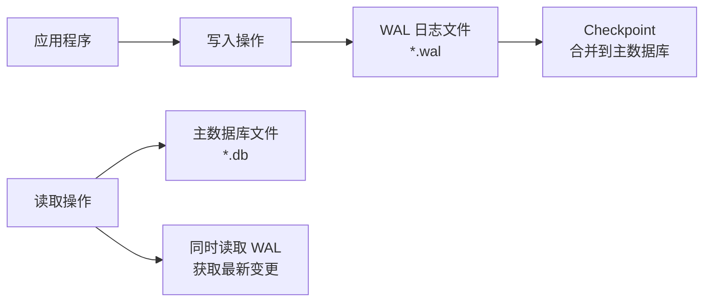
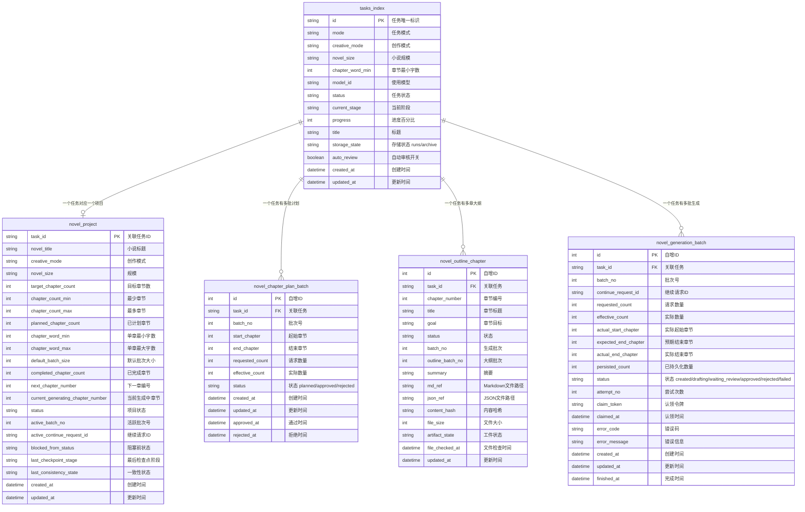
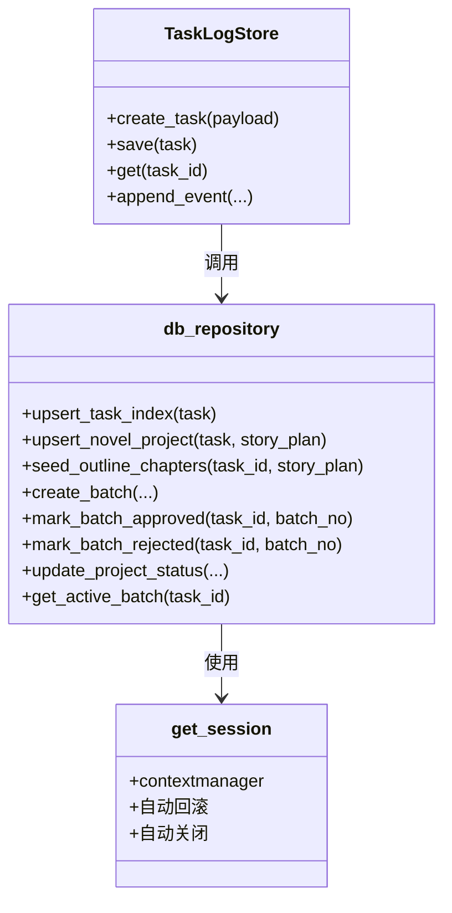
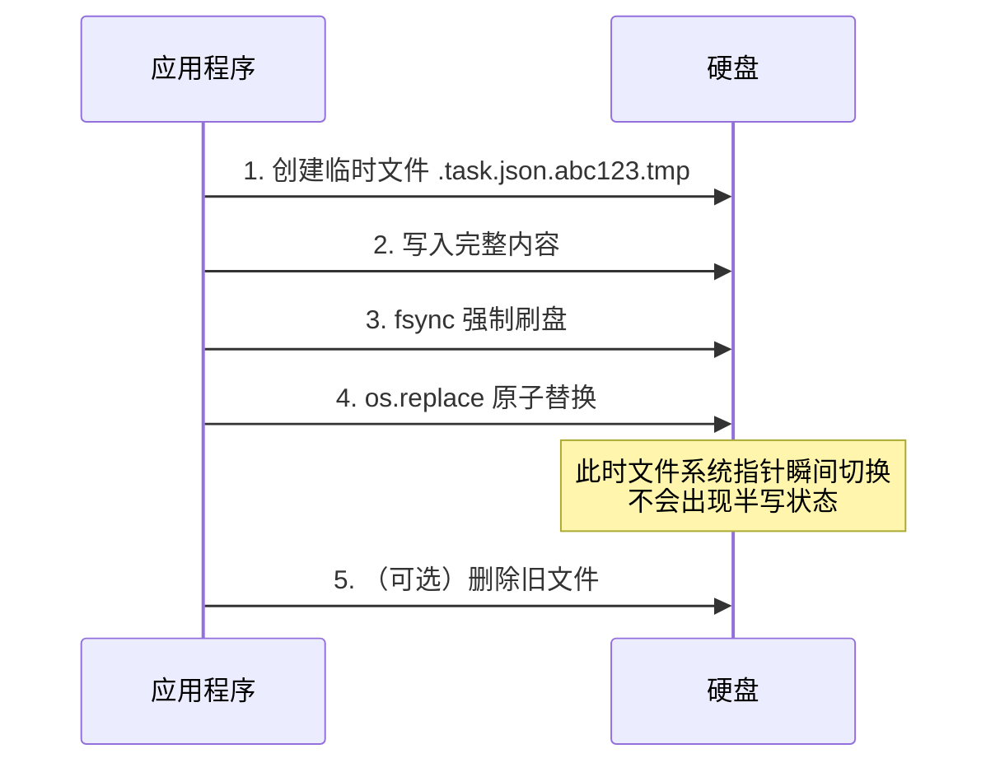
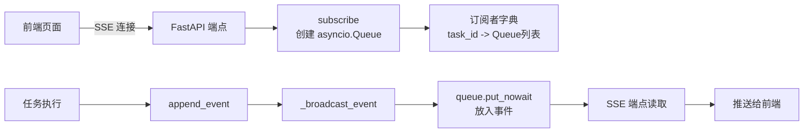
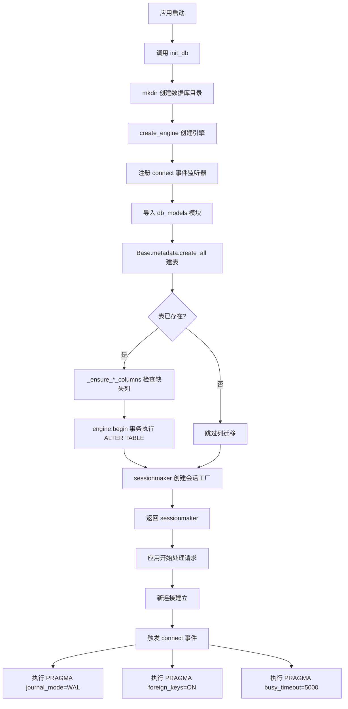
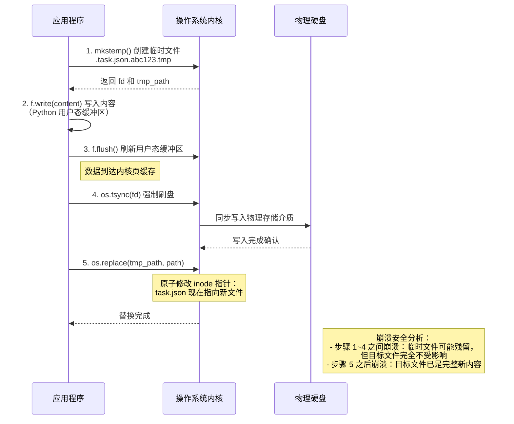
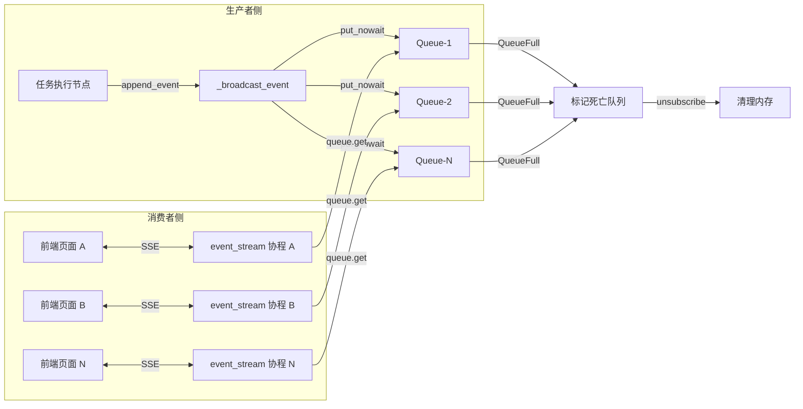

# 09 数据持久化与存储层

> 目标读者：计算机相关专业的大学生，已学过 Python 基础，但对数据库、文件系统和后端架构尚不熟悉。
>
> 阅读时间：约 25 分钟。

---

## 1. 为什么需要持久化？

想象你正在图书馆写论文。你所有的笔记、参考文献、草稿都写在一张白纸上——这张纸就是**内存（RAM）**。它的特点是：读写极快，但一断电（或者你合上电脑去吃饭），上面的内容就全部消失。

**持久化（Persistence）** 就是把这张白纸上的内容，安全地转存到**硬盘**上的过程。硬盘就像图书馆的**档案柜**：即使图书馆闭馆、停电，档案柜里的资料依然完好无损。

在我们的 AI 小说创作系统中，一次创作任务可能持续数小时甚至数天。期间会经历：

- 用户提交创作请求
- AI 生成数万字的大纲和正文
- 人工审核、修改、继续生成
- 最终归档保存

如果没有持久化，服务器重启一次，用户的创作进度就会全部丢失。因此，持久化是整个系统的"生命线"。

---

## 2. 系统的混合持久化策略

我们的系统采用了**数据库 + 文件系统**的混合存储策略。你可以把它类比为：

- **数据库（SQLite）** = 图书馆的**索引卡片柜**。每张卡片只记录书名、作者、位置编号等关键信息，方便快速检索。
- **文件系统（TaskLogStore）** = 图书馆的**实体书库**。真正厚重的小说正文、大纲、事件日志等大体积内容都存放在这里。

为什么要分开？因为数据库擅长**结构化查询**（"找出所有状态为'审核中'的任务"），而文件系统擅长**存储大文本**（"保存一本 10 万字的小说"）。如果把整本小说塞进数据库的某个字段，查询索引卡片时就会变得非常臃肿和缓慢。

```mermaid
graph TB
    subgraph 混合存储架构
        A[应用层] --> B[SQLite 数据库]
        A --> C[TaskLogStore 文件系统]
        B --> D[索引卡片<br/>tasks_index / novel_project<br/>快速查询]
        C --> E[实体书库<br/>tasklog/runs/{task_id}/<br/>大文本存储]
    end
```

---

## 3. SQLAlchemy ORM：让 Python 对象"会说话"

### 3.1 ORM 是什么？

**ORM（Object-Relational Mapping，对象关系映射）** 是一种技术，它让你可以用操作 Python 对象的方式来操作数据库表。

没有 ORM 时，你要写这样的 SQL：

```sql
INSERT INTO tasks_index (id, mode, status, title, created_at, updated_at)
VALUES ('task_abc123', 'novel', 'planning', '我的修仙小说', '2026-05-16 10:00:00', '2026-05-16 10:00:00');
```

有了 ORM，你只需要写 Python 代码：

```python
task = TaskIndexModel(
    id="task_abc123",
    mode="novel",
    status="planning",
    title="我的修仙小说",
    created_at=datetime.now(),
    updated_at=datetime.now(),
)
session.add(task)
session.commit()
```

ORM 就像一位**翻译官**：你对着它说 Python，它帮你翻译成数据库能听懂的 SQL。

### 3.2 SQLAlchemy 2.0 的新语法

我们的项目使用 SQLAlchemy 2.0，它引入了类型安全的声明式语法：

```python
from sqlalchemy.orm import Mapped, mapped_column
from sqlalchemy import String, Integer

class TaskIndexModel(Base):
    __tablename__ = "tasks_index"

    id: Mapped[str] = mapped_column(String(64), primary_key=True)
    mode: Mapped[str] = mapped_column(String(32), nullable=False)
    status: Mapped[str] = mapped_column(String(64), nullable=False, index=True)
    progress: Mapped[int] = mapped_column(Integer, default=0)
```

- `Mapped[str]`：告诉 Python 类型检查器，这个字段是字符串类型。
- `mapped_column(...)`：定义列的属性，比如是否允许为空（`nullable`）、是否有默认值（`default`）、是否是索引（`index=True`）。
- `primary_key=True`：主键，就像你的学号，唯一标识一条记录。

### 3.3 模型基类

所有 ORM 模型都继承自同一个基类：

```python
from sqlalchemy.orm import DeclarativeBase

class Base(DeclarativeBase):
    pass
```

`DeclarativeBase` 是 SQLAlchemy 2.0 的声明式基类。它像一个"魔法底座"：所有继承它的类，SQLAlchemy 都会自动扫描它们的字段定义，生成对应的数据库表结构。

---

## 4. 为什么选择 SQLite？

### 4.1 SQLite 的特点

我们的数据库引擎配置如下：

```python
_engine = create_engine(
    f"sqlite:///{db_path}",
    echo=False,
    connect_args={"check_same_thread": False},
)
```

你可能好奇：为什么不用 PostgreSQL 或 MySQL 这些"专业级"数据库？

| 特性 | SQLite | PostgreSQL / MySQL |
|------|--------|-------------------|
| 部署方式 | 单个文件，零配置 | 需要安装服务、配置用户权限 |
| 并发写入 | 适中（配合 WAL 模式） | 优秀 |
| 数据量 | GB 级别足够 | TB 级别无压力 |
| 运维成本 | 极低 | 需要 DBA 维护 |
| 适用场景 | 单机应用、原型开发、中小型项目 | 大型互联网服务 |

对于我们的 AI 小说创作系统：

- 数据量不大（元数据记录通常在万条以内）。
- 部署简单（用户下载即可运行，无需安装数据库服务）。
- 开发迭代快（不需要维护数据库迁移脚本和运维面板）。

SQLite 就像一台**便携式的卡片索引机**，虽然不如大型档案中心豪华，但对于一个工作室规模的项目来说，完全够用。

### 4.2 连接参数解释

- `echo=False`：关闭 SQL 语句打印。开发调试时可以设为 `True`，看到 ORM 生成的每一条 SQL。
- `check_same_thread=False`：SQLite 默认只允许创建它的线程访问数据库。我们的后端使用异步框架（FastAPI），多个协程可能共享连接，因此需要关闭这个限制。

---

## 5. WAL 模式：预写日志的原理

### 5.1 什么是 WAL？

我们在数据库初始化时执行了这样一条指令：

```python
cursor.execute("PRAGMA journal_mode=WAL")
```

**WAL（Write-Ahead Logging，预写日志）** 是 SQLite 的一种日志模式。要理解它，先了解传统模式的问题。

#### 传统模式（Rollback Journal）

想象你在档案柜里修改一张卡片：

1. 先把原卡片复印一份，放在旁边的"备份夹"里。
2. 在原卡片上涂改。
3. 确认无误后，扔掉备份夹里的复印件。

如果涂改到一半停电了，下次开机时，系统发现备份夹里有复印件，就把原卡片恢复回去。这就是"回滚"。

**缺点**：涂改原卡片时，其他想读这张卡片的人必须等你涂改完（因为原卡片被"锁定"了）。

#### WAL 模式

WAL 模式换了一种思路：

1. 不在原卡片上直接涂改。
2. 把修改内容写进一本新的"变更日志本"。
3. 读卡片的人，先读原卡片，再对照变更日志本，看到最新的内容。
4. 等空闲时，再把变更日志本里的内容"合并"回原卡片（这个过程叫 **Checkpoint**）。

**优点**：

- **读不阻塞写**：读者读原卡片，写者写日志本，互不干扰。
- **写不阻塞读**：即使有人在写日志，读者也能读到一致性快照。
- **崩溃恢复快**：只需要重放日志本里的记录，不需要扫描整个档案柜。



### 5.2 其他关键 PRAGMA

```python
cursor.execute("PRAGMA foreign_keys=ON")      # 启用外键约束
cursor.execute("PRAGMA busy_timeout=5000")    # 忙等待超时 5 秒
```

- **foreign_keys=ON**：启用外键约束。比如 `novel_outline_chapter` 表的 `task_id` 引用了 `tasks_index` 表的 `id`，启用外键后，如果试图删除一个还在被引用的任务，数据库会拒绝，防止数据不一致。
- **busy_timeout=5000**：当两个操作同时想写数据库时，SQLite 会返回"忙"。这个设置让后到的操作等待最多 5 秒，而不是立即报错。

---

## 6. 数据库表结构设计

我们的系统有 5 张核心表，下面用 ER 图展示它们的关系。



### 6.1 各表职责

| 表名 | 职责 | 类比 |
|------|------|------|
| `tasks_index` | 任务元数据索引，支持列表查询和排序 | 图书馆总目录卡片 |
| `novel_project` | 小说项目的整体状态（进度、章节数、活跃批次等） | 项目档案袋封面 |
| `novel_chapter_plan_batch` | 大纲章节计划的批次管理（支持分批次审核） | 分卷出版计划 |
| `novel_outline_chapter` | 单章大纲/正文的元数据（标题、目标、文件引用、哈希） | 章节索引卡 |
| `novel_generation_batch` | 正文生成的批次跟踪（支持重试、认领、审核） | 印刷批次记录 |

注意：**真正的章节正文内容并不在数据库里**，而是存放在文件系统的 `tasklog/runs/{task_id}/` 目录下。数据库只保存指向这些文件的引用（`md_ref`、`json_ref`）和内容哈希（用于校验完整性）。

---

## 7. 仓库模式（Repository Pattern）

### 7.1 设计思想

**仓库模式**是一种设计模式，它在业务逻辑层和数据访问层之间建立了一道"隔离墙"。

想象一家大型超市：

- **顾客（业务逻辑）** 只需要说"我要一瓶可乐"。
- **仓库管理员（Repository）** 负责去仓库里找可乐、检查库存、更新记录。
- 顾客不需要知道可乐存放在哪个货架、仓库门朝哪开。

在我们的代码中，`db_repository.py` 就是"仓库管理员"：



### 7.2 纯函数式 CRUD

仓库层的函数都是**纯函数**：给定相同的输入，总是产生相同的输出，没有副作用（除了写入数据库，这是它的职责）。

例如 `upsert_novel_project`：

```python
def upsert_novel_project(task: TaskRecord, story_plan: StoryPlan | None = None) -> NovelProjectModel:
    active_plan = story_plan or task.story_plan
    if active_plan is None:
        raise ValueError("当前任务缺少 story_plan，无法初始化小说项目。")
    with get_session() as session:
        row = session.query(NovelProjectModel).filter_by(task_id=task.id).first()
        if row is None:
            row = NovelProjectModel(task_id=task.id, created_at=task.created_at, updated_at=task.updated_at)
            session.add(row)
        row.novel_title = active_plan.working_title
        # ... 更新其他字段
        session.commit()
        session.refresh(row)
        return row
```

关键点：

- **Upsert（更新或插入）**：先查询是否存在，存在则更新，不存在则创建。避免了"插入重复主键"的错误。
- **会话管理**：使用 `with get_session()` 上下文管理器，确保无论成功还是异常，会话都会被正确关闭。
- **自动回滚**：如果 `session.commit()` 之前发生异常，`get_session` 会自动调用 `session.rollback()`，保证数据库状态不被污染。

### 7.3 批量状态变更

对于批次的状态流转（草稿中 → 等待审核 → 通过/拒绝/失败），仓库提供了原子操作：

```python
def mark_batch_waiting_review(task_id, batch_no, *, persisted_count): ...
def mark_batch_approved(task_id, batch_no): ...
def mark_batch_rejected(task_id, batch_no): ...
def mark_batch_failed(task_id, batch_no): ...
```

这些函数封装了状态变更的细节，上层业务代码不需要关心 SQL 怎么写，只需要调用语义清晰的函数。

---

## 8. 文件系统存储：TaskLogStore

### 8.1 目录结构

每个任务在文件系统中都有一个独立的"档案袋"：

```
tasklog/
├── index.json              # 所有任务的索引（方便外部工具读取）
├── index.md                # 人类可读的索引
├── specs/                  # 规范文档
│   ├── task-status.md
│   ├── event-types.md
│   └── page-mapping.md
├── runs/                   # 进行中的任务
│   └── task_xxx/
│       ├── task.json       # 完整任务记录（内存镜像）
│       ├── meta.json       # 元数据摘要
│       ├── request.json    # 用户请求（JSON）
│       ├── request.md      # 用户请求（Markdown）
│       ├── outline.json    # 大纲（JSON）
│       ├── outline.md      # 大纲（Markdown）
│       ├── result.json     # 正文结果（JSON）
│       ├── result.md       # 正文结果（Markdown）
│       ├── events.md       # 事件流（人类可读日志）
│       ├── events.tail.json # 最近 50 条事件（前端快速加载）
│       ├── trace/
│       │   └── current.json # 当前状态追踪
│       ├── context/         # LLM 上下文快照
│       │   ├── planning/
│       │   └── drafting/
│       ├── chapters/        # 章节文件
│       │   └── index.json
│       └── artifacts/       # 最终工件
│           ├── chapter-01.md
│           ├── chapter-01.json
│           └── final.md
└── archive/                 # 已完成的任务
    └── task_xxx/
        └── ...（同 runs 结构）
```

### 8.2 为什么需要 JSON + Markdown 双格式？

- **JSON**：机器可读，方便前端解析、程序批量处理。
- **Markdown**：人类可读，方便开发者直接打开文件查看内容，也便于版本控制工具（Git）显示差异。

这就像出版一本书，既要有给印刷厂的**电子版（JSON）**，也要有给编辑看的**校对稿（Markdown）**。

---

## 9. 原子写入：防止"写一半"的灾难

### 9.1 问题场景

假设你正在用文本编辑器写论文，突然电脑死机。如果编辑器是"直接覆盖原文件"的方式保存，那么死机时可能文件只写了一半——前半段是新内容，后半段是旧内容，或者干脆变成空白。这就是**半写（Half-written）灾难**。

### 9.2 解决方案：临时文件 + 原子替换

我们的系统使用了一种经典的原子写入策略：

```python
def _atomic_write_text(self, path: Path, content: str) -> None:
    path.parent.mkdir(parents=True, exist_ok=True)
    # 1. 创建一个临时文件
    fd, tmp_path = tempfile.mkstemp(
        dir=path.parent,
        prefix=f".{path.name}.",
        suffix=".tmp",
    )
    try:
        # 2. 把内容写入临时文件，并强制刷盘
        with os.fdopen(fd, "w", encoding="utf-8") as f:
            f.write(content)
            f.flush()
            os.fsync(fd)          # 确保数据真正写入硬盘
        # 3. 原子替换：临时文件变成正式文件
        os.replace(tmp_path, path)
    except Exception:
        # 4. 出错时清理临时文件
        try:
            os.unlink(tmp_path)
        except OSError:
            pass
        raise
```



关键点：

- `os.fsync(fd)`：强制操作系统把缓存中的数据写入物理硬盘。如果不调用，数据可能还在内存缓存里，断电就会丢失。
- `os.replace(tmp_path, path)`：这是**原子操作**。对于文件系统来说，它只是一个"指针切换"——要么成功（新文件立即可见），要么失败（旧文件保持不变），不存在中间状态。

---

## 10. 事件订阅与 SSE 实时推送

### 10.1 需求背景

前端页面需要实时显示任务进度："大纲生成中... 30%"、"第 5 章已完成"。传统的做法是让前端每隔几秒轮询（Polling）后端，但这既浪费资源，又有延迟。

**SSE（Server-Sent Events，服务器推送事件）** 是一种让服务器主动向前端推送数据的技术。前端只需要建立一次 HTTP 连接，后端就可以源源不断地发送事件流。

### 10.2 基于队列的订阅机制

我们的 `TaskLogStore` 内部维护了一个订阅系统：

```python
class TaskLogStore:
    def __init__(self, ...):
        self._subscribers: dict[str, list[asyncio.Queue[dict]]] = {}

    def subscribe(self, task_id: str) -> asyncio.Queue[dict]:
        queue: asyncio.Queue = asyncio.Queue(maxsize=256)
        self._subscribers.setdefault(task_id, []).append(queue)
        return queue

    def unsubscribe(self, task_id: str, queue: asyncio.Queue) -> None:
        ...
```

工作流程：

1. 前端打开 SSE 连接，后端调用 `subscribe(task_id)` 创建一个异步队列。
2. 当任务产生新事件（如"章节生成完成"），`append_event` 方法会调用 `_broadcast_event`。
3. `_broadcast_event` 把事件放入所有订阅了该 `task_id` 的队列中。
4. SSE 端点从队列中取出事件，推送给前端。
5. 前端断开连接时，调用 `unsubscribe` 清理队列。



### 10.3 背压处理

队列设置了 `maxsize=256`。如果前端消费速度跟不上生产速度（比如网络卡顿），队列满时，`put_nowait` 会抛出 `QueueFull` 异常。此时系统会自动把该队列标记为"死亡队列"并移除，防止内存无限增长。

---

## 11. 自动迁移：优雅地处理表结构演进

### 11.1 为什么需要迁移？

软件开发是一个不断演进的过程。今天你的 `tasks_index` 表有 10 个字段，明天产品经理说"要加一个'创作模式'字段"。如果直接改模型代码，已经部署的数据库表结构不会自动跟着变——新代码查询新字段时就会报错。

**数据库迁移（Migration）** 就是管理这种"代码与数据库结构不同步"问题的机制。

### 11.2 轻量级自动迁移

我们的系统没有引入 Alembic 这样的专业迁移工具（对于 SQLite 单机应用来说太重了），而是实现了一套轻量级的自动列迁移：

```python
def _ensure_tasks_index_columns(engine) -> None:
    inspector = inspect(engine)
    if "tasks_index" not in inspector.get_table_names():
        return
    existing_columns = {column["name"] for column in inspector.get_columns("tasks_index")}
    required_columns = {
        "creative_mode": "ALTER TABLE tasks_index ADD COLUMN creative_mode VARCHAR(32) DEFAULT ''",
        "novel_size": "ALTER TABLE tasks_index ADD COLUMN novel_size VARCHAR(16) DEFAULT ''",
        "chapter_word_min": "ALTER TABLE tasks_index ADD COLUMN chapter_word_min INTEGER DEFAULT 0",
    }
    with engine.begin() as connection:
        for column_name, ddl in required_columns.items():
            if column_name in existing_columns:
                continue
            connection.execute(text(ddl))
```

原理很简单：

1. 启动时检查数据库中已有的列。
2. 对比代码中期望的列。
3. 缺少的列，执行 `ALTER TABLE ADD COLUMN` 补上。
4. 使用 `engine.begin()` 事务包裹，确保要么全部成功，要么全部回滚。

这就像搬家时检查物品清单：新房子（新代码）需要沙发、电视、冰箱。旧房子（旧数据库）已经有沙发和电视，那就只搬冰箱进去。

---

## 12. ACID 特性与事务隔离

### 12.1 什么是 ACID？

数据库事务必须满足四个特性，合称 **ACID**：

| 特性 | 含义 | 图书馆类比 |
|------|------|-----------|
| **A**tomicity（原子性） | 事务中的所有操作，要么全部成功，要么全部失败回滚 | 借书登记和库存扣减必须一起完成，不能只登记不扣减 |
| **C**onsistency（一致性） | 事务执行前后，数据库必须处于合法状态 | 借书后，书的总数不变（只是在架数和借出数之间转移） |
| **I**solation（隔离性） | 并发事务互不干扰，就像串行执行一样 | 两个人同时预约同一本书，系统不会让他们都成功 |
| **D**urability（持久性） | 一旦事务提交，数据就永久保存，即使断电 | 还书登记完成后，即使系统崩溃，记录也不会消失 |

我们的 `get_session()` 上下文管理器封装了事务管理：

```python
@contextmanager
def get_session() -> Generator[Session, Any, None]:
    session = _session_factory()
    try:
        yield session
    except Exception:
        session.rollback()    # 原子性：出错就回滚
        raise
    finally:
        session.close()       # 资源清理
```

### 12.2 SQLite 的隔离级别

SQLite 默认使用 **SERIALIZABLE** 隔离级别（最高级别），这意味着：

- 你可以放心地执行"读取 → 修改 → 写入"的操作序列，不用担心期间有其他事务修改了同一条数据。
- 代价是并发性能稍低，但对于单机应用来说完全可接受。

---

## 13. 总结

我们的 AI 小说创作系统采用了一套精心设计的混合持久化方案：

| 组件 | 技术 | 职责 |
|------|------|------|
| 数据库引擎 | SQLite + SQLAlchemy 2.0 | 结构化元数据存储、快速查询 |
| WAL 模式 | PRAGMA journal_mode=WAL | 读写并发、崩溃恢复 |
| 仓库层 | Repository Pattern | 业务与数据解耦、语义化 API |
| 文件存储 | TaskLogStore | 大文本存储、人类可读日志 |
| 原子写入 | mkstemp + fsync + replace | 防止半写灾难 |
| 事件推送 | asyncio.Queue + SSE | 实时进度通知 |
| 自动迁移 | 启动时列检查 | 平滑升级 |

这套架构的核心思想是**"各司其职"**：数据库做它最擅长的索引和查询，文件系统做它最擅长的大文本存储，两者通过 `md_ref` / `json_ref` 等引用字段关联。就像一座运作良好的图书馆：索引卡片柜让你快速找到书，实体书库让你读到完整的内容。

---

## 参考资源

- [SQLAlchemy 2.0 官方文档](https://docs.sqlalchemy.org/en/20/)
- [SQLAlchemy ORM 快速入门](https://docs.sqlalchemy.org/en/20/orm/quickstart.html)
- [SQLite 官方文档](https://www.sqlite.org/docs.html)
- [SQLite WAL 模式详解](https://www.sqlite.org/wal.html)
- [Python tempfile 模块文档](https://docs.python.org/3/library/tempfile.html)
- [MDN - Server-Sent Events](https://developer.mozilla.org/zh-CN/docs/Web/API/Server-sent_events)
- 《数据库系统概念》（Silberschatz 著）— 第 14 章：事务

---

## 实现详解

> 本节面向已具备 Python 基础的大学生读者，逐行拆解源码中的关键实现细节。阅读前建议先通读上文的概念章节，建立整体认知后再深入代码。

---

### 1. `init_db()` 的 WAL 模式初始化流程

数据库初始化是整个持久化层的起点。`init_db()` 函数在应用启动时被调用一次，负责创建数据库文件、配置引擎参数、设置 SQLite 运行时行为、创建表结构，以及执行轻量级自动迁移。

#### 1.1 源码逐行解读

```python
# apps/agent-runtime/app/storage/database.py

22  def init_db(db_path: str | Path) -> sessionmaker[Session]:
23      """初始化数据库引擎并创建所有表。"""
24      global _engine, _session_factory          # 声明使用模块级全局变量
25
26      db_path = Path(db_path)                   # 将字符串路径转为 Path 对象，支持跨平台路径操作
27      db_path.parent.mkdir(parents=True, exist_ok=True)  # 若数据库所在目录不存在，自动递归创建
28
29      _engine = create_engine(                  # SQLAlchemy 核心：创建数据库引擎
30          f"sqlite:///{db_path}",               # 连接字符串：sqlite:/// + 绝对路径
31          echo=False,                           # 关闭 SQL 语句打印，生产环境保持安静
32          connect_args={"check_same_thread": False},  # 允许跨线程共享连接（FastAPI 异步协程需要）
33      )
```

**`create_engine()` 的参数含义：**

- `f"sqlite:///{db_path}"`：SQLAlchemy 的连接字符串格式。`sqlite:///` 表示使用 SQLite 驱动，后面紧跟数据库文件的绝对路径。例如 `sqlite:////home/user/data.db`。
- `echo=False`：控制日志输出。设为 `True` 时，SQLAlchemy 会把每一条生成的 SQL 语句打印到控制台，调试时非常有用，但生产环境会产生大量噪音。
- `connect_args={"check_same_thread": False}`：这是 SQLite 特有的参数。SQLite 的 C 库默认有一个安全限制——只允许创建数据库连接的线程操作该连接。但 FastAPI 使用 `asyncio` 协程，多个协程可能在不同线程上复用同一个连接池。关闭这个检查，让 SQLAlchemy 的连接池来管理线程安全。

#### 1.2 连接事件监听与 PRAGMA 设置

```python
34      @event.listens_for(_engine, "connect")    # SQLAlchemy 事件装饰器：监听"新连接建立"事件
35      def _set_sqlite_pragma(dbapi_connection, connection_record):
36          cursor = dbapi_connection.cursor()      # 从原始数据库连接获取游标
37          cursor.execute("PRAGMA journal_mode=WAL")   # 启用 WAL 模式（核心！）
38          cursor.execute("PRAGMA foreign_keys=ON")    # 启用外键约束检查
39          cursor.execute("PRAGMA busy_timeout=5000")  # 锁竞争时最多等待 5 秒
40          cursor.close()                          # 用完立即关闭游标，释放资源
```

**`@event.listens_for(_engine, "connect")` 的作用：**

SQLAlchemy 的引擎维护了一个连接池。每当从池中取出一个**新连接**（或连接被重新创建）时，就会触发 `"connect"` 事件。我们通过装饰器注册了一个回调函数 `_set_sqlite_pragma`，确保每个连接在投入使用前都执行三条关键的 PRAGMA 指令。

**三条 PRAGMA 的作用：**

| PRAGMA | 作用 | 如果不设置的风险 |
|--------|------|----------------|
| `journal_mode=WAL` | 启用预写日志模式，读写互不阻塞 | 默认 Rollback 模式下，写操作会锁定整个数据库，读请求被阻塞 |
| `foreign_keys=ON` | 启用外键约束 | 删除 `tasks_index` 记录时，不会检查是否还有 `novel_project` 引用它，导致孤儿数据 |
| `busy_timeout=5000` | 当数据库被锁时，当前操作等待 5000 毫秒后重试 | 默认立即返回 `SQLITE_BUSY` 错误，导致高频报错 |

#### 1.3 表创建与自动列迁移

```python
41      import app.storage.db_models  # noqa: F401   # 触发 db_models 模块的导入，让 SQLAlchemy 扫描所有模型类
42      Base.metadata.create_all(_engine)            # 根据所有继承 Base 的模型，自动创建缺失的表
43      _ensure_tasks_index_columns(_engine)         # 检查并补全 tasks_index 表的列
44      _ensure_novel_project_columns(_engine)       # 检查并补全 novel_project 表的列
45      _ensure_novel_outline_chapter_columns(_engine)  # 检查并补全 novel_outline_chapter 表的列
46
47      _session_factory = sessionmaker(bind=_engine, expire_on_commit=False)  # 创建会话工厂
48      return _session_factory
```

- `Base.metadata.create_all(_engine)`：SQLAlchemy 会收集所有继承自 `Base` 的模型类（如 `TaskIndexModel`、`NovelProjectModel` 等），生成对应的 `CREATE TABLE IF NOT EXISTS` 语句并执行。已存在的表不会被删除或修改。
- `_ensure_*_columns()`：这是项目自研的轻量级迁移机制。因为 SQLite 不支持 `ALTER TABLE DROP COLUMN`，且引入 Alembic 对单机应用来说过重，所以启动时检查现有列，缺少则执行 `ALTER TABLE ADD COLUMN`。

```python
53  def _ensure_tasks_index_columns(engine) -> None:
54      inspector = inspect(engine)               # 获取数据库结构检查器
55      if "tasks_index" not in inspector.get_table_names():
56          return                                # 表还不存在，无需迁移（create_all 会创建完整表）
57      existing_columns = {column["name"] for column in inspector.get_columns("tasks_index")}
58      required_columns = {
59          "creative_mode": "ALTER TABLE tasks_index ADD COLUMN creative_mode VARCHAR(32) DEFAULT ''",
60          "novel_size": "ALTER TABLE tasks_index ADD COLUMN novel_size VARCHAR(16) DEFAULT ''",
61          "chapter_word_min": "ALTER TABLE tasks_index ADD COLUMN chapter_word_min INTEGER DEFAULT 0",
62      }
63      with engine.begin() as connection:          # 开启事务上下文，自动提交或回滚
64          for column_name, ddl in required_columns.items():
65              if column_name in existing_columns:
66                  continue                        # 列已存在，跳过
67              connection.execute(text(ddl))       # 执行 ALTER TABLE 添加新列
```

`engine.begin()` 是 SQLAlchemy 提供的事务上下文管理器。进入 `with` 块时开启事务，正常退出时自动 `commit`，发生异常时自动 `rollback`。这保证了迁移操作的原子性——要么所有新列都加上，要么全部不加。

#### 1.4 数据库初始化流程图



---

### 2. `get_session()` 的上下文管理器实现

数据库会话（Session）是 ORM 与数据库交互的"工作台"。所有增删改查操作都通过会话进行。`get_session()` 是一个上下文管理器，确保会话的生命周期被正确管理。

#### 2.1 源码逐行解读

```python
# apps/agent-runtime/app/storage/database.py

 5  from contextlib import contextmanager        # Python 标准库：提供上下文管理器装饰器
 9  from sqlalchemy.orm import Session, sessionmaker
102  @contextmanager                              # 将普通函数转为上下文管理器
103  def get_session() -> Generator[Session, Any, None]:
104      """创建一个新的数据库会话，异常时自动回滚，退出时自动关闭。"""
105      if _session_factory is None:
106          raise RuntimeError("数据库尚未初始化，请先调用 init_db()")  # 防御性编程：避免空指针
107      session = _session_factory()             # 从工厂创建一个 Session 实例
108      try:
109          yield session                        # 将会话对象交给 with 块内的代码使用
110      except Exception:
111          session.rollback()                   # 发生异常时回滚所有未提交的操作
112          raise                                # 重新抛出异常，让上层感知错误
113      finally:
114          session.close()                      # 无论成功还是异常，都关闭会话释放连接
```

#### 2.2 为什么使用 `@contextmanager`？

在没有上下文管理器时，你可能这样写代码：

```python
session = session_factory()
try:
    row = session.query(TaskIndexModel).filter_by(id="task_001").first()
    row.status = "completed"
    session.commit()
except Exception:
    session.rollback()
    raise
finally:
    session.close()
```

每次操作都要写 8 行模板代码，而且一旦忘记 `close()`，连接池会被耗尽。`@contextmanager` 把这套模板封装起来，让调用方只需写：

```python
with get_session() as session:
    row = session.query(TaskIndexModel).filter_by(id="task_001").first()
    row.status = "completed"
    session.commit()
```

**执行流程拆解：**

1. 进入 `with` 块时，Python 调用 `get_session()`，执行到 `yield session` 暂停，把 `session` 交给 `with` 块内的代码。
2. `with` 块内的代码正常执行完毕，`yield` 恢复，进入 `finally` 块，调用 `session.close()`。
3. 如果 `with` 块内抛出异常，异常被 `except Exception:` 捕获，先执行 `session.rollback()`，再 `raise` 重新抛出，最后 `finally` 依然执行 `session.close()`。

#### 2.3 `expire_on_commit=False` 的作用

```python
47  _session_factory = sessionmaker(bind=_engine, expire_on_commit=False)
```

SQLAlchemy 的默认行为是：会话 `commit()` 后，所有已加载的对象会被标记为"过期"。下次访问这些对象的属性时，会话会自动重新查询数据库。这在 Web 应用中常常引发问题——`commit()` 后会话已关闭，再访问对象属性会抛出 `DetachedInstanceError`。

`expire_on_commit=False` 关闭了这个自动过期机制。`commit()` 后，对象仍保持内存中的状态，可以放心地跨会话边界使用（只要不再做延迟加载）。

---

### 3. `db_repository` 中 upsert 的原子操作实现

仓库层（Repository）封装了所有数据库访问逻辑。其中最常见的模式是 **upsert**（Update or Insert）：如果记录存在则更新，不存在则插入。

#### 3.1 `upsert_novel_project()` 的 SQL 构造

```python
# apps/agent-runtime/app/storage/db_repository.py

71  def upsert_novel_project(task: TaskRecord, story_plan: StoryPlan | None = None) -> NovelProjectModel:
72      active_plan = story_plan or task.story_plan   # 优先使用传入的 story_plan，否则用 task 自带的
73      if active_plan is None:
74          raise ValueError("当前任务缺少 story_plan，无法初始化小说项目。")
75      with get_session() as session:                # 获取会话，退出时自动关闭
76          row = session.query(NovelProjectModel).filter_by(task_id=task.id).first()  # 先查询是否已存在
77          if row is None:
78              row = NovelProjectModel(               # 不存在：创建新实例
79                  task_id=task.id,
80                  created_at=task.created_at,
81                  updated_at=task.updated_at,
82              )
83              session.add(row)                       # 将新实例加入会话的"待插入"队列
84          row.novel_title = active_plan.working_title   # 更新字段...
85          row.creative_mode = task.creative_mode.value if task.creative_mode else ""
86          row.novel_size = task.novel_size.value if task.novel_size else ""
87          row.target_chapter_count = int(task.target_chapter_count or task.input.target_chapter_count or 0)
88          row.chapter_count_min = int(task.chapter_count_min or task.input.chapter_count_min)
89          row.chapter_count_max = int(task.chapter_count_max or task.input.chapter_count_max)
90          row.planned_chapter_count = int(active_plan.planned_chapter_count or len(active_plan.chapter_plan))
91          row.chapter_word_min = int(task.chapter_word_min or task.input.target_words or 1800)
92          row.chapter_word_max = max(int(row.chapter_word_min * 1.3), row.chapter_word_min)
93          row.default_batch_size = 3
94          row.completed_chapter_count = int(row.completed_chapter_count or 0)
95          row.next_chapter_number = max(row.completed_chapter_count + 1, 1)
96          if row.current_generating_chapter_number is not None and row.current_generating_chapter_number <= 0:
97              row.current_generating_chapter_number = None
98          if not row.status:
99              row.status = task.status.value
100         row.updated_at = utc_now()
101         session.commit()                           # 将所有变更刷入数据库（INSERT 或 UPDATE）
102         session.refresh(row)                       # 重新加载数据库生成的默认值（如触发器结果）
103         return row
```

**upsert 逻辑的本质：**

SQLAlchemy 没有原生的 `UPSERT` 语法（不像 PostgreSQL 的 `ON CONFLICT`），所以采用"先查询、后决定"的策略：

1. `session.query(...).filter_by(task_id=task.id).first()` 执行 `SELECT * FROM novel_project WHERE task_id = ? LIMIT 1`。
2. 如果返回 `None`，创建新对象并 `session.add(row)`，此时 SQLAlchemy 会在 `commit()` 时生成 `INSERT` 语句。
3. 如果返回已有对象，直接修改属性，SQLAlchemy 会在 `commit()` 时生成 `UPDATE` 语句。

**为什么不用 `session.merge()`？**

`session.merge()` 是 SQLAlchemy 提供的另一种 upsert 方式，它会根据主键查询并复制状态。但在本项目中，我们需要精细控制哪些字段更新、哪些保留原值（如 `created_at` 只在创建时设置），因此显式的"查询-判断-修改"更加清晰可控。

#### 3.2 `mark_batch_approved()` 的状态更新

```python
# apps/agent-runtime/app/storage/db_repository.py

291  def mark_batch_approved(task_id: str, batch_no: int) -> None:
292      now = utc_now()
293      with get_session() as session:
294          row = session.query(NovelGenerationBatchModel).filter_by(task_id=task_id, batch_no=batch_no).first()
295          if row is None:
296              return                                # 防御性：记录不存在时静默返回
297          row.status = "approved"                  # 修改状态字段
298          row.updated_at = now                     # 更新时间戳
299          row.finished_at = now                    # 记录完成时间
300          row.claim_token = ""                     # 清空认领令牌，释放批次锁
301          session.commit()                         # 原子提交：这四行变更要么全部生效，要么全部回滚
```

**事务边界和 commit 时机：**

仓库层遵循"一个函数一个事务"的原则。`with get_session() as session` 开启会话，所有变更在内存中累积，直到 `session.commit()` 才一次性写入数据库。如果期间发生异常，`get_session()` 的 `except` 块会调用 `session.rollback()`，数据库状态回退到 `commit()` 之前。

这意味着 `mark_batch_approved()` 中的四行赋值操作（`status`、`updated_at`、`finished_at`、`claim_token`）是**原子性**的——不会出现"状态改了但令牌没清空"的中间状态。

---

### 4. `TaskLogStore._atomic_write_text()` 的三步原子写入

文件系统的直接覆盖写入存在"半写"风险：如果写入过程中进程崩溃，目标文件可能只包含部分数据，甚至变成空文件。`_atomic_write_text()` 使用"临时文件 + 原子替换"策略彻底解决这个问题。

#### 4.1 源码逐行解读

```python
# apps/agent-runtime/app/storage/task_store.py

925  def _atomic_write_text(self, path: Path, content: str) -> None:
926      """使用临时文件 + rename 实现原子写入。"""
927      path.parent.mkdir(parents=True, exist_ok=True)  # 确保目标文件的父目录存在
928      fd, tmp_path = tempfile.mkstemp(               # 1. 创建临时文件，返回文件描述符和路径
929          dir=path.parent,                            # 临时文件与目标文件同目录（保证同文件系统）
930          prefix=f".{path.name}.",                    # 前缀带目标文件名，方便排查
931          suffix=".tmp",                              # 明确标识为临时文件
932      )
933      try:
934          with os.fdopen(fd, "w", encoding="utf-8") as f:  # 将文件描述符包装为 Python 文件对象
935              f.write(content)                        # 2. 写入完整内容
936              f.flush()                               # 3. 刷新 Python 缓冲区到操作系统内核
937              os.fsync(fd)                            # 4. 强制操作系统将内核缓存刷入物理硬盘
938          os.replace(tmp_path, path)                  # 5. 原子替换：临时文件"瞬间"变成正式文件
939      except Exception:
940          try:
941              os.unlink(tmp_path)                     # 出错时清理临时文件，避免残留垃圾
942          except OSError:
943              pass                                    # 清理失败也不影响主流程
944          raise                                       # 重新抛出原始异常
```

#### 4.2 五步原子性拆解

| 步骤 | 代码 | 作用 | 如果跳过这步的风险 |
|------|------|------|------------------|
| 1 | `mkstemp()` | 在目标目录创建临时文件，获得独立的文件描述符 | 直接写目标文件，崩溃后文件不完整 |
| 2 | `os.write()` / `f.write()` | 将内容写入临时文件 | — |
| 3 | `f.flush()` | 把 Python 的内存缓冲区数据推给操作系统内核 | 数据还在 Python 层面，进程崩溃丢失 |
| 4 | `os.fsync(fd)` | 命令操作系统把内核缓存的数据写入物理磁盘 | 数据还在操作系统缓存，断电丢失 |
| 5 | `os.replace(tmp, path)` | 文件系统级别的原子指针切换 | 非原子操作可能导致目标文件损坏 |

#### 4.3 为什么 `os.replace()` 是原子的？

在 Linux/Unix 文件系统中，`rename`（Python 的 `os.replace`）是一个**原子系统调用**。它并不复制文件内容，而只是修改文件系统的目录项（inode 指针）：

- 操作前：目录项 `task.json` 指向旧 inode A。
- 操作后：目录项 `task.json` 指向新 inode B（临时文件）。

这个指针切换由操作系统内核保证原子性——对于任何时刻的读者来说，要么看到完整的旧文件，要么看到完整的新文件，绝不可能看到"写了一半"的状态。

**关键前提**：临时文件必须与目标文件位于**同一个文件系统**（同一个磁盘分区）。`mkstemp(dir=path.parent)` 确保了这一点。如果跨文件系统 `replace`，内核会退化为"复制+删除"的非原子操作。

#### 4.4 原子写入时序图



---

### 5. EventStream 的 `asyncio.Queue` 订阅推送机制

前端需要实时感知任务进度变化。系统采用 SSE（Server-Sent Events）技术，后端通过 `asyncio.Queue` 实现生产-消费解耦。

#### 5.1 队列的创建与注册

```python
# apps/agent-runtime/app/storage/task_store.py

42      self._subscribers: dict[str, list[asyncio.Queue[dict[str, Any]]]] = {}  # 订阅者字典

538  def subscribe(self, task_id: str) -> asyncio.Queue[dict[str, Any]]:
539      queue: asyncio.Queue[dict[str, Any]] = asyncio.Queue(maxsize=256)  # 创建有限容量队列
540      self._subscribers.setdefault(task_id, []).append(queue)             # 按 task_id 分组注册
541      return queue                                                        # 将队列句柄返回给调用方

543  def unsubscribe(self, task_id: str, queue: asyncio.Queue[dict[str, Any]]) -> None:
544      queues = self._subscribers.get(task_id, [])
545      if queue in queues:
546          queues.remove(queue)                                              # 从列表中移除指定队列
547      if not queues:
548          self._subscribers.pop(task_id, None)                              # 无人订阅时清理字典键
```

**数据结构解读：**

`_subscribers` 是一个字典，键是 `task_id`，值是一个列表，列表中的每个元素都是一个 `asyncio.Queue` 实例。这允许**多个客户端同时订阅同一个任务**——比如用户同时打开了工作台页面和审核页面，两个页面都会收到相同的事件推送。

`maxsize=256` 是背压（Backpressure）机制的核心。如果前端网络卡顿，队列堆积到 256 条后，`put_nowait()` 会抛出 `QueueFull` 异常，系统会自动将该队列标记为"死亡"并移除，防止内存无限增长。

#### 5.2 消息的生产与广播

```python
# apps/agent-runtime/app/storage/task_store.py

595  def _broadcast_event(self, task_id: str, event: TaskEvent) -> None:
596      payload = event.model_dump(mode="json")   # 将事件对象序列化为 JSON 友好的字典
597      dead_queues: list[asyncio.Queue[dict[str, Any]]] = []
598      for queue in self._subscribers.get(task_id, []):  # 遍历该任务的所有订阅队列
599          try:
600              queue.put_nowait(payload)           # 非阻塞入队，立即返回
601          except (asyncio.QueueFull, Exception):  # 队列满或任何异常
602              dead_queues.append(queue)           # 标记为死亡队列
603      for queue in dead_queues:
604          self.unsubscribe(task_id, queue)        # 清理死亡队列，释放内存
```

**`put_nowait()` 与 `put()` 的区别：**

- `put()` 是异步方法，如果队列满，会**挂起协程**等待空位。这在广播场景中是危险的——一个慢消费者可能阻塞整个广播流程。
- `put_nowait()` 是同步方法，如果队列满，立即抛出 `QueueFull` 异常。广播者可以立刻丢弃这个慢消费者，不影响其他消费者。

#### 5.3 SSE Handler 的消费与发送

```python
# apps/agent-runtime/app/api/routes.py

345  @router.get("/tasks/{task_id}/workspace/stream")
346  @router.get("/tasks/{task_id}/workspace/events")
347  @router.get("/tasks/{task_id}/sse")
348  @router.get("/tasks/{task_id}/events/stream")
349  async def stream_task_events(task_id: str):
350      try:
351          snapshot = task_service.build_sse_snapshot(task_id)   # 构建初始快照（当前任务状态）
352          queue = task_service.subscribe_task_events(task_id)   # 注册订阅，获取队列
353      except Exception as exc:
354          raise _handle_error(exc) from exc
355
356      async def event_stream():
357          try:
358              yield _sse_payload("snapshot", snapshot)            # 第一条消息：当前完整状态
359              while True:
360                  # 检查任务是否已终止但事件队列为空，避免永久挂起
361                  try:
362                      latest = task_service.store.get(task_id)
363                      if latest.status.value in {"completed", "cancelled", "failed"}:
364                          yield _sse_payload("task.done", {...})
365                          break
366                  except Exception:
367                      pass
368                  try:
369                      payload = await asyncio.wait_for(queue.get(), timeout=15)  # 等待新事件，最多 15 秒
370                  except asyncio.TimeoutError:
371                      yield ": keep-alive\n\n"                         # 超时发送心跳，防止 HTTP 连接被中间件切断
372                      continue
373                  yield _sse_payload("task.event", payload)         # 推送事件给前端
374                  if payload.get("event_type") in {"task.completed", "task.cancelled", "task.failed"}:
375                      yield _sse_payload("task.done", {...})        # 终态事件后发送结束标记
376                      break
377          finally:
378              task_service.unsubscribe_task_events(task_id, queue)  # 连接断开时清理订阅

386      return StreamingResponse(
387          event_stream(),
388          media_type="text/event-stream",                           # MIME 类型标识 SSE
389          headers={
390              "Cache-Control": "no-cache",                           # 禁止缓存
391              "Connection": "keep-alive",                            # 保持长连接
392              "X-Accel-Buffering": "no",                             # 禁用 Nginx 等代理的缓冲
393          },
394      )
```

**并发处理机制：**

每个前端 SSE 连接都会触发一次 `stream_task_events()` 调用，创建一个独立的 `event_stream()` 异步生成器。每个生成器拥有自己的 `queue` 实例，但所有队列都注册在同一个 `_subscribers[task_id]` 列表下。

当任务产生新事件时：

1. `_broadcast_event()` 遍历该 `task_id` 下的所有队列。
2. 对每个队列调用 `put_nowait(payload)`。
3. 每个 SSE handler 在自己的协程中执行 `await queue.get()`，从各自的队列中取出同一份 payload。
4. 各 handler 独立通过 HTTP 连接推送给各自的前端页面。

这种"一生产者、多消费者、各消费者独立队列"的设计，天然支持多客户端并发订阅，且互不阻塞。

#### 5.4 订阅推送机制流程图



---

### 6. 小结

| 组件 | 核心机制 | 关键源码位置 |
|------|---------|-------------|
| 数据库初始化 | `create_engine` + 事件监听 + `create_all` + 列迁移 | `app/storage/database.py:22-50` |
| 会话管理 | `@contextmanager` + `sessionmaker` + 自动回滚/关闭 | `app/storage/database.py:102-114` |
| 仓库 upsert | 先 `SELECT` 后决定 `INSERT` 或 `UPDATE`，单事务包裹 | `app/storage/db_repository.py:71-103` |
| 原子写入 | `mkstemp` → `write` → `fsync` → `replace` 五步流程 | `app/storage/task_store.py:925-944` |
| 事件推送 | `asyncio.Queue` 多队列广播 + SSE 长连接消费 | `app/storage/task_store.py:538-604` + `app/api/routes.py:345-394` |

理解这些实现细节，不仅能帮助你读懂本项目的持久化层，也能为你在其他 Python 后端项目中处理数据库事务、文件安全和实时推送提供可直接复用的设计模式。
