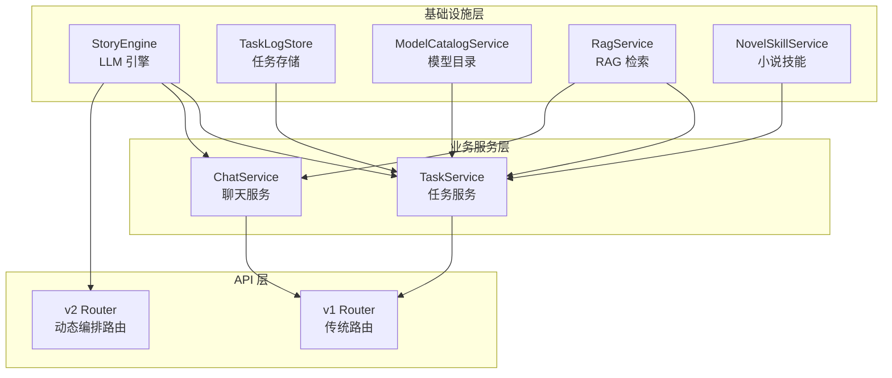
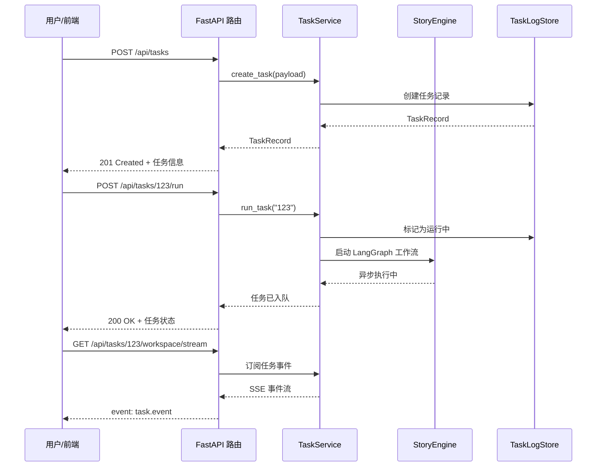
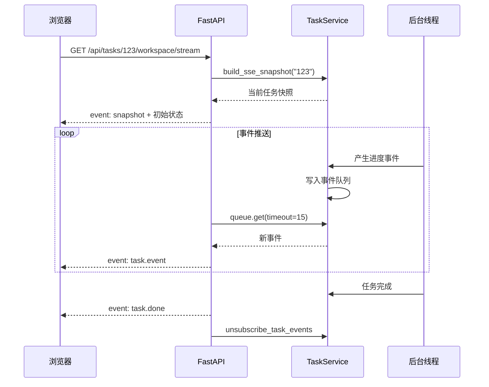
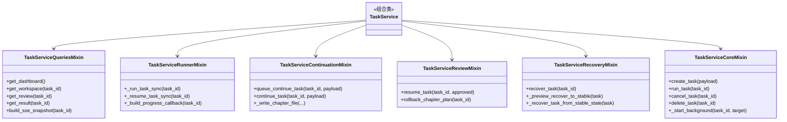
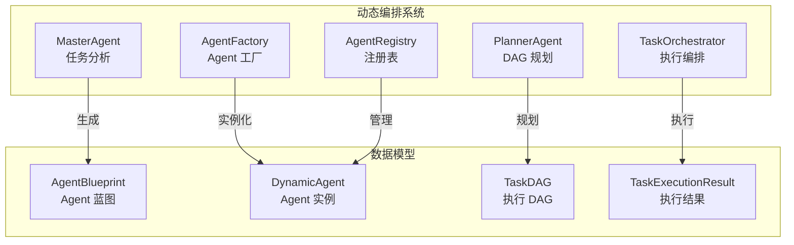
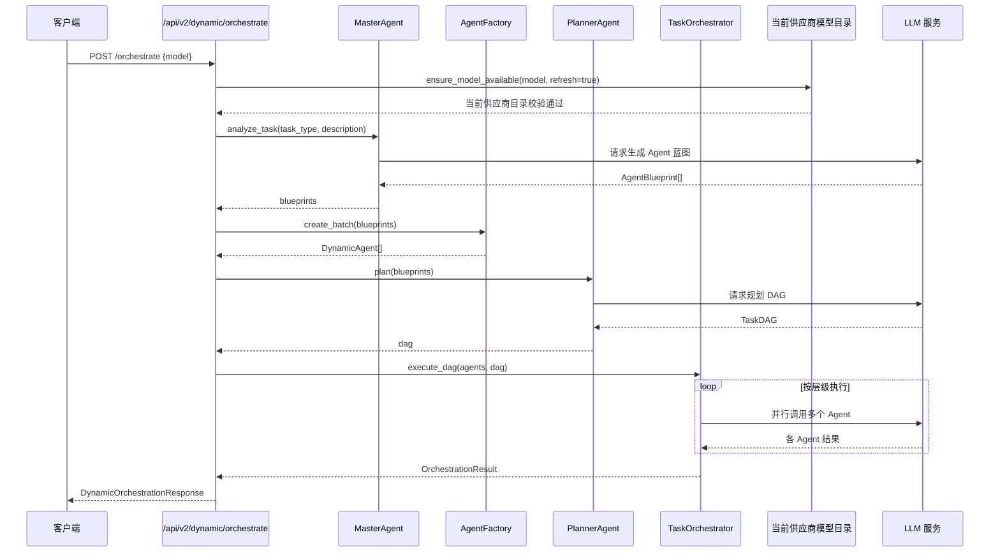
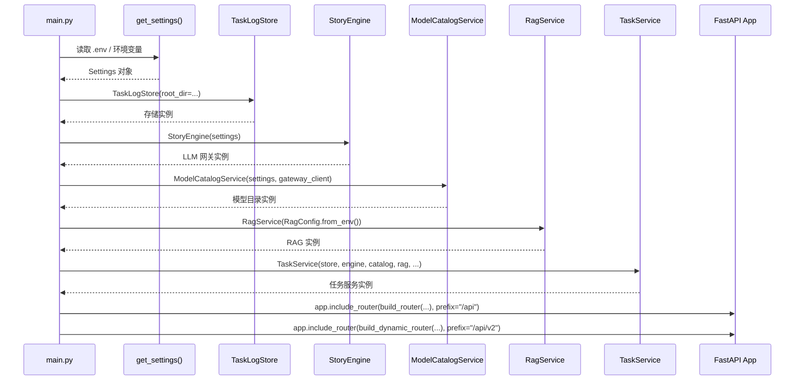
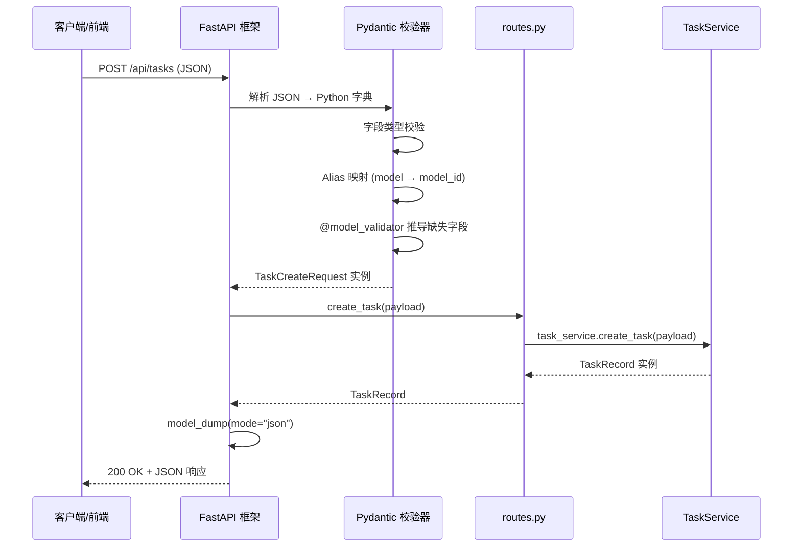
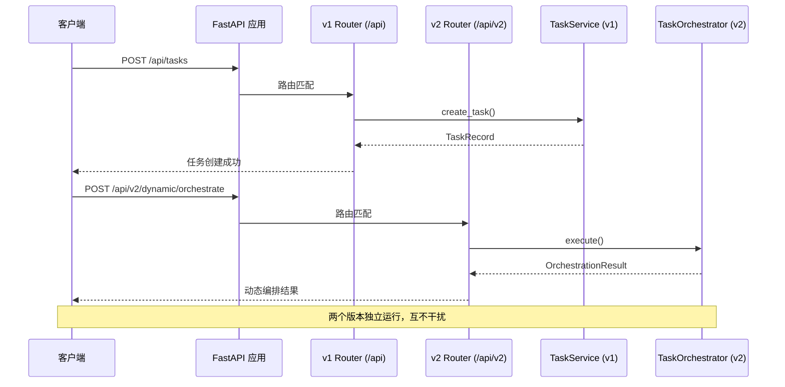

# 动态 Agent 编排 API：从零理解 AI 系统的可扩展后端架构

> 本文面向完全不了解后端开发的大学生读者。你不需要任何前置知识，只需要知道 "网站是怎么打开的" 即可。我们会用餐厅点餐、快递中转等生活例子来解释每一个技术概念。

---

## 目录

1. [网站后端是怎么响应请求的](#1-网站后端是怎么响应请求的)
2. [FastAPI：Python 后端的现代选择](#2-fastapi-python-后端的现代选择)
3. [依赖注入：解耦的乐高积木](#3-依赖注入解耦的乐高积木)
4. [API 版本管理：v1 与 v2 的分层设计](#4-api-版本管理v1-与-v2-的分层设计)
5. [RESTful 设计：资源命名与 HTTP 方法](#5-restful-设计资源命名与-http-方法)
6. [Pydantic 数据校验：类型系统保障 API 契约](#6-pydantic-数据校验类型系统保障-api-契约)
7. [异步处理架构：为什么任务要放后台线程](#7-异步处理架构为什么任务要放后台线程)
8. [SSE 实时推送：EventSource 协议原理](#8-sse-实时推送eventsource-协议原理)
9. [Mixin 组合模式：拆分复杂服务的瑞士军刀](#9-mixin-组合模式拆分复杂服务的瑞士军刀)
10. [配置管理：Pydantic Settings 管理应用配置](#10-配置管理pydantic-settings-管理应用配置)
11. [动态 Agent 编排 API 详解](#11-动态-agent-编排-api-详解)
12. [参考链接](#12-参考链接)

---

## 1. 网站后端是怎么响应请求的

### 1.1 从浏览器到服务器的旅程

想象你走进一家餐厅：

1. **你（浏览器）** 向 **服务员（前端）** 说："我要一份宫保鸡丁"
2. **服务员** 把订单写在纸上，递给 **后厨（后端 API）**
3. **后厨** 里有 **切配工（数据校验）** 检查食材是否齐全
4. **主厨（业务逻辑）** 开始炒菜
5. **传菜员（响应）** 把成品端回给你

网站的工作方式一模一样：

```
用户点击按钮 → 前端发送 HTTP 请求 → 后端接收请求 → 校验数据 → 执行业务逻辑 → 返回响应
```

### 1.2 HTTP 请求的本质

HTTP（超文本传输协议）就是浏览器和服务器之间的"对话规则"。一个 HTTP 请求包含：

- **方法（Method）**：你要做什么？GET（查看）、POST（创建）、PATCH（修改）、DELETE（删除）
- **路径（Path）**：你要操作哪个资源？如 `/api/tasks/123`
- **请求体（Body）**：附加数据，如 JSON 格式的任务信息
- **响应（Response）**：服务器返回的结果，包含状态码和数据

> **生活类比**：HTTP 方法就像餐厅里的动作——GET 是"看菜单"，POST 是"下单"，PATCH 是"改订单"，DELETE 是"退菜"。

---

## 2. FastAPI：Python 后端的现代选择

### 2.1 什么是 FastAPI

FastAPI 是一个用于构建 API 的 Python 框架。它的核心优势可以用一句话概括：**用 Python 类型提示自动生成接口文档**。

```python
from fastapi import FastAPI

app = FastAPI(title="小说 Agent Runtime")

@app.get("/health")
def health() -> dict[str, str]:
    return {"status": "ok"}
```

这段代码定义了一个 `/health` 接口：
- `@app.get("/health")` 表示用 GET 方法访问 `/health` 路径
- `-> dict[str, str]` 是 Python 类型提示，告诉 FastAPI 这个函数返回一个"字符串键值对字典"
- FastAPI 会自动根据这个类型提示生成接口文档（Swagger UI）

### 2.2 为什么选 FastAPI

| 特性 | 说明 | 好处 |
|------|------|------|
| **类型提示驱动** | 用 Python 类型注解定义请求/响应模型 | 自动校验数据、生成文档 |
| **异步原生支持** | 内置 `async`/`await` | 高并发处理不阻塞 |
| **自动文档** | 访问 `/docs` 即可看到交互式 API 文档 | 前后端协作更高效 |
| **依赖注入系统** | 内置 DI 容器 | 组件解耦、测试友好 |

> **生活类比**：FastAPI 就像一家智能餐厅——你写好菜单（类型提示），它自动帮你生成点餐系统（接口文档）、检查食材（数据校验）、安排厨师（依赖注入）。

### 2.3 本系统的 FastAPI 入口

```python
# app/main.py
from fastapi import FastAPI
from app.api.routes import build_router
from app.api.dynamic_routes import build_dynamic_router

app = FastAPI(title=settings.app_name)

# 挂载 v1 路由
app.include_router(build_router(...), prefix="/api")

# 挂载 v2 动态路由
app.include_router(build_dynamic_router(...), prefix="/api/v2")
```

---

## 3. 依赖注入：解耦的乐高积木

### 3.1 什么是依赖注入

**依赖注入（Dependency Injection, DI）** 是一种设计思想：**不要自己创建依赖，让外部传进来**。

想象你要拼一个乐高城堡：
- **传统方式**：每个积木块自己去找需要的其他积木块（紧耦合）
- **依赖注入**：你（组装者）把所有积木块准备好，按说明书组装（松耦合）

```python
# ❌ 传统方式：自己创建依赖
class TaskService:
    def __init__(self):
        self.engine = StoryEngine()  # 自己创建，硬编码
        self.store = TaskLogStore()  # 自己创建，硬编码

# ✅ 依赖注入：外部传入
class TaskService:
    def __init__(self, engine: StoryEngine, store: TaskLogStore):
        self.engine = engine
        self.store = store
```

### 3.2 本系统的依赖注入架构



在 `app/main.py` 中，所有核心服务在应用启动时创建，然后通过参数传递给路由：

```python
# 在 main.py 中组装核心服务
engine = StoryEngine(settings)
model_catalog = ModelCatalogService(settings=settings, gateway_client=engine.gateway_client)
rag_service = RagService(RagConfig.from_env())
store = TaskLogStore(root_dir=settings.tasklog_root)
task_service = TaskService(
    store=store,
    engine=engine,
    model_catalog=model_catalog,
    rag_service=rag_service,
    # ... 更多依赖
)

# 将组装好的服务注入路由
app.include_router(
    build_router(task_service, chat_service=chat_service, ...),
    prefix="/api",
)
```

### 3.3 依赖注入的好处

1. **可测试性**：测试时可以传入 Mock 对象，不需要真实的 LLM 服务
2. **可替换性**：今天用 OpenAI，明天换 Claude，只需改一行配置
3. **可复用性**：同一个 `TaskService` 可以在不同的路由中使用

> **生活类比**：依赖注入就像餐厅的后厨分工——切配工、炒锅师傅、摆盘师各自独立，通过传菜窗口（接口）协作。今天炒锅师傅请假，换一个就行，不需要重新设计整个厨房。

---

## 4. API 版本管理：v1 与 v2 的分层设计

### 4.1 为什么要分版本

软件系统就像城市——老房子（v1 API）还在用，新开发区（v2 API）已经建起来了。直接拆老房子会影响居民，所以先并行运行，慢慢迁移。

本系统的版本策略：
- **v1 (`/api`)**：成熟的传统 API，负责任务创建、执行、审核、归档等核心功能
- **v2 (`/api/v2`)**：实验性的动态 Agent 编排 API，用于对比验证新架构

```python
# main.py 中的路由挂载
app.include_router(build_router(...), prefix="/api")        # v1
app.include_router(build_dynamic_router(...), prefix="/api/v2")  # v2
```

### 4.2 API 路由分层图

```mermaid
graph TD
    subgraph FastAPI 应用
        A[app = FastAPI]
    end

    subgraph v1 API /api
        B[GET /health]
        C[POST /tasks]
        D[GET /tasks/{id}]
        E[POST /tasks/{id}/run]
        F[GET /tasks/{id}/workspace/stream]
        G[POST /chat/stream]
        H[GET /models]
    end

    subgraph v2 API /api/v2
        I[GET /dynamic/health]
        J[POST /dynamic/orchestrate]
        K[POST /dynamic/orchestrate/compare]
    end

    A --> B
    A --> C
    A --> D
    A --> E
    A --> F
    A --> G
    A --> H
    A --> I
    A --> J
    A --> K
```

### 4.3 v1 与 v2 的职责划分

| 层级 | 职责 | 对应文件 |
|------|------|----------|
| v1 | 任务全生命周期管理（创建、运行、审核、归档） | `app/api/routes.py` |
| v2 | 动态 Agent 编排（实验性，用于审核场景） | `app/api/dynamic_routes.py` |

> **生活类比**：v1 就像老城区的成熟商圈，v2 就像新开发区。老城区稳定可靠，新开发区尝试新模式。两者并行，互不干扰。

---

## 5. RESTful 设计：资源命名与 HTTP 方法

### 5.1 什么是 RESTful

REST（Representational State Transfer）是一种 API 设计风格，核心思想是：**把一切都看作资源，用 HTTP 方法操作资源**。

> **生活类比**：RESTful 就像图书馆的管理系统——书是资源，你可以"查看"（GET）、"借阅"（POST）、"续借"（PATCH）、"归还"（DELETE）。

### 5.2 资源命名规范

```
GET    /tasks              # 获取任务列表
POST   /tasks              # 创建新任务
GET    /tasks/{id}         # 获取指定任务
POST   /tasks/{id}/run     # 运行指定任务
POST   /tasks/{id}/cancel  # 取消指定任务
DELETE /tasks/{id}         # 删除指定任务
```

### 5.3 HTTP 状态码的使用

| 状态码 | 含义 | 本系统使用场景 |
|--------|------|--------------|
| 200 | 成功 | 正常返回数据 |
| 400 | 请求参数错误 | 缺少必填字段、格式不正确 |
| 403 | 权限不足 | 操作不被允许 |
| 404 | 资源不存在 | 任务 ID 找不到 |
| 429 | 请求过于频繁 | 触发限流 |
| 500 | 服务器内部错误 | 未捕获的异常 |
| 502 | 网关错误 | LLM 服务不可用 |
| 503 | 服务不可用 | RAG 未配置、聊天服务未启用 |

```python
# routes.py 中的错误处理示例
def _handle_error(exc: Exception) -> HTTPException:
    if isinstance(exc, TaskNotFoundError):
        return HTTPException(status_code=404, detail="任务不存在")
    if isinstance(exc, ValueError):
        return HTTPException(status_code=400, detail=str(exc))
    if isinstance(exc, PermissionError):
        return HTTPException(status_code=403, detail="权限不足")
    return HTTPException(status_code=500, detail="服务内部错误，请稍后重试")
```

### 5.4 RESTful API 调用时序图



---

## 6. Pydantic 数据校验：类型系统保障 API 契约

### 6.1 什么是 Pydantic

Pydantic 是 Python 的数据验证库。它利用 Python 的类型提示，在运行时自动校验数据是否符合预期。

> **生活类比**：Pydantic 就像快递公司的安检——你寄包裹时，它会检查尺寸、重量、内容是否符合规定，不合格的当场退回。

### 6.2 请求模型定义

```python
from pydantic import BaseModel, Field

class DynamicOrchestrationRequest(BaseModel):
    """动态编排请求。"""
    task_type: str = Field(..., description="任务类型")
    task_description: str = Field(..., description="任务描述")
    task_context: dict[str, Any] = Field(default_factory=dict, description="任务上下文变量")
    model: str | None = Field(default=None, description="本次请求显式选择的模型")
    max_workers: int = Field(default=4, ge=1, le=16, description="最大并行 Agent 数")
```

`model` 的类型为可空是为了兼容请求解析，但运行时不接受空值。客户端必须先读取 `/api/models`，从当前供应商返回的目录中选择 `data[].id` 后再调用动态编排；缺失时返回 `400`，错误文案为：`请显式选择当前供应商返回的模型后再执行动态编排。`。

### 6.3 自动校验示例

```python
# 合法的请求
{
    "task_type": "outline_review",
    "task_description": "审核小说大纲",
    "max_workers": 4
}
# ✅ 通过校验

# 非法的请求
{
    "task_type": "outline_review",
    "max_workers": 20
}
# ❌ 校验失败：max_workers 必须 <= 16
```

### 6.4 响应模型

```python
class DynamicOrchestrationResponse(BaseModel):
    """动态编排响应。"""
    success: bool
    orchestration_id: str = ""
    agents_created: int = 0
    agents_succeeded: int = 0
    agents_failed: int = 0
    overall_score: float = 0.0
    overall_approved: bool = False
    total_duration_ms: int = 0
    agent_results: list[dict[str, Any]] = Field(default_factory=list)
    synthesis_result: dict[str, Any] | None = None
```

使用 `response_model=DynamicOrchestrationResponse` 可以确保返回的数据结构始终一致，即使内部出现异常也能返回合法的 JSON。

---

## 7. 异步处理架构：为什么任务要放后台线程

### 7.1 同步 vs 异步

想象你在餐厅点餐：

- **同步**：你点完菜，站在柜台前等 30 分钟，期间不能干别的
- **异步**：你点完菜拿到取餐号，去座位上玩手机，菜好了服务员叫你

Web 后端同理：

- **同步处理**：HTTP 请求一直挂着，等 LLM 生成完才返回（可能几分钟）
- **异步处理**：HTTP 请求立即返回"已接收"，后台慢慢处理，通过 SSE 推送进度

### 7.2 本系统的后台线程实现

```python
# core.py 中的后台任务启动
def _start_background(self, task_id: str, target, *args: Any) -> None:
    def runner() -> None:
        try:
            target(*args)
        except Exception as exc:
            # 异常处理：标记任务失败
            self._mark_failed_unless_stable(task_id, f"后台任务异常：{exc}")
        finally:
            # 清理活跃运行记录
            self._leave_active_run(task_id)

    t = threading.Thread(
        target=runner,
        name=f"task-worker-{task_id}",
        daemon=True,
    )
    t.start()
```

### 7.3 为什么要用线程而不是协程

本系统的 LangGraph 工作流包含大量同步调用（LLM 请求、文件 I/O），使用 `threading.Thread` 可以：

1. **避免阻塞事件循环**：FastAPI 的异步事件循环不会被长时间任务卡住
2. **利用多核 CPU**：Python 的 GIL 虽然限制，但 I/O 等待期间可以切换
3. **简化错误处理**：线程内的异常不会直接导致整个服务崩溃

> **注意**：v2 动态编排使用 `asyncio.to_thread()` 将同步编排器包装为异步调用，这是 Python 3.9+ 推荐的做法。

```python
# dynamic_routes.py 中的异步包装
result: OrchestrationResult = await asyncio.to_thread(
    orchestrator.execute,
    task_type=request.task_type,
    task_description=request.task_description,
    task_context=request.task_context,
    model=request.model,
)
```

---

## 8. SSE 实时推送：EventSource 协议原理

### 8.1 什么是 SSE

SSE（Server-Sent Events）是一种服务器向客户端推送实时数据的技术。与 WebSocket 不同，SSE 是**单向**的（服务器 → 客户端），基于 HTTP，实现更简单。

> **生活类比**：SSE 就像餐厅的"叫号系统"——你取号后坐在座位上，广播叫到你了就去取餐。你不需要一直问"好了没"，而是被动接收通知。

### 8.2 SSE 消息格式

```
event: task.event
data: {"task_id": "123", "event_type": "chapter.saved", ...}

: keep-alive

event: task.done
data: {"task_id": "123", "event_type": "task.completed"}
```

- `event:` 定义事件名称
- `data:` 是 JSON 格式的消息体
- `: keep-alive` 是心跳包，防止连接超时

### 8.3 SSE 连接建立时序图



### 8.4 本系统的 SSE 实现

```python
# routes.py 中的 SSE 端点
@router.get("/tasks/{task_id}/workspace/stream")
async def stream_task_events(task_id: str):
    snapshot = task_service.build_sse_snapshot(task_id)
    queue = task_service.subscribe_task_events(task_id)

    async def event_stream():
        yield _sse_payload("snapshot", snapshot)
        while True:
            # 检查任务是否已终止
            latest = task_service.store.get(task_id)
            if latest.status.value in {"completed", "cancelled", "failed"}:
                yield _sse_payload("task.done", {...})
                break
            try:
                payload = await asyncio.wait_for(queue.get(), timeout=15)
            except asyncio.TimeoutError:
                yield ": keep-alive\n\n"
                continue
            yield _sse_payload("task.event", payload)

    return StreamingResponse(
        event_stream(),
        media_type="text/event-stream",
        headers={
            "Cache-Control": "no-cache",
            "Connection": "keep-alive",
            "X-Accel-Buffering": "no",
        },
    )
```

---

## 9. Mixin 组合模式：拆分复杂服务的瑞士军刀

### 9.1 什么是 Mixin

Mixin 是一种将功能拆分到多个小类中，然后组合成一个完整类的设计模式。

> **生活类比**：Mixin 就像瑞士军刀——刀、剪刀、开瓶器各自独立，组合在一起就是一把多功能刀。你需要什么功能就装什么配件。

### 9.2 本系统的 Mixin 组合

```python
# __init__.py
class TaskService(
    TaskServiceQueriesMixin,      # 查询接口（仪表盘、归档、工作区）
    TaskServiceRunnerMixin,       # LangGraph 启动与恢复
    TaskServiceContinuationMixin, # 继续创作
    TaskServiceReviewMixin,       # 人工审核、回滚
    TaskServiceRecoveryMixin,     # 任务恢复
    TaskServiceCoreMixin,         # 创建、运行、取消、删除
):
    """任务服务门面，组合所有功能 mixin。"""
    pass
```

### 9.3 Mixin 组合类图



### 9.4 Mixin 的好处

1. **单一职责**：每个 Mixin 只负责一类功能，代码清晰
2. **可测试性**：可以单独测试某个 Mixin 的方法
3. **可扩展性**：新增功能只需添加新的 Mixin
4. **避免继承地狱**：Python 支持多继承，Mixin 是合理利用多继承的方式

---

## 10. 配置管理：Pydantic Settings 管理应用配置

### 10.1 为什么需要配置管理

一个应用有很多可调参数：LLM 的 API 地址、超时时间、审核开关等。把这些硬编码在代码里很不方便，需要集中管理。模型 ID 不再作为全局运行时配置，而是由任务、聊天、恢复和动态编排请求显式提供。

> **生活类比**：配置管理就像餐厅的"运营手册"——营业时间、菜单价格、服务标准都写在手册里，而不是让厨师自己决定。

### 10.2 Pydantic Settings 的使用

```python
# app/settings/config.py
from pydantic_settings import BaseSettings, SettingsConfigDict

class Settings(BaseSettings):
    app_name: str = "小说 Agent Runtime"
    llm_provider: str = "openai_compatible"
    openai_base_url: str = Field(default="https://api.lclaitech.com/v1", validation_alias="LLM_BASE_URL")
    # 遗留兼容字段，不参与运行时模型选择
    default_chat_model: str = Field(default="", validation_alias="DEFAULT_CHAT_MODEL")
    openai_api_key: str | None = Field(default=None, validation_alias="LLM_API_KEY")
    auto_review: bool = Field(default=False, validation_alias="AUTO_REVIEW")

    model_config = SettingsConfigDict(
        env_file=".env",
        env_file_encoding="utf-8",
        extra="ignore",
    )

@lru_cache
def get_settings() -> Settings:
    return Settings()
```

### 10.3 配置加载优先级

Pydantic Settings 会自动按以下优先级加载配置：

1. **环境变量**（最高优先级）
2. **.env 文件**
3. **默认值**

```bash
# .env 文件示例
LLM_BASE_URL=https://api.example.com/v1
# 遗留兼容字段；运行时不作为默认模型，保持为空
DEFAULT_CHAT_MODEL=
LLM_API_KEY=sk-xxx
AUTO_REVIEW=true
```

### 10.4 运行时配置更新

除了环境变量，系统还支持运行时更新某些配置：

```python
# runtime_settings.py
_model_protocol_overrides: dict[str, str] = {}

def set_model_protocol_override(model_id: str, protocol: str) -> None:
    """运行时设置模型协议覆盖。"""
    _model_protocol_overrides[model_id] = protocol
```

---

## 11. 动态 Agent 编排 API 详解

### 11.1 什么是动态 Agent 编排

传统的工作流是"硬编码"的——开发者预先写好每个步骤。而**动态 Agent 编排**是让 LLM 自己决定：

1. **需要哪些 Agent**：分析任务后动态生成角色（如"结构分析师"、"文笔评审员"）
2. **如何组织执行**：通过 DAG（有向无环图）规划并行/串行执行顺序
3. **如何汇总结果**：综合 Agent 汇总各子 Agent 的评审意见

> **生活类比**：传统工作流像"固定菜单"，动态编排像"私人定制"——主厨（Master Agent）根据你的口味现场决定需要什么食材、什么做法。

### 11.2 动态编排的核心组件



### 11.3 执行流程



### 11.4 API 端点

#### 健康检查

```http
GET /api/v2/dynamic/health
```

响应：
```json
{
  "status": "ok",
  "module": "dynamic_agent_orchestration"
}
```

#### 执行动态编排

```http
POST /api/v2/dynamic/orchestrate
Content-Type: application/json

{
  "task_type": "outline_review",
  "task_description": "审核小说大纲的结构完整性",
  "task_context": {
    "working_title": "星际旅人",
    "genre": "科幻",
    "target_words": 50000
  },
  "model": "<来自 /api/models 的当前供应商模型 ID>",
  "max_workers": 4
}
```

`/api/v2/dynamic/orchestrate` 与 `/api/v2/dynamic/orchestrate/compare` 都会在执行前刷新并校验该模型仍存在于当前供应商目录；动态编排不使用全局或默认模型。

响应：
```json
{
  "success": true,
  "orchestration_id": "orch_abc123",
  "agents_created": 5,
  "agents_succeeded": 5,
  "agents_failed": 0,
  "overall_score": 78.5,
  "overall_approved": true,
  "total_duration_ms": 12500,
  "agent_results": [
    {
      "agent_name": "结构分析师",
      "role": "structure",
      "score": 82.0,
      "issues": [...],
      "reasoning": "大纲结构完整，但第二章过渡略显突兀"
    }
  ],
  "synthesis_result": {
    "agent_name": "综合决策专家",
    "score": 78.5,
    "reasoning": "各维度评分加权平均后达到通过标准"
  }
}
```

#### 对比模式

```http
POST /api/v2/dynamic/orchestrate/compare
Content-Type: application/json

{
  "task_type": "outline_review",
  "task_description": "审核小说大纲的结构完整性",
  "model": "<来自 /api/models 的当前供应商模型 ID>"
}
```

同时运行动态编排和展示旧架构信息，用于结果一致性验证。该接口与常规编排接口一样要求显式 `model`，为空时返回 `400`：`请显式选择当前供应商返回的模型后再执行动态编排。`。

### 11.5 与现有系统的集成

动态编排通过 **Bridge 模式**与现有审核系统无缝集成：

```python
# bridge.py
class DynamicReviewBridge:
    def review(self, payload: ReviewPayload, policy: AutoReviewPolicy) -> ReviewDecision:
        # 将 ReviewPayload 转换为 TaskOrchestrator 所需的格式
        task_description = self._build_task_description(payload)
        task_context = self._build_task_context(payload, policy)

        # 调用动态编排
        result = orchestrator.execute(...)

        # 将 OrchestrationResult 转换为 ReviewDecision
        return self._convert_to_review_decision(result, policy)
```

这样，主工作流（`main_graph.py`）和任务服务（`task_service`）完全不需要改动，只需在配置中开启 `DYNAMIC_AGENT_REVIEW=true` 即可切换到动态编排模式。

---

## 12. 参考链接

### FastAPI 官方

- [FastAPI 官方文档](https://fastapi.tiangolo.com/)
- [FastAPI 教程 - 用户指南](https://fastapi.tiangolo.com/tutorial/)
- [FastAPI 依赖注入系统](https://fastapi.tiangolo.com/tutorial/dependencies/)
- [FastAPI 后台任务](https://fastapi.tiangolo.com/tutorial/background-tasks/)

### RESTful API 设计

- [RESTful API 设计指南 - Microsoft](https://learn.microsoft.com/azure/architecture/best-practices/api-design)
- [REST API Tutorial](https://restfulapi.net/)
- [HTTP 状态码参考 - MDN](https://developer.mozilla.org/zh-CN/docs/Web/HTTP/Status)

### Pydantic 与配置管理

- [Pydantic 官方文档](https://docs.pydantic.dev/)
- [Pydantic Settings 文档](https://docs.pydantic.dev/latest/concepts/pydantic_settings/)

### SSE 实时推送

- [Server-Sent Events - MDN](https://developer.mozilla.org/zh-CN/docs/Web/API/Server-sent_events)
- [Using SSE with FastAPI](https://fastapi.tiangolo.com/advanced/custom-response/#streamingresponse)

### 设计模式

- [Mixin 模式 - Wikipedia](https://en.wikipedia.org/wiki/Mixin)
- [依赖注入 - Martin Fowler](https://martinfowler.com/articles/injection.html)
- [Strategy Pattern - Refactoring.Guru](https://refactoring.guru/design-patterns/strategy)

### 项目源码

- `apps/agent-runtime/app/api/routes.py` — v1 API 路由
- `apps/agent-runtime/app/api/dynamic_routes.py` — v2 动态编排路由
- `apps/agent-runtime/app/main.py` — 应用入口与依赖注入
- `apps/agent-runtime/app/application/task_service/` — 任务服务 Mixin
- `apps/agent-runtime/app/settings/config.py` — 配置管理
- `apps/agent-runtime/app/agents/dynamic/` — 动态 Agent 编排核心

---

## 实现详解

> 本章面向已经理解基础概念的大学生读者，逐行拆解真实源码，展示系统是如何从代码层面运作的。每一节都包含来自真实代码的片段，并标注行号。

---

### 1. main.py 中依赖注入的完整组装顺序

`app/main.py` 是 FastAPI 应用的入口文件。它的核心使命是：**按正确的顺序创建所有基础设施，然后组装成业务服务，最后挂载到路由上**。就像开一家餐厅——先装修厨房（基础设施），再招聘厨师（业务服务），最后开门迎客（挂载路由）。

#### 1.1 读取配置与初始化日志

```python
# app/main.py 第 108-110 行
init_logging()                          # 初始化日志系统，配置输出格式和级别
settings = get_settings()               # 从环境变量/.env 加载配置，返回 Settings 对象
```

`get_settings()` 使用 `@lru_cache` 缓存，确保全局只创建一次配置对象。Pydantic Settings 会自动读取 `.env` 文件和环境变量。

#### 1.2 创建任务日志存储（TaskLogStore）

```python
# app/main.py 第 111 行
store = TaskLogStore(root_dir=settings.tasklog_root)
```

`TaskLogStore` 是任务的持久化仓库。`root_dir` 指定了任务日志的存放目录（如 `./tasklog`）。它会自动创建目录结构，每个任务对应一个子目录，存储任务状态、事件、产物文件等。

#### 1.3 创建 StoryEngine（LLM 引擎网关）

```python
# app/main.py 第 112 行
engine = StoryEngine(settings)
```

`StoryEngine` 是整个系统的 LLM 调用网关。它接收 `settings` 参数，从中读取：
- `LLM_BASE_URL`：模型服务商的 API 地址
- `LLM_API_KEY`：API 密钥
- `DEFAULT_CHAT_MODEL`：遗留兼容输入，不参与运行时模型选择

`StoryEngine` 内部维护一个 `gateway_client`（HTTP 异步客户端），负责与 LLM 服务商通信。

#### 1.4 初始化模型目录服务（ModelCatalogService）

```python
# app/main.py 第 113 行
model_catalog = ModelCatalogService(
    settings=settings,
    gateway_client=engine.gateway_client,
)
```

`ModelCatalogService` 负责：
1. **模型列表管理**：从 LLM 服务商拉取可用模型列表，支持本地缓存
2. **模型协议解析**：判断模型使用 OpenAI 协议还是 Anthropic 协议
3. **小说任务兼容性管理**：仅允许当前供应商目录中已验证的模型进入小说任务流

它依赖 `engine.gateway_client` 读取当前供应商 `/models`，本地注册表仅补充元数据，不会补出供应商目录之外的候选模型。`PATCH /api/settings/default-model` 已废弃，固定返回 `410` 和 `{"detail":"全局默认模型已移除，请在任务、聊天或恢复动作中显式选择模型。"}`。

#### 1.5 创建 RAG 服务（RagService）

```python
# app/main.py 第 114-115 行
rag_service = RagService(RagConfig.from_env())
rag_rebuild_service = NovelCorpusRebuildService(RagConfig.from_env())
```

`RagConfig.from_env()` 从环境变量读取 RAG 配置（FAISS 索引路径、SQLite 数据库路径等）。`RagService` 提供检索功能，`NovelCorpusRebuildService` 提供重建索引功能。两者共享相同的配置。

#### 1.6 创建风格与技能服务

```python
# app/main.py 第 116-117 行
style_profile_service = StyleProfileService()
novel_skill_service = NovelSkillService(style_profile_service=style_profile_service)
```

`StyleProfileService` 管理小说风格配置（如古风、科幻、悬疑等）。`NovelSkillService` 依赖风格服务，提供小说创作的专项技能（如大纲生成、章节扩展、文笔润色等）。

#### 1.7 组装自动审核策略

```python
# app/main.py 第 118-128 行
auto_review_policy = {
    "auto_review_model_mode": settings.auto_review_model_mode,
    "auditor_model": settings.auto_review_auditor_model,
    "synthesis_model": settings.auto_review_synthesis_model,
    "outline_pass_threshold": 60.0,
    "outline_auto_escalate_on_critical": False,
    "outline_max_auto_revisions": 3,
    "chapter_pass_threshold": 65.0,
    "chapter_auto_escalate_on_critical": False,
    "chapter_max_auto_revisions": 3,
}
```

这是一组**运行时配置的字典**，不是类实例。它定义了自动审核的行为策略：
- `outline_pass_threshold`：大纲审核通过分数线（60 分）
- `chapter_pass_threshold`：章节审核通过分数线（65 分）
- `max_auto_revisions`：最多自动修改次数（防止无限循环）

#### 1.8 组装 TaskService（所有 Mixin 的组合）

```python
# app/main.py 第 129-138 行
task_service = TaskService(
    store=store,                           # 任务存储
    engine=engine,                         # LLM 引擎
    model_catalog=model_catalog,           # 模型目录
    rag_service=rag_service,               # RAG 检索
    novel_skill_service=novel_skill_service,  # 小说技能
    style_profile_service=style_profile_service,  # 风格配置
    auto_review=settings.auto_review,      # 是否开启自动审核
    auto_review_policy=auto_review_policy, # 审核策略
)
```

`TaskService` 是系统的核心业务类。注意它接收了 8 个依赖参数，但**自己没有创建任何一个**——全部来自外部传入。这就是依赖注入的精髓。

#### 1.9 创建聊天服务

```python
# app/main.py 第 140-144 行
chat_service = ChatService(
    gateway_client=engine.gateway_client,
    rag_service=rag_service,
)
```

`ChatService` 处理独立聊天请求。每个聊天请求都必须在 `model` 字段中显式传入当前供应商目录中的模型 ID；缺失时返回 `400`：`未指定模型，请显式选择当前供应商返回的模型。`。

#### 1.10 挂载路由

```python
# app/main.py 第 185-202 行
app.include_router(
    build_router(
        task_service,
        chat_service=chat_service,
        rag_service=rag_service,
        rag_rebuild_service=rag_rebuild_service,
        novel_skill_service=novel_skill_service,
        style_profile_service=style_profile_service,
    ),
    prefix="/api",                         # v1 路由前缀
)

_dynamic_router = build_dynamic_router(
    gateway_client=engine.gateway_client if engine else None,
)
app.include_router(_dynamic_router, prefix="/api/v2")  # v2 路由前缀
```

`build_router()` 和 `build_dynamic_router()` 是工厂函数，接收依赖服务并返回 `APIRouter` 对象。两个路由并行挂载，互不干扰。

#### 依赖注入组装时序图



---

### 2. routes.py 中 API 端点的 Pydantic 校验流程

#### 2.1 路由注册与端点定义

```python
# app/api/routes.py 第 148-154 行
@router.post("/tasks")
def create_task(payload: TaskCreateRequest):
    try:
        return task_service.create_task(payload)
    except Exception as exc:
        logger.exception("创建任务失败")
        raise _handle_error(exc) from exc
```

这 7 行代码做了很多事情：
- `@router.post("/tasks")`：注册 POST 方法的路由，路径为 `/tasks`
- `payload: TaskCreateRequest`：声明参数类型，FastAPI 会自动进行数据校验
- `task_service.create_task(payload)`：调用业务服务创建任务
- `_handle_error(exc)`：统一错误处理，将异常转换为 HTTPException

#### 2.2 TaskCreateRequest 的字段定义

```python
# app/domain/models.py 第 146-164 行
class TaskCreateRequest(TaskInput):
    model_id: str | None = Field(
        default=None,
        validation_alias=AliasChoices("model_id", "model")
    )
    auto_review: bool | None = None
    auto_review_model_mode: AutoReviewModelMode | None = None
    review_model_id: str = ""

    @model_validator(mode="after")
    def _ensure_task_mode_fields(self) -> "TaskCreateRequest":
        if self.mode is None:
            self.mode = self._derive_mode()
        if self.creative_mode is None:
            self.creative_mode = self._derive_creative_mode(self.mode)
        if self.novel_size is None:
            self.novel_size = self._derive_novel_size(self.mode)
        if self.target_chapter_count is None:
            self.target_chapter_count = self._default_target_chapter_count(self.novel_size)
        if self.chapter_word_min is None:
            self.chapter_word_min = 1800
        return self
```

`TaskCreateRequest` 继承自 `TaskInput`，增加了与任务创建相关的字段：
- `model_id`：指定使用的 LLM 模型，支持别名 `"model"` 和历史入站字段 `"default_model_id"`；响应与持久化新数据只输出 `model_id`。服务层要求该值非空、属于当前供应商 `/models`，且小说任务必须兼容性已验证
- `auto_review`：是否开启自动审核
- `auto_review_model_mode`：审核模型模式（跟随创作模型 / 固定模型）
- `review_model_id`：固定审核模型的 ID

`@model_validator(mode="after")` 是一个**后置校验器**，在所有字段校验完成后执行。它会自动推导缺失的字段：如果用户没有指定 `mode`，系统会根据 `creative_mode` 和 `novel_size` 自动推导。

#### 2.3 请求体自动解析过程

当客户端发送如下请求时：

```http
POST /api/tasks
Content-Type: application/json

{
    "prompt": "写一个关于人工智能的科幻小说",
    "genre": "科幻",
    "model": "<来自 /api/models 的已验证模型 ID>"
}
```

FastAPI 的处理流程如下：

1. **接收原始字节**：FastAPI 从 HTTP 请求体中读取 JSON 字节流
2. **JSON 反序列化**：将字节流解析为 Python 字典
3. **字段映射**：`AliasChoices("model_id", "model")` 将 `"model"` 映射到 `model_id` 字段
4. **类型校验**：检查每个字段的类型是否符合声明（如 `prompt` 必须是字符串）
5. **模型校验器执行**：`_ensure_task_mode_fields()` 自动推导 `mode`、`creative_mode` 等缺失字段
6. **创建 Python 对象**：返回一个 `TaskCreateRequest` 实例，可以直接在代码中使用

Pydantic 完成结构校验后，`TaskService.create_task()` 还会执行运行时模型校验。未传 `model_id` 返回 `400`：`请显式选择当前供应商返回的模型后再创建任务。`；所选模型不在当前供应商目录中时返回 `400`：`模型 <模型 ID> 不在当前供应商模型目录中，请刷新模型列表后重新选择。`；未完成小说任务兼容性验证时也会拒绝创建。

如果校验失败，FastAPI 会自动返回 422 错误，并附带详细的错误信息：

```json
{
    "detail": [
        {
            "loc": ["body", "prompt"],
            "msg": "字段必填",
            "type": "missing"
        }
    ]
}
```

#### 2.4 响应序列化

```python
# app/api/routes.py 第 149 行
return task_service.create_task(payload)
```

`create_task()` 返回的是 `TaskRecord` 对象（Pydantic Model）。FastAPI 会自动：
1. 调用 `TaskRecord.model_dump(mode="json")` 将对象序列化为字典
2. 将字典转换为 JSON 字符串
3. 设置响应头 `Content-Type: application/json`

```python
# 等效于 FastAPI 内部做的转换
response_dict = task_record.model_dump(mode="json")
response_body = json.dumps(response_dict, ensure_ascii=False)
```

`mode="json"` 确保 `datetime` 对象被格式化为 ISO 8601 字符串，`Enum` 被序列化为字符串值。

#### HTTP 请求处理时序图



---

### 3. TaskService Mixins 的组合继承链

#### 3.1 Mixin 组合声明

```python
# app/application/task_service/__init__.py 第 11-20 行
class TaskService(
    TaskServiceQueriesMixin,      # 查询接口（仪表盘、归档、工作区）
    TaskServiceRunnerMixin,       # LangGraph 启动与恢复
    TaskServiceContinuationMixin, # 继续创作
    TaskServiceReviewMixin,       # 人工审核、回滚
    TaskServiceRecoveryMixin,     # 任务恢复
    TaskServiceCoreMixin,         # 创建、运行、取消、删除
):
    """任务服务门面，组合所有功能 mixin。"""
    pass
```

这个类声明本身**没有任何自己的代码**，只是通过多继承将 6 个 Mixin 组合在一起。Python 的 MRO（Method Resolution Order，方法解析顺序）决定了当调用一个方法时，Python 会按什么顺序在这些父类中查找。

#### 3.2 Python MRO 解析

对于上面的继承声明，Python 的 MRO 是：

```
TaskService
→ TaskServiceQueriesMixin
→ TaskServiceRunnerMixin
→ TaskServiceContinuationMixin
→ TaskServiceReviewMixin
→ TaskServiceRecoveryMixin
→ TaskServiceCoreMixin
→ object
```

MRO 遵循 **C3 线性化算法**，规则是：
1. 子类永远在父类之前
2. 多个父类按声明顺序从左到右
3. 每个类只出现一次

可以用 Python 验证：

```python
>>> TaskService.__mro__
(<class 'app.application.task_service.TaskService'>,
 <class 'app.application.task_service.queries.TaskServiceQueriesMixin'>,
 <class 'app.application.task_service.runner.TaskServiceRunnerMixin'>,
 <class 'app.application.task_service.continuation.TaskServiceContinuationMixin'>,
 <class 'app.application.task_service.review.TaskServiceReviewMixin'>,
 <class 'app.application.task_service.recovery.TaskServiceRecoveryMixin'>,
 <class 'app.application.task_service.core.TaskServiceCoreMixin'>,
 <class 'object'>)
```

#### 3.3 各 Mixin 的职责边界

| Mixin | 核心方法 | 职责 |
|-------|---------|------|
| `TaskServiceQueriesMixin` | `get_dashboard()`, `get_workspace()`, `get_review()`, `build_sse_snapshot()` | 只读查询，不修改任务状态 |
| `TaskServiceRunnerMixin` | `_run_task_sync()`, `_resume_task_sync()` | 启动和恢复 LangGraph 工作流 |
| `TaskServiceContinuationMixin` | `queue_continue_task()`, `continue_task()` | 继续创作（从审核通过状态继续生成） |
| `TaskServiceReviewMixin` | `resume_task()`, `rollback_chapter_plan()` | 处理人工审核结果（通过/驳回） |
| `TaskServiceRecoveryMixin` | `recover_task()` | 任务异常恢复和状态修复 |
| `TaskServiceCoreMixin` | `create_task()`, `run_task()`, `cancel_task()`, `delete_task()` | 任务生命周期管理 + `__init__` 初始化 |

#### 3.4 `super()` 的使用和初始化链

```python
# app/application/task_service/core.py 第 55-66 行
class TaskServiceCoreMixin:
    def __init__(
        self,
        store: TaskLogStore,
        engine: StoryEngine,
        model_catalog: ModelCatalogService | None = None,
        context_manager: ContextManager | None = None,
        rag_service: RagService | None = None,
        novel_skill_service: Any | None = None,
        style_profile_service: Any | None = None,
        auto_review: bool = False,
        auto_review_policy: dict[str, Any] | None = None,
    ) -> None:
```

注意：**只有 `TaskServiceCoreMixin` 定义了 `__init__` 方法**，其他 Mixin 都没有。这意味着：

1. 当 `TaskService(store=store, engine=engine, ...)` 被调用时
2. Python 按 MRO 查找 `__init__`
3. `TaskService` 自己没有，找到 `TaskServiceQueriesMixin`——也没有
4. 继续找 `TaskServiceRunnerMixin`——也没有
5. ...一直找到 `TaskServiceCoreMixin`——找到了！
6. 执行 `TaskServiceCoreMixin.__init__(self, store, engine, ...)`

由于其他 Mixin 没有 `__init__`，所以不需要 `super()` 链式调用。所有的初始化逻辑都集中在 `TaskServiceCoreMixin` 中完成。

#### 3.5 为什么 `TaskServiceCoreMixin` 放在最右边

在 MRO 中，**最右边的类是方法查找的兜底**。将 `TaskServiceCoreMixin` 放在最右边，确保：
- 如果其他 Mixin 和 `CoreMixin` 有同名方法，其他 Mixin 优先
- `CoreMixin` 作为"默认实现"存在

例如 `run_task()` 方法：
- `TaskServiceRunnerMixin` 有 `_run_task_sync()`（内部实现）
- `TaskServiceCoreMixin` 有 `run_task()`（对外接口，调用 `_start_background` 和 `_run_task_sync`）

由于 `CoreMixin` 在 MRO 最右边，它的 `run_task()` 会被使用（因为前面没有 Mixin 覆盖它）。

#### Mixin 组合类图

```mermaid
classDiagram
    class TaskService {
        <<组合类>>
    }

    class TaskServiceQueriesMixin {
        +get_dashboard()
        +get_workspace(task_id)
        +get_review(task_id)
        +get_result(task_id)
        +build_sse_snapshot(task_id)
        +list_models(force_refresh)
    }

    class TaskServiceRunnerMixin {
        +_run_task_sync(task_id, action_model_id)
        +_resume_task_sync(task_id, action_model_id)
        +_build_progress_callback(task_id)
    }

    class TaskServiceContinuationMixin {
        +queue_continue_task(task_id, payload)
        +continue_task(task_id, payload)
        +_write_chapter_file(...)
    }

    class TaskServiceReviewMixin {
        +resume_task(task_id, approved, comment, model_id)
        +rollback_chapter_plan(task_id, keep_batch_count)
        +_reconcile_pending_review_with_novel_project(task)
    }

    class TaskServiceRecoveryMixin {
        +recover_task(task_id, force, model_id, recovery_mode)
        +_preview_recover_to_stable(task)
        +_recover_task_from_stable_state(task)
        +_retry_task_from_original_input(task, model_id)
    }

    class TaskServiceCoreMixin {
        +__init__(store, engine, model_catalog, ...)
        +create_task(payload)
        +run_task(task_id, model_id)
        +cancel_task(task_id, comment)
        +delete_task(task_id)
        +_start_background(task_id, target, *args)
        +_initial_state(task, action_model_id)
        +_sync_result(task_id, result)
    }

    TaskService --> TaskServiceQueriesMixin
    TaskService --> TaskServiceRunnerMixin
    TaskService --> TaskServiceContinuationMixin
    TaskService --> TaskServiceReviewMixin
    TaskService --> TaskServiceRecoveryMixin
    TaskService --> TaskServiceCoreMixin
```



---

### 4. SSE /events/stream 的 stream 实现

#### 4.1 SSE 端点注册

```python
# app/api/routes.py 第 345-349 行
@router.get("/tasks/{task_id}/workspace/stream")
@router.get("/tasks/{task_id}/workspace/events")
@router.get("/tasks/{task_id}/sse")
@router.get("/tasks/{task_id}/events/stream")
async def stream_task_events(task_id: str):
```

一个函数注册了**四个路径**，这是为了兼容不同前端版本的调用方式。无论前端访问哪个路径，都会进入同一个处理函数。

#### 4.2 获取初始快照和订阅事件队列

```python
# app/api/routes.py 第 350-354 行
try:
    snapshot = task_service.build_sse_snapshot(task_id)
    queue = task_service.subscribe_task_events(task_id)
except Exception as exc:
    raise _handle_error(exc) from exc
```

- `build_sse_snapshot(task_id)`：获取任务的当前状态快照（包含任务信息、进度、最新事件等）
- `subscribe_task_events(task_id)`：订阅任务的事件队列，返回一个 `asyncio.Queue` 对象

#### 4.3 异步生成器 event_stream

```python
# app/api/routes.py 第 356-384 行
async def event_stream():
    try:
        yield _sse_payload("snapshot", snapshot)    # 第 1 条：发送初始快照
        while True:                                  # 无限循环，持续监听事件
            # 检查任务是否已终止
            try:
                latest = task_service.store.get(task_id)
                if latest.status.value in {"completed", "cancelled", "failed"}:
                    yield _sse_payload("task.done", {...})
                    break                           # 任务结束，退出循环
            except Exception:
                pass

            try:
                payload = await asyncio.wait_for(queue.get(), timeout=15)
            except asyncio.TimeoutError:
                yield ": keep-alive\n\n"            # 15 秒无事件，发送心跳
                continue

            yield _sse_payload("task.event", payload)  # 发送新事件
            if payload.get("event_type") in {"task.completed", "task.cancelled", "task.failed"}:
                yield _sse_payload("task.done", {...})
                break                               # 收到终止事件，退出循环
    finally:
        task_service.unsubscribe_task_events(task_id, queue)  # 清理订阅
```

这是一个**异步生成器函数**（`async def` + `yield`），它的执行流程：

1. **发送快照**：客户端连接后立即收到当前任务状态
2. **进入循环**：持续监听事件队列
3. **检查终止状态**：如果任务已完成/取消/失败，发送 `task.done` 并退出
4. **等待事件**：从队列中取事件，最多等待 15 秒
5. **心跳机制**：15 秒内无事件，发送 `: keep-alive` 保持连接
6. **发送事件**：收到事件后，格式化为 SSE 消息发送
7. **清理**：无论正常结束还是异常断开，都会执行 `finally` 块取消订阅

#### 4.4 SSE 消息格式构造

```python
# app/api/routes.py 第 40-41 行
def _sse_payload(event_name: str, payload: dict) -> str:
    return f"event: {event_name}\ndata: {json.dumps(payload, ensure_ascii=False)}\n\n"
```

这个函数构造符合 SSE 协议的消息格式：

```
event: task.event\n
data: {"task_id": "123", "event_type": "chapter.saved", ...}\n
\n
```

- `event: <name>`：事件名称，前端可以用 `eventSource.addEventListener("task.event", ...)` 监听特定事件
- `data: <json>`：事件数据，JSON 格式
- `\n\n`：两个换行符表示消息结束（SSE 协议规定）

#### 4.5 StreamingResponse 返回

```python
# app/api/routes.py 第 386-394 行
return StreamingResponse(
    event_stream(),                          # 异步生成器作为数据源
    media_type="text/event-stream",          # MIME 类型标识 SSE
    headers={
        "Cache-Control": "no-cache",         # 禁止缓存
        "Connection": "keep-alive",          # 保持 TCP 连接
        "X-Accel-Buffering": "no",           # 禁用 Nginx 缓冲（关键！）
    },
)
```

`StreamingResponse` 是 FastAPI 的流式响应类。它不会等 `event_stream()` 全部执行完再返回，而是**边生成边发送**——每遇到一个 `yield`，就立即将数据发送到客户端。

`X-Accel-Buffering: no` 非常重要：如果使用了 Nginx 反向代理，这个头部告诉 Nginx 不要缓冲响应，否则 SSE 的实时性会丧失。

#### 4.6 客户端断开时的清理逻辑

```python
# app/api/routes.py 第 383-384 行
finally:
    task_service.unsubscribe_task_events(task_id, queue)
```

当客户端关闭页面或断开连接时：
1. FastAPI 检测到连接断开，取消 `event_stream()` 生成器的执行
2. Python 生成器的 `finally` 块保证执行
3. `unsubscribe_task_events()` 从任务的事件订阅列表中移除这个队列
4. 队列被垃圾回收，不会内存泄漏

---

### 5. 动态路由的 API 版本切换机制

#### 5.1 v1 和 v2 路由的并行注册

```python
# app/main.py 第 185-202 行
# v1 路由（传统 API）
app.include_router(
    build_router(task_service, chat_service=chat_service, ...),
    prefix="/api",
)

# v2 路由（动态 Agent 编排）
_dynamic_router = build_dynamic_router(
    gateway_client=engine.gateway_client if engine else None,
)
app.include_router(_dynamic_router, prefix="/api/v2")
```

两个路由**同时挂载**到同一个 FastAPI 应用上：
- v1 路径：`/api/tasks`、`/api/chat/stream`、`/api/models` 等
- v2 路径：`/api/v2/dynamic/health`、`/api/v2/dynamic/orchestrate` 等

前缀不同，所以不会冲突。这种设计允许新旧架构**并行运行**，前端可以逐步迁移。

#### 5.2 动态路由的 endpoint 设计

```python
# app/api/dynamic_routes.py
def build_dynamic_router(gateway_client=None) -> APIRouter:
    router = APIRouter(prefix="/dynamic", tags=["动态 Agent 编排"])

    @router.get("/health")
    def dynamic_health() -> dict[str, str]:
        if gateway_client is None:
            return {"status": "degraded", "message": "模型网关未配置"}
        return {"status": "ok", "module": "dynamic_agent_orchestration"}
```

注意 `router = APIRouter(prefix="/dynamic", ...)` 定义了子前缀。结合 `main.py` 中的 `prefix="/api/v2"`，最终路径是：

```
/api/v2 + /dynamic + /health = /api/v2/dynamic/health
```

#### 5.3 动态编排的核心 endpoint

```python
# app/api/dynamic_routes.py 第 62-94 行
@router.post("/orchestrate", response_model=DynamicOrchestrationResponse)
async def orchestrate(request: DynamicOrchestrationRequest) -> DynamicOrchestrationResponse:
    if gateway_client is None:
        raise HTTPException(
            status_code=503,
            detail="模型网关未配置，请检查 .env 中的 LLM_BASE_URL 与 LLM_API_KEY。",
        )
    model_id = str(request.model or "").strip()
    if not model_id:
        raise HTTPException(status_code=400, detail="请显式选择当前供应商返回的模型后再执行动态编排。")
    validator = getattr(gateway_client, "ensure_model_available", None)
    if callable(validator):
        try:
            validator(model_id, force_refresh=True)
        except GatewayClientError as exc:
            raise HTTPException(status_code=400, detail=str(exc)) from exc

    try:
        orchestrator = TaskOrchestrator(
            gateway_client=gateway_client,
            max_workers=request.max_workers,
        )

        # 使用 asyncio.to_thread 避免同步编排器阻塞事件循环
        result: OrchestrationResult = await asyncio.to_thread(
            orchestrator.execute,
            task_type=request.task_type,
            task_description=request.task_description,
            task_context=request.task_context,
            model=model_id,
        )
        # ... 构建响应
```

关键设计点：
- `response_model=DynamicOrchestrationResponse`：FastAPI 会自动校验返回数据结构
- `model_id`：必须由调用方显式提供，并在每次执行前通过当前供应商模型目录校验
- `asyncio.to_thread(...)`：将同步的 `orchestrator.execute()` 放到后台线程执行，不阻塞事件循环
- `TaskOrchestrator` 在请求处理时才创建，而不是全局单例——每个请求有独立的编排器实例

#### 5.4 Bridge 模式连接动态路由和主服务

动态编排不仅提供独立 API，还通过 **Bridge 模式** 与现有审核系统集成：

```python
# app/agents/dynamic/bridge.py（概念示意）
class DynamicReviewBridge:
    def review(self, payload: ReviewPayload, policy: AutoReviewPolicy) -> ReviewDecision:
        # 将 ReviewPayload 转换为 TaskOrchestrator 所需的格式
        task_description = self._build_task_description(payload)
        task_context = self._build_task_context(payload, policy)

        # 调用动态编排
        result = orchestrator.execute(...)

        # 将 OrchestrationResult 转换为 ReviewDecision
        return self._convert_to_review_decision(result, policy)
```

Bridge 模式的核心思想：**不改变现有代码，通过适配器连接新系统**。

- `main_graph.py` 仍然调用 `review()` 方法
- `task_service` 仍然返回 `ReviewDecision`
- 但底层实现可以从"硬编码审核"无缝切换到"动态 Agent 编排"

切换方式：在 `.env` 中设置 `DYNAMIC_AGENT_REVIEW=true`。

#### 5.5 版本切换的完整路径映射

| 功能 | v1 路径 | v2 路径 |
|------|---------|---------|
| 健康检查 | `/api/health` | `/api/v2/dynamic/health` |
| 动态编排 | （无） | `/api/v2/dynamic/orchestrate` |
| 对比模式 | （无） | `/api/v2/dynamic/orchestrate/compare` |
| 创建任务 | `/api/tasks` | （无，需通过 v1） |
| 获取任务 | `/api/tasks/{id}` | （无） |

v2 不是 v1 的替代，而是**补充**。v2 只提供动态编排相关功能，任务生命周期管理仍在 v1。

#### API 版本切换时序图



---

## 总结

本文从"网站后端是怎么响应请求的"出发，逐步深入到动态 Agent 编排 API 的设计原理：

1. **FastAPI** 提供了现代、高效的 Python Web 框架，类型提示即文档
2. **依赖注入** 让组件像乐高积木一样松耦合、可替换
3. **API 版本管理** 让新旧架构可以并行运行、平滑过渡
4. **RESTful 设计** 用统一的资源命名和 HTTP 方法规范接口
5. **Pydantic** 用类型系统保障数据契约，自动校验、自动文档
6. **异步处理** 将耗时任务放入后台线程，避免阻塞 HTTP 响应
7. **SSE** 实现服务器向客户端的实时推送，让用户看到进度
8. **Mixin 组合** 将复杂服务拆分为单一职责的小类，再组合使用
9. **Pydantic Settings** 统一管理应用配置，支持环境变量和运行时更新
10. **动态 Agent 编排** 让 LLM 自主决定需要哪些 Agent、如何执行，实现真正的"智能编排"

这套架构的核心设计思想是**解耦**——每个组件只做一件事，通过清晰的接口协作。无论是替换 LLM 提供商、新增审核维度，还是扩展新的任务类型，都可以在不影响其他部分的前提下完成。
