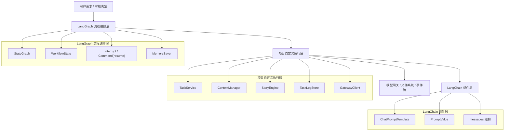
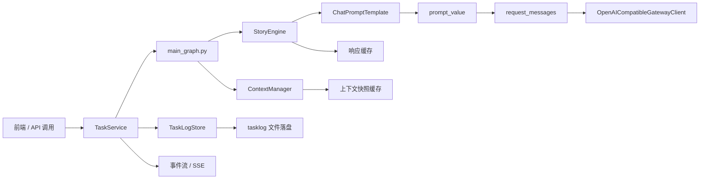
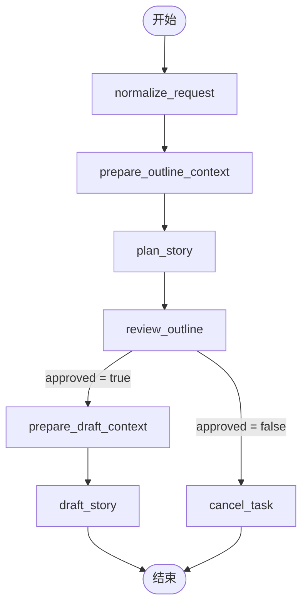

# 小说生成 Agent 系统核心技术原理 01：Agent 与工作流

> 适合对象：掌握 Python 基础，但还不熟悉 LLM Agent、工作流图和人工审核机制的读者。  
> 说明：本文一方面解释通用概念，另一方面明确指出“当前仓库到底是怎么实现的”。

---

## 1. 为什么这个项目要做成 Agent，而不是普通脚本

传统脚本适合“输入固定、处理固定、输出固定”的任务。例如把一段文本转成小写、把 CSV 转成 JSON。这类程序通常没有中间决策，也不需要在执行一半时等待人类确认。

小说生成任务不是这样。它至少同时具备三类特征：

1. 目标不是单一步骤，而是多个阶段串联。
2. 某些阶段的结果需要人工判断是否继续。
3. 后续阶段要依赖前面阶段的中间产物，例如故事大纲、章节摘要和用户审核意见。

因此，这个系统更接近“会分阶段推进的智能工作流”，而不是“一次函数调用返回完整结果的普通程序”。

---

## 2. 这个项目里的 Agent，到底负责什么

在本项目中，Agent 不是一个神秘的大脑，而是一套由多个模块共同组成的执行系统：

- `StoryEngine` 负责真正调用模型，生成大纲或正文。
- `ContextManager` 负责预算、压缩、上下文装配和快照缓存。
- `LangGraph` 负责决定每一步先做什么、后做什么，以及什么时候停下来等人审核。
- `TaskService` 负责把工作流包装成一个后台任务，并把过程写入事件流和文件。

如果把它类比成一个写作团队：

- `StoryEngine` 像主笔。
- `ContextManager` 像资料整理和预算控制人员。
- `LangGraph` 像流程导演。
- `TaskService` 像制片，负责让前端、文件系统和后台线程协同工作。

这就是“Agent”在工程落地中的真实形态：不是单个类，而是围绕任务目标组织起来的一组角色。

### 2.1 `LangChain` 和 `LangGraph` 在这个项目里怎么分工

这两个名字很容易一起出现，但它们在当前项目里的职责并不相同。

结合官方文档，更容易理解的口径是：

- `LangChain` 更偏“组件层”和“调用抽象层”
- `LangGraph` 更偏“流程层”和“状态编排层”

放到这个仓库里，对应关系可以写得更具体一些：

| 框架 | 当前项目主要承担什么 | 本仓库里的体现 |
|---|---|---|
| `LangChain` | 组织提示模板、统一消息对象形态、帮助把输入参数格式化为聊天消息 | `StoryEngine` 中使用 `ChatPromptTemplate` 构造大纲、正文总览、章节生成模板 |
| `LangGraph` | 编排节点顺序、维护共享状态、处理中断恢复和审核分支 | `main_graph.py` 中的 `StateGraph`、`interrupt()`、`Command(resume=...)`、`MemorySaver()` |

如果把整个系统类比成一条装配线：

- `LangChain` 更像“工位上的标准工具”和“零件接口”
- `LangGraph` 更像“整条产线的调度系统”

所以这两个框架不是竞争关系，而是上下层关系。  
`LangChain` 负责把“这一轮该怎么组织提示和消息”说清楚，`LangGraph` 负责把“整个任务先做哪一步、再做哪一步、什么时候停下来等人”说清楚。

### 2.2 为什么当前项目没有直接采用完整的 `LangChain Agent`

官方文档把 `LangChain` 定位为更高层的 agent 框架，而把 `LangGraph` 定位为更低层的 orchestration runtime。  
当前项目没有直接采用完整的 `LangChain Agent Executor` 主线，主要是因为它的任务结构本身已经比较确定：

1. 标准化请求
2. 生成大纲
3. 等待人工审核
4. 生成正文

这是一条很强的确定性流程，不是那种“让模型在运行时自由决定下一步要不要查工具、要不要再问用户、要不要换策略”的开放式 Agent 回路。

因此当前架构选择了更直接的组合方式：

- 用 `LangChain` 的 prompt 组件组织消息模板
- 用 `LangGraph` 编排状态化工作流
- 用自定义的 `StoryEngine` 与网关客户端控制模型调用、缓存和降级

这种方式的好处是：

- 结构更可控
- 更容易插入人工审核闸门
- 缓存、上下文装配和文件落盘都能按项目需要自行控制

代价是：

- 没有直接复用完整 Agent 框架里的高层能力
- 某些通用能力需要自己实现，例如调用缓存、任务事件和部分状态汇总

但对这个项目来说，这种取舍是合理的。因为当前需求更像“有审核闸门的写作流水线”，而不是“开放式工具调用 Agent”。

### 2.3 三层结构总览：`LangChain`、`LangGraph` 与自定义引擎

前面已经讲了分工关系，但如果只看文字，读者还是容易把三者混在一起。  
这里用两张图把它拆开：第一张偏教学，第二张偏代码映射。

#### 2.3.1 教学视角：三层职责图



这张图想表达的核心只有一句话：

> `LangGraph` 决定流程怎么走，`LangChain` 帮助组织 prompt 和消息，自定义执行层把二者接到真实业务上。

#### 2.3.2 代码视角：当前仓库模块映射图



这张图比上一张更贴近代码位置：

- `TaskService` 是任务入口和总调度。
- `main_graph.py` 是 `LangGraph` 主工作流。
- `ContextManager` 负责上下文预算、压缩和快照装配。
- `StoryEngine` 负责 prompt 组装、消息链维护、缓存和模型请求。
- `ChatPromptTemplate` 是 `StoryEngine` 内部用到的 `LangChain` 组件。
- `TaskLogStore` 负责事件、状态和结果的落盘。

这样一来，读者既能理解抽象分层，也能在仓库里找到每一层的真实落点。

#### 2.3.3 从用户请求到模型调用，链路是怎样串起来的

如果把上面两张图连起来看，当前项目的主调用链可以概括成下面 8 步：

1. 前端或 API 层创建任务，随后调用 `TaskService.run_task()`。
2. `TaskService` 启动后台线程，并把任务交给 `LangGraph` 主图执行。
3. `main_graph.py` 按节点顺序推进，例如标准化请求、准备大纲上下文、生成大纲。
4. 当某个节点需要内容生成时，会调用 `StoryEngine`。
5. `StoryEngine` 内部使用 `ChatPromptTemplate` 把任务参数组织成聊天 prompt。
6. prompt 被填充为 `prompt_value`，再转换成标准 `messages` 字典列表。
7. `GatewayClient` 根据这些 `messages` 发起实际模型请求，并返回 JSON 结果。
8. 结果再回流到 `TaskService`、`TaskLogStore`、事件流与文件系统，供后续审核、展示和归档使用。

这 8 步里最容易混淆的点有两个：

- `LangChain` 没有负责整条工作流，只负责 prompt 和消息组织。
- `LangGraph` 没有直接替你请求模型，它负责的是流程推进和状态编排。

因此，把三者的关系再压缩成一句话就是：

> `LangGraph` 管流程，`LangChain` 管 prompt 组件，自定义执行层管真正的业务落地、缓存、持久化和网关调用。

---

## 3. 为什么不能让模型一次性把整篇小说写完

### 3.1 上下文窗口有限

模型每次请求都只能看到有限长度的输入。这个限制通常叫上下文窗口。  
如果把提示词、风格要求、参考素材、人物关系、前文内容一次性全塞进去，很容易超限。

### 3.2 一次性生成很难控制质量

如果直接让模型生成几万字正文，常见风险包括：

- 前后文风格不一致。
- 人物关系在后文漂移。
- 前半部分埋下的设定后面没回收。
- 局部章节质量不均，且难以逐段修正。

### 3.3 缺少人工闸门

大纲如果有问题，越晚发现，返工越贵。  
所以这个项目把“先出大纲，再人工审核，再生成正文”作为核心流程，而不是“先一把生成再说”。

---

## 4. 当前项目的工作流总览

当前仓库在 `apps/agent-runtime/app/graph/main_graph.py` 中定义了主工作流。它是一个用 `StateGraph` 构建的有向流程图。



这个图有 7 个核心节点：

| 节点 | 当前职责 | 典型输入 | 典型输出 |
|---|---|---|---|
| `normalize_request` | 标准化用户输入 | `input_payload` | `normalized_spec` |
| `prepare_outline_context` | 组装大纲阶段上下文 | 规格、素材、模型画像 | `outline_context_packet`、`outline_context_snapshot` |
| `plan_story` | 调用模型生成大纲 | 标准化规格、上下文包 | `story_plan` |
| `review_outline` | 触发人工审核中断 | `story_plan` | `approved`、`review_comment` |
| `prepare_draft_context` | 组装正文阶段上下文 | 大纲、素材、模型画像 | `draft_context_packet`、`draft_context_snapshot` |
| `draft_story` | 按章节生成正文 | 大纲、上下文包 | `draft_result` |
| `cancel_task` | 标记取消 | 审核驳回结果 | `cancelled = true` |

这里最容易写错的一点是：  
审核通过以后，系统不是直接跳到 `draft_story`，而是先进入 `prepare_draft_context`，重新装配正文阶段上下文，再开始真正的章节生成。

---

## 5. `WorkflowState` 为什么重要

`LangGraph` 并不是靠“全局变量到处改”来传递数据，而是通过共享状态对象在节点之间传递中间结果。

当前项目中的状态对象大致是这样：

```python
class WorkflowState(TypedDict, total=False):
    task_id: str
    input_payload: dict[str, Any]
    reference_text: str
    source_assets: list[dict[str, Any]]
    normalized_spec: dict[str, Any]
    outline_context_packet: dict[str, Any]
    outline_context_snapshot: dict[str, Any]
    story_plan: dict[str, Any]
    approved: bool
    review_comment: str
    draft_context_packet: dict[str, Any]
    draft_context_snapshot: dict[str, Any]
    draft_result: dict[str, Any]
    cancelled: bool
```

你可以把它理解成一块共享黑板：

- 前面的节点把结果写上去。
- 后面的节点从黑板上读需要的数据。
- 每个节点通常只关心自己新增或更新的那一小部分字段。

### 5.1 为什么旧文档里“纯函数”的说法不够准确

旧文档把节点描述成“纯函数、无副作用”，这在教学上容易理解，但对当前项目并不准确。

原因是当前节点虽然采用“输入状态 -> 返回状态增量”的接口形式，但它们内部会：

- 调用 `ContextManager` 做缓存与压缩。
- 调用 `StoryEngine` 去请求模型网关。
- 调用 `interrupt()` 触发人工审核暂停。

所以更准确的表述应该是：

> 这些节点是“以状态增量为输出的工作流节点”，接口风格接近纯函数，但节点内部并不完全无副作用。

---

## 6. 大纲审核为什么要放在中间

这个系统把人工审核放在“大纲之后、正文之前”，因为这是成本最低、收益最高的拦截点。

如果把任务拆成两个大阶段：

1. 先规划故事骨架。
2. 再按骨架写正文。

那么人类最值得介入的地方就是两个阶段之间的边界。  
这时用户看到的是：

- 工作标题
- 一句话梗概
- 世界观说明
- 角色说明
- 章节规划

这些信息足够判断故事方向是否跑偏，但还没有投入大规模正文生成成本。

---

## 7. `interrupt()` 到底做了什么

当前项目在 `review_outline` 节点里调用 `langgraph.types.interrupt`。  
官方设计的目标是“让图执行停在这里，等待人类做决定，再继续往下走”。

当前节点形态大致如下：

```python
def review_outline(state: WorkflowState) -> WorkflowState:
    review = interrupt(
        {
            "type": "outline_review",
            "version": "v1",
            "summary": "请确认大纲是否可以进入正文起草。",
            "story_plan": state["story_plan"],
            "risk_flags": [...],
        }
    )
    approved = bool(review.get("approved")) if isinstance(review, dict) else bool(review)
    comment = review.get("comment", "") if isinstance(review, dict) else ""
    return {"approved": approved, "review_comment": comment}
```

这里可以把 `interrupt()` 理解成一个“故意停机点”：

1. 图先把当前执行上下文保存到 checkpointer。
2. 当前调用方收到特殊的中断结果。
3. 前端把审核信息展示给用户。
4. 用户提交“通过 / 驳回 + 评论”。
5. 系统再用恢复命令把图从这里接着跑下去。

---

## 8. 恢复执行为什么要用 `Command(resume=...)`

在 `TaskService._resume_task_sync(...)` 中，系统会调用：

```python
result = self.graph.invoke(
    Command(resume={"approved": approved, "comment": comment}),
    config=self._config(task_id),
)
```

这一步的关键是同一个 `task_id` 会继续使用同一个图线程上下文。  
换句话说，恢复不是“重新从头跑一遍”，而是“带着之前保存的状态，从审核节点往后跑”。

因此：

- `story_plan` 不需要重新生成。
- 前面已经算好的 `normalized_spec` 不需要重新标准化。
- 人工只需要提供审核结果，图就能顺着既有状态继续运行。

---

## 9. `MemorySaver` 在这里扮演什么角色

主图编译时使用了：

```python
graph.compile(checkpointer=MemorySaver())
```

它的作用是给图执行提供检查点能力。  
这意味着在审核中断出现时，系统可以保留当前状态，等待后续恢复。

### 9.1 当前实现的优点

- 接入简单。
- 对短时间的人工审核等待已经够用。
- 不需要额外数据库就能跑通 demo。

### 9.2 当前实现的限制

- `MemorySaver` 是内存型 checkpointer。
- 如果服务进程重启，图内部检查点会丢失。
- 因此它适合 demo 和短时交互，不适合作为强持久恢复方案。

要特别区分两件事：

1. `tasklog/` 里的任务文件是持久化落盘的。
2. `LangGraph` 的 `MemorySaver` 检查点不是强持久化存储。

这两者都叫“保存”，但保存的对象和恢复能力并不一样。

---

## 10. 从用户点击“开始”到正文完成，系统发生了什么

可以把主链路按顺序理解成下面这 10 步：

1. 前端提交创建好的任务。
2. `TaskService.run_task()` 把任务状态切到 `planning`。
3. 后台线程开始执行图。
4. `normalize_request` 整理用户输入。
5. `prepare_outline_context` 组装大纲阶段上下文。
6. `plan_story` 调用模型生成大纲。
7. `review_outline` 中断，等待人工审核。
8. 用户审核通过后，`Command(resume=...)` 恢复。
9. `prepare_draft_context` 重新装配正文阶段上下文。
10. `draft_story` 按章节生成正文，并由 `TaskService` 同步落盘和推送事件。

这条链路把“规划”“审核”“正文生成”明确隔开，是整个项目最核心的架构骨架。

---

## 11. 当前实现的边界与限制

为了避免把教学概念误写成“系统已经完美实现”，这里专门列出边界。

### 11.1 工作流图是清晰的，但还不是复杂编排系统

当前主图结构已经能稳定支撑：

- 标准化请求
- 大纲生成
- 人工审核
- 正文生成
- 取消分支

但它还没有扩展到例如：

- 自动重规划分支
- 多角色协作写作分支
- 错误后的局部重试分支
- 并行章节生成分支

### 11.2 审核恢复依赖进程内检查点

只要服务不重启，审核恢复是有效的。  
如果服务重启，就不能把它描述成“任何时候都可恢复的强持久工作流”。

### 11.3 工作流节点里仍有工程副作用

它们采用的是“状态增量接口”，但内部仍会调用缓存、文件写入回调、模型网关和人工中断机制。  
所以在阅读源码时，不要把它和纯算法课上的无副作用函数完全等同。

---

## 12. 本篇小结

这篇文档最核心的结论有三条：

1. 这个项目之所以像 Agent，是因为它会分阶段决策、暂停、恢复，并依赖中间状态推进。
2. `LangGraph` 在这里承担的是流程编排职责，而不是“生成内容”的职责。
3. 人工审核节点是整个系统的关键闸门，它让“故事方向是否正确”这件事由人来拍板，而不是完全交给模型。

理解了这一层，后面再看上下文预算、缓存和前端实时联动，就会更容易。
