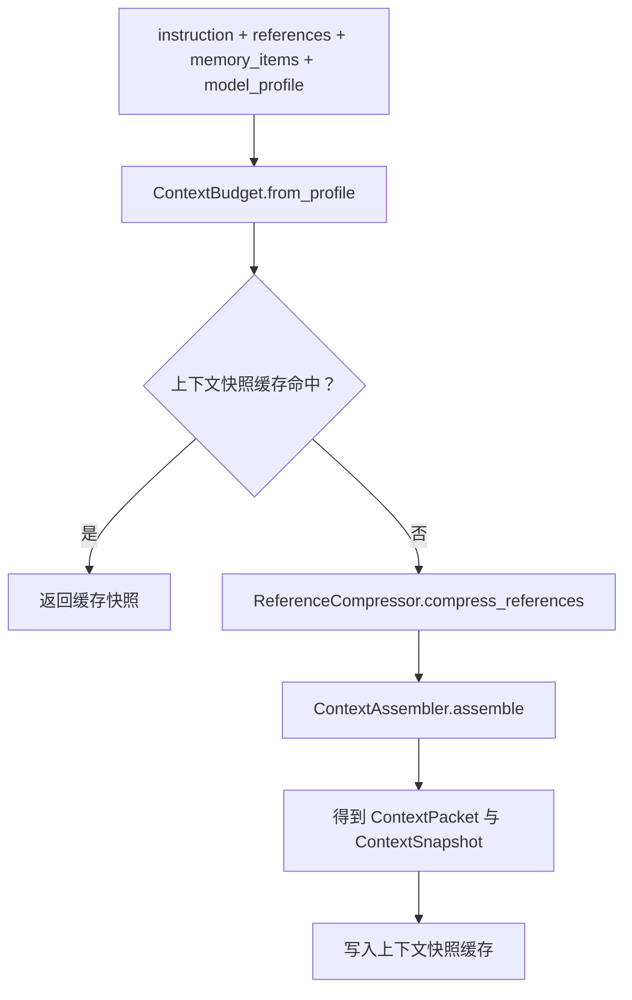
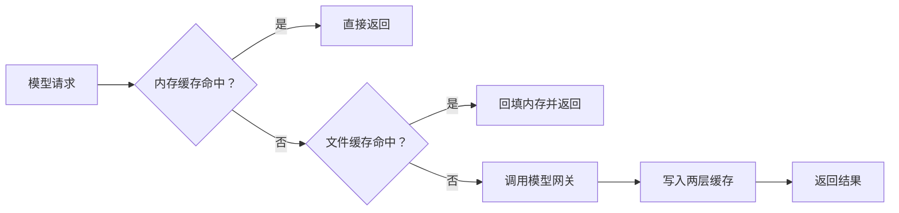

# 小说生成 Agent 系统核心技术原理 02：上下文压缩、缓存与模型能力

> 本文重点回答 4 个问题：  
> 1. 模型为什么会“装不下”所有信息。  
> 2. 参考素材和记忆是怎样被裁剪并组装进去的。  
> 3. 项目里哪些地方算“上下文连续”，哪些地方只是“快照展示”。  
> 4. `/api/models` 为什么不仅仅是把网关结果原样透传。

---

## 1. 为什么上下文窗口是一个硬约束

每次调用模型时，系统都要把多种信息一起送进去：

- 任务说明
- 风格和题材要求
- 用户上传的参考素材
- 已生成章节的摘要
- 当前章节的目标
- 系统角色提示

模型能接受的输入长度是有限的，所以这些信息之间必须竞争预算。  
这就像你只有一个登机箱，却想把衣服、电脑、相机和书都装进去。不是“有没有必要装”，而是“每样东西最多能装多少”。

---

## 2. 当前项目如何把模型能力变成预算

在 `apps/agent-runtime/app/context/models.py` 中，`ContextBudget.from_profile(...)` 会把模型画像转成预算。

核心参数是：

```python
available_input_tokens = max(profile.max_input_tokens - profile.reserved_output_tokens, 0)
instruction_tokens = max(int(available_input_tokens * 0.2), 16)
memory_tokens = max(int(available_input_tokens * 0.2), 16)
reference_tokens = max(available_input_tokens - instruction_tokens - memory_tokens, 16)
```

这意味着当前项目采用的是固定比例预算：

- 指令约 20%
- 记忆约 20%
- 参考素材约 60%

再把 token 预算近似换算成字符预算：

```python
max_instruction_chars = instruction_tokens * 4
max_memory_chars = memory_tokens * 4
max_reference_chars = reference_tokens * 4
```

### 2.1 为什么这里是“近似”，不是精确 token 统计

项目里目前使用：

```python
estimate_tokens(text) = ceil(len(text) / 4)
```

它的含义不是“一个中文字符永远等于四分之一个 token”，而是：

> 在没有接入精确 tokenizer 的前提下，用一个便宜、稳定、足够保守的近似估算，先把 demo 跑通。

所以更准确的说法应该是：

- 这是工程近似。
- 适合 demo 级预算控制。
- 不应写成严格的语言学或厂商级 token 定义。

---

## 3. 上下文包是怎样组装出来的

`ContextManager.build_snapshot(...)` 做三件事：

1. 根据模型画像算预算。
2. 压缩参考素材。
3. 把指令、记忆、参考素材拼成一个 `ContextPacket`。

数据流可以简化成这样：



这里要注意，“上下文包”不是直接把所有原文一股脑拼接，而是先经历两个层次的限制：

- 先按子预算分别截断 `instruction_text`、`memory_text`、`references_text`
- 再做一次总量校验，如果仍然超限，就继续裁剪

### 3.1 `LangChain` 在这里没有负责“跑流程”，而是负责“组织 prompt”

这一点很关键。  
当前项目里 `LangChain` 的存在感主要集中在 `StoryEngine`，而不是在工作流主图里。

`StoryEngine` 当前使用的是：

```python
from langchain_core.prompts import ChatPromptTemplate
```

它被用来定义三套模板：

- 大纲模板 `outline_prompt`
- 正文总览模板 `draft_prompt`
- 章节模板 `chapter_prompt`

也就是说，`LangChain` 在这里更像一个“提示消息工厂”：

- 负责定义 `system` / `human` 消息模板
- 负责把变量填进模板
- 负责产出结构化的聊天 prompt 对象

至于“什么时候生成大纲、什么时候等待审核、什么时候起草正文”，这些并不是 `LangChain` 负责的，而是 `LangGraph` 在主图里决定的。

### 3.2 `ChatPromptTemplate -> prompt_value -> messages` 这条链到底怎么走

当前项目的实际调用链可以简化成下面这样：


在代码里，这条链分成了 3 步。

第一步，用 `ChatPromptTemplate.from_messages(...)` 定义模板：

```python
self.outline_prompt = ChatPromptTemplate.from_messages(
    [
        ("system", "你是一个中文小说策划助手，要输出严格 JSON，不要输出额外解释。"),
        ("human", "请基于以下信息生成小说大纲 ..."),
    ]
)
```

第二步，调用 `template.invoke(...)`，把变量真正填进去：

```python
prompt_value = self.outline_prompt.invoke(
    {
        "mode": spec["mode"],
        "genre": spec.get("genre", ""),
        "style": spec.get("style", ""),
        "target_words": spec.get("target_words", 1800),
        "prompt": spec.get("prompt", ""),
        "context_memory": self._context_memory(context_packet),
        "reference_excerpt": self._context_reference(reference_text, context_packet),
    }
)
```

第三步，把 `prompt_value.messages` 转成当前网关客户端需要的标准字典列表：

```python
def _prompt_to_messages(self, prompt_value) -> list[dict[str, str]]:
    messages: list[dict[str, str]] = []
    for message in prompt_value.messages:
        role = "assistant"
        if message.type in {"system", "human", "ai"}:
            role = {"system": "system", "human": "user", "ai": "assistant"}[message.type]
        messages.append({"role": role, "content": str(message.content)})
    return messages
```

这说明当前项目并没有把“模型调用”完全托管给 `LangChain` 的模型封装，而是只借用了它在 prompt 组织上的能力。

### 3.3 为什么项目最后还要自己把 `messages` 交给网关客户端

这是一个很工程化的取舍。

当前项目后面要做的不只是“把 prompt 发给模型”，还包括：

- 自己生成缓存键
- 自己控制响应缓存
- 自己记录 `conversation_history`
- 自己把请求历史落盘
- 自己处理 JSON 解析失败后的降级逻辑

因此项目采用的是：

- 前半段用 `LangChain` 组织 prompt
- 后半段用自定义 `OpenAICompatibleGatewayClient` 控制真正的 HTTP 请求

这样虽然多写了一层转换代码，但换来了更强的可控性。

### 3.4 这条 prompt 链和缓存键有什么关系

模型响应缓存的键依赖：

- `model`
- `request_messages`

而 `request_messages` 正是由 `ChatPromptTemplate` 填充后的 `prompt_value.messages` 再转换得到的。

因此可以把当前缓存链理解成：

1. `LangChain` 决定消息内容长什么样
2. 项目代码把消息转成标准字典列表
3. 字典列表被序列化后进入 `sha256`
4. 结果成为响应缓存键

这也是为什么文档里要把 `ChatPromptTemplate` 讲清楚。  
如果不讲这一层，读者会看见“缓存键来自 `messages`”，却不知道这些 `messages` 最初是怎么构造出来的。

---

## 4. 为什么旧文档里的“迭代裁剪”是基本正确的

当前 `ContextAssembler._fit_sections(...)` 的逻辑确实是迭代裁剪，顺序如下：

1. 先拼出完整文本。
2. 估算 token 总量。
3. 如果超预算，就先裁剪参考素材。
4. 参考素材裁不动了，再裁剪记忆。
5. 记忆也裁不动了，最后才裁指令。

它对应的优先级是：

```text
references_text > memory_text > instruction_text
```

这套顺序背后的工程直觉是：

- 参考素材通常最长，也最适合被压缩。
- 记忆比参考更关键，因为它牵涉到前后文连贯。
- 指令最不能随便丢，否则模型会误解任务。

因此旧文档中“先裁参考，再裁记忆，最后裁指令”的解释是可以保留的，只需要把表述改得更贴近真实实现。

---

## 5. 多份参考素材怎么分配预算

`ReferenceCompressor.compress_references(...)` 当前采用的是一种简单但好解释的分配策略：

1. 先按 `priority` 从高到低排序。
2. 对剩余素材做平均分配。
3. 每轮至少给一个 `48` 字符的保底额度。

核心思路如下：

```python
allocation = max(remaining_chars // remaining_items, 48)
compressed = compress_text(reference, allocation)
remaining_chars -= compressed.compressed_chars
```

### 5.1 这是不是严格最优解

不是。它更像一个易实现、易解释的启发式方法。  
它的目标不是数学上的全局最优，而是兼顾三件事：

- 高优先级素材优先获得空间
- 低优先级素材也尽量别被完全饿死
- 算法复杂度低，容易维护

### 5.2 为什么这里还要再强调一次“不是最终总预算保证”

因为这一步只是在“参考素材子预算”内部做分配。  
即使这里的分配存在局部粗糙之处，后面 `ContextAssembler` 仍然会对整体文本再次做总量裁剪。

换句话说：

- `compress_references(...)` 负责“先分配得像样一点”
- `_fit_sections(...)` 负责“最后一定塞得进去”

---

## 6. 单素材压缩策略其实很朴素

当前单素材压缩没有做语义摘要，也没有做 embedding 检索，只做字符级截断：

```python
if original_chars <= max_chars:
    strategy = "full_text"
elif max_chars <= 3:
    strategy = "hard_truncate"
else:
    strategy = "truncate_tail"
```

也就是说，当前压缩更接近：

- 完整保留
- 生硬截断
- 截断尾部并补 `...`

这非常重要，因为它决定了文档表述不能写成“智能摘要压缩器”。  
更准确的说法应该是：

> 当前实现是预算驱动的字符级裁剪与截断，还不是语义理解级压缩。

---

## 7. “上下文连续性”在这个项目里有两层含义

这是旧文档最容易混淆的地方。当前项目其实有两种不同的连续性：

### 7.1 第一层：阶段上下文包

这由 `ContextManager` 负责，主要内容是：

- 当前阶段的任务说明
- 参考素材截断结果
- 从大纲或章节摘要提炼出的记忆项

它服务的是“本轮请求前的上下文装配”。

### 7.2 第二层：章节生成中的消息链历史

这由 `StoryEngine.generate_draft(...)` 中的 `conversation_history` 负责。  
在第 2 章、第 3 章继续生成时，请求会带上前面轮次的消息历史。

当前拼接逻辑是：

```python
if not conversation_history:
    return prompt_messages

latest_user_messages = [m for m in prompt_messages if m["role"] != "system"]
return conversation_history + latest_user_messages
```

也就是说：

- 第一轮直接发送当前 prompt。
- 后续轮次会复用历史消息。
- 同时避免重复附加相同的 `system` 角色消息。

### 7.3 为什么旧文档里“只有 assistant 列表”的示例不够准确

旧文档把历史示意成：

```python
[
  {"role": "assistant", ...},
  {"role": "assistant", ...}
]
```

但当前真实实现里，历史不是单独的 `assistant` 列表，而是：

- 第一轮请求消息
- 前几轮的 `assistant` 响应
- 当前轮新的 `user` 请求

所以更准确的理解是：

> 当前项目在正文阶段维护的是“连续消息链”，而不是“只存模型回答摘要”。

---

## 8. 为什么还要保留 `completed_summaries`

除了 `conversation_history`，章节生成还维护了一个更轻量的结构：

```python
completed_summaries.append(f"{chapter_draft.title}:{chapter_draft.summary}")
```

它的作用不是替代消息历史，而是给当前章节 prompt 再补一层压缩过的剧情摘要。  
因此正文生成实际上同时依赖两种连续信息：

1. 显式的消息链历史
2. 更短、更便宜的已完成章节摘要

前者保留结构化上下文，后者降低 token 成本。  
二者配合，才构成当前项目真正的“上下文连续性”。

---

## 9. 响应缓存和上下文缓存不是一回事

当前项目至少有两类缓存：

### 9.1 上下文快照缓存

由 `ContextManager` 使用 `InMemoryCacheStore` 维护。  
缓存键来自：

- `stage`
- `instruction`
- `model_profile`
- `references`
- `memory_items`

它缓存的是“装配好的上下文快照”，目的是避免重复做同样的预算和压缩计算。

### 9.2 模型响应缓存

由 `StoryEngine` 使用 `LayeredCacheStore` 维护。  
缓存键来自：

- `model`
- `request_messages`

核心逻辑：

```python
payload = json.dumps(
    {"model": model, "messages": request_messages},
    ensure_ascii=False,
    sort_keys=True,
)
digest = hashlib.sha256(payload.encode("utf-8")).hexdigest()
return f"response:{digest}"
```

这里 `sort_keys=True` 的意义是：  
只要消息内容一样，就尽量保证序列化后的字符串稳定，从而让缓存键稳定。

---

## 10. 当前模型响应缓存为什么是“两层”

`StoryEngine` 初始化时挂了 `LayeredCacheStore`，内部包含：

- 一层进程内内存缓存
- 一层文件缓存 `tasklog/cache/responses/`

它的行为可以概括成：



这样设计的直觉很简单：

- 最近重复请求用内存，快。
- 跨实例或较晚重复请求还能吃到文件缓存。

---

## 11. 旧文档里“指数退避”这一节需要改正

当前 `apps/agent-runtime/app/llm/gateway_client.py` 的失败重试逻辑是：

```python
for attempt in range(3):
    ...
    if attempt < 2:
        sleep(1.5 * (attempt + 1))
```

实际等待时间是：

- 第 1 次失败后等 `1.5s`
- 第 2 次失败后等 `3.0s`
- 第 3 次失败后放弃

这属于线性递增等待，不是指数退避。  
如果要写成数学形式，更接近：

```text
t(n) = 1.5 * (n + 1)
```

而不是：

```text
t(n) = base * 2^n
```

因此本次文档核定后，所有关于这部分的描述都应改成“线性递增重试等待”。

---

## 12. `/api/models` 为什么不是简单透传

当前模型列表接口在 `apps/agent-runtime/app/api/routes.py` 中暴露为：

```python
@router.get("/models")
def list_models():
    return task_service.list_models_payload()
```

真正的聚合工作发生在 `ModelCatalogService` 中。它会把三类来源合并在一起：

1. 网关 `/models` 返回的模型列表
2. 本地 `_PROFILE_REGISTRY` 注册表
3. 默认模型兜底项

最终返回对象不仅有 `id`，还会补齐：

- `display_name`
- `provider`
- `capabilities.context_window`
- `capabilities.cache`
- `capabilities.compression`
- `capabilities.features`
- `metadata.source`

### 12.1 为什么要这样做

因为纯网关返回通常只告诉你“有哪些模型”，却不一定告诉你：

- 这个模型应该按多大窗口估算预算
- 当前前端要不要显示“可能触发压缩”
- 这个模型是不是允许工具调用

本地注册表的作用就是把这些“工程需要的能力描述”补上。

### 12.2 为什么文档里不能把这些数字写成官方永久真值

因为这里很多能力值是当前项目的本地注册值，而不是供应商官方协议保证值。  
所以更安全的写法是：

> 当前项目在注册表中为某个模型配置了怎样的预算与能力字段。

而不是：

> 该厂商模型永远就是这个值。

---

## 13. 当前实现的边界与限制

### 13.1 预算估算还是启发式

`len(text) / 4` 不是精确 tokenizer。  
它足够用于 demo 级装配，不代表高精度 token 计费或极限窗口控制。

### 13.2 参考素材压缩是字符截断，不是语义摘要

当前实现还没有做：

- 语义抽取
- 相似段召回
- embedding 检索
- 自动摘要后再排序

因此不应把它描述成复杂检索增强系统。

### 13.3 上下文快照缓存和响应缓存职责不同

前者解决“重复装配”，后者解决“重复调用模型”。  
如果把这两者混成一个概念，读者会误以为“只要看见 `cache_hit` 就说明模型请求被跳过了”，这并不总是成立。

### 13.4 模型能力表有本地兜底逻辑

未知模型会走保守默认值。  
这是一种工程降级策略，不意味着系统真的知道该模型的全部官方能力。

---

## 14. 本篇小结

这篇文档最重要的结论有四条：

1. 当前项目的上下文管理本质上是预算分配、截断和组装。
2. “上下文快照”和“消息历史”是两套不同机制，分别服务于阶段装配和章节连续生成。
3. 缓存也分两种，不能把上下文缓存和模型响应缓存混为一谈。
4. 模型能力信息来自“网关列表 + 本地注册表 + 默认兜底”，所以文档必须按当前项目口径描述，而不是按厂商永久事实描述。
