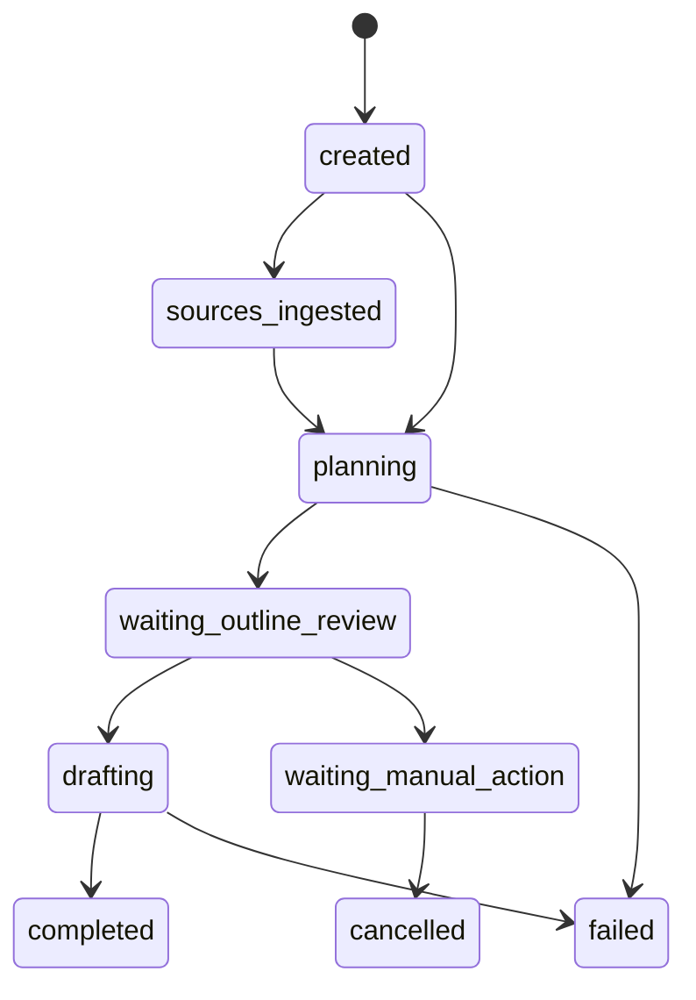

# 小说生成 Agent 系统核心技术原理 03：任务持久化与前端联动

> 本文回答的核心问题是：  
> 后台线程里持续运行的任务，怎样把状态、结果和过程事件稳定地传给文件系统和前端页面。

---

## 1. 这个项目为什么一定要有“任务层”

如果只写一个同步接口：

1. 前端发请求
2. 后端阻塞几十秒
3. 最后一次性返回整份结果

那么体验会很差：

- 用户看不到过程
- 一旦刷新页面就容易丢失现场
- 无法在中途插入审核
- 很难追踪某一步究竟做到了哪里

因此当前项目把“生成小说”包装成一个后台任务。  
从接口设计上看，用户操作的不是“一次模型调用”，而是“一个有生命周期的任务对象”。

---

## 2. `TaskService` 才是运行时总调度者

`TaskService` 连接了几个关键世界：

- API 层
- `LangGraph` 工作流
- `StoryEngine`
- `TaskLogStore`
- 前端工作台所需的聚合数据

它的作用不是替代模型，也不是替代工作流，而是：

> 让任务从“用户请求”变成“可运行、可恢复、可落盘、可推送”的后台执行单元。

---

## 3. 从创建任务到开始执行，中间发生了什么

一个任务大致经历以下入口：

1. `create_task()` 创建任务对象。
2. `add_source()` 写入用户上传的参考素材。
3. `run_task()` 把任务状态切到 `planning`，并启动后台线程。
4. 后台线程调用 `_run_task_sync()`，正式进入 `LangGraph` 主流程。
5. 如果遇到审核中断，前端再调用 `resume_task()` 触发恢复。

这说明任务服务层不仅管理“结果”，还管理“什么时候开始、什么时候暂停、什么时候继续”。

---

## 4. 为什么项目里要开后台线程

`TaskService._start_background(...)` 当前通过 `threading.Thread(..., daemon=True)` 启动后台执行。

这意味着：

- API 接口不用一直阻塞等待完整生成结束。
- 前端可以在生成过程中持续查询或订阅事件。
- 审核恢复也可以作为新的后台执行批次继续推进。

### 4.1 `daemon=True` 有什么含义

守护线程会随着主进程退出一起结束。  
这很适合 demo 项目，因为部署简单，但也意味着：

- 如果服务进程被杀掉，后台线程不会独立存活。
- 因此不能把它理解成成熟任务队列系统那样的强可靠执行。

---

## 5. 当前任务状态机长什么样

状态定义在 `apps/agent-runtime/app/domain/models.py` 的 `TaskStatus` 中：

- `created`
- `sources_ingested`
- `planning`
- `waiting_outline_review`
- `drafting`
- `assembling`
- `waiting_manual_action`
- `completed`
- `cancelled`
- `failed`

可以简化成下面的主链：



### 5.1 为什么有 `waiting_manual_action`

它表示：

- 审核已经给出“不同意继续”
- 但系统还需要走一段明确的人工决策后处理链路

因此它不是简单的失败态，而是“等待人工后续动作”的状态。

---

## 6. 为什么要防止同一个任务被重复运行

当前项目使用：

```python
_active_runs: set[str] = set()
_run_lock = threading.Lock()
```

核心逻辑是：

```python
def _enter_active_run(task_id: str) -> bool:
    with _run_lock:
        if task_id in _active_runs:
            return False
        _active_runs.add(task_id)
        return True
```

这不是数据库级分布式锁，而是进程内的轻量并发保护。  
它解决的问题很具体：

- 避免同一个任务被重复点击“开始”
- 避免同一个任务在审核恢复时被并发重复执行

它的能力边界也很明确：

- 只在当前 Python 进程内有效
- 不适用于多实例分布式部署

---

## 7. `TaskLogStore` 为什么是系统的“落盘中枢”

`TaskLogStore` 负责把任务从内存状态写成一组真实文件。  
它管理的根目录是 `tasklog/`，里面至少有：

- `tasklog/runs/`
- `tasklog/archive/`
- `tasklog/specs/`
- `tasklog/cache/`

### 7.1 一个任务目录里通常会有什么

任务执行过程中，系统会陆续写入：

- `task.json`
- `state/task.json`
- `meta.json`
- `request.json`
- `request.md`
- `events.md`
- `events.tail.json`
- `trace/current.json`
- `outline.json`
- `outline.md`
- `result.json`
- `result.md`
- `artifacts/`
- `context/planning/*.json`
- `context/drafting/*.json`

这些文件不是同一种用途：

- 有的是给前端或接口聚合读取的
- 有的是给人工排障看的
- 有的是最终产物
- 有的是过程痕迹

---

## 8. 上下文快照文件和消息历史文件到底有什么区别

这是第三篇里最重要的区分点之一。

### 8.1 上下文快照文件

`write_context_snapshot(...)` 会把类似下面的数据落盘：

- `outline-context.json`
- `draft-context.json`

它记录的是：

- 当前阶段是什么
- 预算怎么算的
- 是否发生压缩
- 是否命中上下文快照缓存
- 最终组装出的上下文包内容

这类文件更偏向“本轮上下文装配结果”。

### 8.2 消息历史文件

`write_message_history(...)` 会把模型交互历史写到：

- `context/planning/outline-history.json`
- `context/drafting/chapter-01-history.json`
- `context/drafting/chapter-02-history.json`

这类文件记录的是：

- 本次请求前后形成的消息链
- 包含 `system / user / assistant` 等角色内容

它更接近“这次模型到底看到了什么、回了什么”。

### 8.3 为什么二者不能混成一个概念

因为：

- 快照文件更偏装配和诊断
- 历史文件更偏真实交互链回放

如果不区分，读者就会误以为“只要落盘了上下文快照，就等于真实连续会话已经被下次请求自动回灌”，这并不严谨。

---

## 9. 任务完成后为什么会自动归档

`TaskLogStore.save(...)` 内部会调用 `_archive_completed_task(...)`。  
当任务状态变成 `completed` 且当前还在 `runs/` 下时，目录会被移动到 `tasklog/archive/<task_id>/`。

它做的不只是移动文件夹，还会同步修正事件里的引用前缀：

- `tasklog/runs/<task_id>/...`
- 改成
- `tasklog/archive/<task_id>/...`

所以当前系统的归档逻辑是自动的：

- 运行中任务在 `runs/`
- 完成后转入 `archive/`

这也是为什么工作台与归档页可以读取到不同位置的数据。

---

## 10. SSE 为什么能把后台事件实时送到前端

当前项目在 `apps/agent-runtime/app/api/routes.py` 中暴露了多个别名入口：

- `/tasks/{task_id}/workspace/stream`
- `/tasks/{task_id}/workspace/events`
- `/tasks/{task_id}/sse`
- `/tasks/{task_id}/events/stream`

它们最终都指向同一个 SSE 流处理函数。

### 10.1 事件从哪里来

`TaskLogStore.append_event(...)` 在写事件时会调用 `_broadcast_event(...)`：

```python
for queue in self._subscribers.get(task_id, []):
    queue.put_nowait(payload)
```

而 SSE 接口会先 `subscribe(task_id)`，拿到一个 `asyncio.Queue`，然后在循环里持续读取：

```python
payload = await asyncio.wait_for(queue.get(), timeout=15)
yield _sse_payload("task.event", payload)
```

这条链路说明：

- 后台执行过程负责产生活动事件
- `TaskLogStore` 负责广播到订阅队列
- SSE 接口负责把队列内容转换成浏览器可读的流式响应

### 10.2 为什么还要发快照

SSE 建连后，服务端会先推一个 `snapshot`。  
这样前端即使是在任务执行中途才打开页面，也能先拿到当前概览，再继续接收后续增量事件。

---

## 11. `/workspace` 接口提供的并不是原始日志，而是聚合视图

前端工作台最常读的是：

- `/api/tasks/{task_id}/workspace`

这个接口不是直接把某个 JSON 文件原样返回，而是由 `TaskService.get_workspace(...)` 聚合出一个面向页面的结果，其中包括：

- `meta`
- `recent_events`
- `active_trace_summary`
- `available_tabs`
- `request_preview`
- `context_status`
- `sources`

### 11.1 `context_status` 是怎么来的

`TaskService._load_context_status(...)` 会优先读取：

1. `context/drafting/draft-context.json`
2. 如果没有，再读 `context/planning/outline-context.json`

然后再把预算、压缩率、缓存命中等字段重新整理成适合前端展示的结构。

因此工作台上看到的“上下文状态”是一个二次加工后的展示视图，而不是快照文件原文直接透传。

---

## 12. 工作台上的“执行摘要”从哪里来

任务在推进过程中，`TaskService` 会调用 `_emit_trace_summary(...)` 写入 `trace.summary` 事件。  
这些摘要用于把底层过程翻译成适合人看的短说明，例如：

- 创作要求已标准化
- 大纲上下文已装配
- 大纲已生成
- 开始生成正文
- 第 2 章已完成

它和详细事件流的关系有点像：

- 详细事件流是系统日志
- 执行摘要是给页面展示的高层提炼

---

## 13. 进度条为什么不是平均涨到 100%

章节进度计算使用的是一段线性插值逻辑：

```python
base_progress = 55
span = 35
offset = chapter_number - 1 if event_type == "chapter.started" else chapter_number
progress = base_progress + int(offset / total * span)
```

这意味着正文阶段通常只占 `55% -> 90%` 的区间。  
最后的 `10%` 预留给收尾工作，例如：

- 结果汇总
- 工件写入
- 状态切换
- 归档整理

这样做的好处是，进度条不会在正文最后一章刚写完时就过早显示 100%。

---

## 14. 当前实现的边界与限制

### 14.1 任务执行仍然是单进程内方案

后台线程、活跃任务锁、SSE 队列都依赖当前进程内存。  
这足以支撑当前 demo，但不应描述成完整的分布式任务系统。

### 14.2 SSE 队列不是持久消息队列

如果进程重启：

- 订阅关系会丢失
- in-memory 队列会丢失

但已经写入 `tasklog/` 的文件仍然存在。

### 14.3 `tasklog/` 很强，但不等于图检查点

任务文件可以帮助你查看：

- 当前状态
- 已写出的结果
- 过程事件
- 模型消息历史

但它并不自动替代 `LangGraph` 的 checkpointer 语义。  
“能看到文件”不等于“图一定能从中断点继续恢复”。

---

## 15. 本篇小结

这一篇最重要的结论有四条：

1. 这个项目把“生成小说”包装成后台任务，而不是一次同步接口。
2. `TaskLogStore` 负责把任务运行痕迹系统化地落到 `tasklog/`。
3. 工作台看到的是“聚合视图 + 事件流”，不是某一个原始 JSON 文件的直接镜像。
4. 当前方案已经具备良好的可观察性，但仍然属于单进程 demo 级任务架构，不应过度表述为强可靠分布式系统。
